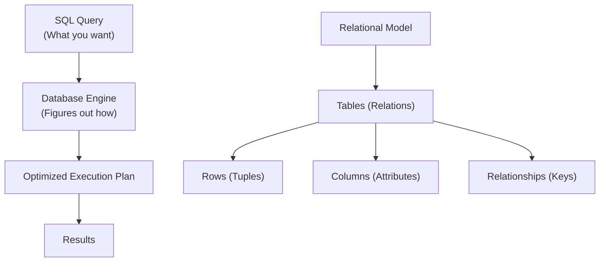

# What is SQL and the Relational Model

> **Module 1 • Lesson 1**  
> Estimated time: 25 min | Difficulty: ★☆☆☆☆

## 1. Why this matters

SQL (Structured Query Language) is the foundation of modern data management. Whether you're building web applications, analyzing business data, or managing enterprise systems, SQL is the universal language that lets you communicate with databases. Understanding SQL and the relational model isn't just about writing queries—it's about thinking in terms of sets, relationships, and declarative problem-solving that scales from small applications to massive data warehouses.

## 2. Key Concepts

- **SQL is declarative**: You describe *what* you want, not *how* to get it
- **Relational model**: Data organized in tables with relationships, not hierarchies or networks  
- **ACID properties**: Atomicity, Consistency, Isolation, Durability ensure data integrity
- **SQL standards**: ANSI/ISO specifications with vendor-specific extensions
- **Set-based operations**: SQL works with entire sets of data, not individual records



## 3. Deep Dive

### 3.1 SQL as a Declarative Language

Unlike imperative programming languages where you write step-by-step instructions, SQL is **declarative**. You specify the result you want, and the database engine determines the most efficient way to retrieve it.

**Imperative approach** (pseudocode):
```
for each customer in customers:
    if customer.country == 'USA':
        for each order in orders:
            if order.customer_id == customer.id:
                add order.total to sum
```

**Declarative approach** (SQL):
```sql
SELECT SUM(o.total)
FROM customers c
JOIN orders o ON c.id = o.customer_id
WHERE c.country = 'USA';
```

The SQL version is shorter, clearer, and allows the database to optimize the execution automatically.

### 3.2 The Relational Model Foundation

The relational model, developed by Edgar F. Codd in 1970, provides the mathematical foundation for SQL:

**Tables (Relations)**: Two-dimensional structures where each row represents an entity and each column represents an attribute.

**Primary Keys**: Uniquely identify each row in a table.
```sql
CREATE TABLE customers (
    id INT PRIMARY KEY,
    name VARCHAR(100) NOT NULL,
    email VARCHAR(100) UNIQUE
);
```

**Foreign Keys**: Create relationships between tables and enforce referential integrity.
```sql
CREATE TABLE orders (
    id INT PRIMARY KEY,
    customer_id INT,
    order_date DATE,
    FOREIGN KEY (customer_id) REFERENCES customers(id)
);
```

### 3.3 ACID Properties

ACID ensures your data remains consistent and reliable:

- **Atomicity**: Transactions are all-or-nothing
- **Consistency**: Database moves from one valid state to another
- **Isolation**: Concurrent transactions don't interfere with each other
- **Durability**: Committed changes survive system crashes

Example of atomicity in action:
```sql
BEGIN TRANSACTION;
UPDATE accounts SET balance = balance - 100 WHERE id = 1;
UPDATE accounts SET balance = balance + 100 WHERE id = 2;
COMMIT; -- Both updates succeed, or both fail
```

### 3.4 SQL Standards vs Vendor Extensions

SQL is standardized by ANSI/ISO, but each database vendor adds extensions:

**Standard SQL** (portable across databases):
```sql
SELECT name, age FROM users WHERE age > 18;
```

**MySQL-specific extensions**:
```sql
SELECT name, age FROM users WHERE age > 18 LIMIT 10;
-- LIMIT is MySQL/PostgreSQL syntax, not standard SQL
```

**Standard equivalent**:
```sql
SELECT name, age FROM users WHERE age > 18 FETCH FIRST 10 ROWS ONLY;
```

## 4. Hands-On Practice

Let's create a simple database to practice these concepts:

```sql
-- Create a basic e-commerce schema
CREATE TABLE customers (
    id INT AUTO_INCREMENT PRIMARY KEY,
    name VARCHAR(100) NOT NULL,
    email VARCHAR(100) UNIQUE NOT NULL,
    country VARCHAR(50)
);

CREATE TABLE products (
    id INT AUTO_INCREMENT PRIMARY KEY,
    name VARCHAR(100) NOT NULL,
    price DECIMAL(10,2) NOT NULL,
    category VARCHAR(50)
);

CREATE TABLE orders (
    id INT AUTO_INCREMENT PRIMARY KEY,
    customer_id INT NOT NULL,
    product_id INT NOT NULL,
    quantity INT NOT NULL,
    order_date DATE NOT NULL,
    FOREIGN KEY (customer_id) REFERENCES customers(id),
    FOREIGN KEY (product_id) REFERENCES products(id)
);

-- Insert sample data
INSERT INTO customers (name, email, country) VALUES 
('Alice Johnson', 'alice@email.com', 'USA'),
('Bob Smith', 'bob@email.com', 'Canada'),
('Carol Davis', 'carol@email.com', 'USA');

INSERT INTO products (name, price, category) VALUES 
('Laptop', 999.99, 'Electronics'),
('Book', 19.99, 'Education'),
('Coffee Mug', 12.99, 'Home');

INSERT INTO orders (customer_id, product_id, quantity, order_date) VALUES 
(1, 1, 1, '2024-01-15'),
(2, 2, 2, '2024-01-16'),
(1, 3, 1, '2024-01-17');

-- Practice declarative queries
SELECT c.name, p.name as product, o.quantity
FROM customers c
JOIN orders o ON c.id = o.customer_id  
JOIN products p ON o.product_id = p.id
WHERE c.country = 'USA';
```

**Exercise**: Try writing queries to:
1. Find all customers who haven't placed any orders
2. Calculate the total revenue by country
3. List the most expensive product in each category

## 5. Common Pitfalls

### 5.1 Thinking Procedurally Instead of Declaratively
**Wrong mindset**: "How do I loop through each row?"  
**Right mindset**: "What set of data do I need?"

### 5.2 Ignoring NULL Values
```sql
-- This might not work as expected
SELECT * FROM customers WHERE country != 'USA';
-- Won't return rows where country is NULL
```

### 5.3 Confusing Tables with Files
Tables are mathematical relations, not just storage containers. They have no inherent order unless you specify `ORDER BY`.

### 5.4 Over-relying on Vendor Extensions
Using MySQL-specific syntax makes your code less portable. Learn standard SQL first, then add vendor features as needed.

## 6. Knowledge Check

<details>
<summary>1. What's the main difference between SQL and imperative programming languages?</summary>

SQL is declarative—you specify what you want, not how to get it. The database engine optimizes the execution automatically.
</details>

<details>
<summary>2. What does ACID stand for and why does it matter?</summary>

Atomicity, Consistency, Isolation, Durability. ACID properties ensure that database transactions are reliable and maintain data integrity even in the face of errors, crashes, or concurrent access.
</details>

<details>
<summary>3. What's the difference between a primary key and a foreign key?</summary>

A primary key uniquely identifies each row in a table. A foreign key creates a relationship to another table by referencing that table's primary key, enforcing referential integrity.
</details>

<details>
<summary>4. Why might this query not return all non-USA customers: `SELECT * FROM customers WHERE country != 'USA'`?</summary>

It won't return customers where the country column is NULL, because NULL != 'USA' evaluates to NULL (unknown), not TRUE. You'd need: `WHERE country != 'USA' OR country IS NULL`.
</details>

<details>
<summary>5. What makes SQL "set-based" rather than "row-based"?</summary>

SQL operations work on entire sets of data at once. A single SELECT statement can process millions of rows, and operations like JOIN combine entire tables, not individual records.
</details>

## 7. Further Reading

- [Edgar F. Codd's original paper on the relational model](https://www.seas.upenn.edu/~zives/03f/cis550/codd.pdf)
- [SQL-92 Standard Overview](https://en.wikipedia.org/wiki/SQL-92)
- [MySQL Documentation: SQL Statement Syntax](https://dev.mysql.com/doc/refman/8.0/en/sql-statements.html)
- [PostgreSQL Documentation: SQL Language](https://www.postgresql.org/docs/current/sql.html)

---

**Navigation**

[Next → Database Management Systems Deep Dive](01-02-dbms-deep-dive.md)

_Last updated: 2025-06-21_ 