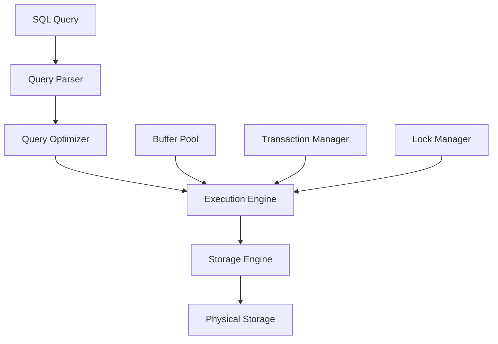

# Database Management Systems Deep Dive

> **Module 1 • Lesson 2**  
> Estimated time: 30 min | Difficulty: ★★☆☆☆

## 1. Why this matters

A Database Management System (DBMS) is the sophisticated software layer that sits between your SQL queries and the physical storage of your data. Understanding how a DBMS works internally helps you write better queries, design more efficient schemas, and troubleshoot performance issues. Whether you're optimizing a slow query or planning for scale, knowing what happens "under the hood" transforms you from someone who writes SQL to someone who architects data solutions.

## 2. Key Concepts

- **DBMS responsibilities**: Storage, retrieval, integrity, concurrency, security
- **Physical vs logical organization**: How data is stored vs how you see it
- **Buffer management**: Caching frequently accessed data in memory
- **Transaction management**: Ensuring ACID properties across concurrent operations
- **Query processing pipeline**: Parse → Optimize → Execute → Return results
- **Storage engines**: Different approaches to data storage and retrieval



## 3. Deep Dive

### 3.1 DBMS Core Responsibilities

A DBMS handles five critical functions that would be extremely complex to implement in application code:

**Data Storage and Retrieval**
- Efficiently organizes data on disk using specialized data structures
- Manages indexes to speed up queries
- Handles compression and encoding

**Data Integrity**
- Enforces constraints (PRIMARY KEY, FOREIGN KEY, CHECK, NOT NULL)
- Validates data types and ranges
- Maintains referential integrity across tables

**Concurrency Control**
- Allows multiple users to access data simultaneously
- Prevents conflicts using locks or multi-version concurrency control (MVCC)
- Manages deadlock detection and resolution

**Transaction Management**
- Ensures ACID properties
- Manages rollback and recovery
- Coordinates distributed transactions

**Security and Access Control**
- Authenticates users and manages permissions
- Encrypts data at rest and in transit
- Audits access and modifications

### 3.2 Physical vs Logical Data Organization

**Logical View** (what you see in SQL):
```sql
SELECT customer_name, order_total 
FROM customers c
JOIN orders o ON c.id = o.customer_id;
```

**Physical Reality** (what happens on disk):
- Data stored in fixed-size pages (typically 8KB or 16KB)
- Rows may span multiple pages or be compressed
- Indexes stored separately from table data
- Related data may be scattered across different disk locations

**Example**: In InnoDB (MySQL's default storage engine):
```sql
-- Logical table structure
CREATE TABLE orders (
    id INT PRIMARY KEY,
    customer_id INT,
    order_date DATE,
    total DECIMAL(10,2)
);

-- Physical storage:
-- - Primary key index stores actual row data (clustered index)
-- - Secondary indexes store key values + primary key references
-- - Data pages organized in a B+ tree structure
-- - Buffer pool caches frequently accessed pages
```

### 3.3 Query Processing Pipeline

When you execute a SQL statement, it goes through several stages:

**1. Parsing and Syntax Checking**
```sql
-- Parser converts this...
SELECT name FROM customers WHERE id = 42;

-- Into an abstract syntax tree (AST)
SELECT_STATEMENT
├── SELECT_LIST: name
├── FROM_CLAUSE: customers  
└── WHERE_CLAUSE: id = 42
```

**2. Semantic Analysis**
- Validates table and column names exist
- Checks data types compatibility
- Resolves aliases and wildcards

**3. Query Optimization**
- Generates multiple execution plans
- Estimates cost of each plan using statistics
- Chooses the most efficient plan

**4. Execution**
- Executes the chosen plan
- Manages memory allocation
- Returns results to client

### 3.4 Storage Engine Architecture

Different storage engines optimize for different use cases:

**InnoDB (MySQL default)**
- ACID compliant with full transaction support
- Row-level locking for high concurrency
- Clustered indexes (data stored with primary key)
- Foreign key constraints supported

```sql
-- InnoDB table creation
CREATE TABLE products (
    id INT AUTO_INCREMENT PRIMARY KEY,
    name VARCHAR(100),
    price DECIMAL(10,2)
) ENGINE=InnoDB;
```

**MyISAM (Legacy MySQL)**
- Table-level locking (lower concurrency)
- Fast for read-heavy workloads
- No transaction support
- Smaller storage footprint

**Memory Engine**
- Stores all data in RAM
- Extremely fast access
- Data lost on restart
- Good for temporary tables or caching

### 3.5 Buffer Pool Management

The buffer pool is crucial for performance:

```sql
-- Check buffer pool status in MySQL
SHOW ENGINE INNODB STATUS;

-- Key metrics:
-- - Buffer pool hit ratio (should be >95%)
-- - Pages read vs pages created
-- - Dirty pages (modified but not yet written to disk)
```

**Buffer Pool Mechanics**:
1. Query requests data page
2. Check if page is in buffer pool (cache hit)
3. If not, read from disk (cache miss)
4. Use LRU algorithm to manage memory
5. Write dirty pages back to disk periodically

## 4. Hands-On Practice

Let's explore DBMS internals with practical examples:

```sql
-- Create a table to demonstrate storage concepts
CREATE TABLE performance_test (
    id INT AUTO_INCREMENT PRIMARY KEY,
    name VARCHAR(100),
    description TEXT,
    created_at TIMESTAMP DEFAULT CURRENT_TIMESTAMP,
    INDEX idx_name (name),
    INDEX idx_created (created_at)
) ENGINE=InnoDB;

-- Insert test data
INSERT INTO performance_test (name, description) 
SELECT 
    CONCAT('Product ', n),
    CONCAT('Description for product ', n)
FROM (
    SELECT a.N + b.N * 10 + c.N * 100 + 1 n
    FROM (SELECT 0 AS N UNION SELECT 1 UNION SELECT 2 UNION SELECT 3 UNION SELECT 4 UNION SELECT 5 UNION SELECT 6 UNION SELECT 7 UNION SELECT 8 UNION SELECT 9) a
    CROSS JOIN (SELECT 0 AS N UNION SELECT 1 UNION SELECT 2 UNION SELECT 3 UNION SELECT 4 UNION SELECT 5 UNION SELECT 6 UNION SELECT 7 UNION SELECT 8 UNION SELECT 9) b  
    CROSS JOIN (SELECT 0 AS N UNION SELECT 1 UNION SELECT 2 UNION SELECT 3 UNION SELECT 4 UNION SELECT 5 UNION SELECT 6 UNION SELECT 7 UNION SELECT 8 UNION SELECT 9) c
) numbers 
WHERE n <= 1000;

-- Examine table structure and statistics
SHOW TABLE STATUS LIKE 'performance_test';

-- View index information
SHOW INDEX FROM performance_test;

-- Analyze query execution plan
EXPLAIN SELECT * FROM performance_test WHERE name LIKE 'Product 5%';

-- Compare with and without index
EXPLAIN SELECT * FROM performance_test WHERE description LIKE '%product 5%';
```

**Exercise Tasks**:
1. Compare the execution plans for indexed vs non-indexed column searches
2. Check the table size and index sizes using `SHOW TABLE STATUS`
3. Monitor buffer pool usage before and after running large queries
4. Experiment with different storage engines and observe the differences

## 5. Common Pitfalls

### 5.1 Ignoring Physical Storage Implications
**Problem**: Designing tables without considering how data is physically stored
```sql
-- Inefficient: UUID as primary key causes page splits
CREATE TABLE orders (
    id CHAR(36) PRIMARY KEY,  -- UUID
    customer_id INT,
    order_date DATE
);

-- Better: Auto-increment integer for clustered index efficiency
CREATE TABLE orders (
    id INT AUTO_INCREMENT PRIMARY KEY,
    uuid CHAR(36) UNIQUE,
    customer_id INT,
    order_date DATE
);
```

### 5.2 Not Understanding Index Impact
**Problem**: Creating too many indexes or wrong types of indexes
```sql
-- Over-indexing (slows down writes)
CREATE TABLE products (
    id INT PRIMARY KEY,
    name VARCHAR(100),
    category VARCHAR(50),
    price DECIMAL(10,2),
    INDEX idx1 (name),
    INDEX idx2 (category), 
    INDEX idx3 (price),
    INDEX idx4 (name, category),  -- Redundant with idx1
    INDEX idx5 (category, name)   -- Different from idx4
);
```

### 5.3 Misunderstanding Transaction Boundaries
```sql
-- Problematic: Long-running transaction
BEGIN;
SELECT * FROM large_table;  -- Takes 5 minutes
-- ... application processing ...
UPDATE small_table SET status = 'processed';
COMMIT;  -- Holds locks for entire duration
```

### 5.4 Ignoring Storage Engine Characteristics
```sql
-- Wrong engine choice for use case
CREATE TABLE session_data (
    session_id VARCHAR(64) PRIMARY KEY,
    data TEXT,
    expires TIMESTAMP
) ENGINE=InnoDB;  -- InnoDB overhead for temporary data

-- Better for temporary session data
CREATE TABLE session_data (
    session_id VARCHAR(64) PRIMARY KEY,
    data TEXT,
    expires TIMESTAMP
) ENGINE=MEMORY;
```

## 6. Knowledge Check

<details>
<summary>1. What are the five core responsibilities of a DBMS?</summary>

Data storage and retrieval, data integrity, concurrency control, transaction management, and security/access control.
</details>

<details>
<summary>2. What's the difference between logical and physical data organization?</summary>

Logical organization is how you see data in SQL (tables, rows, columns). Physical organization is how data is actually stored on disk (pages, blocks, indexes, compression).
</details>

<details>
<summary>3. Why is the buffer pool important for database performance?</summary>

The buffer pool caches frequently accessed data pages in memory, avoiding expensive disk I/O operations. A high buffer pool hit ratio (>95%) is crucial for good performance.
</details>

<details>
<summary>4. What happens during the query optimization phase?</summary>

The optimizer generates multiple execution plans, estimates the cost of each using table statistics, and chooses the most efficient plan based on factors like index availability, join order, and data distribution.
</details>

<details>
<summary>5. When would you choose MyISAM over InnoDB storage engine?</summary>

MyISAM might be chosen for read-heavy workloads where you don't need transactions, foreign keys, or high concurrency. However, InnoDB is generally preferred for most modern applications due to its ACID compliance and better concurrency support.
</details>

## 7. Further Reading

- [MySQL InnoDB Storage Engine Architecture](https://dev.mysql.com/doc/refman/8.0/en/innodb-architecture.html)
- [Database System Concepts by Silberschatz](https://www.db-book.com/) - Chapter 10-12 on Storage and Indexing
- [High Performance MySQL](https://www.oreilly.com/library/view/high-performance-mysql/9781492080503/) - Chapters 1-2
- [PostgreSQL Internals Documentation](https://www.postgresql.org/docs/current/storage.html)
- [How does a relational database work?](http://coding-geek.com/how-databases-work/) - Comprehensive technical overview

---

**Navigation**

[← Previous: What is SQL and the Relational Model](01-01-what-is-sql.md) | [Next → Logical Clause Evaluation Order](02-01-logical-clause-evaluation.md)

_Last updated: 2025-01-21_ 