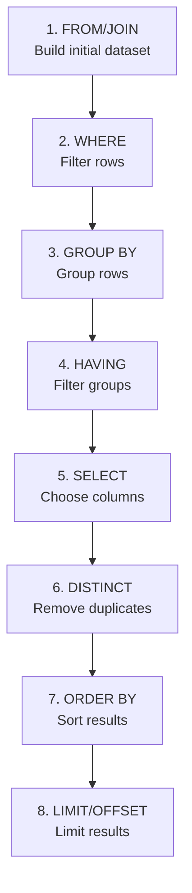

# Logical Clause Evaluation Order

> **Module 2 • Lesson 1**  
> Estimated time: 25 min | Difficulty: ★★☆☆☆

## 1. Why this matters

Understanding the logical evaluation order of SQL clauses is crucial for writing correct queries and avoiding common errors. Many SQL mistakes stem from misunderstanding when each clause is processed. For example, trying to use a column alias from the SELECT list in a WHERE clause will fail because WHERE is evaluated before SELECT. This knowledge also helps you understand why certain optimizations work and how to structure complex queries for both correctness and performance.

> **Need a refresher?** This lesson builds on concepts from [What is SQL and the Relational Model](01-01-what-is-sql.md).

## 2. Key Concepts

- **Logical vs physical order**: The order SQL processes clauses vs the order you write them
- **8-step evaluation sequence**: FROM → WHERE → GROUP BY → HAVING → SELECT → DISTINCT → ORDER BY → LIMIT
- **Alias availability**: When column aliases become available in the evaluation process
- **Early filtering**: Why WHERE is more efficient than HAVING for non-aggregate conditions
- **Set transformations**: Each clause transforms the result set for the next clause



## 3. Deep Dive

### 3.1 The Complete Evaluation Order

SQL clauses are evaluated in this logical order, regardless of how you write them:

1. **FROM / JOIN** - Build the initial row set
2. **WHERE** - Filter rows before grouping
3. **GROUP BY** - Group rows for aggregation
4. **HAVING** - Filter groups after aggregation
5. **SELECT** - Choose columns and create aliases
6. **DISTINCT** - Remove duplicate rows
7. **ORDER BY** - Sort the final result set
8. **LIMIT / OFFSET** - Restrict the number of rows returned

### 3.2 Why This Order Matters

**Alias Availability Example**:
```sql
-- This FAILS because WHERE is evaluated before SELECT
SELECT customer_id, 
       order_total * 1.1 AS total_with_tax
FROM orders
WHERE total_with_tax > 100;  -- ERROR: Unknown column 'total_with_tax'

-- This WORKS because ORDER BY is evaluated after SELECT
SELECT customer_id,
       order_total * 1.1 AS total_with_tax  
FROM orders
WHERE order_total * 1.1 > 100  -- Must repeat the expression
ORDER BY total_with_tax;       -- Can use the alias
```

**Filtering Efficiency**:
```sql
-- INEFFICIENT: HAVING processes all rows first, then filters
SELECT customer_id, COUNT(*) as order_count
FROM orders
GROUP BY customer_id
HAVING order_count > 5;

-- MORE EFFICIENT: WHERE filters early, reducing rows to group
SELECT customer_id, COUNT(*) as order_count  
FROM orders
WHERE order_date >= '2024-01-01'  -- Filter before grouping
GROUP BY customer_id
HAVING COUNT(*) > 5;              -- Filter after grouping
```

### 3.3 Detailed Step-by-Step Example

Let's trace through a complete query:

```sql
SELECT c.country,
       COUNT(*) AS customer_count,
       AVG(o.total) AS avg_order_value
FROM customers c
JOIN orders o ON c.id = o.customer_id
WHERE o.order_date >= '2024-01-01'
GROUP BY c.country
HAVING COUNT(*) >= 10
ORDER BY avg_order_value DESC
LIMIT 5;
```

**Step 1: FROM/JOIN**
- Start with `customers` table
- JOIN with `orders` table on `c.id = o.customer_id`
- Result: Combined dataset with customer and order information

**Step 2: WHERE**
- Filter rows where `o.order_date >= '2024-01-01'`
- Result: Only recent orders remain

**Step 3: GROUP BY**
- Group remaining rows by `c.country`
- Result: One group per country

**Step 4: HAVING**
- Filter groups where `COUNT(*) >= 10`
- Result: Only countries with 10+ orders

**Step 5: SELECT**
- Choose columns: `c.country`, `COUNT(*)`, `AVG(o.total)`
- Create aliases: `customer_count`, `avg_order_value`
- Result: Final column set with aliases

**Step 6: DISTINCT**
- Not used in this query

**Step 7: ORDER BY**
- Sort by `avg_order_value DESC`
- Can use alias because SELECT already executed
- Result: Sorted result set

**Step 8: LIMIT**
- Take only first 5 rows
- Result: Top 5 countries by average order value

### 3.4 Common Logical Order Mistakes

**Mistake 1: Using SELECT aliases in WHERE**
```sql
-- WRONG
SELECT product_id, price * quantity AS line_total
FROM order_items  
WHERE line_total > 100;

-- CORRECT
SELECT product_id, price * quantity AS line_total
FROM order_items
WHERE price * quantity > 100;
```

**Mistake 2: Using aggregate functions in WHERE**
```sql
-- WRONG - aggregates not available in WHERE
SELECT customer_id
FROM orders
WHERE COUNT(*) > 5
GROUP BY customer_id;

-- CORRECT - use HAVING for aggregate conditions
SELECT customer_id
FROM orders  
GROUP BY customer_id
HAVING COUNT(*) > 5;
```

**Mistake 3: Expecting ORDER BY to affect other clauses**
```sql
-- WRONG assumption: ORDER BY doesn't affect LIMIT selection
SELECT * FROM products
ORDER BY RAND()  -- Random order
LIMIT 10;        -- Gets 10 random products

-- The LIMIT still gets the first 10 after ordering
-- This is correct behavior, not a bug
```

### 3.5 Important Note: LIMIT Optimization in Practice

**⚠️ Critical Understanding**: While LIMIT appears last in logical evaluation order, modern query optimizers implement **early termination optimization**. This means:

```sql
-- MYTH: This query is slow because LIMIT runs last
SELECT c.name, o.total
FROM customers c
JOIN orders o ON c.id = o.customer_id
WHERE c.country = 'USA'
LIMIT 1;

-- REALITY: Optimizer can use early termination strategies:
-- - Stop scanning after finding 1 qualifying row
-- - Use nested loop joins that terminate early
-- - Choose index seeks for faster first-match finding
```

**Demonstration with EXPLAIN:**
```sql
-- Compare these two queries with EXPLAIN
-- Query 1: Without LIMIT
EXPLAIN SELECT c.name, o.total
FROM customers c
JOIN orders o ON c.id = o.customer_id
WHERE c.country = 'USA';

-- Query 2: With LIMIT 1  
EXPLAIN SELECT c.name, o.total
FROM customers c
JOIN orders o ON c.id = o.customer_id
WHERE c.country = 'USA'
LIMIT 1;

-- Often you'll see different execution plans!
-- The optimizer may choose nested loop for LIMIT version
-- and hash join for the version without LIMIT
```

**When LIMIT optimization is most effective:**
- **Selective WHERE conditions** combined with LIMIT
- **ORDER BY with matching indexes** + LIMIT (top-N optimization)
- **JOIN queries** where early termination can avoid processing entire tables

**When it's less effective:**
- **GROUP BY with LIMIT** (must process all groups first)
- **DISTINCT with LIMIT** (may need to see many rows to find distinct ones)
- **Complex subqueries** where LIMIT can't be pushed down

## 4. Hands-On Practice

Let's practice with a sample dataset:

```sql
-- Create practice tables
CREATE TABLE employees (
    id INT AUTO_INCREMENT PRIMARY KEY,
    name VARCHAR(100),
    department VARCHAR(50),
    salary DECIMAL(10,2),
    hire_date DATE
);

CREATE TABLE sales (
    id INT AUTO_INCREMENT PRIMARY KEY,
    employee_id INT,
    sale_amount DECIMAL(10,2),
    sale_date DATE,
    FOREIGN KEY (employee_id) REFERENCES employees(id)
);

-- Insert sample data
INSERT INTO employees (name, department, salary, hire_date) VALUES
('Alice Johnson', 'Sales', 75000, '2023-01-15'),
('Bob Smith', 'Sales', 68000, '2023-02-20'),
('Carol Davis', 'Marketing', 72000, '2023-01-10'),
('David Wilson', 'Sales', 71000, '2023-03-05'),
('Eve Brown', 'Marketing', 69000, '2023-02-15');

INSERT INTO sales (employee_id, sale_amount, sale_date) VALUES
(1, 5000, '2024-01-10'), (1, 7500, '2024-01-15'), (1, 3200, '2024-01-20'),
(2, 4800, '2024-01-12'), (2, 6200, '2024-01-18'),
(4, 9100, '2024-01-14'), (4, 5500, '2024-01-22'), (4, 4300, '2024-01-25');

-- Practice query with evaluation order
SELECT e.department,
       e.name,
       COUNT(s.id) AS total_sales,
       SUM(s.sale_amount) AS total_revenue,
       AVG(s.sale_amount) AS avg_sale_amount
FROM employees e
LEFT JOIN sales s ON e.id = s.employee_id
WHERE e.hire_date >= '2023-01-01'
GROUP BY e.department, e.name
HAVING COUNT(s.id) > 0
ORDER BY total_revenue DESC
LIMIT 3;
```

**Practice Exercises**:

1. **Trace the evaluation**: Write out what happens at each step for the query above
2. **Fix the error**: What's wrong with this query and how would you fix it?
   ```sql
   SELECT department, COUNT(*) AS emp_count
   FROM employees
   WHERE emp_count > 2
   GROUP BY department;
   ```
3. **Optimize the query**: Rewrite this query to be more efficient:
   ```sql
   SELECT customer_id, SUM(total) AS revenue
   FROM orders
   GROUP BY customer_id
   HAVING SUM(total) > 1000 AND customer_id IN (
       SELECT id FROM customers WHERE country = 'USA'
   );
   ```

4. **LIMIT Optimization Exercise**: Try this to see early termination in action:
   ```sql
   -- Create a larger test dataset
   INSERT INTO employees (name, department, salary, hire_date)
   SELECT 
       CONCAT('Employee ', n),
       CASE WHEN n % 3 = 0 THEN 'Sales' 
            WHEN n % 3 = 1 THEN 'Marketing' 
            ELSE 'Support' END,
       50000 + (n % 50000),
       DATE_ADD('2020-01-01', INTERVAL (n % 1000) DAY)
   FROM (
       SELECT a.N + b.N * 10 + c.N * 100 + d.N * 1000 + 1 n
       FROM 
           (SELECT 0 AS N UNION SELECT 1 UNION SELECT 2 UNION SELECT 3 UNION SELECT 4 UNION SELECT 5 UNION SELECT 6 UNION SELECT 7 UNION SELECT 8 UNION SELECT 9) a
       CROSS JOIN (SELECT 0 AS N UNION SELECT 1 UNION SELECT 2 UNION SELECT 3 UNION SELECT 4 UNION SELECT 5 UNION SELECT 6 UNION SELECT 7 UNION SELECT 8 UNION SELECT 9) b
       CROSS JOIN (SELECT 0 AS N UNION SELECT 1 UNION SELECT 2 UNION SELECT 3 UNION SELECT 4 UNION SELECT 5 UNION SELECT 6 UNION SELECT 7 UNION SELECT 8 UNION SELECT 9) c
       CROSS JOIN (SELECT 0 AS N UNION SELECT 1 UNION SELECT 2 UNION SELECT 3 UNION SELECT 4 UNION SELECT 5 UNION SELECT 6 UNION SELECT 7 UNION SELECT 8 UNION SELECT 9) d
   ) numbers WHERE n <= 10000;
   
   -- Now compare execution plans and timing:
   
   -- Query A: No LIMIT (processes all matching rows)
   EXPLAIN FORMAT=JSON
   SELECT e.name, s.sale_amount 
   FROM employees e
   JOIN sales s ON e.id = s.employee_id
   WHERE e.department = 'Sales';
   
   -- Query B: With LIMIT 1 (can use early termination)
   EXPLAIN FORMAT=JSON  
   SELECT e.name, s.sale_amount
   FROM employees e
   JOIN sales s ON e.id = s.employee_id
   WHERE e.department = 'Sales'
   LIMIT 1;
   
   -- You'll likely see different join algorithms or access methods!
   ```

## 5. Common Pitfalls

### 5.1 Confusing Logical and Physical Order
**Problem**: Thinking clauses execute in the order you write them
**Solution**: Always remember the logical evaluation order

### 5.2 Using Aliases Too Early
**Problem**: Trying to use SELECT aliases in WHERE or GROUP BY
**Solution**: Either repeat the expression or use a subquery/CTE

### 5.3 Misplacing Aggregate Conditions
**Problem**: Using aggregate functions in WHERE instead of HAVING
**Solution**: Use WHERE for row-level filtering, HAVING for group-level filtering

### 5.4 Not Understanding GROUP BY Requirements
**Problem**: Selecting non-aggregated columns not in GROUP BY
```sql
-- WRONG (in strict SQL mode)
SELECT customer_id, order_date, COUNT(*)
FROM orders
GROUP BY customer_id;  -- order_date not in GROUP BY
```

## 6. Knowledge Check

<details>
<summary>1. Why does this query fail: `SELECT price * 1.1 AS new_price FROM products WHERE new_price > 100`?</summary>

The query fails because WHERE is evaluated before SELECT in the logical order. The alias `new_price` doesn't exist yet when WHERE is processed. You need to either repeat the expression in WHERE or use a subquery.
</details>

<details>
<summary>2. What's the difference between WHERE and HAVING?</summary>

WHERE filters individual rows before grouping, while HAVING filters groups after GROUP BY. WHERE cannot use aggregate functions, but HAVING can. WHERE is more efficient for non-aggregate conditions.
</details>

<details>
<summary>3. In what order are these clauses logically evaluated: SELECT, FROM, WHERE, ORDER BY?</summary>

FROM → WHERE → SELECT → ORDER BY. This is why you can use SELECT aliases in ORDER BY but not in WHERE.
</details>

<details>
<summary>4. Can you use ORDER BY in a subquery?</summary>

Generally no, unless the subquery also has LIMIT/OFFSET. ORDER BY in a subquery without LIMIT is usually ignored because the outer query might reorder the results anyway.
</details>

<details>
<summary>5. Why is `WHERE customer_id = 1` more efficient than `HAVING customer_id = 1`?</summary>

WHERE filters rows early in the process, reducing the amount of data that needs to be grouped and processed. HAVING filters after all grouping is complete, so more work is done unnecessarily.
</details>

## 7. Further Reading

- [SQL Logical Processing Order - Microsoft Documentation](https://docs.microsoft.com/en-us/sql/t-sql/queries/select-transact-sql)
- [Understanding SQL Query Execution Order](https://www.sisense.com/blog/sql-query-order-of-operations/)
- [MySQL SELECT Statement Documentation](https://dev.mysql.com/doc/refman/8.0/en/select.html)
- [PostgreSQL SELECT Documentation](https://www.postgresql.org/docs/current/sql-select.html)

---

**Navigation**

[← Previous: Database Management Systems Deep Dive](01-02-dbms-deep-dive.md) | [Next → Physical Execution Behind the Scenes](02-02-physical-execution.md)

_Last updated: 2025-06-21_ 