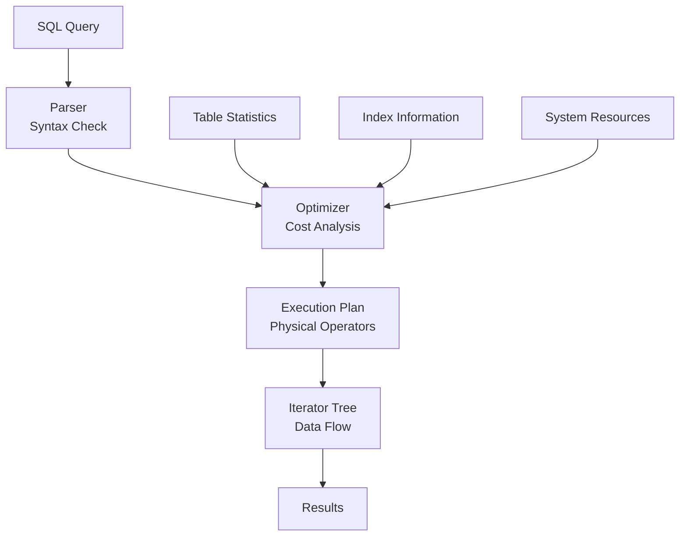

# Physical Execution Behind the Scenes

> **Module 2 • Lesson 2**  
> Estimated time: 30 min | Difficulty: ★★★☆☆

## 1. Why this matters

While logical clause evaluation tells you *what* your SQL query means, physical execution reveals *how* the database actually processes it. Understanding physical execution helps you write faster queries, interpret EXPLAIN plans, and troubleshoot performance issues. The gap between logical and physical execution is where query optimization happens—and where you can make the biggest impact on performance.

> **Need a refresher?** This lesson builds on [Logical Clause Evaluation Order](02-01-logical-clause-evaluation.md) and [Database Management Systems Deep Dive](01-02-dbms-deep-dive.md).

## 2. Key Concepts

- **Logical vs Physical**: What the query means vs how it's actually executed
- **Query execution pipeline**: Parse → Optimize → Execute → Return
- **Execution operators**: Scan, seek, join, sort, aggregate operations
- **Cost-based optimization**: Database chooses the cheapest execution plan
- **Iterator model**: Each operator pulls data from its child operators
- **Statistics-driven decisions**: Table and index statistics guide optimization



## 3. Deep Dive

### 3.1 The Complete Execution Pipeline

**1. Parsing Phase**
```sql
-- Input query
SELECT c.name, COUNT(o.id) as order_count
FROM customers c
LEFT JOIN orders o ON c.id = o.customer_id
WHERE c.country = 'USA'
GROUP BY c.id, c.name
HAVING COUNT(o.id) > 5;

-- Parser output: Abstract Syntax Tree (AST)
-- Validates syntax, resolves object names, checks permissions
```

**2. Optimization Phase**
The optimizer considers multiple execution strategies:
- Which table to scan first?
- Which indexes to use?
- What join algorithm to employ?
- Where to apply filters?

**3. Execution Phase**
The chosen plan becomes an iterator tree where each operator:
- Requests data from child operators
- Processes the data
- Returns results to parent operators

### 3.2 Physical Operators Deep Dive

**Table Access Operators**

*Table Scan (Full Table Scan)*
```sql
-- Forces a table scan
SELECT * FROM large_table WHERE description LIKE '%keyword%';
-- No index can help with middle wildcards
```
- Reads every row in the table
- Most expensive for large tables
- Sometimes optimal for small tables or when returning most rows

*Index Seek*
```sql
-- Uses index seek
SELECT * FROM customers WHERE id = 42;
-- Primary key lookup - very fast
```
- Uses index to go directly to specific rows
- Most efficient for selective queries
- Requires matching index

*Index Scan*
```sql
-- Uses index scan
SELECT name FROM customers ORDER BY name;
-- Can use index on 'name' to avoid sorting
```
- Reads index in order
- Faster than table scan when covering index available
- Good for range queries and ordering

**Join Operators**

*Nested Loop Join*
```sql
-- Small table driving large table
SELECT c.name, o.total
FROM customers c
JOIN orders o ON c.id = o.customer_id
WHERE c.country = 'Monaco';  -- Very selective
```
- For each row in outer table, search inner table
- Efficient when outer table is small
- Can use indexes on inner table

*Hash Join*
```sql
-- Large tables with equi-join
SELECT c.name, o.total  
FROM customers c
JOIN orders o ON c.id = o.customer_id;
-- Both tables are large
```
- Build hash table from smaller input
- Probe hash table with larger input
- Good for large equi-joins
- Requires sufficient memory

*Sort-Merge Join*
```sql
-- When both inputs are already sorted
SELECT c.name, o.total
FROM customers c
JOIN orders o ON c.id = o.customer_id
ORDER BY c.id;
```
- Both inputs sorted on join key
- Merge sorted streams together
- Good when sort order is needed anyway

### 3.3 Understanding EXPLAIN Output

Let's analyze a real execution plan:

```sql
-- Sample query
EXPLAIN FORMAT=JSON
SELECT c.country, COUNT(*) as customer_count, AVG(o.total) as avg_order
FROM customers c
JOIN orders o ON c.id = o.customer_id
WHERE o.order_date >= '2024-01-01'
GROUP BY c.country
HAVING COUNT(*) > 100
ORDER BY avg_order DESC
LIMIT 10;
```

**Key EXPLAIN Metrics:**
- **rows**: Estimated number of rows processed
- **filtered**: Percentage of rows remaining after WHERE
- **Extra**: Additional information about the operation
- **key**: Which index is used
- **type**: Access method (const, eq_ref, ref, range, index, ALL)

**Common EXPLAIN Patterns:**
```sql
-- Good: Using index
type: ref, key: idx_customer_id, rows: 1

-- Warning: Full table scan  
type: ALL, rows: 1000000, Extra: Using where

-- Problem: Using temporary and filesort
Extra: Using temporary; Using filesort
```

### 3.4 Query Optimization Process

**Statistics Collection**
```sql
-- Update table statistics
ANALYZE TABLE customers, orders;

-- View statistics
SHOW TABLE STATUS LIKE 'customers';
SHOW INDEX FROM customers;
```

**Cost Estimation**
The optimizer estimates costs based on:
- I/O operations (disk reads)
- CPU operations (comparisons, calculations)
- Memory usage
- Network overhead (in distributed systems)

**Plan Selection**
```sql
-- Optimizer might choose between:
-- Plan A: customers -> orders (nested loop)
-- Plan B: orders -> customers (hash join)  
-- Plan C: Use covering index to avoid table access
```

### 3.5 Execution Model: Iterator Pattern

Each operator implements the iterator interface:
- `open()`: Initialize the operator
- `next()`: Return next row or EOF
- `close()`: Clean up resources

```
┌─────────────────┐
│   LIMIT (10)    │ ← Returns first 10 rows
└─────────────────┘
         │
┌─────────────────┐
│   SORT (desc)   │ ← Sorts all input rows
└─────────────────┘
         │
┌─────────────────┐
│ HASH AGGREGATE  │ ← Groups and calculates averages
└─────────────────┘
         │
┌─────────────────┐
│   HASH JOIN     │ ← Joins customers and orders
└─────────────────┘
       │     │
   ┌───────┐ ┌──────────┐
   │ SCAN  │ │ INDEX    │
   │ customers │ │ SCAN orders │
   └───────┘ └──────────┘
```

## 4. Hands-On Practice

Let's explore physical execution with practical examples:

```sql
-- Create test tables with realistic data distribution
CREATE TABLE customers_large (
    id INT AUTO_INCREMENT PRIMARY KEY,
    name VARCHAR(100),
    country VARCHAR(50),
    signup_date DATE,
    INDEX idx_country (country),
    INDEX idx_signup_date (signup_date)
);

CREATE TABLE orders_large (
    id INT AUTO_INCREMENT PRIMARY KEY,
    customer_id INT,
    order_date DATE,
    total DECIMAL(10,2),
    status VARCHAR(20),
    INDEX idx_customer_id (customer_id),
    INDEX idx_order_date (order_date),
    INDEX idx_status (status),
    FOREIGN KEY (customer_id) REFERENCES customers_large(id)
);

-- Insert sample data with realistic distribution
INSERT INTO customers_large (name, country, signup_date)
SELECT 
    CONCAT('Customer ', n),
    CASE 
        WHEN n % 10 = 0 THEN 'USA'
        WHEN n % 10 IN (1,2) THEN 'Canada'  
        WHEN n % 10 IN (3,4) THEN 'UK'
        ELSE 'Other'
    END,
    DATE_ADD('2020-01-01', INTERVAL (n % 1460) DAY)
FROM (
    SELECT a.N + b.N * 10 + c.N * 100 + d.N * 1000 + 1 n
    FROM 
        (SELECT 0 AS N UNION SELECT 1 UNION SELECT 2 UNION SELECT 3 UNION SELECT 4 UNION SELECT 5 UNION SELECT 6 UNION SELECT 7 UNION SELECT 8 UNION SELECT 9) a
    CROSS JOIN (SELECT 0 AS N UNION SELECT 1 UNION SELECT 2 UNION SELECT 3 UNION SELECT 4 UNION SELECT 5 UNION SELECT 6 UNION SELECT 7 UNION SELECT 8 UNION SELECT 9) b
    CROSS JOIN (SELECT 0 AS N UNION SELECT 1 UNION SELECT 2 UNION SELECT 3 UNION SELECT 4 UNION SELECT 5 UNION SELECT 6 UNION SELECT 7 UNION SELECT 8 UNION SELECT 9) c
    CROSS JOIN (SELECT 0 AS N UNION SELECT 1 UNION SELECT 2 UNION SELECT 3 UNION SELECT 4 UNION SELECT 5 UNION SELECT 6 UNION SELECT 7 UNION SELECT 8 UNION SELECT 9) d
) numbers 
WHERE n <= 50000;

-- Insert orders (multiple per customer, realistic distribution)
INSERT INTO orders_large (customer_id, order_date, total, status)
SELECT 
    (n % 50000) + 1,
    DATE_ADD('2023-01-01', INTERVAL (n % 365) DAY),
    ROUND(RAND() * 1000 + 10, 2),
    CASE WHEN n % 10 = 0 THEN 'cancelled' ELSE 'completed' END
FROM (
    SELECT a.N + b.N * 10 + c.N * 100 + d.N * 1000 + e.N * 10000 + 1 n
    FROM 
        (SELECT 0 AS N UNION SELECT 1 UNION SELECT 2 UNION SELECT 3 UNION SELECT 4 UNION SELECT 5 UNION SELECT 6 UNION SELECT 7 UNION SELECT 8 UNION SELECT 9) a
    CROSS JOIN (SELECT 0 AS N UNION SELECT 1 UNION SELECT 2 UNION SELECT 3 UNION SELECT 4 UNION SELECT 5 UNION SELECT 6 UNION SELECT 7 UNION SELECT 8 UNION SELECT 9) b
    CROSS JOIN (SELECT 0 AS N UNION SELECT 1 UNION SELECT 2 UNION SELECT 3 UNION SELECT 4 UNION SELECT 5 UNION SELECT 6 UNION SELECT 7 UNION SELECT 8 UNION SELECT 9) c
    CROSS JOIN (SELECT 0 AS N UNION SELECT 1 UNION SELECT 2 UNION SELECT 3 UNION SELECT 4 UNION SELECT 5 UNION SELECT 6 UNION SELECT 7 UNION SELECT 8 UNION SELECT 9) d
    CROSS JOIN (SELECT 0 AS N UNION SELECT 1 UNION SELECT 2 UNION SELECT 3 UNION SELECT 4) e
) numbers 
WHERE n <= 200000;

-- Update statistics
ANALYZE TABLE customers_large, orders_large;

-- Now let's compare different execution plans
-- Query 1: Selective WHERE condition
EXPLAIN FORMAT=JSON
SELECT c.name, o.total
FROM customers_large c
JOIN orders_large o ON c.id = o.customer_id
WHERE c.country = 'USA' AND o.status = 'completed';

-- Query 2: Non-selective condition  
EXPLAIN FORMAT=JSON
SELECT c.name, o.total
FROM customers_large c
JOIN orders_large o ON c.id = o.customer_id
WHERE c.country IN ('USA', 'Canada', 'UK', 'Other');

-- Query 3: Aggregation with different GROUP BY
EXPLAIN FORMAT=JSON
SELECT c.country, COUNT(*), AVG(o.total)
FROM customers_large c
JOIN orders_large o ON c.id = o.customer_id
GROUP BY c.country;

-- Query 4: Force different join order with hints
EXPLAIN FORMAT=JSON
SELECT /*+ JOIN_ORDER(o, c) */ c.name, o.total
FROM customers_large c
JOIN orders_large o ON c.id = o.customer_id
WHERE o.order_date >= '2024-01-01';
```

**Practice Exercises:**

1. **Compare execution plans**: Run the queries above and analyze the differences in execution plans
2. **Index impact**: Drop an index and see how the execution plan changes
3. **Join order**: Try different table orders in FROM clause and observe optimizer choices
4. **Covering indexes**: Create a covering index and see if it's used

## 5. Common Pitfalls

### 5.1 Misreading EXPLAIN Output
**Problem**: Focusing only on row counts, ignoring access methods
```sql
-- This looks good (low row count) but is actually slow
EXPLAIN SELECT * FROM orders WHERE id > 999000;
-- type: range, rows: 1000 
-- But it's scanning a large range of the index
```

### 5.2 Ignoring Data Distribution
**Problem**: Assuming uniform data distribution
```sql
-- Optimizer might choose wrong plan if statistics are stale
-- 90% of customers are in 'USA', but optimizer thinks it's 25%
SELECT * FROM customers WHERE country = 'USA';
```

### 5.3 Over-optimizing for EXPLAIN
**Problem**: Making changes that improve EXPLAIN but hurt real performance
```sql
-- Adding unnecessary indexes just to make EXPLAIN look better
-- Indexes have maintenance overhead
```

### 5.4 Not Understanding Join Order Impact
```sql
-- Inefficient: Large table first
SELECT c.name, o.total
FROM orders o  -- 1M rows
JOIN customers c ON o.customer_id = c.id  -- 10K rows  
WHERE c.country = 'Monaco';  -- 5 rows

-- Better: Let optimizer choose, or use hints
SELECT c.name, o.total  
FROM customers c  -- Start with selective filter
JOIN orders o ON c.id = o.customer_id
WHERE c.country = 'Monaco';
```

## 6. Knowledge Check

<details>
<summary>1. What's the difference between logical and physical query execution?</summary>

Logical execution defines what the query means (the 8-step evaluation order), while physical execution describes how the database actually processes the query using specific algorithms and access methods.
</details>

<details>
<summary>2. What are the three main types of table access methods?</summary>

Table Scan (reads all rows), Index Seek (uses index to find specific rows), and Index Scan (reads index in order). Each is optimal in different scenarios based on selectivity and data needs.
</details>

<details>
<summary>3. When would the optimizer choose a Hash Join over a Nested Loop Join?</summary>

Hash Join is typically chosen when both tables are large and there's an equi-join condition. Nested Loop Join is preferred when the outer table is small or when indexes are available on the inner table.
</details>

<details>
<summary>4. What does "Using temporary; Using filesort" in EXPLAIN output indicate?</summary>

This indicates the query requires creating a temporary table and sorting data on disk, which can be expensive. It often occurs with complex GROUP BY or ORDER BY operations that can't use existing indexes.
</details>

<details>
<summary>5. Why do database statistics matter for query optimization?</summary>

Statistics help the optimizer estimate the cost of different execution plans by providing information about data distribution, table sizes, and index selectivity. Stale statistics can lead to poor plan choices.
</details>

## 7. Further Reading

- [MySQL EXPLAIN Output Format](https://dev.mysql.com/doc/refman/8.0/en/explain-output.html)
- [PostgreSQL Query Planning](https://www.postgresql.org/docs/current/planner-optimizer.html)
- [SQL Server Execution Plans](https://docs.microsoft.com/en-us/sql/relational-databases/performance/execution-plans)
- [Understanding Join Algorithms](https://use-the-index-luke.com/sql/join)
- [Query Optimization in Database Systems](https://www.amazon.com/Database-System-Concepts-Abraham-Silberschatz/dp/0078022150) - Chapter 13

---

**Navigation**

[← Previous: Logical Clause Evaluation Order](02-01-logical-clause-evaluation.md) | [Next → Query Optimization Fundamentals](02-03-query-optimization.md)

_Last updated: 2025-06-21_ 