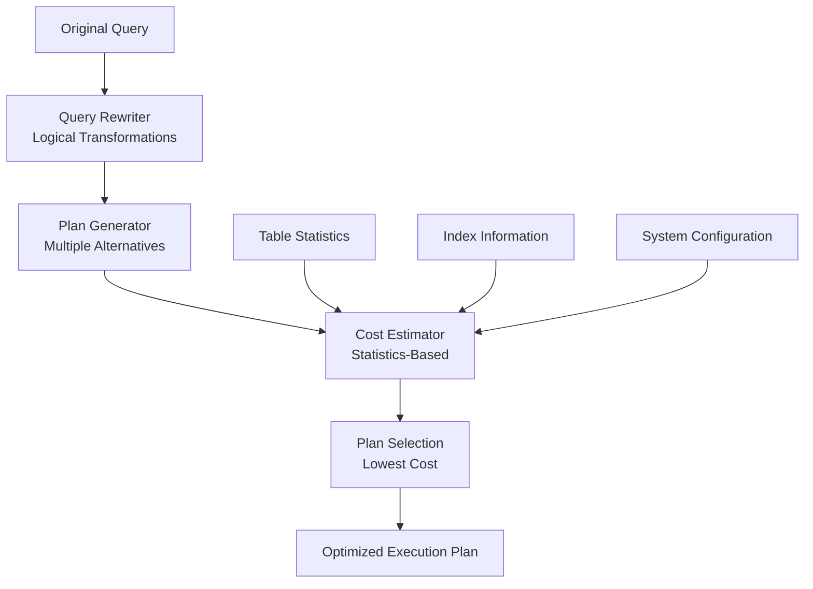

# Query Optimization Fundamentals

> **Module 2 • Lesson 3**  
> Estimated time: 35 min | Difficulty: ★★★☆☆

## 1. Why this matters

Query optimization is where the rubber meets the road in database performance. Understanding how optimizers work—and more importantly, how to help them make good decisions—is essential for building scalable applications. A poorly optimized query can bring down an entire system, while a well-optimized one can handle millions of rows effortlessly. This knowledge bridges the gap between writing SQL that works and writing SQL that performs.

> **Need a refresher?** This lesson builds on [Physical Execution Behind the Scenes](02-02-physical-execution.md) and [Logical Clause Evaluation Order](02-01-logical-clause-evaluation.md).

## 2. Key Concepts

- **Cost-based optimization**: Optimizer chooses plans based on estimated resource costs
- **Statistics and cardinality**: Data distribution information guides optimization decisions
- **Index selection**: How optimizers choose which indexes to use
- **Join ordering**: The sequence of table joins dramatically affects performance
- **Predicate pushdown**: Moving filter conditions to reduce data movement
- **Query rewriting**: Optimizer transforms queries into equivalent but faster forms



## 3. Deep Dive

### 3.1 Cost-Based Optimization Fundamentals

Modern database optimizers use **cost-based optimization (CBO)**, estimating the resource cost of different execution plans and choosing the cheapest one.

**Cost Components:**
- **I/O Cost**: Reading pages from disk (most expensive)
- **CPU Cost**: Processing rows, comparisons, calculations
- **Memory Cost**: Sorting, hashing, temporary storage
- **Network Cost**: Data transfer in distributed systems

**Cost Calculation Example:**
```sql
-- Query: Find customers with high-value orders
SELECT c.name, o.total
FROM customers c
JOIN orders o ON c.id = o.customer_id  
WHERE o.total > 1000;

-- Optimizer considers:
-- Plan A: Scan orders (filter total > 1000), then join customers
-- Plan B: Scan customers, join orders, then filter
-- Plan C: Use index on orders.total, then join

-- Cost estimation for Plan A:
-- - Scan orders table: 100,000 rows * 0.01 I/O cost = 1,000
-- - Filter total > 1000: 100,000 rows * 0.001 CPU cost = 100  
-- - Join with customers: 5,000 matches * 0.01 seek cost = 50
-- Total estimated cost: 1,150
```

### 3.2 Statistics: The Foundation of Good Decisions

Database statistics provide the optimizer with crucial information about data distribution:

**Table-Level Statistics:**
```sql
-- View table statistics in MySQL
SELECT 
    table_name,
    table_rows,
    avg_row_length,
    data_length,
    index_length
FROM information_schema.tables 
WHERE table_schema = 'your_database';

-- Update statistics
ANALYZE TABLE customers, orders;
```

**Column-Level Statistics:**
- **Cardinality**: Number of distinct values
- **Histogram**: Distribution of values across ranges
- **Null percentage**: How many values are NULL
- **Min/Max values**: Range boundaries

**Index Statistics:**
```sql
-- View index cardinality
SHOW INDEX FROM orders;

-- Key metrics:
-- - Cardinality: Estimated unique values
-- - Sub_part: Prefix length for partial indexes
-- - Null: Whether NULL values are indexed
```

### 3.3 Index Selection Strategies

The optimizer chooses indexes based on several factors:

**Selectivity Analysis:**
```sql
-- High selectivity (good for indexes)
SELECT * FROM customers WHERE id = 42;  
-- Returns 1 row out of 100,000 (0.001% selectivity)

-- Low selectivity (index might not help)
SELECT * FROM customers WHERE country = 'USA';
-- Returns 50,000 rows out of 100,000 (50% selectivity)

-- Composite index usage
CREATE INDEX idx_country_city ON customers(country, city);

-- Uses full index
SELECT * FROM customers WHERE country = 'USA' AND city = 'New York';

-- Uses partial index (country only)  
SELECT * FROM customers WHERE country = 'USA';

-- Cannot use index efficiently
SELECT * FROM customers WHERE city = 'New York';  -- Missing leading column
```

**Covering Indexes:**
```sql
-- Query needs: customer_id, name, total
SELECT c.id, c.name, SUM(o.total)
FROM customers c
JOIN orders o ON c.id = o.customer_id
GROUP BY c.id, c.name;

-- Covering index eliminates table lookups
CREATE INDEX idx_covering ON orders(customer_id, total);
-- Index contains all needed columns from orders table
```

### 3.4 Join Optimization Techniques

**Join Order Optimization:**
```sql
-- Three-table join example
SELECT c.name, p.name, oi.quantity
FROM customers c
JOIN orders o ON c.id = o.customer_id
JOIN order_items oi ON o.id = oi.order_id  
WHERE c.country = 'USA' AND p.category = 'Electronics';

-- Possible join orders (n! combinations for n tables):
-- 1. customers → orders → order_items
-- 2. orders → customers → order_items  
-- 3. order_items → orders → customers
-- ... and 3 more

-- Optimizer chooses based on:
-- - Selectivity of WHERE conditions
-- - Available indexes  
-- - Estimated result set sizes
```

**Join Algorithm Selection:**
```sql
-- Nested Loop Join (good when outer table is small)
SELECT c.name, o.total
FROM customers c
JOIN orders o ON c.id = o.customer_id
WHERE c.country = 'Monaco';  -- Very selective, few customers

-- Hash Join (good for large equi-joins)  
SELECT c.name, o.total
FROM customers c  
JOIN orders o ON c.id = o.customer_id;  -- Both tables large

-- Sort-Merge Join (when sort order is beneficial)
SELECT c.name, o.total
FROM customers c
JOIN orders o ON c.id = o.customer_id
ORDER BY c.id;  -- Result needs to be sorted anyway
```

### 3.5 Query Rewriting and Transformations

Optimizers automatically rewrite queries into equivalent but more efficient forms:

**Predicate Pushdown:**
```sql
-- Original query
SELECT c.name, o.total
FROM customers c
JOIN (
    SELECT customer_id, total
    FROM orders  
    WHERE order_date >= '2024-01-01'
) o ON c.id = o.customer_id
WHERE c.country = 'USA';

-- Optimizer pushes predicates down:
-- 1. Filter orders by date before join
-- 2. Filter customers by country before join
-- Result: Much smaller intermediate result sets
```

**Subquery Flattening:**
```sql
-- Original: Correlated subquery (potentially slow)
SELECT c.name
FROM customers c
WHERE EXISTS (
    SELECT 1 FROM orders o 
    WHERE o.customer_id = c.id 
    AND o.total > 1000
);

-- Optimizer may rewrite as join:
SELECT DISTINCT c.name
FROM customers c
JOIN orders o ON c.id = o.customer_id
WHERE o.total > 1000;
```

**Constant Folding:**
```sql
-- Original query
SELECT * FROM products 
WHERE price > 100 * 1.2 AND category = UPPER('electronics');

-- Optimizer pre-calculates constants:
SELECT * FROM products
WHERE price > 120 AND category = 'ELECTRONICS';
```

### 3.6 Advanced Optimization Techniques

**Partition Pruning:**
```sql
-- Partitioned table by date
CREATE TABLE sales_2024 (
    id INT,
    sale_date DATE,
    amount DECIMAL(10,2)
) PARTITION BY RANGE (YEAR(sale_date)) (
    PARTITION p2024_q1 VALUES LESS THAN (2024-04-01),
    PARTITION p2024_q2 VALUES LESS THAN (2024-07-01),
    PARTITION p2024_q3 VALUES LESS THAN (2024-10-01),
    PARTITION p2024_q4 VALUES LESS THAN (2024-12-31)
);

-- Query automatically prunes partitions
SELECT * FROM sales_2024 
WHERE sale_date BETWEEN '2024-01-01' AND '2024-03-31';
-- Only scans p2024_q1 partition
```

**Materialized View Matching:**
```sql
-- Expensive aggregation query
SELECT country, SUM(total), COUNT(*)
FROM customers c
JOIN orders o ON c.id = o.customer_id
GROUP BY country;

-- Pre-computed materialized view
CREATE TABLE country_summary AS
SELECT country, SUM(total) as total_sales, COUNT(*) as order_count
FROM customers c
JOIN orders o ON c.id = o.customer_id  
GROUP BY country;

-- Optimizer may automatically use materialized view
```

## 4. Hands-On Practice

Let's explore optimization with realistic scenarios:

```sql
-- Create tables with different data distributions
CREATE TABLE products_catalog (
    id INT AUTO_INCREMENT PRIMARY KEY,
    name VARCHAR(200),
    category VARCHAR(50),
    price DECIMAL(10,2),
    brand VARCHAR(50),
    in_stock BOOLEAN,
    created_date DATE,
    INDEX idx_category (category),
    INDEX idx_price (price), 
    INDEX idx_brand (brand),
    INDEX idx_stock (in_stock),
    INDEX idx_created (created_date)
);

-- Insert realistic data with skewed distribution
INSERT INTO products_catalog (name, category, price, brand, in_stock, created_date)
SELECT 
    CONCAT('Product ', n),
    CASE 
        WHEN n % 100 < 60 THEN 'Electronics'  -- 60% electronics
        WHEN n % 100 < 80 THEN 'Clothing'     -- 20% clothing  
        WHEN n % 100 < 90 THEN 'Books'        -- 10% books
        ELSE 'Other'                          -- 10% other
    END,
    CASE 
        WHEN n % 10 < 7 THEN ROUND(RAND() * 100 + 10, 2)     -- 70% low price
        WHEN n % 10 < 9 THEN ROUND(RAND() * 500 + 100, 2)    -- 20% medium price
        ELSE ROUND(RAND() * 2000 + 500, 2)                   -- 10% high price
    END,
    CASE 
        WHEN n % 20 < 8 THEN 'BrandA'   -- 40% BrandA
        WHEN n % 20 < 12 THEN 'BrandB'  -- 20% BrandB
        ELSE CONCAT('Brand', (n % 8) + 3)  -- Various other brands
    END,
    CASE WHEN n % 10 < 8 THEN TRUE ELSE FALSE END,  -- 80% in stock
    DATE_ADD('2020-01-01', INTERVAL (n % 1460) DAY)
FROM (
    SELECT a.N + b.N * 10 + c.N * 100 + d.N * 1000 + 1 n
    FROM 
        (SELECT 0 AS N UNION SELECT 1 UNION SELECT 2 UNION SELECT 3 UNION SELECT 4 UNION SELECT 5 UNION SELECT 6 UNION SELECT 7 UNION SELECT 8 UNION SELECT 9) a
    CROSS JOIN (SELECT 0 AS N UNION SELECT 1 UNION SELECT 2 UNION SELECT 3 UNION SELECT 4 UNION SELECT 5 UNION SELECT 6 UNION SELECT 7 UNION SELECT 8 UNION SELECT 9) b
    CROSS JOIN (SELECT 0 AS N UNION SELECT 1 UNION SELECT 2 UNION SELECT 3 UNION SELECT 4 UNION SELECT 5 UNION SELECT 6 UNION SELECT 7 UNION SELECT 8 UNION SELECT 9) c
    CROSS JOIN (SELECT 0 AS N UNION SELECT 1 UNION SELECT 2 UNION SELECT 3 UNION SELECT 4 UNION SELECT 5 UNION SELECT 6 UNION SELECT 7 UNION SELECT 8 UNION SELECT 9) d
) numbers 
WHERE n <= 100000;

-- Update statistics
ANALYZE TABLE products_catalog;

-- Optimization Exercise 1: Compare selective vs non-selective queries
-- Selective query (should use index)
EXPLAIN FORMAT=JSON
SELECT * FROM products_catalog WHERE id = 12345;

-- Non-selective query (might not use index)  
EXPLAIN FORMAT=JSON
SELECT * FROM products_catalog WHERE category = 'Electronics';

-- Optimization Exercise 2: Composite index usage
CREATE INDEX idx_category_price ON products_catalog(category, price);

-- Uses full composite index
EXPLAIN FORMAT=JSON  
SELECT * FROM products_catalog 
WHERE category = 'Electronics' AND price BETWEEN 100 AND 500;

-- Uses partial composite index
EXPLAIN FORMAT=JSON
SELECT * FROM products_catalog WHERE category = 'Electronics';

-- Cannot use composite index efficiently
EXPLAIN FORMAT=JSON
SELECT * FROM products_catalog WHERE price BETWEEN 100 AND 500;

-- Optimization Exercise 3: Covering index
CREATE INDEX idx_covering_search ON products_catalog(category, in_stock, price, name);

-- Should use covering index (no table lookup needed)
EXPLAIN FORMAT=JSON
SELECT name, price FROM products_catalog 
WHERE category = 'Electronics' AND in_stock = TRUE
ORDER BY price;

-- Optimization Exercise 4: Query rewriting
-- Suboptimal: Function in WHERE clause
EXPLAIN FORMAT=JSON
SELECT * FROM products_catalog WHERE YEAR(created_date) = 2023;

-- Better: Range condition (can use index)
EXPLAIN FORMAT=JSON  
SELECT * FROM products_catalog 
WHERE created_date >= '2023-01-01' AND created_date < '2024-01-01';

-- Optimization Exercise 5: Join optimization
CREATE TABLE product_reviews (
    id INT AUTO_INCREMENT PRIMARY KEY,
    product_id INT,
    rating INT,
    review_date DATE,
    INDEX idx_product_id (product_id),
    INDEX idx_rating (rating)
);

-- Insert sample reviews (fewer reviews for expensive products)
INSERT INTO product_reviews (product_id, rating, review_date)
SELECT 
    (n % 100000) + 1,
    CASE WHEN n % 10 < 7 THEN (n % 5) + 1 ELSE (n % 3) + 3 END,
    DATE_ADD('2023-01-01', INTERVAL (n % 365) DAY)
FROM (
    SELECT a.N + b.N * 10 + c.N * 100 + d.N * 1000 + e.N * 10000 + 1 n
    FROM 
        (SELECT 0 AS N UNION SELECT 1 UNION SELECT 2 UNION SELECT 3 UNION SELECT 4 UNION SELECT 5 UNION SELECT 6 UNION SELECT 7 UNION SELECT 8 UNION SELECT 9) a
    CROSS JOIN (SELECT 0 AS N UNION SELECT 1 UNION SELECT 2 UNION SELECT 3 UNION SELECT 4 UNION SELECT 5 UNION SELECT 6 UNION SELECT 7 UNION SELECT 8 UNION SELECT 9) b
    CROSS JOIN (SELECT 0 AS N UNION SELECT 1 UNION SELECT 2 UNION SELECT 3 UNION SELECT 4 UNION SELECT 5 UNION SELECT 6 UNION SELECT 7 UNION SELECT 8 UNION SELECT 9) c
    CROSS JOIN (SELECT 0 AS N UNION SELECT 1 UNION SELECT 2 UNION SELECT 3 UNION SELECT 4 UNION SELECT 5 UNION SELECT 6 UNION SELECT 7 UNION SELECT 8 UNION SELECT 9) d
    CROSS JOIN (SELECT 0 AS N UNION SELECT 1 UNION SELECT 2 UNION SELECT 3 UNION SELECT 4) e
) numbers 
WHERE n <= 300000;

ANALYZE TABLE product_reviews;

-- Compare join strategies
EXPLAIN FORMAT=JSON
SELECT p.name, AVG(r.rating) as avg_rating
FROM products_catalog p
JOIN product_reviews r ON p.id = r.product_id
WHERE p.category = 'Electronics' AND p.price > 500
GROUP BY p.id, p.name
HAVING AVG(r.rating) >= 4;
```

**Practice Exercises:**

1. **Index Analysis**: Create different indexes and observe how execution plans change
2. **Statistics Impact**: Run `ANALYZE TABLE` and compare plans before/after
3. **Query Rewriting**: Take a slow query and rewrite it multiple ways
4. **Join Order**: Experiment with different table orders in multi-table joins

## 5. Common Pitfalls

### 5.1 Stale Statistics Leading to Poor Plans
**Problem**: Optimizer makes decisions based on outdated information
```sql
-- After major data changes, statistics may be stale
INSERT INTO products_catalog SELECT ... FROM huge_import;

-- Query may use wrong plan due to old statistics
SELECT * FROM products_catalog WHERE category = 'NewCategory';

-- Solution: Update statistics regularly
ANALYZE TABLE products_catalog;
```

### 5.2 Over-Indexing
**Problem**: Too many indexes hurt write performance and confuse optimizer
```sql
-- Problematic: Too many similar indexes
CREATE INDEX idx1 ON products(category);
CREATE INDEX idx2 ON products(category, price);  
CREATE INDEX idx3 ON products(category, brand);
CREATE INDEX idx4 ON products(category, price, brand);  -- idx1, idx2, idx3 are redundant
```

### 5.3 Functions in WHERE Clauses
**Problem**: Functions prevent index usage
```sql
-- Bad: Function prevents index usage
SELECT * FROM orders WHERE YEAR(order_date) = 2024;

-- Good: Range condition can use index
SELECT * FROM orders 
WHERE order_date >= '2024-01-01' AND order_date < '2025-01-01';
```

### 5.4 Implicit Type Conversions
**Problem**: Type mismatches force conversions and prevent index usage
```sql
-- Bad: String compared to number
SELECT * FROM products WHERE id = '12345';  -- id is INT

-- Good: Proper type matching
SELECT * FROM products WHERE id = 12345;
```

### 5.5 Ignoring Data Distribution
**Problem**: Assuming uniform distribution when creating indexes
```sql
-- If 90% of orders are 'completed', this index has low selectivity
CREATE INDEX idx_status ON orders(status);

-- Better: Partial index for uncommon values
CREATE INDEX idx_pending_status ON orders(status) WHERE status != 'completed';
```

## 6. Knowledge Check

<details>
<summary>1. What is cost-based optimization and how does it work?</summary>

Cost-based optimization is a method where the database optimizer estimates the resource cost (I/O, CPU, memory) of different execution plans and chooses the one with the lowest estimated cost. It relies on table and index statistics to make these estimates.
</details>

<details>
<summary>2. Why are database statistics crucial for query optimization?</summary>

Statistics provide information about data distribution, table sizes, and index selectivity. Without accurate statistics, the optimizer can't estimate costs properly and may choose inefficient execution plans.
</details>

<details>
<summary>3. What's the difference between index selectivity and cardinality?</summary>

Cardinality is the number of distinct values in a column. Selectivity is the percentage of rows that match a particular condition. High cardinality often leads to high selectivity, making indexes more effective.
</details>

<details>
<summary>4. When would you use a covering index?</summary>

A covering index includes all columns needed by a query, eliminating the need for table lookups. Use it when you have frequent queries that select a small subset of columns with specific WHERE conditions.
</details>

<details>
<summary>5. Why do functions in WHERE clauses hurt performance?</summary>

Functions applied to columns prevent the optimizer from using indexes on those columns because the function must be evaluated for every row. It's better to rewrite conditions as ranges when possible.
</details>

## 7. Further Reading

- [MySQL Query Optimization](https://dev.mysql.com/doc/refman/8.0/en/optimization.html)
- [Use The Index, Luke!](https://use-the-index-luke.com/) - Comprehensive guide to SQL indexing
- [PostgreSQL Query Planning](https://www.postgresql.org/docs/current/planner-optimizer.html)
- [SQL Server Query Optimization](https://docs.microsoft.com/en-us/sql/relational-databases/query-processing-architecture-guide)
- [Database System Implementation by Garcia-Molina](https://www.amazon.com/Database-System-Implementation-Hector-Garcia-Molina/dp/0130319953) - Chapter 16

---

**Navigation**

[← Previous: Physical Execution Behind the Scenes](02-02-physical-execution.md) | [Next → Data Definition Language (DDL)](03-01-data-definition-language.md)

_Last updated: 2025-01-21_ 