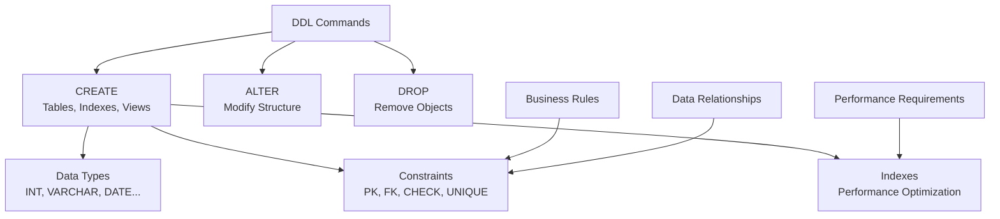

# Data Definition Language (DDL)

> **Module 3 • Lesson 1**  
> Estimated time: 30 min | Difficulty: ★★☆☆☆

## 1. Why this matters

Data Definition Language (DDL) is your toolkit for creating and managing the structure of your database. While DML (Data Manipulation Language) works with the data inside tables, DDL creates the tables themselves, along with indexes, constraints, and relationships. Mastering DDL means understanding how to design schemas that are not only functional but also performant, maintainable, and scalable. Poor DDL choices made early in a project can haunt you for years—but good ones provide a solid foundation for everything else.

> **Need a refresher?** This lesson builds on [What is SQL and the Relational Model](01-01-what-is-sql.md) and [Database Management Systems Deep Dive](01-02-dbms-deep-dive.md).

## 2. Key Concepts

- **Schema definition**: Creating the blueprint for your data structure
- **Data types**: Choosing appropriate types for storage efficiency and validation
- **Constraints**: Enforcing business rules and data integrity at the database level
- **Indexes**: Optimizing query performance with strategic index placement
- **Schema evolution**: Safely modifying existing database structures
- **Referential integrity**: Maintaining consistent relationships between tables



## 3. Deep Dive

### 3.1 CREATE TABLE: Building Your Foundation

**Basic Table Creation:**
```sql
-- Simple table with essential constraints
CREATE TABLE customers (
    id INT AUTO_INCREMENT PRIMARY KEY,
    email VARCHAR(255) NOT NULL UNIQUE,
    first_name VARCHAR(100) NOT NULL,
    last_name VARCHAR(100) NOT NULL,
    phone VARCHAR(20),
    created_at TIMESTAMP DEFAULT CURRENT_TIMESTAMP,
    updated_at TIMESTAMP DEFAULT CURRENT_TIMESTAMP ON UPDATE CURRENT_TIMESTAMP
);
```

**Advanced Table Features:**
```sql
-- Table with comprehensive constraints and options
CREATE TABLE orders (
    id INT AUTO_INCREMENT PRIMARY KEY,
    customer_id INT NOT NULL,
    order_number VARCHAR(50) NOT NULL UNIQUE,
    order_date DATE NOT NULL DEFAULT (CURRENT_DATE),
    status ENUM('pending', 'processing', 'shipped', 'delivered', 'cancelled') 
           NOT NULL DEFAULT 'pending',
    total_amount DECIMAL(10,2) NOT NULL,
    shipping_address TEXT,
    notes TEXT,
    created_at TIMESTAMP DEFAULT CURRENT_TIMESTAMP,
    
    -- Constraints
    CONSTRAINT fk_customer FOREIGN KEY (customer_id) REFERENCES customers(id)
        ON DELETE RESTRICT ON UPDATE CASCADE,
    CONSTRAINT chk_positive_amount CHECK (total_amount >= 0),
    CONSTRAINT chk_valid_date CHECK (order_date >= '2020-01-01'),
    
    -- Indexes for performance
    INDEX idx_customer_id (customer_id),
    INDEX idx_order_date (order_date),
    INDEX idx_status (status),
    INDEX idx_order_number (order_number)
) ENGINE=InnoDB DEFAULT CHARSET=utf8mb4 COLLATE=utf8mb4_unicode_ci;
```

### 3.2 Data Types: Choosing Wisely

**Numeric Types:**
```sql
-- Integer types (choose smallest that fits your range)
TINYINT     -- -128 to 127 (1 byte)
SMALLINT    -- -32,768 to 32,767 (2 bytes)  
MEDIUMINT   -- -8,388,608 to 8,388,607 (3 bytes)
INT         -- -2,147,483,648 to 2,147,483,647 (4 bytes)
BIGINT      -- Very large range (8 bytes)

-- Decimal types (for precise calculations)
DECIMAL(10,2)  -- 10 total digits, 2 after decimal point
NUMERIC(15,4)  -- Alias for DECIMAL

-- Floating point (for scientific calculations)
FLOAT       -- Single precision
DOUBLE      -- Double precision
```

**String Types:**
```sql
-- Fixed vs variable length
CHAR(10)        -- Always 10 characters, padded with spaces
VARCHAR(255)    -- Up to 255 characters, only uses what's needed

-- Text types for larger content
TEXT            -- Up to 65,535 characters
MEDIUMTEXT      -- Up to 16,777,215 characters  
LONGTEXT        -- Up to 4,294,967,295 characters

-- Binary data
BLOB            -- Binary Large Object
VARBINARY(255)  -- Variable-length binary data
```

**Date and Time Types:**
```sql
-- Date and time options
DATE            -- YYYY-MM-DD
TIME            -- HH:MM:SS
DATETIME        -- YYYY-MM-DD HH:MM:SS
TIMESTAMP       -- YYYY-MM-DD HH:MM:SS (UTC-aware)
YEAR            -- YYYY

-- Examples with defaults
created_date DATE DEFAULT (CURRENT_DATE),
created_at TIMESTAMP DEFAULT CURRENT_TIMESTAMP,
updated_at TIMESTAMP DEFAULT CURRENT_TIMESTAMP ON UPDATE CURRENT_TIMESTAMP
```

### 3.3 Constraints: Enforcing Data Integrity

**Primary Keys:**
```sql
-- Single column primary key
CREATE TABLE products (
    id INT AUTO_INCREMENT PRIMARY KEY,
    name VARCHAR(200) NOT NULL
);

-- Composite primary key
CREATE TABLE order_items (
    order_id INT,
    product_id INT,
    quantity INT NOT NULL,
    price DECIMAL(10,2) NOT NULL,
    PRIMARY KEY (order_id, product_id),
    FOREIGN KEY (order_id) REFERENCES orders(id),
    FOREIGN KEY (product_id) REFERENCES products(id)
);
```

**Foreign Keys with Actions:**
```sql
CREATE TABLE order_history (
    id INT AUTO_INCREMENT PRIMARY KEY,
    order_id INT,
    status_change VARCHAR(50),
    changed_at TIMESTAMP DEFAULT CURRENT_TIMESTAMP,
    
    -- Different referential actions
    FOREIGN KEY (order_id) REFERENCES orders(id)
        ON DELETE CASCADE    -- Delete history when order is deleted
        ON UPDATE CASCADE    -- Update references when order ID changes
);

-- Alternative actions:
-- ON DELETE RESTRICT  -- Prevent deletion if references exist
-- ON DELETE SET NULL  -- Set foreign key to NULL when parent deleted
-- ON DELETE NO ACTION -- Same as RESTRICT (default)
```

**Check Constraints:**
```sql
CREATE TABLE employees (
    id INT AUTO_INCREMENT PRIMARY KEY,
    name VARCHAR(100) NOT NULL,
    email VARCHAR(255) NOT NULL UNIQUE,
    salary DECIMAL(10,2),
    hire_date DATE,
    department ENUM('Engineering', 'Sales', 'Marketing', 'HR'),
    
    -- Check constraints for business rules
    CONSTRAINT chk_positive_salary CHECK (salary > 0),
    CONSTRAINT chk_reasonable_salary CHECK (salary BETWEEN 30000 AND 500000),
    CONSTRAINT chk_hire_date CHECK (hire_date >= '1990-01-01'),
    CONSTRAINT chk_email_format CHECK (email LIKE '%@%.%')
);
```

**Unique Constraints:**
```sql
-- Single column unique
CREATE TABLE users (
    id INT AUTO_INCREMENT PRIMARY KEY,
    username VARCHAR(50) NOT NULL UNIQUE,
    email VARCHAR(255) NOT NULL UNIQUE
);

-- Composite unique constraint
CREATE TABLE user_preferences (
    user_id INT,
    preference_key VARCHAR(100),
    preference_value TEXT,
    
    UNIQUE KEY uk_user_preference (user_id, preference_key),
    FOREIGN KEY (user_id) REFERENCES users(id)
);
```

### 3.4 Indexes: Performance Optimization

**Basic Index Types:**
```sql
-- Single column index
CREATE INDEX idx_lastname ON customers(last_name);

-- Composite index (order matters!)
CREATE INDEX idx_name_email ON customers(last_name, first_name, email);

-- Unique index (enforces uniqueness)
CREATE UNIQUE INDEX idx_order_number ON orders(order_number);

-- Partial index (MySQL 8.0+)
CREATE INDEX idx_active_customers ON customers(last_name) 
WHERE status = 'active';
```

**Covering Indexes:**
```sql
-- Query: SELECT first_name, last_name, email FROM customers WHERE status = 'active'
-- Covering index includes all needed columns
CREATE INDEX idx_covering_active ON customers(status, first_name, last_name, email);

-- This index can satisfy the entire query without table lookup
```

**Full-Text Indexes:**
```sql
-- For text search capabilities
CREATE TABLE articles (
    id INT AUTO_INCREMENT PRIMARY KEY,
    title VARCHAR(255),
    content TEXT,
    
    FULLTEXT(title, content)
);

-- Usage
SELECT * FROM articles 
WHERE MATCH(title, content) AGAINST('database optimization' IN NATURAL LANGUAGE MODE);
```

### 3.5 ALTER TABLE: Schema Evolution

**Adding Columns:**
```sql
-- Add new column with default value
ALTER TABLE customers 
ADD COLUMN middle_name VARCHAR(100) AFTER first_name;

-- Add column with constraint
ALTER TABLE orders 
ADD COLUMN priority ENUM('low', 'normal', 'high') NOT NULL DEFAULT 'normal';
```

**Modifying Columns:**
```sql
-- Change column type
ALTER TABLE customers 
MODIFY COLUMN phone VARCHAR(25);

-- Rename column
ALTER TABLE customers 
CHANGE COLUMN phone phone_number VARCHAR(25);

-- Add constraint to existing column
ALTER TABLE orders 
ADD CONSTRAINT chk_future_date CHECK (order_date >= CURRENT_DATE);
```

**Managing Indexes:**
```sql
-- Add index
ALTER TABLE customers 
ADD INDEX idx_created_at (created_at);

-- Drop index
ALTER TABLE customers 
DROP INDEX idx_created_at;

-- Add foreign key
ALTER TABLE orders 
ADD CONSTRAINT fk_customer 
FOREIGN KEY (customer_id) REFERENCES customers(id);
```

### 3.6 DROP: Removing Database Objects

**Safe Deletion Practices:**
```sql
-- Check dependencies first
SELECT 
    TABLE_NAME,
    COLUMN_NAME,
    CONSTRAINT_NAME,
    REFERENCED_TABLE_NAME
FROM information_schema.KEY_COLUMN_USAGE 
WHERE REFERENCED_TABLE_NAME = 'customers';

-- Drop foreign key constraints first
ALTER TABLE orders DROP FOREIGN KEY fk_customer;

-- Then drop the table
DROP TABLE IF EXISTS customers;

-- Drop index
DROP INDEX idx_lastname ON customers;
```

## 4. Hands-On Practice

Let's build a complete e-commerce schema step by step:

```sql
-- Step 1: Create core entities
CREATE TABLE categories (
    id INT AUTO_INCREMENT PRIMARY KEY,
    name VARCHAR(100) NOT NULL UNIQUE,
    description TEXT,
    parent_id INT NULL,
    is_active BOOLEAN NOT NULL DEFAULT TRUE,
    created_at TIMESTAMP DEFAULT CURRENT_TIMESTAMP,
    
    FOREIGN KEY (parent_id) REFERENCES categories(id) ON DELETE SET NULL,
    INDEX idx_parent (parent_id),
    INDEX idx_active (is_active)
);

CREATE TABLE suppliers (
    id INT AUTO_INCREMENT PRIMARY KEY,
    company_name VARCHAR(200) NOT NULL,
    contact_name VARCHAR(100),
    email VARCHAR(255) UNIQUE,
    phone VARCHAR(20),
    address TEXT,
    country VARCHAR(100),
    is_active BOOLEAN NOT NULL DEFAULT TRUE,
    created_at TIMESTAMP DEFAULT CURRENT_TIMESTAMP,
    
    INDEX idx_country (country),
    INDEX idx_active (is_active)
);

CREATE TABLE products (
    id INT AUTO_INCREMENT PRIMARY KEY,
    sku VARCHAR(50) NOT NULL UNIQUE,
    name VARCHAR(200) NOT NULL,
    description TEXT,
    category_id INT NOT NULL,
    supplier_id INT NOT NULL,
    cost_price DECIMAL(10,2) NOT NULL,
    selling_price DECIMAL(10,2) NOT NULL,
    stock_quantity INT NOT NULL DEFAULT 0,
    min_stock_level INT NOT NULL DEFAULT 0,
    weight DECIMAL(8,3),
    dimensions VARCHAR(50),
    is_active BOOLEAN NOT NULL DEFAULT TRUE,
    created_at TIMESTAMP DEFAULT CURRENT_TIMESTAMP,
    updated_at TIMESTAMP DEFAULT CURRENT_TIMESTAMP ON UPDATE CURRENT_TIMESTAMP,
    
    FOREIGN KEY (category_id) REFERENCES categories(id) ON DELETE RESTRICT,
    FOREIGN KEY (supplier_id) REFERENCES suppliers(id) ON DELETE RESTRICT,
    
    CONSTRAINT chk_positive_cost CHECK (cost_price > 0),
    CONSTRAINT chk_positive_price CHECK (selling_price > 0),
    CONSTRAINT chk_price_logic CHECK (selling_price >= cost_price),
    CONSTRAINT chk_stock_positive CHECK (stock_quantity >= 0),
    CONSTRAINT chk_min_stock_positive CHECK (min_stock_level >= 0),
    
    INDEX idx_category (category_id),
    INDEX idx_supplier (supplier_id),
    INDEX idx_sku (sku),
    INDEX idx_price_range (selling_price),
    INDEX idx_stock (stock_quantity),
    INDEX idx_active (is_active),
    FULLTEXT idx_search (name, description)
);

-- Step 2: Create customer and order tables
CREATE TABLE customers (
    id INT AUTO_INCREMENT PRIMARY KEY,
    email VARCHAR(255) NOT NULL UNIQUE,
    password_hash VARCHAR(255) NOT NULL,
    first_name VARCHAR(100) NOT NULL,
    last_name VARCHAR(100) NOT NULL,
    phone VARCHAR(20),
    date_of_birth DATE,
    gender ENUM('M', 'F', 'Other'),
    is_active BOOLEAN NOT NULL DEFAULT TRUE,
    email_verified BOOLEAN NOT NULL DEFAULT FALSE,
    created_at TIMESTAMP DEFAULT CURRENT_TIMESTAMP,
    last_login TIMESTAMP NULL,
    
    INDEX idx_email (email),
    INDEX idx_name (last_name, first_name),
    INDEX idx_active (is_active)
);

CREATE TABLE addresses (
    id INT AUTO_INCREMENT PRIMARY KEY,
    customer_id INT NOT NULL,
    type ENUM('billing', 'shipping') NOT NULL,
    first_name VARCHAR(100) NOT NULL,
    last_name VARCHAR(100) NOT NULL,
    company VARCHAR(200),
    address_line1 VARCHAR(255) NOT NULL,
    address_line2 VARCHAR(255),
    city VARCHAR(100) NOT NULL,
    state VARCHAR(100),
    postal_code VARCHAR(20),
    country VARCHAR(100) NOT NULL,
    is_default BOOLEAN NOT NULL DEFAULT FALSE,
    
    FOREIGN KEY (customer_id) REFERENCES customers(id) ON DELETE CASCADE,
    INDEX idx_customer (customer_id),
    INDEX idx_type (type)
);

CREATE TABLE orders (
    id INT AUTO_INCREMENT PRIMARY KEY,
    order_number VARCHAR(50) NOT NULL UNIQUE,
    customer_id INT NOT NULL,
    status ENUM('pending', 'confirmed', 'processing', 'shipped', 'delivered', 'cancelled', 'refunded') 
           NOT NULL DEFAULT 'pending',
    order_date TIMESTAMP DEFAULT CURRENT_TIMESTAMP,
    shipping_date TIMESTAMP NULL,
    delivery_date TIMESTAMP NULL,
    
    -- Pricing
    subtotal DECIMAL(10,2) NOT NULL,
    tax_amount DECIMAL(10,2) NOT NULL DEFAULT 0,
    shipping_cost DECIMAL(10,2) NOT NULL DEFAULT 0,
    discount_amount DECIMAL(10,2) NOT NULL DEFAULT 0,
    total_amount DECIMAL(10,2) NOT NULL,
    
    -- Addresses (denormalized for history)
    billing_address TEXT NOT NULL,
    shipping_address TEXT NOT NULL,
    
    notes TEXT,
    
    FOREIGN KEY (customer_id) REFERENCES customers(id) ON DELETE RESTRICT,
    
    CONSTRAINT chk_positive_subtotal CHECK (subtotal > 0),
    CONSTRAINT chk_positive_total CHECK (total_amount > 0),
    CONSTRAINT chk_tax_positive CHECK (tax_amount >= 0),
    CONSTRAINT chk_shipping_positive CHECK (shipping_cost >= 0),
    CONSTRAINT chk_discount_positive CHECK (discount_amount >= 0),
    
    INDEX idx_customer (customer_id),
    INDEX idx_order_date (order_date),
    INDEX idx_status (status),
    INDEX idx_order_number (order_number)
);

CREATE TABLE order_items (
    id INT AUTO_INCREMENT PRIMARY KEY,
    order_id INT NOT NULL,
    product_id INT NOT NULL,
    quantity INT NOT NULL,
    unit_price DECIMAL(10,2) NOT NULL,
    total_price DECIMAL(10,2) NOT NULL,
    
    -- Product details at time of order (for history)
    product_sku VARCHAR(50) NOT NULL,
    product_name VARCHAR(200) NOT NULL,
    
    FOREIGN KEY (order_id) REFERENCES orders(id) ON DELETE CASCADE,
    FOREIGN KEY (product_id) REFERENCES products(id) ON DELETE RESTRICT,
    
    CONSTRAINT chk_positive_quantity CHECK (quantity > 0),
    CONSTRAINT chk_positive_unit_price CHECK (unit_price > 0),
    CONSTRAINT chk_total_calculation CHECK (total_price = quantity * unit_price),
    
    INDEX idx_order (order_id),
    INDEX idx_product (product_id),
    UNIQUE KEY uk_order_product (order_id, product_id)
);

-- Step 3: Add some sample data
INSERT INTO categories (name, description) VALUES
('Electronics', 'Electronic devices and accessories'),
('Books', 'Physical and digital books'),
('Clothing', 'Apparel and accessories');

INSERT INTO suppliers (company_name, contact_name, email, country) VALUES
('TechCorp Inc', 'John Smith', 'john@techcorp.com', 'USA'),
('BookWorld Ltd', 'Jane Doe', 'jane@bookworld.com', 'UK'),
('Fashion Plus', 'Mike Johnson', 'mike@fashionplus.com', 'Italy');

-- Step 4: Create some useful views
CREATE VIEW active_products AS
SELECT 
    p.id,
    p.sku,
    p.name,
    c.name AS category_name,
    s.company_name AS supplier_name,
    p.selling_price,
    p.stock_quantity,
    CASE 
        WHEN p.stock_quantity <= p.min_stock_level THEN 'Low Stock'
        WHEN p.stock_quantity = 0 THEN 'Out of Stock'
        ELSE 'In Stock'
    END AS stock_status
FROM products p
JOIN categories c ON p.category_id = c.id
JOIN suppliers s ON p.supplier_id = s.id
WHERE p.is_active = TRUE AND c.is_active = TRUE;
```

**Practice Exercises:**

1. **Add a reviews system**: Create tables for product reviews with ratings
2. **Implement inventory tracking**: Add tables to track stock movements
3. **Create a promotion system**: Design tables for discounts and coupons
4. **Add audit trails**: Create triggers to log changes to important tables

## 5. Common Pitfalls

### 5.1 Choosing Wrong Data Types
**Problem**: Using VARCHAR(255) for everything or INT for IDs that might grow large
```sql
-- Inefficient
CREATE TABLE users (
    id INT,                    -- Might not be enough for large systems
    name VARCHAR(255),         -- Overkill for names
    age VARCHAR(255),          -- Should be numeric
    is_active VARCHAR(255)     -- Should be BOOLEAN
);

-- Better
CREATE TABLE users (
    id BIGINT AUTO_INCREMENT PRIMARY KEY,
    name VARCHAR(100),
    age TINYINT UNSIGNED,
    is_active BOOLEAN NOT NULL DEFAULT TRUE
);
```

### 5.2 Missing or Excessive Indexes
```sql
-- Too few indexes (performance problems)
CREATE TABLE orders (
    id INT PRIMARY KEY,
    customer_id INT,           -- Missing index for frequent joins
    order_date DATE,           -- Missing index for date range queries
    status VARCHAR(20)         -- Missing index for status filtering
);

-- Too many indexes (maintenance overhead)
CREATE TABLE products (
    id INT PRIMARY KEY,
    name VARCHAR(200),
    INDEX idx1 (name),
    INDEX idx2 (name(10)),     -- Redundant prefix index
    INDEX idx3 (name, id),     -- Redundant (id is already in PK)
    INDEX idx4 (id, name)      -- Redundant (id is PK)
);
```

### 5.3 Poor Constraint Design
```sql
-- Missing important constraints
CREATE TABLE orders (
    id INT PRIMARY KEY,
    total_amount DECIMAL(10,2),  -- No check for positive values
    order_date DATE              -- No check for reasonable dates
);

-- Overly restrictive constraints
CREATE TABLE customers (
    phone VARCHAR(20) CHECK (phone REGEXP '^[0-9]{10}$')  -- Too strict for international
);
```

### 5.4 Ignoring Character Sets and Collations
```sql
-- Problems with international data
CREATE TABLE users (
    name VARCHAR(100)
) CHARSET=latin1;  -- Can't store international characters

-- Better
CREATE TABLE users (
    name VARCHAR(100)
) CHARSET=utf8mb4 COLLATE=utf8mb4_unicode_ci;
```

## 6. Knowledge Check

<details>
<summary>1. What's the difference between CHAR and VARCHAR data types?</summary>

CHAR is fixed-length and always uses the specified number of bytes (padding with spaces), while VARCHAR(255) is variable-length and only uses the space needed for the actual data. CHAR is faster for fixed-size data, VARCHAR(255) saves space for variable-length data.
</details>

<details>
<summary>2. When should you use a composite primary key vs a surrogate key?</summary>

Use composite primary keys when the combination of columns naturally identifies the entity (like order_id + product_id in order_items). Use surrogate keys (auto-increment) for most entities to ensure stability, performance, and simplicity in relationships.
</details>

<details>
<summary>3. What's the difference between ON DELETE CASCADE and ON DELETE RESTRICT?</summary>

CASCADE automatically deletes child records when the parent is deleted. RESTRICT prevents deletion of the parent if child records exist. CASCADE is useful for dependent data, RESTRICT protects against accidental data loss.
</details>

<details>
<summary>4. Why is column order important in composite indexes?</summary>

Columns in composite indexes should be ordered by selectivity (most selective first) and usage patterns. The index can be used for queries that filter on the leftmost columns, but not for queries that only filter on rightmost columns.
</details>

<details>
<summary>5. What are the risks of using AUTO_INCREMENT for distributed systems?</summary>

AUTO_INCREMENT can create conflicts in distributed systems where multiple servers generate IDs. Consider UUIDs, sequence generators, or partitioned ID ranges for distributed architectures.
</details>

## 7. Further Reading

- [MySQL Data Types](https://dev.mysql.com/doc/refman/8.0/en/data-types.html)
- [MySQL CREATE TABLE Syntax](https://dev.mysql.com/doc/refman/8.0/en/create-table.html)
- [Database Design Best Practices](https://www.vertabelo.com/blog/database-design-best-practices/)
- [Effective MySQL: Replication Techniques in Depth](https://effectivemysql.com/)
- [High Performance MySQL](https://www.oreilly.com/library/view/high-performance-mysql/9781492080503/) - Chapter 4: Schema and Data Types

---

**Navigation**

[← Previous: Query Optimization Fundamentals](02-03-query-optimization.md) | [Next → Data Manipulation Language (DML)](03-02-data-manipulation-language.md)

_Last updated: 2025-06-21_ 