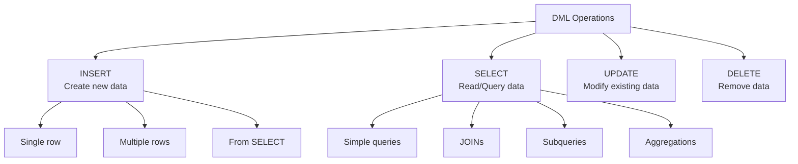

# Data Manipulation Language (DML)

> **Module 3 • Lesson 2**  
> Estimated time: 35 min | Difficulty: ★★☆☆☆

## 1. Why this matters

Data Manipulation Language (DML) is where SQL becomes practical—it's how you actually work with your data day-to-day. While DDL creates the structure, DML is about the content: inserting new records, updating existing ones, deleting obsolete data, and most importantly, querying information. Mastering DML patterns means you can handle everything from simple CRUD operations to complex data transformations, bulk operations, and sophisticated queries that drive business intelligence and application logic.

> **Need a refresher?** This lesson builds on [Data Definition Language (DDL)](03-01-data-definition-language.md) and [Logical Clause Evaluation Order](02-01-logical-clause-evaluation.md).

## 2. Key Concepts

- **CRUD operations**: Create (INSERT), Read (SELECT), Update (UPDATE), Delete (DELETE)
- **Bulk operations**: Working with multiple rows efficiently
- **JOIN patterns**: Combining data from multiple tables
- **Subqueries**: Queries within queries for complex logic
- **Data transformation**: Converting and calculating values during retrieval
- **Transaction safety**: Ensuring data integrity during modifications



## 3. Deep Dive

### 3.1 INSERT - Creating Data

**Single Row Insert**:
```sql
INSERT INTO customers (name, email, country, created_at)
VALUES ('John Doe', 'john@example.com', 'USA', NOW());
```

**Multiple Row Insert** (more efficient than multiple single inserts):
```sql
INSERT INTO products (name, category, price, stock_quantity)
VALUES 
    ('Laptop Pro', 'Electronics', 1299.99, 50),
    ('Wireless Mouse', 'Electronics', 29.99, 200),
    ('Office Chair', 'Furniture', 199.99, 25),
    ('Desk Lamp', 'Furniture', 49.99, 75);
```

**INSERT from SELECT** (powerful for data transformation):
```sql
-- Create a summary table from existing data
INSERT INTO monthly_sales_summary (year_month, total_revenue, order_count)
SELECT 
    DATE_FORMAT(order_date, '%Y-%m') as year_month,
    SUM(total_amount) as total_revenue,
    COUNT(*) as order_count
FROM orders 
WHERE order_date >= '2024-01-01'
GROUP BY DATE_FORMAT(order_date, '%Y-%m');
```

**INSERT with ON DUPLICATE KEY UPDATE** (MySQL-specific upsert):
```sql
INSERT INTO inventory (product_id, quantity, last_updated)
VALUES (101, 50, NOW())
ON DUPLICATE KEY UPDATE 
    quantity = VALUES(quantity),
    last_updated = NOW();
```

### 3.2 SELECT - Reading Data

**Basic SELECT Patterns**:
```sql
-- Column selection and aliasing
SELECT 
    customer_id,
    CONCAT(first_name, ' ', last_name) AS full_name,
    email,
    DATEDIFF(NOW(), created_at) AS days_since_signup
FROM customers
WHERE country = 'USA'
ORDER BY days_since_signup DESC
LIMIT 10;
```

**JOIN Patterns**:
```sql
-- INNER JOIN - only matching records
SELECT c.name, o.order_date, o.total_amount
FROM customers c
INNER JOIN orders o ON c.id = o.customer_id
WHERE o.order_date >= '2024-01-01';

-- LEFT JOIN - all customers, even without orders
SELECT 
    c.name,
    COUNT(o.id) as order_count,
    COALESCE(SUM(o.total_amount), 0) as total_spent
FROM customers c
LEFT JOIN orders o ON c.id = o.customer_id
GROUP BY c.id, c.name
ORDER BY total_spent DESC;

-- SELF JOIN - hierarchical data
SELECT 
    e.name as employee,
    m.name as manager
FROM employees e
LEFT JOIN employees m ON e.manager_id = m.id;
```

**Subquery Patterns**:
```sql
-- Scalar subquery
SELECT 
    product_name,
    price,
    price - (SELECT AVG(price) FROM products) AS price_vs_average
FROM products;

-- EXISTS subquery
SELECT c.name, c.email
FROM customers c
WHERE EXISTS (
    SELECT 1 FROM orders o 
    WHERE o.customer_id = c.id 
    AND o.order_date >= '2024-01-01'
);

-- IN subquery
SELECT product_name, price
FROM products
WHERE category_id IN (
    SELECT id FROM categories 
    WHERE name IN ('Electronics', 'Books')
);
```

### 3.3 UPDATE - Modifying Data

**Simple UPDATE**:
```sql
UPDATE customers 
SET email = 'newemail@example.com',
    updated_at = NOW()
WHERE id = 123;
```

**Conditional UPDATE with CASE**:
```sql
UPDATE products 
SET 
    price = CASE 
        WHEN category = 'Electronics' THEN price * 0.9  -- 10% discount
        WHEN category = 'Books' THEN price * 0.8        -- 20% discount
        ELSE price
    END,
    updated_at = NOW()
WHERE price > 100;
```

**UPDATE with JOIN** (MySQL extension):
```sql
-- Update customer tier based on total spending
UPDATE customers c
JOIN (
    SELECT 
        customer_id,
        SUM(total_amount) as total_spent
    FROM orders 
    GROUP BY customer_id
) o ON c.id = o.customer_id
SET c.tier = CASE 
    WHEN o.total_spent >= 10000 THEN 'Platinum'
    WHEN o.total_spent >= 5000 THEN 'Gold'
    WHEN o.total_spent >= 1000 THEN 'Silver'
    ELSE 'Bronze'
END;
```

**Bulk UPDATE with subquery**:
```sql
UPDATE products 
SET stock_status = 'Low Stock'
WHERE stock_quantity < (
    SELECT AVG(stock_quantity) * 0.1 
    FROM (SELECT stock_quantity FROM products) AS p
);
```

### 3.4 DELETE - Removing Data

**Simple DELETE**:
```sql
DELETE FROM orders 
WHERE order_date < '2023-01-01';
```

**DELETE with JOIN** (MySQL extension):
```sql
-- Delete orders for inactive customers
DELETE o 
FROM orders o
JOIN customers c ON o.customer_id = c.id
WHERE c.status = 'inactive'
AND o.order_date < DATE_SUB(NOW(), INTERVAL 1 YEAR);
```

**Safe DELETE patterns**:
```sql
-- Always test with SELECT first
SELECT COUNT(*) FROM orders 
WHERE order_date < '2023-01-01';

-- Use LIMIT for large deletes to avoid locking
DELETE FROM log_entries 
WHERE created_at < DATE_SUB(NOW(), INTERVAL 90 DAY)
LIMIT 1000;

-- Soft delete pattern
UPDATE customers 
SET deleted_at = NOW(), status = 'deleted'
WHERE id = 123;
```

### 3.5 Advanced DML Patterns

**Window Functions for Analytics**:
```sql
SELECT 
    customer_id,
    order_date,
    total_amount,
    SUM(total_amount) OVER (
        PARTITION BY customer_id 
        ORDER BY order_date
        ROWS UNBOUNDED PRECEDING
    ) AS running_total,
    ROW_NUMBER() OVER (
        PARTITION BY customer_id 
        ORDER BY order_date DESC
    ) AS order_recency_rank
FROM orders;
```

**Common Table Expressions (CTEs)**:
```sql
WITH monthly_stats AS (
    SELECT 
        DATE_FORMAT(order_date, '%Y-%m') as month,
        COUNT(*) as order_count,
        SUM(total_amount) as revenue
    FROM orders
    WHERE order_date >= '2024-01-01'
    GROUP BY DATE_FORMAT(order_date, '%Y-%m')
),
growth_calc AS (
    SELECT 
        month,
        order_count,
        revenue,
        LAG(revenue) OVER (ORDER BY month) as prev_month_revenue
    FROM monthly_stats
)
SELECT 
    month,
    revenue,
    ROUND(
        ((revenue - prev_month_revenue) / prev_month_revenue) * 100, 2
    ) as growth_percentage
FROM growth_calc
WHERE prev_month_revenue IS NOT NULL;
```

## 4. Hands-On Practice

Let's work with a comprehensive e-commerce database:

```sql
-- Create sample tables (if not already created)
CREATE TABLE customers (
    id INT AUTO_INCREMENT PRIMARY KEY,
    first_name VARCHAR(50) NOT NULL,
    last_name VARCHAR(50) NOT NULL,
    email VARCHAR(100) UNIQUE NOT NULL,
    phone VARCHAR(20),
    country VARCHAR(50),
    tier ENUM('Bronze', 'Silver', 'Gold', 'Platinum') DEFAULT 'Bronze',
    created_at TIMESTAMP DEFAULT CURRENT_TIMESTAMP,
    updated_at TIMESTAMP DEFAULT CURRENT_TIMESTAMP ON UPDATE CURRENT_TIMESTAMP
);

CREATE TABLE categories (
    id INT AUTO_INCREMENT PRIMARY KEY,
    name VARCHAR(50) NOT NULL,
    description TEXT
);

CREATE TABLE products (
    id INT AUTO_INCREMENT PRIMARY KEY,
    name VARCHAR(100) NOT NULL,
    category_id INT,
    price DECIMAL(10,2) NOT NULL,
    stock_quantity INT DEFAULT 0,
    created_at TIMESTAMP DEFAULT CURRENT_TIMESTAMP,
    FOREIGN KEY (category_id) REFERENCES categories(id)
);

CREATE TABLE orders (
    id INT AUTO_INCREMENT PRIMARY KEY,
    customer_id INT NOT NULL,
    order_date DATE NOT NULL,
    total_amount DECIMAL(10,2) NOT NULL,
    status ENUM('pending', 'processing', 'shipped', 'delivered', 'cancelled') DEFAULT 'pending',
    FOREIGN KEY (customer_id) REFERENCES customers(id)
);

CREATE TABLE order_items (
    id INT AUTO_INCREMENT PRIMARY KEY,
    order_id INT NOT NULL,
    product_id INT NOT NULL,
    quantity INT NOT NULL,
    unit_price DECIMAL(10,2) NOT NULL,
    FOREIGN KEY (order_id) REFERENCES orders(id),
    FOREIGN KEY (product_id) REFERENCES products(id)
);

-- Insert sample data
INSERT INTO categories (name, description) VALUES
('Electronics', 'Electronic devices and accessories'),
('Books', 'Physical and digital books'),
('Clothing', 'Apparel and accessories'),
('Home', 'Home and garden items');

INSERT INTO customers (first_name, last_name, email, country) VALUES
('Alice', 'Johnson', 'alice@example.com', 'USA'),
('Bob', 'Smith', 'bob@example.com', 'Canada'),
('Carol', 'Davis', 'carol@example.com', 'USA'),
('David', 'Wilson', 'david@example.com', 'UK'),
('Eve', 'Brown', 'eve@example.com', 'Australia');

INSERT INTO products (name, category_id, price, stock_quantity) VALUES
('Smartphone', 1, 699.99, 100),
('Laptop', 1, 1299.99, 50),
('Programming Book', 2, 49.99, 200),
('T-Shirt', 3, 19.99, 500),
('Coffee Maker', 4, 89.99, 75);

-- Practice Exercises
```

**Exercise 1: Complex INSERT**
```sql
-- Insert orders with calculated totals
INSERT INTO orders (customer_id, order_date, total_amount, status)
SELECT 
    c.id,
    DATE_SUB(NOW(), INTERVAL FLOOR(RAND() * 365) DAY),
    ROUND(50 + (RAND() * 500), 2),
    'delivered'
FROM customers c
CROSS JOIN (SELECT 1 UNION SELECT 2 UNION SELECT 3) multiplier
ORDER BY RAND()
LIMIT 15;
```

**Exercise 2: Advanced SELECT with multiple JOINs**
```sql
-- Customer analytics report
SELECT 
    CONCAT(c.first_name, ' ', c.last_name) as customer_name,
    c.country,
    COUNT(DISTINCT o.id) as total_orders,
    COUNT(DISTINCT oi.product_id) as unique_products_bought,
    SUM(oi.quantity * oi.unit_price) as total_spent,
    AVG(o.total_amount) as avg_order_value,
    MAX(o.order_date) as last_order_date,
    DATEDIFF(NOW(), MAX(o.order_date)) as days_since_last_order
FROM customers c
LEFT JOIN orders o ON c.id = o.customer_id
LEFT JOIN order_items oi ON o.id = oi.order_id
GROUP BY c.id, c.first_name, c.last_name, c.country
HAVING total_orders > 0
ORDER BY total_spent DESC;
```

**Exercise 3: UPDATE with business logic**
```sql
-- Update customer tiers based on spending
UPDATE customers c
SET tier = (
    SELECT 
        CASE 
            WHEN COALESCE(total_spent, 0) >= 2000 THEN 'Platinum'
            WHEN COALESCE(total_spent, 0) >= 1000 THEN 'Gold'
            WHEN COALESCE(total_spent, 0) >= 500 THEN 'Silver'
            ELSE 'Bronze'
        END
    FROM (
        SELECT 
            customer_id,
            SUM(total_amount) as total_spent
        FROM orders 
        WHERE customer_id = c.id
        GROUP BY customer_id
    ) spending
);
```

**Practice Tasks**:
1. Write a query to find customers who haven't ordered in the last 90 days
2. Create a product popularity report showing sales by category
3. Implement a soft delete system for orders
4. Build a query to find potential upselling opportunities
5. Create a monthly sales trend analysis

## 5. Common Pitfalls

### 5.1 Forgetting WHERE in UPDATE/DELETE
```sql
-- DANGEROUS - Updates all rows!
UPDATE products SET price = price * 1.1;

-- SAFE - Always include WHERE clause
UPDATE products SET price = price * 1.1 
WHERE category_id = 1;

-- SAFEST - Test with SELECT first
SELECT COUNT(*) FROM products WHERE category_id = 1;
```

### 5.2 N+1 Query Problem
```sql
-- INEFFICIENT - Multiple queries in application code
-- SELECT * FROM customers;
-- For each customer: SELECT * FROM orders WHERE customer_id = ?

-- EFFICIENT - Single query with JOIN
SELECT c.*, o.order_date, o.total_amount
FROM customers c
LEFT JOIN orders o ON c.id = o.customer_id
ORDER BY c.id, o.order_date;
```

### 5.3 Not Handling NULLs in JOINs
```sql
-- WRONG - Doesn't handle customers without orders
SELECT c.name, SUM(o.total_amount) as total
FROM customers c
LEFT JOIN orders o ON c.id = o.customer_id
GROUP BY c.id;

-- CORRECT - Handle NULL values
SELECT c.name, COALESCE(SUM(o.total_amount), 0) as total
FROM customers c
LEFT JOIN orders o ON c.id = o.customer_id
GROUP BY c.id;
```

### 5.4 Inefficient Subqueries
```sql
-- SLOW - Correlated subquery
SELECT * FROM products p
WHERE price > (
    SELECT AVG(price) FROM products p2 
    WHERE p2.category_id = p.category_id
);

-- FASTER - Window function
SELECT * FROM (
    SELECT *,
           AVG(price) OVER (PARTITION BY category_id) as avg_category_price
    FROM products
) p
WHERE price > avg_category_price;
```

### 5.5 Large Bulk Operations Without Batching
```sql
-- PROBLEMATIC - Can lock tables for too long
DELETE FROM log_entries WHERE created_at < '2023-01-01';

-- BETTER - Batch processing
DELIMITER $$
CREATE PROCEDURE cleanup_old_logs()
BEGIN
    DECLARE done INT DEFAULT FALSE;
    REPEAT
        DELETE FROM log_entries 
        WHERE created_at < '2023-01-01' 
        LIMIT 1000;
        
        SELECT ROW_COUNT() INTO @rows_deleted;
        
        IF @rows_deleted > 0 THEN
            SELECT SLEEP(0.1); -- Brief pause
        END IF;
    UNTIL @rows_deleted = 0 END REPEAT;
END$$
DELIMITER ;
```

## 6. Knowledge Check

<details>
<summary>1. What's the difference between DELETE and UPDATE for removing data?</summary>

DELETE removes entire rows from the table, while UPDATE can modify specific columns. For "soft deletes," UPDATE is used to set a deleted_at timestamp or status flag, preserving the data while marking it as deleted.
</details>

<details>
<summary>2. When should you use INSERT ... ON DUPLICATE KEY UPDATE vs regular INSERT?</summary>

Use ON DUPLICATE KEY UPDATE when you want to insert a row if it doesn't exist, or update it if it does (upsert pattern). This is more efficient than separate SELECT/INSERT or UPDATE operations and avoids race conditions in concurrent environments.
</details>

<details>
<summary>3. Why is JOIN usually better than multiple separate queries?</summary>

JOINs reduce network round trips, allow the database to optimize the entire operation, and often result in better performance. Multiple separate queries can lead to the N+1 problem and make it harder to maintain data consistency.
</details>

<details>
<summary>4. What's the risk of this query: `UPDATE products SET price = price * 1.1;`?</summary>

It updates ALL rows in the products table because there's no WHERE clause. Always include a WHERE clause in UPDATE/DELETE statements unless you truly intend to modify every row.
</details>

<details>
<summary>5. When would you use a subquery vs a JOIN?</summary>

Use subqueries for: scalar values, EXISTS/NOT EXISTS checks, or when you need the result of an aggregate. Use JOINs when you need columns from multiple tables in the result set. JOINs are often faster for retrieving data from multiple tables.
</details>

## 7. Further Reading

- [MySQL INSERT Statement Documentation](https://dev.mysql.com/doc/refman/8.0/en/insert.html)
- [MySQL SELECT Statement Documentation](https://dev.mysql.com/doc/refman/8.0/en/select.html)
- [MySQL UPDATE Statement Documentation](https://dev.mysql.com/doc/refman/8.0/en/update.html)
- [MySQL DELETE Statement Documentation](https://dev.mysql.com/doc/refman/8.0/en/delete.html)
- [SQL Antipatterns by Bill Karwin](https://pragprog.com/titles/bksqla/sql-antipatterns/) - Chapter 11 on Query Antipatterns
- [High Performance MySQL](https://www.oreilly.com/library/view/high-performance-mysql/9781492080503/) - Chapter 4 on Schema Optimization

---

**Navigation**

[← Previous: Data Definition Language (DDL)](03-01-data-definition-language.md) | [Next → Data Control Language (DCL) & Transaction Control (TCL)](03-03-data-control-transaction-control.md)

_Last updated: 2025-01-21_ 