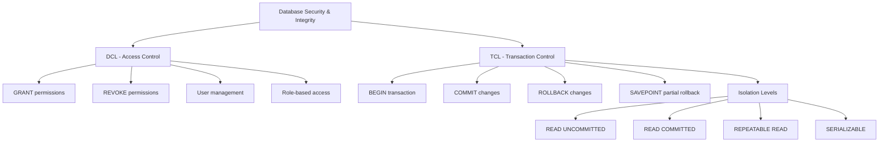

# Data Control Language (DCL) & Transaction Control (TCL)

> **Module 3 • Lesson 3**  
> Estimated time: 30 min | Difficulty: ★★★☆☆

## 1. Why this matters

Security and data integrity are fundamental to any database system. Data Control Language (DCL) manages who can access what data and perform which operations, while Transaction Control Language (TCL) ensures that database operations maintain consistency and can be safely rolled back when things go wrong. Understanding these concepts is crucial for building secure, reliable applications and managing multi-user database environments where concurrent access and data protection are paramount.

> **Need a refresher?** This lesson builds on [Data Manipulation Language (DML)](03-02-data-manipulation-language.md) and concepts from [DBMS Deep Dive](01-02-dbms-deep-dive.md).

## 2. Key Concepts

- **DCL fundamentals**: GRANT and REVOKE for access control
- **User and role management**: Creating users, assigning permissions
- **Principle of least privilege**: Giving minimum necessary access
- **Transaction boundaries**: BEGIN, COMMIT, ROLLBACK
- **ACID compliance**: Ensuring data integrity through transactions
- **Isolation levels**: Controlling concurrent transaction behavior
- **Savepoints**: Partial rollback within transactions



## 3. Deep Dive

### 3.1 Data Control Language (DCL)

**User Creation and Management**:
```sql
-- Create a new user
CREATE USER 'app_user'@'localhost' IDENTIFIED BY 'secure_password123';
CREATE USER 'readonly_user'@'%' IDENTIFIED BY 'readonly_pass';
CREATE USER 'analyst'@'10.0.%.%' IDENTIFIED BY 'analyst_pass';

-- Change user password
ALTER USER 'app_user'@'localhost' IDENTIFIED BY 'new_secure_password';

-- Drop a user
DROP USER 'old_user'@'localhost';
```

**Basic Permission Management**:
```sql
-- Grant table-level permissions
GRANT SELECT, INSERT, UPDATE ON ecommerce.customers TO 'app_user'@'localhost';
GRANT SELECT ON ecommerce.orders TO 'readonly_user'@'%';

-- Grant database-level permissions
GRANT ALL PRIVILEGES ON ecommerce.* TO 'admin_user'@'localhost';

-- Grant specific column permissions
GRANT SELECT (id, name, email) ON customers TO 'limited_user'@'localhost';
GRANT UPDATE (stock_quantity) ON products TO 'inventory_user'@'localhost';

-- Revoke permissions
REVOKE INSERT, UPDATE ON ecommerce.customers FROM 'app_user'@'localhost';
REVOKE ALL PRIVILEGES ON ecommerce.* FROM 'temp_user'@'localhost';
```

**Role-Based Access Control** (MySQL 8.0+):
```sql
-- Create roles
CREATE ROLE 'app_read', 'app_write', 'app_admin';

-- Grant permissions to roles
GRANT SELECT ON ecommerce.* TO 'app_read';
GRANT INSERT, UPDATE, DELETE ON ecommerce.* TO 'app_write';
GRANT ALL PRIVILEGES ON ecommerce.* TO 'app_admin';

-- Assign roles to users
GRANT 'app_read' TO 'readonly_user'@'%';
GRANT 'app_read', 'app_write' TO 'app_user'@'localhost';
GRANT 'app_admin' TO 'admin_user'@'localhost';

-- Set default roles for users
ALTER USER 'app_user'@'localhost' DEFAULT ROLE 'app_read', 'app_write';

-- Users can activate roles in their session
SET ROLE 'app_write';
SET ROLE ALL; -- Activate all granted roles
```

**Advanced Permission Patterns**:
```sql
-- Grant with grant option (user can grant to others)
GRANT SELECT ON customers TO 'team_lead'@'localhost' WITH GRANT OPTION;

-- Create a procedure execution permission
GRANT EXECUTE ON PROCEDURE calculate_commission TO 'sales_user'@'%';

-- Grant permission to create temporary tables
GRANT CREATE TEMPORARY TABLES ON ecommerce.* TO 'report_user'@'localhost';

-- View current permissions
SHOW GRANTS FOR 'app_user'@'localhost';
SHOW GRANTS FOR CURRENT_USER();
```

### 3.2 Transaction Control Language (TCL)

**Basic Transaction Control**:
```sql
-- Explicit transaction
BEGIN; -- or START TRANSACTION;

INSERT INTO customers (name, email) VALUES ('John Doe', 'john@example.com');
INSERT INTO orders (customer_id, total_amount) VALUES (LAST_INSERT_ID(), 99.99);

-- If everything looks good
COMMIT;

-- If something went wrong
-- ROLLBACK;
```

**Transaction with Error Handling**:
```sql
DELIMITER $$
CREATE PROCEDURE transfer_funds(
    IN from_account INT,
    IN to_account INT,
    IN amount DECIMAL(10,2)
)
BEGIN
    DECLARE EXIT HANDLER FOR SQLEXCEPTION
    BEGIN
        ROLLBACK;
        RESIGNAL; -- Re-throw the error
    END;
    
    START TRANSACTION;
    
    -- Check sufficient funds
    IF (SELECT balance FROM accounts WHERE id = from_account) < amount THEN
        SIGNAL SQLSTATE '45000' SET MESSAGE_TEXT = 'Insufficient funds';
    END IF;
    
    -- Perform transfer
    UPDATE accounts SET balance = balance - amount WHERE id = from_account;
    UPDATE accounts SET balance = balance + amount WHERE id = to_account;
    
    -- Log the transaction
    INSERT INTO transaction_log (from_account, to_account, amount, timestamp)
    VALUES (from_account, to_account, amount, NOW());
    
    COMMIT;
END$$
DELIMITER ;
```

**Savepoints for Partial Rollback**:
```sql
BEGIN;

INSERT INTO customers (name, email) VALUES ('Alice Smith', 'alice@example.com');
SAVEPOINT after_customer;

INSERT INTO orders (customer_id, total_amount) VALUES (LAST_INSERT_ID(), 150.00);
SAVEPOINT after_order;

-- Try to insert order items
INSERT INTO order_items (order_id, product_id, quantity) 
VALUES (LAST_INSERT_ID(), 999, 1); -- This might fail if product doesn't exist

-- If order items fail, rollback to after_order but keep customer and order
-- ROLLBACK TO after_order;

-- If we want to keep everything
COMMIT;
```

### 3.3 Isolation Levels

**Understanding Isolation Levels**:
```sql
-- Check current isolation level
SELECT @@transaction_isolation;

-- Set isolation level for current session
SET SESSION TRANSACTION ISOLATION LEVEL READ COMMITTED;

-- Set isolation level for next transaction only
SET TRANSACTION ISOLATION LEVEL REPEATABLE READ;
```

**READ UNCOMMITTED** (Allows dirty reads):
```sql
-- Session 1
SET TRANSACTION ISOLATION LEVEL READ UNCOMMITTED;
BEGIN;
SELECT balance FROM accounts WHERE id = 1; -- Might see uncommitted changes

-- Session 2 (concurrent)
BEGIN;
UPDATE accounts SET balance = 1000 WHERE id = 1; -- Not yet committed
-- Session 1 can see this change even before commit
```

**READ COMMITTED** (Prevents dirty reads):
```sql
-- Session 1
SET TRANSACTION ISOLATION LEVEL READ COMMITTED;
BEGIN;
SELECT balance FROM accounts WHERE id = 1; -- 500
-- ... later in same transaction
SELECT balance FROM accounts WHERE id = 1; -- Might now be 1000 if another transaction committed

-- This prevents dirty reads but allows non-repeatable reads
```

**REPEATABLE READ** (MySQL default, prevents dirty and non-repeatable reads):
```sql
-- Session 1
SET TRANSACTION ISOLATION LEVEL REPEATABLE READ;
BEGIN;
SELECT balance FROM accounts WHERE id = 1; -- 500
-- ... later in same transaction
SELECT balance FROM accounts WHERE id = 1; -- Still 500, even if others committed changes

-- Consistent reads within transaction, but phantom reads possible
```

**SERIALIZABLE** (Highest isolation, prevents all phenomena):
```sql
-- Session 1
SET TRANSACTION ISOLATION LEVEL SERIALIZABLE;
BEGIN;
SELECT COUNT(*) FROM orders WHERE customer_id = 1; -- 5

-- Session 2 cannot insert new orders for customer 1 until Session 1 commits
-- This prevents phantom reads but reduces concurrency
```

### 3.4 Advanced Transaction Patterns

**Optimistic Locking with Version Control**:
```sql
-- Add version column to table
ALTER TABLE accounts ADD COLUMN version INT DEFAULT 1;

-- Update with version check
UPDATE accounts 
SET balance = balance - 100,
    version = version + 1
WHERE id = 1 AND version = 3; -- Only update if version matches

-- Check if update succeeded
SELECT ROW_COUNT(); -- Returns 0 if no rows updated (version mismatch)
```

**Pessimistic Locking**:
```sql
BEGIN;

-- Lock the row for update
SELECT balance FROM accounts WHERE id = 1 FOR UPDATE;

-- Other transactions will wait here
-- Perform calculations...
UPDATE accounts SET balance = balance - 100 WHERE id = 1;

COMMIT; -- Releases the lock
```

**Distributed Transaction Pattern**:
```sql
-- Prepare phase
BEGIN;
UPDATE inventory SET quantity = quantity - 1 WHERE product_id = 101;
UPDATE orders SET status = 'confirmed' WHERE id = 12345;

-- Check if all operations succeeded
-- If yes: COMMIT
-- If no: ROLLBACK

COMMIT;
```

## 4. Hands-On Practice

Let's create a comprehensive security and transaction scenario:

```sql
-- Create a banking scenario for practice
CREATE DATABASE banking_demo;
USE banking_demo;

CREATE TABLE accounts (
    id INT AUTO_INCREMENT PRIMARY KEY,
    account_number VARCHAR(20) UNIQUE NOT NULL,
    customer_name VARCHAR(100) NOT NULL,
    balance DECIMAL(15,2) DEFAULT 0.00,
    account_type ENUM('checking', 'savings') DEFAULT 'checking',
    version INT DEFAULT 1,
    created_at TIMESTAMP DEFAULT CURRENT_TIMESTAMP,
    updated_at TIMESTAMP DEFAULT CURRENT_TIMESTAMP ON UPDATE CURRENT_TIMESTAMP
);

CREATE TABLE transaction_log (
    id INT AUTO_INCREMENT PRIMARY KEY,
    from_account_id INT,
    to_account_id INT,
    amount DECIMAL(15,2) NOT NULL,
    transaction_type ENUM('deposit', 'withdrawal', 'transfer') NOT NULL,
    description TEXT,
    created_at TIMESTAMP DEFAULT CURRENT_TIMESTAMP,
    FOREIGN KEY (from_account_id) REFERENCES accounts(id),
    FOREIGN KEY (to_account_id) REFERENCES accounts(id)
);

-- Insert sample data
INSERT INTO accounts (account_number, customer_name, balance, account_type) VALUES
('ACC001', 'Alice Johnson', 5000.00, 'checking'),
('ACC002', 'Bob Smith', 3000.00, 'savings'),
('ACC003', 'Carol Davis', 7500.00, 'checking');

-- Create different user types
CREATE USER 'bank_teller'@'localhost' IDENTIFIED BY 'teller_pass123';
CREATE USER 'account_manager'@'localhost' IDENTIFIED BY 'manager_pass123';
CREATE USER 'auditor'@'localhost' IDENTIFIED BY 'audit_pass123';
CREATE USER 'customer_app'@'%' IDENTIFIED BY 'app_pass123';

-- Create roles
CREATE ROLE 'teller_role', 'manager_role', 'auditor_role', 'customer_role';

-- Grant permissions to roles
GRANT SELECT, UPDATE ON banking_demo.accounts TO 'teller_role';
GRANT INSERT ON banking_demo.transaction_log TO 'teller_role';

GRANT ALL PRIVILEGES ON banking_demo.* TO 'manager_role';

GRANT SELECT ON banking_demo.* TO 'auditor_role';

GRANT SELECT ON banking_demo.accounts TO 'customer_role';
GRANT SELECT ON banking_demo.transaction_log TO 'customer_role';

-- Assign roles to users
GRANT 'teller_role' TO 'bank_teller'@'localhost';
GRANT 'manager_role' TO 'account_manager'@'localhost';
GRANT 'auditor_role' TO 'auditor'@'localhost';
GRANT 'customer_role' TO 'customer_app'@'%';

-- Set default roles
ALTER USER 'bank_teller'@'localhost' DEFAULT ROLE 'teller_role';
ALTER USER 'account_manager'@'localhost' DEFAULT ROLE 'manager_role';
ALTER USER 'auditor'@'localhost' DEFAULT ROLE 'auditor_role';
ALTER USER 'customer_app'@'%' DEFAULT ROLE 'customer_role';
```

**Practice Exercise 1: Safe Money Transfer**
```sql
DELIMITER $$
CREATE PROCEDURE safe_transfer(
    IN from_account VARCHAR(20),
    IN to_account VARCHAR(20),
    IN transfer_amount DECIMAL(15,2),
    OUT result_message VARCHAR(255)
)
BEGIN
    DECLARE from_id INT;
    DECLARE to_id INT;
    DECLARE current_balance DECIMAL(15,2);
    DECLARE EXIT HANDLER FOR SQLEXCEPTION
    BEGIN
        ROLLBACK;
        SET result_message = 'Transfer failed due to error';
    END;
    
    START TRANSACTION;
    
    -- Get account IDs and lock rows
    SELECT id, balance INTO from_id, current_balance 
    FROM accounts 
    WHERE account_number = from_account 
    FOR UPDATE;
    
    SELECT id INTO to_id 
    FROM accounts 
    WHERE account_number = to_account 
    FOR UPDATE;
    
    -- Validate accounts exist
    IF from_id IS NULL OR to_id IS NULL THEN
        SET result_message = 'Invalid account number';
        ROLLBACK;
    ELSEIF current_balance < transfer_amount THEN
        SET result_message = 'Insufficient funds';
        ROLLBACK;
    ELSEIF transfer_amount <= 0 THEN
        SET result_message = 'Invalid transfer amount';
        ROLLBACK;
    ELSE
        -- Perform transfer
        UPDATE accounts 
        SET balance = balance - transfer_amount,
            version = version + 1
        WHERE id = from_id;
        
        UPDATE accounts 
        SET balance = balance + transfer_amount,
            version = version + 1
        WHERE id = to_id;
        
        -- Log transaction
        INSERT INTO transaction_log (from_account_id, to_account_id, amount, transaction_type, description)
        VALUES (from_id, to_id, transfer_amount, 'transfer', CONCAT('Transfer from ', from_account, ' to ', to_account));
        
        SET result_message = 'Transfer completed successfully';
        COMMIT;
    END IF;
END$$
DELIMITER ;

-- Test the procedure
CALL safe_transfer('ACC001', 'ACC002', 500.00, @result);
SELECT @result;
```

**Practice Exercise 2: Concurrent Access Simulation**
```sql
-- Simulate concurrent access (run in different sessions)

-- Session 1: Long-running transaction
BEGIN;
SELECT * FROM accounts WHERE account_number = 'ACC001' FOR UPDATE;
-- ... do some processing (simulate with SLEEP)
SELECT SLEEP(10);
UPDATE accounts SET balance = balance - 100 WHERE account_number = 'ACC001';
COMMIT;

-- Session 2: This will wait for Session 1 to complete
BEGIN;
UPDATE accounts SET balance = balance + 50 WHERE account_number = 'ACC001';
COMMIT;
```

**Practice Tasks**:
1. Create a user that can only view account balances but not transaction history
2. Implement a procedure that handles concurrent withdrawals safely
3. Set up different isolation levels and observe their behavior
4. Create an audit trail system that logs all account modifications
5. Implement a deadlock scenario and show how to handle it

## 5. Common Pitfalls

### 5.1 Overprivileged Users
```sql
-- BAD - Giving too many permissions
GRANT ALL PRIVILEGES ON *.* TO 'app_user'@'%';

-- GOOD - Principle of least privilege
GRANT SELECT, INSERT, UPDATE ON ecommerce.orders TO 'app_user'@'localhost';
GRANT SELECT ON ecommerce.products TO 'app_user'@'localhost';
```

### 5.2 Forgetting to COMMIT or ROLLBACK
```sql
-- PROBLEMATIC - Transaction left hanging
BEGIN;
UPDATE accounts SET balance = balance - 100 WHERE id = 1;
-- ... application crashes or connection lost
-- Transaction remains open, holding locks
```

### 5.3 Deadlock-Prone Code
```sql
-- Session 1
BEGIN;
UPDATE accounts SET balance = balance - 100 WHERE id = 1;
UPDATE accounts SET balance = balance + 100 WHERE id = 2;
COMMIT;

-- Session 2 (running concurrently)
BEGIN;
UPDATE accounts SET balance = balance - 50 WHERE id = 2; -- Waits for Session 1
UPDATE accounts SET balance = balance + 50 WHERE id = 1; -- Deadlock!
COMMIT;

-- SOLUTION - Consistent ordering
-- Always update accounts in ID order
```

### 5.4 Wrong Isolation Level
```sql
-- WRONG - Using SERIALIZABLE for high-concurrency OLTP
SET TRANSACTION ISOLATION LEVEL SERIALIZABLE;
-- This will cause too much blocking

-- BETTER - Use READ COMMITTED for most OLTP workloads
SET TRANSACTION ISOLATION LEVEL READ COMMITTED;
```

### 5.5 Not Handling Transaction Failures
```sql
-- BAD - No error handling
BEGIN;
UPDATE accounts SET balance = balance - amount WHERE id = from_id;
UPDATE accounts SET balance = balance + amount WHERE id = to_id;
COMMIT; -- What if one of the UPDATEs failed?

-- GOOD - Proper error handling (shown in stored procedure examples above)
```

## 6. Knowledge Check

<details>
<summary>1. What's the difference between GRANT and REVOKE?</summary>

GRANT gives permissions to users or roles, while REVOKE removes previously granted permissions. GRANT adds access rights, REVOKE takes them away.
</details>

<details>
<summary>2. Why should you use roles instead of granting permissions directly to users?</summary>

Roles make permission management easier and more maintainable. You can grant a role to multiple users, modify the role's permissions once to affect all users, and easily reassign users to different roles as their responsibilities change.
</details>

<details>
<summary>3. What happens if you don't COMMIT or ROLLBACK a transaction?</summary>

The transaction remains open, holding locks on any modified data. This can block other transactions and eventually lead to timeout errors. In MySQL, transactions auto-rollback when the connection is lost.
</details>

<details>
<summary>4. When would you use SAVEPOINT instead of full ROLLBACK?</summary>

Use SAVEPOINT when you want to rollback only part of a transaction. For example, if you're processing multiple steps and one step fails, you can rollback to a savepoint rather than losing all the work done in earlier steps.
</details>

<details>
<summary>5. What's the trade-off between higher isolation levels and performance?</summary>

Higher isolation levels (like SERIALIZABLE) provide more consistency guarantees but reduce concurrency and performance due to increased locking. Lower levels (like READ COMMITTED) allow more concurrency but may see inconsistent data during concurrent modifications.
</details>

## 7. Further Reading

- [MySQL User Account Management](https://dev.mysql.com/doc/refman/8.0/en/user-account-management.html)
- [MySQL Transaction Isolation Levels](https://dev.mysql.com/doc/refman/8.0/en/innodb-transaction-isolation-levels.html)
- [MySQL Role-Based Access Control](https://dev.mysql.com/doc/refman/8.0/en/roles.html)
- [Database Security Best Practices](https://owasp.org/www-project-top-ten/2017/A3_2017-Sensitive_Data_Exposure)
- [Transaction Processing: Concepts and Techniques by Gray & Reuter](https://www.amazon.com/Transaction-Processing-Concepts-Techniques-Management/dp/1558601902)

---

**Navigation**

[← Previous: Data Manipulation Language (DML)](03-02-data-manipulation-language.md) | [Next → Joins and Relationships](04-01-joins-and-relationships.md)

_Last updated: 2025-01-21_ 