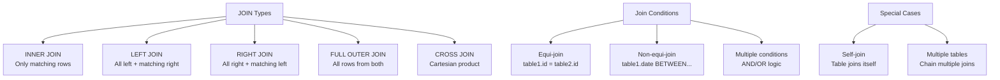

# Joins and Relationships

> **Module 4 • Lesson 1**  
> Estimated time: 35 min | Difficulty: ★★★☆☆

## 1. Why this matters

Joins are the heart of relational databases—they're how you combine data from multiple tables to answer complex questions. Understanding joins deeply means you can model data efficiently across normalized tables while still being able to retrieve comprehensive information when needed. Whether you're building reports, APIs, or analytical queries, mastering join patterns and understanding their performance implications is essential for any SQL practitioner working with real-world data.

> **Need a refresher?** This lesson builds on [Data Manipulation Language (DML)](03-02-data-manipulation-language.md) and [Logical Clause Evaluation Order](02-01-logical-clause-evaluation.md).

## 2. Key Concepts

- **Join types**: INNER, LEFT, RIGHT, FULL OUTER, CROSS
- **Join conditions**: Equi-joins, non-equi-joins, multiple conditions
- **Self-joins**: Joining a table to itself for hierarchical data
- **Multiple table joins**: Chaining joins across many tables
- **Join performance**: Index usage and optimization strategies
- **Relationship patterns**: One-to-one, one-to-many, many-to-many



## 3. Deep Dive

### 3.1 INNER JOIN - Only Matching Records

INNER JOIN returns only rows where the join condition is met in both tables.

```sql
-- Basic INNER JOIN
SELECT 
    c.customer_name,
    o.order_date,
    o.total_amount
FROM customers c
INNER JOIN orders o ON c.customer_id = o.customer_id;

-- Multiple conditions in INNER JOIN
SELECT 
    c.customer_name,
    o.order_date,
    o.total_amount
FROM customers c
INNER JOIN orders o ON c.customer_id = o.customer_id
    AND o.order_date >= '2024-01-01'
    AND o.status = 'completed';

-- INNER JOIN with aggregation
SELECT 
    c.customer_name,
    COUNT(o.order_id) as total_orders,
    SUM(o.total_amount) as total_spent
FROM customers c
INNER JOIN orders o ON c.customer_id = o.customer_id
GROUP BY c.customer_id, c.customer_name
HAVING COUNT(o.order_id) > 5;
```

### 3.2 LEFT JOIN - All Left Records Plus Matches

LEFT JOIN returns all rows from the left table and matching rows from the right table. NULL values appear for non-matching right table columns.

```sql
-- Basic LEFT JOIN - all customers, even those without orders
SELECT 
    c.customer_name,
    c.email,
    COUNT(o.order_id) as order_count,
    COALESCE(SUM(o.total_amount), 0) as total_spent
FROM customers c
LEFT JOIN orders o ON c.customer_id = o.customer_id
GROUP BY c.customer_id, c.customer_name, c.email
ORDER BY total_spent DESC;

-- LEFT JOIN to find records without matches
SELECT 
    c.customer_name,
    c.email,
    c.registration_date
FROM customers c
LEFT JOIN orders o ON c.customer_id = o.customer_id
WHERE o.customer_id IS NULL; -- Customers who never ordered

-- LEFT JOIN with date filtering
SELECT 
    c.customer_name,
    COUNT(o.order_id) as orders_this_year
FROM customers c
LEFT JOIN orders o ON c.customer_id = o.customer_id 
    AND o.order_date >= '2024-01-01'
GROUP BY c.customer_id, c.customer_name;
```

### 3.3 RIGHT JOIN - All Right Records Plus Matches

RIGHT JOIN is the opposite of LEFT JOIN. It's less commonly used since you can achieve the same result by swapping table positions in a LEFT JOIN.

```sql
-- RIGHT JOIN (less common)
SELECT 
    c.customer_name,
    o.order_date,
    o.total_amount
FROM orders o
RIGHT JOIN customers c ON o.customer_id = c.customer_id;

-- Equivalent LEFT JOIN (preferred)
SELECT 
    c.customer_name,
    o.order_date,
    o.total_amount
FROM customers c
LEFT JOIN orders o ON c.customer_id = o.customer_id;
```

### 3.4 FULL OUTER JOIN - All Records from Both Tables

FULL OUTER JOIN returns all rows from both tables. MySQL doesn't support FULL OUTER JOIN directly, but you can simulate it with UNION.

```sql
-- Simulating FULL OUTER JOIN in MySQL
SELECT 
    c.customer_name,
    o.order_date,
    o.total_amount
FROM customers c
LEFT JOIN orders o ON c.customer_id = o.customer_id

UNION

SELECT 
    c.customer_name,
    o.order_date,
    o.total_amount
FROM customers c
RIGHT JOIN orders o ON c.customer_id = o.customer_id
WHERE c.customer_id IS NULL;
```

### 3.5 CROSS JOIN - Cartesian Product

CROSS JOIN produces a Cartesian product of both tables. Use with caution as it can produce very large result sets.

```sql
-- CROSS JOIN - every customer with every product
SELECT 
    c.customer_name,
    p.product_name,
    p.price
FROM customers c
CROSS JOIN products p
WHERE c.customer_id <= 3 AND p.product_id <= 5; -- Limit for safety

-- Practical use: Generate date ranges for each customer
SELECT 
    c.customer_name,
    dates.report_date
FROM customers c
CROSS JOIN (
    SELECT DATE_ADD('2024-01-01', INTERVAL n DAY) as report_date
    FROM (
        SELECT 0 as n UNION SELECT 1 UNION SELECT 2 UNION SELECT 3 
        UNION SELECT 4 UNION SELECT 5 UNION SELECT 6
    ) numbers
) dates
WHERE c.customer_id <= 3;
```

### 3.6 Self-Joins - Table Joins Itself

Self-joins are useful for hierarchical data, comparing rows within the same table, or finding relationships within a single table.

```sql
-- Employee hierarchy
SELECT 
    e.employee_name as employee,
    m.employee_name as manager
FROM employees e
LEFT JOIN employees m ON e.manager_id = m.employee_id;

-- Find customers in the same city
SELECT 
    c1.customer_name as customer1,
    c2.customer_name as customer2,
    c1.city
FROM customers c1
INNER JOIN customers c2 ON c1.city = c2.city
WHERE c1.customer_id < c2.customer_id; -- Avoid duplicates

-- Compare sales between consecutive months
SELECT 
    curr.sales_month,
    curr.total_sales as current_month,
    prev.total_sales as previous_month,
    ROUND(
        ((curr.total_sales - prev.total_sales) / prev.total_sales) * 100, 2
    ) as growth_percentage
FROM monthly_sales curr
LEFT JOIN monthly_sales prev ON DATE_ADD(prev.sales_month, INTERVAL 1 MONTH) = curr.sales_month
ORDER BY curr.sales_month;
```

### 3.7 Multiple Table Joins

Real-world queries often involve joining multiple tables. Order matters for performance and readability.

```sql
-- Complex multi-table join
SELECT 
    c.customer_name,
    c.email,
    o.order_date,
    p.product_name,
    cat.category_name,
    oi.quantity,
    oi.unit_price,
    (oi.quantity * oi.unit_price) as line_total
FROM customers c
INNER JOIN orders o ON c.customer_id = o.customer_id
INNER JOIN order_items oi ON o.order_id = oi.order_id
INNER JOIN products p ON oi.product_id = p.product_id
INNER JOIN categories cat ON p.category_id = cat.category_id
WHERE o.order_date >= '2024-01-01'
ORDER BY c.customer_name, o.order_date, p.product_name;

-- Mixed join types in one query
SELECT 
    c.customer_name,
    c.email,
    COUNT(DISTINCT o.order_id) as total_orders,
    COUNT(DISTINCT r.review_id) as total_reviews,
    AVG(r.rating) as avg_rating
FROM customers c
LEFT JOIN orders o ON c.customer_id = o.customer_id
LEFT JOIN reviews r ON c.customer_id = r.customer_id
WHERE c.registration_date >= '2023-01-01'
GROUP BY c.customer_id, c.customer_name, c.email
HAVING total_orders > 0 OR total_reviews > 0;
```

### 3.8 Non-Equi Joins

Joins don't always use equality. Non-equi joins use other comparison operators.

```sql
-- Price range matching
SELECT 
    p.product_name,
    p.price,
    pr.range_name
FROM products p
INNER JOIN price_ranges pr ON p.price BETWEEN pr.min_price AND pr.max_price;

-- Date range joins
SELECT 
    o.order_id,
    o.order_date,
    promo.promotion_name,
    promo.discount_percentage
FROM orders o
INNER JOIN promotions promo ON o.order_date BETWEEN promo.start_date AND promo.end_date;

-- Inequality joins for finding related records
SELECT 
    p1.product_name as product1,
    p2.product_name as product2,
    ABS(p1.price - p2.price) as price_difference
FROM products p1
INNER JOIN products p2 ON p1.category_id = p2.category_id
    AND p1.product_id != p2.product_id
    AND ABS(p1.price - p2.price) < 50
ORDER BY price_difference;
```

## 4. Hands-On Practice

Let's create a comprehensive e-commerce schema to practice different join patterns:

```sql
-- Create comprehensive schema for join practice
CREATE DATABASE ecommerce_joins;
USE ecommerce_joins;

CREATE TABLE categories (
    category_id INT AUTO_INCREMENT PRIMARY KEY,
    category_name VARCHAR(50) NOT NULL,
    parent_category_id INT,
    FOREIGN KEY (parent_category_id) REFERENCES categories(category_id)
);

CREATE TABLE customers (
    customer_id INT AUTO_INCREMENT PRIMARY KEY,
    customer_name VARCHAR(100) NOT NULL,
    email VARCHAR(100) UNIQUE NOT NULL,
    city VARCHAR(50),
    country VARCHAR(50),
    registration_date DATE NOT NULL
);

CREATE TABLE products (
    product_id INT AUTO_INCREMENT PRIMARY KEY,
    product_name VARCHAR(100) NOT NULL,
    category_id INT,
    price DECIMAL(10,2) NOT NULL,
    stock_quantity INT DEFAULT 0,
    FOREIGN KEY (category_id) REFERENCES categories(category_id)
);

CREATE TABLE orders (
    order_id INT AUTO_INCREMENT PRIMARY KEY,
    customer_id INT NOT NULL,
    order_date DATE NOT NULL,
    total_amount DECIMAL(10,2) NOT NULL,
    status ENUM('pending', 'processing', 'shipped', 'delivered', 'cancelled') DEFAULT 'pending',
    FOREIGN KEY (customer_id) REFERENCES customers(customer_id)
);

CREATE TABLE order_items (
    order_item_id INT AUTO_INCREMENT PRIMARY KEY,
    order_id INT NOT NULL,
    product_id INT NOT NULL,
    quantity INT NOT NULL,
    unit_price DECIMAL(10,2) NOT NULL,
    FOREIGN KEY (order_id) REFERENCES orders(order_id),
    FOREIGN KEY (product_id) REFERENCES products(product_id)
);

CREATE TABLE reviews (
    review_id INT AUTO_INCREMENT PRIMARY KEY,
    customer_id INT NOT NULL,
    product_id INT NOT NULL,
    rating INT CHECK (rating BETWEEN 1 AND 5),
    review_text TEXT,
    review_date DATE NOT NULL,
    FOREIGN KEY (customer_id) REFERENCES customers(customer_id),
    FOREIGN KEY (product_id) REFERENCES products(product_id)
);

CREATE TABLE employees (
    employee_id INT AUTO_INCREMENT PRIMARY KEY,
    employee_name VARCHAR(100) NOT NULL,
    manager_id INT,
    department VARCHAR(50),
    hire_date DATE NOT NULL,
    FOREIGN KEY (manager_id) REFERENCES employees(employee_id)
);

-- Insert sample data
INSERT INTO categories (category_name, parent_category_id) VALUES
('Electronics', NULL),
('Books', NULL),
('Clothing', NULL),
('Laptops', 1),
('Smartphones', 1),
('Fiction', 2),
('Non-Fiction', 2);

INSERT INTO customers (customer_name, email, city, country, registration_date) VALUES
('Alice Johnson', 'alice@example.com', 'New York', 'USA', '2023-01-15'),
('Bob Smith', 'bob@example.com', 'Toronto', 'Canada', '2023-02-20'),
('Carol Davis', 'carol@example.com', 'London', 'UK', '2023-03-10'),
('David Wilson', 'david@example.com', 'Sydney', 'Australia', '2023-04-05'),
('Eve Brown', 'eve@example.com', 'Berlin', 'Germany', '2023-05-12');

INSERT INTO products (product_name, category_id, price, stock_quantity) VALUES
('MacBook Pro', 4, 1999.99, 25),
('iPhone 15', 5, 999.99, 50),
('The Great Gatsby', 6, 12.99, 100),
('Sapiens', 7, 18.99, 75),
('Dell XPS 13', 4, 1299.99, 30);

INSERT INTO employees (employee_name, manager_id, department, hire_date) VALUES
('John Manager', NULL, 'Management', '2020-01-01'),
('Alice Lead', 1, 'Sales', '2021-01-15'),
('Bob Rep', 2, 'Sales', '2022-03-01'),
('Carol Rep', 2, 'Sales', '2022-06-15'),
('David Admin', 1, 'Admin', '2021-08-01');

-- Insert orders and order items
INSERT INTO orders (customer_id, order_date, total_amount, status) VALUES
(1, '2024-01-10', 2012.98, 'delivered'),
(2, '2024-01-15', 999.99, 'delivered'),
(3, '2024-01-20', 31.98, 'delivered'),
(1, '2024-02-01', 1299.99, 'shipped');

INSERT INTO order_items (order_id, product_id, quantity, unit_price) VALUES
(1, 1, 1, 1999.99),
(1, 3, 1, 12.99),
(2, 2, 1, 999.99),
(3, 3, 1, 12.99),
(3, 4, 1, 18.99),
(4, 5, 1, 1299.99);

INSERT INTO reviews (customer_id, product_id, rating, review_text, review_date) VALUES
(1, 1, 5, 'Excellent laptop!', '2024-01-15'),
(2, 2, 4, 'Great phone, battery could be better', '2024-01-20'),
(3, 3, 5, 'Classic book, loved it', '2024-01-25');
```

**Practice Exercise 1: Customer Order Analysis**
```sql
-- Find customers with their order statistics
SELECT 
    c.customer_name,
    c.email,
    c.country,
    COUNT(DISTINCT o.order_id) as total_orders,
    COUNT(DISTINCT oi.product_id) as unique_products_bought,
    SUM(oi.quantity * oi.unit_price) as total_spent,
    AVG(o.total_amount) as avg_order_value,
    MAX(o.order_date) as last_order_date
FROM customers c
LEFT JOIN orders o ON c.customer_id = o.customer_id
LEFT JOIN order_items oi ON o.order_id = oi.order_id
GROUP BY c.customer_id, c.customer_name, c.email, c.country
ORDER BY total_spent DESC;
```

**Practice Exercise 2: Product Performance with Categories**
```sql
-- Product sales with category hierarchy
SELECT 
    parent.category_name as parent_category,
    child.category_name as subcategory,
    p.product_name,
    p.price,
    COALESCE(SUM(oi.quantity), 0) as total_sold,
    COALESCE(SUM(oi.quantity * oi.unit_price), 0) as total_revenue,
    COUNT(DISTINCT r.review_id) as review_count,
    AVG(r.rating) as avg_rating
FROM categories parent
LEFT JOIN categories child ON parent.category_id = child.parent_category_id
LEFT JOIN products p ON child.category_id = p.category_id
LEFT JOIN order_items oi ON p.product_id = oi.product_id
LEFT JOIN reviews r ON p.product_id = r.product_id
WHERE parent.parent_category_id IS NULL
GROUP BY parent.category_id, child.category_id, p.product_id
ORDER BY parent.category_name, child.category_name, total_revenue DESC;
```

**Practice Exercise 3: Employee Hierarchy**
```sql
-- Employee reporting structure
SELECT 
    e.employee_name as employee,
    e.department,
    e.hire_date,
    m.employee_name as manager,
    COUNT(subordinate.employee_id) as direct_reports
FROM employees e
LEFT JOIN employees m ON e.manager_id = m.employee_id
LEFT JOIN employees subordinate ON e.employee_id = subordinate.manager_id
GROUP BY e.employee_id, e.employee_name, e.department, e.hire_date, m.employee_name
ORDER BY e.department, e.hire_date;
```

**Advanced Practice Tasks**:
1. Find customers who bought products but never left reviews
2. Create a report showing monthly sales trends by category
3. Find products that are frequently bought together
4. Identify customers who might be interested in similar products based on their purchase history
5. Create a comprehensive sales report with customer, product, and geographic breakdowns

## 5. Common Pitfalls

### 5.1 Cartesian Products from Missing JOIN Conditions
```sql
-- WRONG - Creates Cartesian product
SELECT c.customer_name, p.product_name
FROM customers c, products p; -- Old syntax, no join condition

-- CORRECT - Proper join condition
SELECT c.customer_name, p.product_name
FROM customers c
CROSS JOIN products p
WHERE c.customer_id <= 2 AND p.product_id <= 3; -- Intentional cross join with filters
```

### 5.2 Confusing LEFT JOIN with WHERE
```sql
-- WRONG - WHERE clause turns LEFT JOIN into INNER JOIN
SELECT c.customer_name, o.order_date
FROM customers c
LEFT JOIN orders o ON c.customer_id = o.customer_id
WHERE o.order_date >= '2024-01-01'; -- Excludes customers without orders

-- CORRECT - Filter in JOIN condition or handle NULLs
SELECT c.customer_name, o.order_date
FROM customers c
LEFT JOIN orders o ON c.customer_id = o.customer_id 
    AND o.order_date >= '2024-01-01';
```

### 5.3 Not Handling NULLs in Aggregations
```sql
-- PROBLEMATIC - NULL values in aggregations
SELECT 
    c.customer_name,
    SUM(o.total_amount) as total_spent -- NULL if no orders
FROM customers c
LEFT JOIN orders o ON c.customer_id = o.customer_id
GROUP BY c.customer_id, c.customer_name;

-- BETTER - Handle NULLs explicitly
SELECT 
    c.customer_name,
    COALESCE(SUM(o.total_amount), 0) as total_spent
FROM customers c
LEFT JOIN orders o ON c.customer_id = o.customer_id
GROUP BY c.customer_id, c.customer_name;
```

### 5.4 Inefficient Join Order
```sql
-- LESS EFFICIENT - Large table first
SELECT *
FROM large_table l
INNER JOIN small_filtered_table s ON l.id = s.id
WHERE s.filter_column = 'specific_value';

-- MORE EFFICIENT - Filter first, then join
SELECT *
FROM small_filtered_table s
INNER JOIN large_table l ON s.id = l.id
WHERE s.filter_column = 'specific_value';
```

### 5.5 Duplicate Results from One-to-Many Joins
```sql
-- PROBLEMATIC - Duplicates customer data for each order
SELECT 
    c.customer_name,
    c.email,
    o.order_date,
    SUM(oi.quantity * oi.unit_price) as order_total
FROM customers c
INNER JOIN orders o ON c.customer_id = o.customer_id
INNER JOIN order_items oi ON o.order_id = oi.order_id
GROUP BY c.customer_id, o.order_id; -- Need to group properly

-- BETTER - Separate aggregations or use subqueries
SELECT 
    c.customer_name,
    c.email,
    order_summary.total_orders,
    order_summary.total_spent
FROM customers c
INNER JOIN (
    SELECT 
        customer_id,
        COUNT(*) as total_orders,
        SUM(total_amount) as total_spent
    FROM orders
    GROUP BY customer_id
) order_summary ON c.customer_id = order_summary.customer_id;
```

## 6. Knowledge Check

<details>
<summary>1. What's the difference between INNER JOIN and LEFT JOIN?</summary>

INNER JOIN returns only rows where the join condition is met in both tables. LEFT JOIN returns all rows from the left table and matching rows from the right table, with NULL values for non-matching right table columns.
</details>

<details>
<summary>2. When would you use a self-join?</summary>

Self-joins are useful for hierarchical data (like employee-manager relationships), comparing rows within the same table, or finding relationships within a single table (like customers in the same city).
</details>

<details>
<summary>3. Why might this query not return customers without orders: `SELECT c.*, o.* FROM customers c LEFT JOIN orders o ON c.id = o.customer_id WHERE o.order_date > '2024-01-01'`?</summary>

The WHERE clause filters out rows where o.order_date is NULL, which includes customers without orders. The filter should be moved to the JOIN condition: `LEFT JOIN orders o ON c.id = o.customer_id AND o.order_date > '2024-01-01'`.
</details>

<details>
<summary>4. What's a Cartesian product and why is it usually problematic?</summary>

A Cartesian product occurs when you join tables without proper join conditions, resulting in every row from the first table being combined with every row from the second table. This usually creates an unexpectedly large result set and is rarely what you want.
</details>

<details>
<summary>5. How do you handle NULL values when aggregating data from LEFT JOINs?</summary>

Use functions like COALESCE() or IFNULL() to convert NULL values to appropriate defaults. For example: `COALESCE(SUM(o.total_amount), 0)` returns 0 instead of NULL when there are no matching orders.
</details>

## 7. Further Reading

- [MySQL JOIN Documentation](https://dev.mysql.com/doc/refman/8.0/en/join.html)
- [SQL Joins Explained](https://www.w3schools.com/sql/sql_join.asp)
- [Visual Representation of SQL Joins](https://blog.codinghorror.com/a-visual-explanation-of-sql-joins/)
- [High Performance MySQL](https://www.oreilly.com/library/view/high-performance-mysql/9781492080503/) - Chapter 6 on Query Performance Optimization
- [SQL Antipatterns by Bill Karwin](https://pragprog.com/titles/bksqla/sql-antipatterns/) - Chapter 18 on Join Antipatterns

---

**Navigation**

[← Previous: Data Control Language (DCL) & Transaction Control (TCL)](03-03-data-control-transaction-control.md) | [Next → Subqueries and CTEs](04-02-subqueries-and-ctes.md)

_Last updated: 2025-06-21_ 