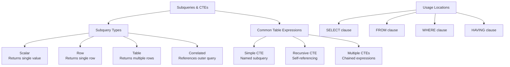

# Subqueries and CTEs

> **Module 4 • Lesson 2**  
> Estimated time: 40 min | Difficulty: ★★★☆☆

## 1. Why this matters

Subqueries and Common Table Expressions (CTEs) are powerful tools for breaking down complex problems into manageable parts. They allow you to write more readable, maintainable SQL by expressing complex logic step-by-step rather than in monolithic queries. Understanding when to use subqueries versus JOINs, and when to leverage CTEs for recursive operations or improved readability, is crucial for writing efficient and understandable SQL code that can handle sophisticated business logic.

> **Need a refresher?** This lesson builds on [Joins and Relationships](04-01-joins-and-relationships.md) and [Logical Clause Evaluation Order](02-01-logical-clause-evaluation.md).

## 2. Key Concepts

- **Subquery types**: Scalar, row, table, correlated vs non-correlated
- **Subquery locations**: SELECT, FROM, WHERE, HAVING clauses
- **Common Table Expressions (CTEs)**: Named temporary result sets
- **Recursive CTEs**: Self-referencing queries for hierarchical data
- **Performance considerations**: When subqueries vs JOINs are more efficient
- **EXISTS vs IN**: Different approaches for filtering with subqueries



## 3. Deep Dive

### 3.1 Scalar Subqueries

Scalar subqueries return a single value and can be used anywhere a single value is expected.

```sql
-- Scalar subquery in SELECT clause
SELECT 
    product_name,
    price,
    price - (SELECT AVG(price) FROM products) AS price_vs_average,
    ROUND(
        (price / (SELECT MAX(price) FROM products)) * 100, 2
    ) AS price_percentile
FROM products
ORDER BY price DESC;

-- Scalar subquery in WHERE clause
SELECT customer_name, total_spent
FROM (
    SELECT 
        c.customer_name,
        SUM(o.total_amount) as total_spent
    FROM customers c
    INNER JOIN orders o ON c.customer_id = o.customer_id
    GROUP BY c.customer_id, c.customer_name
) customer_totals
WHERE total_spent > (
    SELECT AVG(total_amount) * 3 
    FROM orders
);

-- Scalar subquery with CASE for conditional logic
SELECT 
    product_name,
    stock_quantity,
    CASE 
        WHEN stock_quantity > (SELECT AVG(stock_quantity) FROM products) 
        THEN 'High Stock'
        WHEN stock_quantity > (SELECT AVG(stock_quantity) FROM products) * 0.5 
        THEN 'Medium Stock'
        ELSE 'Low Stock'
    END as stock_level
FROM products;
```

### 3.2 Row and Table Subqueries

Row subqueries return a single row, while table subqueries return multiple rows.

```sql
-- Row subquery - comparing multiple columns
SELECT customer_name, city, country
FROM customers
WHERE (city, country) = (
    SELECT city, country 
    FROM customers 
    WHERE customer_name = 'Alice Johnson'
);

-- Table subquery in FROM clause (derived table)
SELECT 
    category_summary.category_name,
    category_summary.product_count,
    category_summary.avg_price,
    category_summary.total_revenue
FROM (
    SELECT 
        c.category_name,
        COUNT(p.product_id) as product_count,
        AVG(p.price) as avg_price,
        COALESCE(SUM(oi.quantity * oi.unit_price), 0) as total_revenue
    FROM categories c
    LEFT JOIN products p ON c.category_id = p.category_id
    LEFT JOIN order_items oi ON p.product_id = oi.product_id
    GROUP BY c.category_id, c.category_name
) category_summary
WHERE category_summary.product_count > 0
ORDER BY category_summary.total_revenue DESC;

-- Table subquery with IN operator
SELECT product_name, price
FROM products
WHERE category_id IN (
    SELECT category_id 
    FROM categories 
    WHERE category_name IN ('Electronics', 'Books')
);
```

### 3.3 Correlated Subqueries

Correlated subqueries reference columns from the outer query and are evaluated once for each row of the outer query.

```sql
-- Find customers who spent more than their country's average
SELECT 
    c.customer_name,
    c.country,
    customer_total.total_spent
FROM customers c
INNER JOIN (
    SELECT customer_id, SUM(total_amount) as total_spent
    FROM orders
    GROUP BY customer_id
) customer_total ON c.customer_id = customer_total.customer_id
WHERE customer_total.total_spent > (
    SELECT AVG(o2.total_amount)
    FROM orders o2
    INNER JOIN customers c2 ON o2.customer_id = c2.customer_id
    WHERE c2.country = c.country  -- Correlated reference
);

-- Find products that are above average price in their category
SELECT 
    p.product_name,
    p.price,
    c.category_name
FROM products p
INNER JOIN categories c ON p.category_id = c.category_id
WHERE p.price > (
    SELECT AVG(p2.price)
    FROM products p2
    WHERE p2.category_id = p.category_id  -- Correlated reference
);

-- Find each customer's most recent order
SELECT 
    c.customer_name,
    o.order_date,
    o.total_amount
FROM customers c
INNER JOIN orders o ON c.customer_id = o.customer_id
WHERE o.order_date = (
    SELECT MAX(o2.order_date)
    FROM orders o2
    WHERE o2.customer_id = c.customer_id  -- Correlated reference
);
```

### 3.4 EXISTS and NOT EXISTS

EXISTS is often more efficient than IN for checking existence, especially with NULL values.

```sql
-- Find customers who have placed orders
SELECT customer_name, email
FROM customers c
WHERE EXISTS (
    SELECT 1 
    FROM orders o 
    WHERE o.customer_id = c.customer_id
);

-- Find customers who haven't placed orders
SELECT customer_name, email, registration_date
FROM customers c
WHERE NOT EXISTS (
    SELECT 1 
    FROM orders o 
    WHERE o.customer_id = c.customer_id
);

-- Find products that have never been ordered
SELECT product_name, price, stock_quantity
FROM products p
WHERE NOT EXISTS (
    SELECT 1 
    FROM order_items oi 
    WHERE oi.product_id = p.product_id
);

-- Complex EXISTS with multiple conditions
SELECT c.customer_name, c.country
FROM customers c
WHERE EXISTS (
    SELECT 1
    FROM orders o
    INNER JOIN order_items oi ON o.order_id = oi.order_id
    WHERE o.customer_id = c.customer_id
    AND o.order_date >= '2024-01-01'
    AND oi.quantity * oi.unit_price > 100
);
```

### 3.5 Common Table Expressions (CTEs)

CTEs provide a way to create named temporary result sets that exist only for the duration of a query.

```sql
-- Basic CTE for improved readability
WITH customer_stats AS (
    SELECT 
        c.customer_id,
        c.customer_name,
        c.country,
        COUNT(o.order_id) as order_count,
        SUM(o.total_amount) as total_spent,
        AVG(o.total_amount) as avg_order_value,
        MAX(o.order_date) as last_order_date
    FROM customers c
    LEFT JOIN orders o ON c.customer_id = o.customer_id
    GROUP BY c.customer_id, c.customer_name, c.country
)
SELECT 
    customer_name,
    country,
    order_count,
    total_spent,
    ROUND(avg_order_value, 2) as avg_order_value,
    last_order_date,
    CASE 
        WHEN order_count = 0 THEN 'No Orders'
        WHEN total_spent > 2000 THEN 'High Value'
        WHEN total_spent > 1000 THEN 'Medium Value'
        ELSE 'Low Value'
    END as customer_segment
FROM customer_stats
ORDER BY total_spent DESC;

-- Multiple CTEs in one query
WITH monthly_sales AS (
    SELECT 
        DATE_FORMAT(order_date, '%Y-%m') as month,
        SUM(total_amount) as monthly_revenue,
        COUNT(*) as monthly_orders
    FROM orders
    WHERE order_date >= '2024-01-01'
    GROUP BY DATE_FORMAT(order_date, '%Y-%m')
),
sales_with_growth AS (
    SELECT 
        month,
        monthly_revenue,
        monthly_orders,
        LAG(monthly_revenue) OVER (ORDER BY month) as prev_month_revenue,
        LAG(monthly_orders) OVER (ORDER BY month) as prev_month_orders
    FROM monthly_sales
)
SELECT 
    month,
    monthly_revenue,
    monthly_orders,
    prev_month_revenue,
    CASE 
        WHEN prev_month_revenue IS NULL THEN NULL
        ELSE ROUND(
            ((monthly_revenue - prev_month_revenue) / prev_month_revenue) * 100, 2
        )
    END as revenue_growth_percent,
    CASE 
        WHEN prev_month_orders IS NULL THEN NULL
        ELSE ROUND(
            ((monthly_orders - prev_month_orders) / prev_month_orders) * 100, 2
        )
    END as order_growth_percent
FROM sales_with_growth
ORDER BY month;
```

### 3.6 Recursive CTEs

Recursive CTEs are perfect for hierarchical data like organizational charts, category trees, or any parent-child relationships.

```sql
-- Employee hierarchy with recursive CTE
WITH RECURSIVE employee_hierarchy AS (
    -- Base case: top-level managers (no manager)
    SELECT 
        employee_id,
        employee_name,
        manager_id,
        department,
        0 as level,
        CAST(employee_name AS CHAR(1000)) as hierarchy_path
    FROM employees
    WHERE manager_id IS NULL
    
    UNION ALL
    
    -- Recursive case: employees with managers
    SELECT 
        e.employee_id,
        e.employee_name,
        e.manager_id,
        e.department,
        eh.level + 1,
        CONCAT(eh.hierarchy_path, ' > ', e.employee_name)
    FROM employees e
    INNER JOIN employee_hierarchy eh ON e.manager_id = eh.employee_id
)
SELECT 
    REPEAT('  ', level) || employee_name as indented_name,
    department,
    level,
    hierarchy_path
FROM employee_hierarchy
ORDER BY hierarchy_path;

-- Category tree with recursive CTE
WITH RECURSIVE category_tree AS (
    -- Base case: root categories
    SELECT 
        category_id,
        category_name,
        parent_category_id,
        0 as level,
        CAST(category_name AS CHAR(500)) as full_path
    FROM categories
    WHERE parent_category_id IS NULL
    
    UNION ALL
    
    -- Recursive case: subcategories
    SELECT 
        c.category_id,
        c.category_name,
        c.parent_category_id,
        ct.level + 1,
        CONCAT(ct.full_path, ' > ', c.category_name)
    FROM categories c
    INNER JOIN category_tree ct ON c.parent_category_id = ct.category_id
)
SELECT 
    category_id,
    REPEAT('  ', level) || category_name as indented_category,
    level,
    full_path
FROM category_tree
ORDER BY full_path;

-- Generate date series with recursive CTE
WITH RECURSIVE date_series AS (
    SELECT DATE('2024-01-01') as date_value
    
    UNION ALL
    
    SELECT DATE_ADD(date_value, INTERVAL 1 DAY)
    FROM date_series
    WHERE date_value < '2024-01-31'
)
SELECT 
    ds.date_value,
    DAYNAME(ds.date_value) as day_name,
    COALESCE(daily_sales.order_count, 0) as orders,
    COALESCE(daily_sales.revenue, 0) as revenue
FROM date_series ds
LEFT JOIN (
    SELECT 
        order_date,
        COUNT(*) as order_count,
        SUM(total_amount) as revenue
    FROM orders
    WHERE order_date BETWEEN '2024-01-01' AND '2024-01-31'
    GROUP BY order_date
) daily_sales ON ds.date_value = daily_sales.order_date
ORDER BY ds.date_value;
```

## 4. Hands-On Practice

Let's practice with advanced subquery and CTE scenarios:

```sql
-- Add some additional sample data for practice
INSERT INTO employees (employee_name, manager_id, department, hire_date) VALUES
('Frank Developer', 2, 'Engineering', '2022-01-10'),
('Grace Developer', 2, 'Engineering', '2022-02-15'),
('Henry Analyst', 5, 'Analytics', '2022-05-01'),
('Ivy Designer', 1, 'Design', '2021-12-01');

-- Add more orders for time-series analysis
INSERT INTO orders (customer_id, order_date, total_amount, status) VALUES
(1, '2024-02-15', 150.00, 'delivered'),
(2, '2024-02-20', 75.50, 'delivered'),
(3, '2024-03-01', 200.00, 'processing'),
(4, '2024-03-05', 89.99, 'shipped'),
(5, '2024-03-10', 125.00, 'delivered');
```

**Practice Exercise 1: Customer Segmentation with Subqueries**
```sql
-- Segment customers based on their ordering behavior
SELECT 
    c.customer_name,
    c.country,
    customer_metrics.total_orders,
    customer_metrics.total_spent,
    customer_metrics.avg_order_value,
    customer_metrics.days_since_last_order,
    CASE 
        WHEN customer_metrics.total_orders = 0 THEN 'Inactive'
        WHEN customer_metrics.total_spent > (
            SELECT AVG(total_spent) + STDDEV(total_spent)
            FROM (
                SELECT SUM(total_amount) as total_spent
                FROM orders
                GROUP BY customer_id
            ) spending_stats
        ) THEN 'High Value'
        WHEN customer_metrics.days_since_last_order > 90 THEN 'At Risk'
        WHEN customer_metrics.total_orders >= 3 THEN 'Loyal'
        ELSE 'Regular'
    END as customer_segment
FROM customers c
LEFT JOIN (
    SELECT 
        customer_id,
        COUNT(*) as total_orders,
        SUM(total_amount) as total_spent,
        AVG(total_amount) as avg_order_value,
        DATEDIFF(CURDATE(), MAX(order_date)) as days_since_last_order
    FROM orders
    GROUP BY customer_id
) customer_metrics ON c.customer_id = customer_metrics.customer_id;
```

**Practice Exercise 2: Product Recommendations with CTEs**
```sql
-- Find products frequently bought together
WITH product_pairs AS (
    SELECT 
        oi1.product_id as product1_id,
        oi2.product_id as product2_id,
        COUNT(*) as times_bought_together
    FROM order_items oi1
    INNER JOIN order_items oi2 ON oi1.order_id = oi2.order_id
    WHERE oi1.product_id < oi2.product_id  -- Avoid duplicates
    GROUP BY oi1.product_id, oi2.product_id
    HAVING COUNT(*) >= 2
),
product_recommendations AS (
    SELECT 
        pp.product1_id,
        pp.product2_id,
        pp.times_bought_together,
        p1.product_name as product1_name,
        p2.product_name as product2_name,
        ROUND(
            pp.times_bought_together / (
                SELECT COUNT(DISTINCT order_id) 
                FROM order_items 
                WHERE product_id = pp.product1_id
            ) * 100, 2
        ) as recommendation_strength
    FROM product_pairs pp
    INNER JOIN products p1 ON pp.product1_id = p1.product_id
    INNER JOIN products p2 ON pp.product2_id = p2.product_id
)
SELECT 
    product1_name,
    product2_name,
    times_bought_together,
    recommendation_strength
FROM product_recommendations
ORDER BY recommendation_strength DESC, times_bought_together DESC;
```

**Practice Exercise 3: Recursive Organization Chart**
```sql
-- Complete organizational analysis with recursive CTE
WITH RECURSIVE org_chart AS (
    -- Top level
    SELECT 
        employee_id,
        employee_name,
        manager_id,
        department,
        0 as level,
        CAST(employee_name AS CHAR(500)) as reporting_chain,
        CAST(employee_id AS CHAR(100)) as id_chain
    FROM employees
    WHERE manager_id IS NULL
    
    UNION ALL
    
    -- Recursive levels
    SELECT 
        e.employee_id,
        e.employee_name,
        e.manager_id,
        e.department,
        oc.level + 1,
        CONCAT(oc.reporting_chain, ' → ', e.employee_name),
        CONCAT(oc.id_chain, ',', e.employee_id)
    FROM employees e
    INNER JOIN org_chart oc ON e.manager_id = oc.employee_id
),
employee_counts AS (
    SELECT 
        employee_id,
        employee_name,
        department,
        level,
        reporting_chain,
        (SELECT COUNT(*) FROM employees WHERE manager_id = org_chart.employee_id) as direct_reports,
        (SELECT COUNT(*) - 1 FROM org_chart oc2 WHERE FIND_IN_SET(org_chart.employee_id, oc2.id_chain)) as total_subordinates
    FROM org_chart
)
SELECT 
    CONCAT(REPEAT('  ', level), '├─ ', employee_name) as org_structure,
    department,
    level,
    direct_reports,
    total_subordinates,
    reporting_chain
FROM employee_counts
ORDER BY reporting_chain;
```

**Advanced Practice Tasks**:
1. Create a CTE that identifies seasonal sales patterns
2. Use subqueries to find products with declining sales trends
3. Build a recursive CTE for category hierarchies with sales data
4. Create a complex customer lifetime value calculation using multiple CTEs
5. Use EXISTS to find customers who bought from multiple categories

## 5. Common Pitfalls

### 5.1 Inefficient Correlated Subqueries
```sql
-- SLOW - Correlated subquery runs for each row
SELECT product_name, price
FROM products p
WHERE price > (
    SELECT AVG(price) 
    FROM products p2 
    WHERE p2.category_id = p.category_id
);

-- FASTER - Use window functions
SELECT product_name, price
FROM (
    SELECT 
        product_name,
        price,
        AVG(price) OVER (PARTITION BY category_id) as avg_category_price
    FROM products
) p
WHERE price > avg_category_price;
```

### 5.2 NULL Handling in IN vs EXISTS
```sql
-- PROBLEMATIC - IN with NULLs can give unexpected results
SELECT customer_name
FROM customers
WHERE customer_id IN (
    SELECT customer_id FROM orders WHERE total_amount > 100
    -- If any customer_id is NULL, entire result may be empty
);

-- SAFER - EXISTS handles NULLs better
SELECT customer_name
FROM customers c
WHERE EXISTS (
    SELECT 1 FROM orders o 
    WHERE o.customer_id = c.customer_id 
    AND o.total_amount > 100
);
```

### 5.3 Forgetting RECURSIVE Keyword
```sql
-- WRONG - Missing RECURSIVE keyword
WITH employee_tree AS (
    SELECT employee_id, employee_name, manager_id, 0 as level
    FROM employees WHERE manager_id IS NULL
    UNION ALL
    SELECT e.employee_id, e.employee_name, e.manager_id, et.level + 1
    FROM employees e JOIN employee_tree et ON e.manager_id = et.employee_id
)
SELECT * FROM employee_tree; -- Error!

-- CORRECT - Include RECURSIVE
WITH RECURSIVE employee_tree AS (
    -- Base and recursive cases
)
SELECT * FROM employee_tree;
```

### 5.4 CTE Performance vs Subqueries
```sql
-- Sometimes subqueries are more efficient
-- CTE is materialized once and reused
WITH expensive_calculation AS (
    SELECT customer_id, complex_calculation()
    FROM large_table
    WHERE complex_condition
)
SELECT * FROM expensive_calculation
UNION ALL
SELECT * FROM expensive_calculation WHERE additional_condition;

-- Consider if JOIN or subquery might be better for single use
```

### 5.5 Infinite Recursion
```sql
-- DANGEROUS - No termination condition
WITH RECURSIVE infinite_loop AS (
    SELECT 1 as n
    UNION ALL
    SELECT n + 1 FROM infinite_loop  -- No WHERE clause to stop!
)
SELECT * FROM infinite_loop; -- Will run forever!

-- SAFE - Always include termination condition
WITH RECURSIVE safe_recursion AS (
    SELECT 1 as n
    UNION ALL
    SELECT n + 1 FROM safe_recursion WHERE n < 100
)
SELECT * FROM safe_recursion;
```

## 6. Knowledge Check

<details>
<summary>1. What's the difference between a correlated and non-correlated subquery?</summary>

A non-correlated subquery can be executed independently of the outer query and returns the same result for every row. A correlated subquery references columns from the outer query and must be executed once for each row of the outer query.
</details>

<details>
<summary>2. When should you use EXISTS instead of IN?</summary>

Use EXISTS when you only need to check for existence (not actual values), when dealing with potential NULL values, or when the subquery might return many rows. EXISTS is often more efficient and handles NULLs more predictably than IN.
</details>

<details>
<summary>3. What's the main advantage of CTEs over subqueries?</summary>

CTEs improve readability by allowing you to name complex subqueries and reference them multiple times. They also enable recursive operations and make complex queries easier to understand and maintain.
</details>

<details>
<summary>4. When might a JOIN be more efficient than a subquery?</summary>

JOINs are often more efficient when you need columns from multiple tables in the result set, when the optimizer can better optimize the execution plan, or when you're doing simple existence checks that can be converted to semi-joins.
</details>

<details>
<summary>5. What's the risk of recursive CTEs and how do you prevent it?</summary>

Recursive CTEs can create infinite loops if there's no proper termination condition. Always include a WHERE clause in the recursive part that will eventually become false, and consider setting a maximum recursion depth.
</details>

## 7. Further Reading

- [MySQL Subquery Documentation](https://dev.mysql.com/doc/refman/8.0/en/subqueries.html)
- [MySQL CTE Documentation](https://dev.mysql.com/doc/refman/8.0/en/with.html)
- [MySQL Recursive CTE Documentation](https://dev.mysql.com/doc/refman/8.0/en/with.html#common-table-expressions-recursive)
- [SQL Performance Explained by Markus Winand](https://sql-performance-explained.com/) - Chapter on Subqueries
- [Modern SQL: A Lot Has Changed Since SQL-92](https://modern-sql.com/) - CTEs and Window Functions

---

**Navigation**

[← Previous: Joins and Relationships](04-01-joins-and-relationships.md) | [Next → Window Functions and Analytics](04-03-window-functions-analytics.md)

_Last updated: 2025-06-21_ 