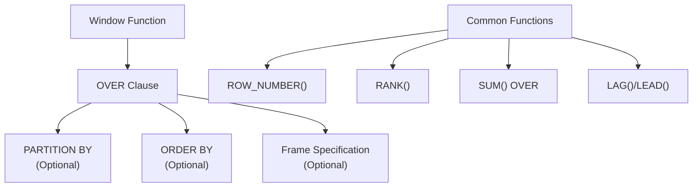

# Window Functions and Analytics

> **Module 4 • Lesson 3**  
> Estimated time: 35 min | Difficulty: ★★★☆☆

## 1. Why this matters

Window functions are one of SQL's most powerful features for analytical queries. They allow you to perform calculations across related rows without collapsing the result set like GROUP BY does. Whether you're calculating running totals, ranking results, or finding moving averages, window functions provide elegant solutions to complex analytical problems. They're essential for business intelligence, reporting, and data analysis tasks that require row-level detail alongside aggregate calculations.

> **Need a refresher?** This lesson builds on concepts from [Aggregate Functions and Grouping](04-04-aggregate-functions-grouping.md) and [Logical Clause Evaluation Order](02-01-logical-clause-evaluation.md).

## 2. Key Concepts

- **Window functions vs aggregates**: Keep all rows while performing calculations
- **OVER clause**: Defines the window of rows for calculations
- **PARTITION BY**: Divides result set into groups for separate calculations
- **ORDER BY**: Defines row ordering within each partition
- **Window frames**: ROWS and RANGE specifications for sliding windows
- **Ranking functions**: ROW_NUMBER(), RANK(), DENSE_RANK()
- **Analytical functions**: LAG(), LEAD(), FIRST_VALUE(), LAST_VALUE()



## 3. Deep Dive

### 3.1 Window Functions vs GROUP BY

**GROUP BY** collapses rows:
```sql
-- Returns one row per customer
SELECT customer_id, SUM(amount) as total_spent
FROM orders
GROUP BY customer_id;
```

**Window functions** preserve all rows:
```sql
-- Returns all rows with running total
SELECT customer_id, order_date, amount,
       SUM(amount) OVER (PARTITION BY customer_id ORDER BY order_date) as running_total
FROM orders;
```

### 3.2 The OVER Clause Structure

The OVER clause defines the "window" of rows for calculation:

```sql
function_name() OVER (
    [PARTITION BY column1, column2, ...]
    [ORDER BY column1 [ASC|DESC], column2 [ASC|DESC], ...]
    [ROWS|RANGE frame_specification]
)
```

**Components**:
- **PARTITION BY**: Divides rows into groups (like GROUP BY but doesn't collapse)
- **ORDER BY**: Orders rows within each partition
- **Frame specification**: Defines which rows within the partition to include

### 3.3 Ranking Functions

**ROW_NUMBER()**: Assigns unique sequential numbers
```sql
SELECT employee_name, salary, department,
       ROW_NUMBER() OVER (PARTITION BY department ORDER BY salary DESC) as row_num
FROM employees;
-- Result: 1, 2, 3, 4... (no ties)
```

**RANK()**: Assigns ranks with gaps for ties
```sql
SELECT employee_name, salary, department,
       RANK() OVER (PARTITION BY department ORDER BY salary DESC) as rank_num
FROM employees;
-- Result: 1, 2, 2, 4... (gaps after ties)
```

**DENSE_RANK()**: Assigns ranks without gaps
```sql
SELECT employee_name, salary, department,
       DENSE_RANK() OVER (PARTITION BY department ORDER BY salary DESC) as dense_rank
FROM employees;
-- Result: 1, 2, 2, 3... (no gaps)
```

### 3.4 Aggregate Window Functions

**Running totals**:
```sql
SELECT order_date, amount,
       SUM(amount) OVER (ORDER BY order_date) as running_total
FROM orders;
```

**Moving averages**:
```sql
SELECT order_date, amount,
       AVG(amount) OVER (
           ORDER BY order_date 
           ROWS BETWEEN 2 PRECEDING AND CURRENT ROW
       ) as moving_avg_3_days
FROM orders;
```

**Percentage of total**:
```sql
SELECT product_name, sales_amount,
       sales_amount / SUM(sales_amount) OVER () * 100 as pct_of_total
FROM product_sales;
```

### 3.5 Analytical Functions

**LAG() and LEAD()**: Access previous/next row values
```sql
SELECT order_date, amount,
       LAG(amount, 1) OVER (ORDER BY order_date) as prev_amount,
       LEAD(amount, 1) OVER (ORDER BY order_date) as next_amount,
       amount - LAG(amount, 1) OVER (ORDER BY order_date) as change_from_prev
FROM orders;
```

**FIRST_VALUE() and LAST_VALUE()**: Get first/last values in window
```sql
SELECT employee_name, salary, department,
       FIRST_VALUE(salary) OVER (
           PARTITION BY department 
           ORDER BY salary DESC
       ) as highest_salary_in_dept,
       LAST_VALUE(salary) OVER (
           PARTITION BY department 
           ORDER BY salary DESC
           RANGE BETWEEN UNBOUNDED PRECEDING AND UNBOUNDED FOLLOWING
       ) as lowest_salary_in_dept
FROM employees;
```

### 3.6 Window Frame Specifications

**ROWS**: Physical number of rows
```sql
-- Previous 3 rows, current row, next 2 rows
ROWS BETWEEN 3 PRECEDING AND 2 FOLLOWING

-- All rows from start to current
ROWS BETWEEN UNBOUNDED PRECEDING AND CURRENT ROW

-- Current row and all following
ROWS BETWEEN CURRENT ROW AND UNBOUNDED FOLLOWING
```

**RANGE**: Logical range based on values
```sql
-- All rows with same ORDER BY value as current row
RANGE BETWEEN CURRENT ROW AND CURRENT ROW

-- All rows within 30 days before current row
RANGE BETWEEN INTERVAL 30 DAY PRECEDING AND CURRENT ROW
```

## 4. Hands-On Practice

Let's create a comprehensive dataset for practicing window functions:

```sql
-- Create sample sales data
CREATE TABLE sales_data (
    id INT AUTO_INCREMENT PRIMARY KEY,
    salesperson VARCHAR(50),
    region VARCHAR(50),
    product_category VARCHAR(50),
    sale_date DATE,
    amount DECIMAL(10,2)
);

INSERT INTO sales_data (salesperson, region, product_category, sale_date, amount) VALUES
('Alice Johnson', 'North', 'Electronics', '2024-01-05', 1500.00),
('Alice Johnson', 'North', 'Electronics', '2024-01-12', 2200.00),
('Alice Johnson', 'North', 'Home', '2024-01-18', 800.00),
('Bob Smith', 'North', 'Electronics', '2024-01-08', 1800.00),
('Bob Smith', 'North', 'Electronics', '2024-01-15', 2100.00),
('Bob Smith', 'North', 'Home', '2024-01-22', 950.00),
('Carol Davis', 'South', 'Electronics', '2024-01-10', 1600.00),
('Carol Davis', 'South', 'Electronics', '2024-01-17', 1900.00),
('Carol Davis', 'South', 'Home', '2024-01-25', 750.00),
('David Wilson', 'South', 'Electronics', '2024-01-12', 2000.00),
('David Wilson', 'South', 'Home', '2024-01-20', 1100.00),
('Eve Brown', 'West', 'Electronics', '2024-01-14', 1700.00),
('Eve Brown', 'West', 'Home', '2024-01-21', 900.00);

-- Practice 1: Ranking and Row Numbers
SELECT salesperson, region, amount,
       ROW_NUMBER() OVER (ORDER BY amount DESC) as overall_rank,
       RANK() OVER (PARTITION BY region ORDER BY amount DESC) as region_rank,
       DENSE_RANK() OVER (PARTITION BY region ORDER BY amount DESC) as region_dense_rank
FROM sales_data
ORDER BY region, amount DESC;

-- Practice 2: Running Totals and Cumulative Analysis
SELECT salesperson, sale_date, amount,
       SUM(amount) OVER (ORDER BY sale_date) as running_total,
       SUM(amount) OVER (PARTITION BY salesperson ORDER BY sale_date) as personal_running_total,
       COUNT(*) OVER (ORDER BY sale_date) as cumulative_sales_count
FROM sales_data
ORDER BY sale_date;

-- Practice 3: Moving Averages
SELECT salesperson, sale_date, amount,
       AVG(amount) OVER (
           ORDER BY sale_date 
           ROWS BETWEEN 2 PRECEDING AND CURRENT ROW
       ) as moving_avg_3_sales,
       AVG(amount) OVER (
           PARTITION BY salesperson 
           ORDER BY sale_date
           ROWS BETWEEN 1 PRECEDING AND 1 FOLLOWING
       ) as personal_moving_avg
FROM sales_data
ORDER BY salesperson, sale_date;

-- Practice 4: LAG/LEAD for Trend Analysis
SELECT salesperson, sale_date, amount,
       LAG(amount, 1) OVER (PARTITION BY salesperson ORDER BY sale_date) as prev_sale,
       LEAD(amount, 1) OVER (PARTITION BY salesperson ORDER BY sale_date) as next_sale,
       amount - LAG(amount, 1) OVER (PARTITION BY salesperson ORDER BY sale_date) as change_from_prev,
       CASE 
           WHEN amount > LAG(amount, 1) OVER (PARTITION BY salesperson ORDER BY sale_date) THEN 'UP'
           WHEN amount < LAG(amount, 1) OVER (PARTITION BY salesperson ORDER BY sale_date) THEN 'DOWN'
           ELSE 'SAME'
       END as trend
FROM sales_data
ORDER BY salesperson, sale_date;

-- Practice 5: Top N per Group
SELECT *
FROM (
    SELECT salesperson, region, product_category, amount,
           ROW_NUMBER() OVER (PARTITION BY region ORDER BY amount DESC) as rn
    FROM sales_data
) ranked
WHERE rn <= 2;  -- Top 2 sales per region

-- Practice 6: Percentage Analysis
SELECT salesperson, region, amount,
       amount / SUM(amount) OVER () * 100 as pct_of_total_sales,
       amount / SUM(amount) OVER (PARTITION BY region) * 100 as pct_of_region_sales,
       SUM(amount) OVER (PARTITION BY region) as region_total
FROM sales_data
ORDER BY region, amount DESC;
```

**Advanced Practice Exercises**:

1. **Sales Performance Dashboard**: Create a query showing each salesperson's current month performance vs their previous month
2. **Market Share Analysis**: Calculate each product category's percentage of total sales and running market share
3. **Streak Analysis**: Find the longest consecutive streak of increasing sales for each salesperson
4. **Quartile Analysis**: Divide sales into quartiles and show which quartile each sale falls into

## 5. Common Pitfalls

### 5.1 Forgetting Window Frame Defaults
**Problem**: Not understanding default frame behavior
```sql
-- This might not give expected results for LAST_VALUE
SELECT name, salary,
       LAST_VALUE(salary) OVER (ORDER BY salary) as max_salary
FROM employees;

-- Default frame is "RANGE BETWEEN UNBOUNDED PRECEDING AND CURRENT ROW"
-- Need to specify full frame for LAST_VALUE
SELECT name, salary,
       LAST_VALUE(salary) OVER (
           ORDER BY salary 
           RANGE BETWEEN UNBOUNDED PRECEDING AND UNBOUNDED FOLLOWING
       ) as max_salary
FROM employees;
```

### 5.2 Misunderstanding ROWS vs RANGE
```sql
-- ROWS: Physical row count
ROWS BETWEEN 1 PRECEDING AND 1 FOLLOWING  -- Exactly 3 rows

-- RANGE: Logical value range (can include many rows with same value)
RANGE BETWEEN 1 PRECEDING AND 1 FOLLOWING -- All rows within value range
```

### 5.3 Performance Issues with Large Windows
**Problem**: Using window functions on large datasets without proper indexing
```sql
-- Slow: No supporting index
SELECT *, ROW_NUMBER() OVER (PARTITION BY customer_id ORDER BY order_date)
FROM orders;  -- 10M rows

-- Better: Create supporting index
CREATE INDEX idx_orders_customer_date ON orders(customer_id, order_date);
```

### 5.4 Incorrect ORDER BY in Window vs Query
```sql
-- Confusing: Different ORDER BY in window vs main query
SELECT name, salary,
       ROW_NUMBER() OVER (ORDER BY salary DESC) as rank_by_salary
FROM employees
ORDER BY name;  -- Results ordered by name, not salary
```

## 6. Knowledge Check

<details>
<summary>1. What's the difference between ROW_NUMBER(), RANK(), and DENSE_RANK()?</summary>

- **ROW_NUMBER()**: Assigns unique sequential numbers (1,2,3,4...)
- **RANK()**: Assigns ranks with gaps after ties (1,2,2,4...)  
- **DENSE_RANK()**: Assigns ranks without gaps (1,2,2,3...)
</details>

<details>
<summary>2. Why might this LAST_VALUE query not work as expected?</summary>

```sql
SELECT name, salary,
       LAST_VALUE(salary) OVER (ORDER BY salary) as max_salary
FROM employees;
```

The default window frame is "RANGE BETWEEN UNBOUNDED PRECEDING AND CURRENT ROW", so LAST_VALUE only sees up to the current row. You need to specify "UNBOUNDED FOLLOWING" to see all rows.
</details>

<details>
<summary>3. What's the difference between ROWS and RANGE in window frames?</summary>

- **ROWS**: Physical row count (exactly N rows)
- **RANGE**: Logical value range (can include multiple rows with the same ORDER BY value)
</details>

<details>
<summary>4. How would you calculate a 3-month moving average for monthly sales?</summary>

```sql
SELECT month, sales,
       AVG(sales) OVER (
           ORDER BY month 
           ROWS BETWEEN 2 PRECEDING AND CURRENT ROW
       ) as moving_avg_3_months
FROM monthly_sales;
```
</details>

<details>
<summary>5. What's the key difference between window functions and GROUP BY?</summary>

GROUP BY collapses rows into groups and returns one row per group. Window functions perform calculations across related rows but preserve all original rows in the result set.
</details>

## 7. Further Reading

- [MySQL Window Functions Documentation](https://dev.mysql.com/doc/refman/8.0/en/window-functions.html)
- [PostgreSQL Window Functions Tutorial](https://www.postgresql.org/docs/current/tutorial-window.html)
- [SQL Window Functions Explained](https://www.sqlshack.com/sql-window-functions/)
- [Advanced Window Functions Techniques](https://modern-sql.com/feature/window-functions)
- [Window Functions Performance Tips](https://use-the-index-luke.com/sql/partial-results/window-functions)

---

**Navigation**

[← Previous: Subqueries and CTEs](04-02-subqueries-and-ctes.md) | [Next → Aggregate Functions and Grouping](04-04-aggregate-functions-grouping.md)

_Last updated: 2025-01-21_ 