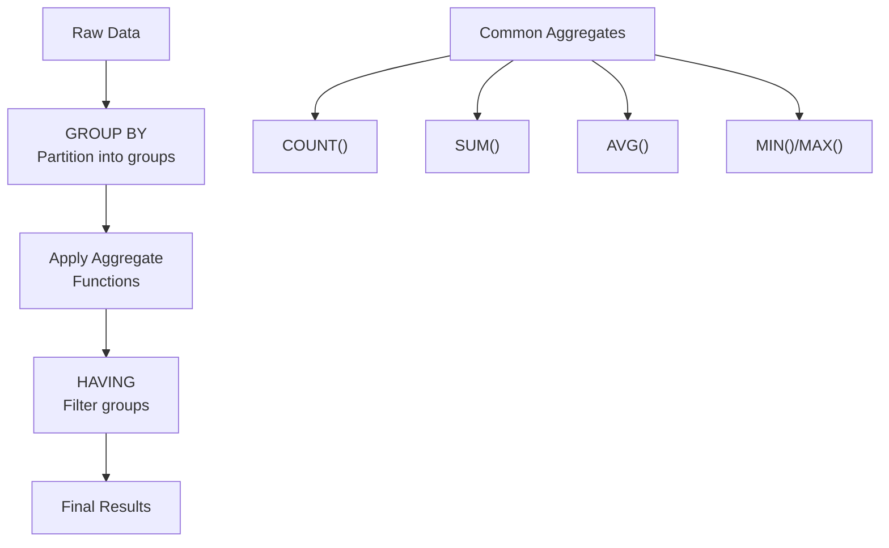

# Aggregate Functions and Grouping

> **Module 4 • Lesson 4**  
> Estimated time: 30 min | Difficulty: ★★☆☆☆

## 1. Why this matters

Aggregate functions and grouping are fundamental to data analysis and reporting. They allow you to summarize large datasets into meaningful insights—calculating totals, averages, counts, and other statistics across groups of related data. Whether you're creating business reports, analyzing customer behavior, or building dashboards, mastering aggregation is essential for transforming raw data into actionable information.

> **Need a refresher?** This lesson builds on concepts from [Logical Clause Evaluation Order](02-01-logical-clause-evaluation.md) and complements [Window Functions and Analytics](04-03-window-functions-analytics.md).

## 2. Key Concepts

- **Basic aggregates**: COUNT, SUM, AVG, MIN, MAX
- **GROUP BY**: Partitioning data into groups for separate calculations
- **HAVING**: Filtering groups after aggregation (vs WHERE for filtering rows)
- **Multiple grouping levels**: Grouping by multiple columns
- **Advanced grouping**: ROLLUP, CUBE, GROUPING SETS
- **Aggregate with DISTINCT**: Removing duplicates before aggregation
- **NULL handling**: How aggregates treat NULL values



## 3. Deep Dive

### 3.1 Basic Aggregate Functions

**COUNT()**: Counts rows or non-NULL values
```sql
-- Count all rows (including NULLs)
SELECT COUNT(*) FROM orders;

-- Count non-NULL values in a column
SELECT COUNT(customer_email) FROM customers;

-- Count distinct values
SELECT COUNT(DISTINCT customer_id) FROM orders;
```

**SUM()**: Adds up numeric values
```sql
-- Total sales amount
SELECT SUM(amount) FROM orders;

-- SUM ignores NULL values
SELECT SUM(commission) FROM sales;  -- NULLs not included
```

**AVG()**: Calculates arithmetic mean
```sql
-- Average order value
SELECT AVG(amount) FROM orders;

-- Note: AVG excludes NULLs from both numerator and denominator
```

**MIN() and MAX()**: Find minimum and maximum values
```sql
-- Date range of orders
SELECT MIN(order_date) as first_order, 
       MAX(order_date) as last_order 
FROM orders;

-- Works with text too (alphabetical order)
SELECT MIN(customer_name), MAX(customer_name) FROM customers;
```

### 3.2 GROUP BY Fundamentals

GROUP BY partitions rows into groups based on column values:

```sql
-- Sales by region
SELECT region, SUM(amount) as total_sales
FROM sales
GROUP BY region;

-- Multiple grouping columns
SELECT region, product_category, 
       COUNT(*) as order_count,
       SUM(amount) as total_sales
FROM sales
GROUP BY region, product_category;
```

**Important Rule**: In standard SQL, every column in SELECT must either be:
1. In the GROUP BY clause, or
2. An aggregate function

```sql
-- WRONG (in strict mode)
SELECT customer_id, customer_name, COUNT(*)
FROM orders
GROUP BY customer_id;  -- customer_name not in GROUP BY

-- CORRECT
SELECT customer_id, COUNT(*)
FROM orders
GROUP BY customer_id;
```

### 3.3 HAVING vs WHERE

**WHERE**: Filters individual rows before grouping
**HAVING**: Filters groups after aggregation

```sql
-- Filter rows first, then group
SELECT region, COUNT(*) as order_count
FROM orders
WHERE order_date >= '2024-01-01'  -- Filter rows
GROUP BY region
HAVING COUNT(*) > 10;             -- Filter groups

-- This is more efficient than putting date filter in HAVING
```

### 3.4 Advanced Grouping Operations

**ROLLUP**: Creates subtotals and grand totals
```sql
SELECT region, product_category, SUM(amount) as total_sales
FROM sales
GROUP BY region, product_category WITH ROLLUP;

-- Results include:
-- 1. Normal grouped results (region + category)
-- 2. Subtotals by region (category = NULL)  
-- 3. Grand total (both = NULL)
```

**CUBE**: Creates all possible combinations of groupings
```sql
SELECT region, product_category, SUM(amount) as total_sales
FROM sales
GROUP BY region, product_category WITH CUBE;

-- Results include all combinations:
-- (region, category), (region, NULL), (NULL, category), (NULL, NULL)
```

**GROUPING SETS**: Specify exact grouping combinations
```sql
SELECT region, product_category, salesperson, SUM(amount)
FROM sales
GROUP BY GROUPING SETS (
    (region, product_category),
    (region),
    (salesperson),
    ()  -- Grand total
);
```

### 3.5 Working with NULL Values

Aggregates handle NULLs in specific ways:

```sql
-- Sample data with NULLs
CREATE TABLE test_nulls (
    id INT,
    value INT
);
INSERT INTO test_nulls VALUES (1, 100), (2, NULL), (3, 200), (4, NULL), (5, 300);

-- Aggregate behavior with NULLs
SELECT 
    COUNT(*) as total_rows,        -- 5 (includes NULLs)
    COUNT(value) as non_null_count, -- 3 (excludes NULLs)
    SUM(value) as total_value,     -- 600 (ignores NULLs)
    AVG(value) as average_value    -- 200 (600/3, not 600/5)
FROM test_nulls;
```

### 3.6 Conditional Aggregation

Use CASE statements within aggregates for conditional logic:

```sql
SELECT 
    region,
    COUNT(*) as total_orders,
    COUNT(CASE WHEN amount > 1000 THEN 1 END) as high_value_orders,
    SUM(CASE WHEN product_category = 'Electronics' THEN amount ELSE 0 END) as electronics_sales,
    AVG(CASE WHEN customer_type = 'Premium' THEN amount END) as avg_premium_order
FROM orders
GROUP BY region;
```

## 4. Hands-On Practice

Let's create a comprehensive dataset for practicing aggregation:

```sql
-- Create sample e-commerce data
CREATE TABLE order_details (
    order_id INT,
    customer_id INT,
    customer_name VARCHAR(100),
    customer_type ENUM('Regular', 'Premium', 'VIP'),
    region VARCHAR(50),
    product_id INT,
    product_name VARCHAR(100),
    category VARCHAR(50),
    quantity INT,
    unit_price DECIMAL(10,2),
    discount_percent DECIMAL(5,2),
    order_date DATE
);

INSERT INTO order_details VALUES
(1, 101, 'Alice Johnson', 'Premium', 'North', 1, 'Laptop Pro', 'Electronics', 1, 1500.00, 10.00, '2024-01-15'),
(1, 101, 'Alice Johnson', 'Premium', 'North', 2, 'Mouse', 'Electronics', 2, 25.00, 0.00, '2024-01-15'),
(2, 102, 'Bob Smith', 'Regular', 'South', 3, 'Office Chair', 'Furniture', 1, 300.00, 5.00, '2024-01-16'),
(3, 103, 'Carol Davis', 'VIP', 'North', 1, 'Laptop Pro', 'Electronics', 2, 1500.00, 15.00, '2024-01-17'),
(4, 104, 'David Wilson', 'Regular', 'West', 4, 'Desk Lamp', 'Furniture', 1, 75.00, 0.00, '2024-01-18'),
(5, 105, 'Eve Brown', 'Premium', 'South', 5, 'Notebook', 'Stationery', 5, 12.00, 0.00, '2024-01-19'),
(6, 102, 'Bob Smith', 'Regular', 'South', 6, 'Pen Set', 'Stationery', 3, 20.00, 10.00, '2024-01-20'),
(7, 106, 'Frank Miller', 'VIP', 'West', 1, 'Laptop Pro', 'Electronics', 1, 1500.00, 20.00, '2024-01-21'),
(8, 107, 'Grace Lee', 'Regular', 'North', 7, 'Monitor', 'Electronics', 1, 400.00, 5.00, '2024-01-22');

-- Practice 1: Basic Aggregations
SELECT 
    COUNT(*) as total_line_items,
    COUNT(DISTINCT order_id) as total_orders,
    COUNT(DISTINCT customer_id) as unique_customers,
    SUM(quantity * unit_price * (1 - discount_percent/100)) as total_revenue,
    AVG(quantity * unit_price * (1 - discount_percent/100)) as avg_line_value,
    MIN(order_date) as first_order_date,
    MAX(order_date) as last_order_date
FROM order_details;

-- Practice 2: Grouping by Single Column
SELECT 
    region,
    COUNT(DISTINCT order_id) as orders,
    COUNT(DISTINCT customer_id) as customers,
    SUM(quantity * unit_price * (1 - discount_percent/100)) as revenue,
    AVG(quantity * unit_price * (1 - discount_percent/100)) as avg_line_value
FROM order_details
GROUP BY region
ORDER BY revenue DESC;

-- Practice 3: Multiple Column Grouping
SELECT 
    region,
    customer_type,
    COUNT(*) as line_items,
    COUNT(DISTINCT customer_id) as customers,
    SUM(quantity * unit_price * (1 - discount_percent/100)) as revenue
FROM order_details
GROUP BY region, customer_type
ORDER BY region, customer_type;

-- Practice 4: HAVING Clause
SELECT 
    category,
    COUNT(*) as line_items,
    SUM(quantity * unit_price * (1 - discount_percent/100)) as revenue,
    AVG(quantity * unit_price * (1 - discount_percent/100)) as avg_line_value
FROM order_details
GROUP BY category
HAVING COUNT(*) >= 2  -- Categories with at least 2 line items
ORDER BY revenue DESC;

-- Practice 5: Conditional Aggregation
SELECT 
    region,
    COUNT(*) as total_items,
    COUNT(CASE WHEN customer_type = 'VIP' THEN 1 END) as vip_items,
    COUNT(CASE WHEN customer_type = 'Premium' THEN 1 END) as premium_items,
    COUNT(CASE WHEN customer_type = 'Regular' THEN 1 END) as regular_items,
    SUM(CASE WHEN category = 'Electronics' THEN quantity * unit_price * (1 - discount_percent/100) ELSE 0 END) as electronics_revenue,
    AVG(CASE WHEN discount_percent > 0 THEN discount_percent END) as avg_discount_when_applied
FROM order_details
GROUP BY region;

-- Practice 6: ROLLUP for Subtotals
SELECT 
    region,
    category,
    COUNT(*) as line_items,
    SUM(quantity * unit_price * (1 - discount_percent/100)) as revenue
FROM order_details
GROUP BY region, category WITH ROLLUP
ORDER BY region, category;

-- Practice 7: Complex Analysis
SELECT 
    customer_type,
    COUNT(DISTINCT customer_id) as customer_count,
    COUNT(DISTINCT order_id) as order_count,
    COUNT(*) as total_line_items,
    ROUND(COUNT(*) / COUNT(DISTINCT order_id), 2) as avg_items_per_order,
    SUM(quantity * unit_price * (1 - discount_percent/100)) as total_revenue,
    ROUND(SUM(quantity * unit_price * (1 - discount_percent/100)) / COUNT(DISTINCT customer_id), 2) as revenue_per_customer
FROM order_details
GROUP BY customer_type
ORDER BY total_revenue DESC;
```

**Advanced Practice Exercises**:

1. **Customer Segmentation**: Group customers by their total purchase amount into segments (High: >$2000, Medium: $500-$2000, Low: <$500)
2. **Product Performance**: Find the top 3 products by revenue in each category
3. **Seasonal Analysis**: Group orders by month and analyze trends
4. **Discount Impact**: Compare average order values with and without discounts

## 5. Common Pitfalls

### 5.1 Selecting Non-Grouped Columns
**Problem**: Including columns that aren't in GROUP BY or aggregated
```sql
-- WRONG (in strict SQL mode)
SELECT customer_id, customer_name, COUNT(*)
FROM orders
GROUP BY customer_id;  -- customer_name not grouped or aggregated

-- CORRECT options:
-- Option 1: Remove non-grouped column
SELECT customer_id, COUNT(*) FROM orders GROUP BY customer_id;

-- Option 2: Add to GROUP BY
SELECT customer_id, customer_name, COUNT(*) 
FROM orders GROUP BY customer_id, customer_name;

-- Option 3: Use window function instead
SELECT DISTINCT customer_id, customer_name,
       COUNT(*) OVER (PARTITION BY customer_id) as order_count
FROM orders;
```

### 5.2 Misunderstanding NULL Handling
```sql
-- Surprising result: AVG excludes NULLs
SELECT AVG(rating) FROM products;  -- NULLs ignored in calculation

-- If you want to include NULLs as zeros:
SELECT AVG(COALESCE(rating, 0)) FROM products;
```

### 5.3 Using WHERE Instead of HAVING
```sql
-- WRONG: Can't use aggregates in WHERE
SELECT category, COUNT(*)
FROM products
WHERE COUNT(*) > 5  -- ERROR
GROUP BY category;

-- CORRECT: Use HAVING for aggregate conditions
SELECT category, COUNT(*)
FROM products
GROUP BY category
HAVING COUNT(*) > 5;
```

### 5.4 Forgetting COUNT(*) vs COUNT(column)
```sql
-- COUNT(*) includes NULLs, COUNT(column) excludes them
SELECT 
    COUNT(*) as total_rows,        -- All rows
    COUNT(email) as rows_with_email -- Only non-NULL emails
FROM customers;
```

## 6. Knowledge Check

<details>
<summary>1. What's the difference between WHERE and HAVING?</summary>

WHERE filters individual rows before grouping, while HAVING filters groups after aggregation. WHERE cannot use aggregate functions, but HAVING can. WHERE is processed earlier in the query execution order.
</details>

<details>
<summary>2. How do aggregate functions handle NULL values?</summary>

Most aggregate functions (SUM, AVG, MIN, MAX, COUNT(column)) ignore NULL values. COUNT(*) includes rows with NULLs. AVG calculates the mean of non-NULL values only.
</details>

<details>
<summary>3. What's wrong with this query: `SELECT customer_id, name, COUNT(*) FROM orders GROUP BY customer_id`?</summary>

The `name` column is neither in the GROUP BY clause nor an aggregate function. In strict SQL mode, this would cause an error. You need to either add `name` to GROUP BY or remove it from SELECT.
</details>

<details>
<summary>4. What's the difference between COUNT(*) and COUNT(column_name)?</summary>

COUNT(*) counts all rows including those with NULL values. COUNT(column_name) counts only rows where that column is not NULL.
</details>

<details>
<summary>5. How would you find categories with more than 10 products?</summary>

```sql
SELECT category, COUNT(*) as product_count
FROM products
GROUP BY category
HAVING COUNT(*) > 10;
```
</details>

## 7. Further Reading

- [MySQL Aggregate Functions Documentation](https://dev.mysql.com/doc/refman/8.0/en/aggregate-functions.html)
- [MySQL GROUP BY Documentation](https://dev.mysql.com/doc/refman/8.0/en/group-by-modifiers.html)
- [SQL Aggregate Functions Tutorial](https://www.w3schools.com/sql/sql_count_avg_sum.asp)
- [Advanced GROUP BY Techniques](https://modern-sql.com/feature/grouping)
- [Understanding SQL Aggregation](https://sqlbolt.com/lesson/select_queries_with_aggregates)

---

**Navigation**

[← Previous: Window Functions and Analytics](04-03-window-functions-analytics.md) | [Next → Schema Design Patterns](05-01-schema-design-patterns.md)

_Last updated: 2025-01-21_ 