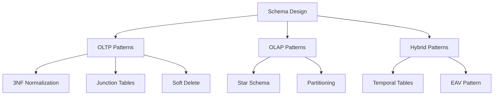

# Schema Design Patterns

> **Module 5 • Lesson 1**  
> Estimated time: 40 min | Difficulty: ★★★☆☆

## 1. Why this matters

Schema design patterns are proven solutions to common data modeling challenges. Good schema design is the foundation of every successful database application—it affects performance, data integrity, scalability, and maintainability. Whether you're building an OLTP system that needs fast transactions or an analytics warehouse that requires efficient reporting, understanding these patterns helps you choose the right approach for your specific requirements.

> **Need a refresher?** This lesson builds on concepts from [What is SQL and the Relational Model](01-01-what-is-sql.md) and [Database Management Systems Deep Dive](01-02-dbms-deep-dive.md).

## 2. Key Concepts

- **Third Normal Form (3NF)**: Eliminating redundancy for OLTP systems
- **Junction tables**: Handling many-to-many relationships
- **Soft delete patterns**: Preserving data while marking as deleted
- **Temporal patterns**: Tracking changes over time
- **Star schema**: Optimizing for analytical queries
- **Partitioning strategies**: Managing large datasets
- **Entity-Attribute-Value (EAV)**: Flexible schema for sparse data



## 3. Deep Dive

### 3.1 Third Normal Form (3NF) for OLTP

**Purpose**: Eliminate redundancy and update anomalies in transactional systems.

**Rules**:
1. First Normal Form (1NF): Atomic values, no repeating groups
2. Second Normal Form (2NF): No partial dependencies on composite keys
3. Third Normal Form (3NF): No transitive dependencies

**Example - E-commerce Schema**:
```sql
-- WRONG: Denormalized (redundant data)
CREATE TABLE orders_bad (
    order_id INT PRIMARY KEY,
    customer_id INT,
    customer_name VARCHAR(100),    -- Redundant
    customer_email VARCHAR(100),   -- Redundant
    customer_address TEXT,         -- Redundant
    product_id INT,
    product_name VARCHAR(100),     -- Redundant
    product_price DECIMAL(10,2),   -- Redundant
    quantity INT,
    order_date DATE
);

-- CORRECT: Normalized (3NF)
CREATE TABLE customers (
    customer_id INT AUTO_INCREMENT PRIMARY KEY,
    name VARCHAR(100) NOT NULL,
    email VARCHAR(100) UNIQUE NOT NULL,
    address TEXT,
    created_at TIMESTAMP DEFAULT CURRENT_TIMESTAMP
);

CREATE TABLE products (
    product_id INT AUTO_INCREMENT PRIMARY KEY,
    name VARCHAR(100) NOT NULL,
    price DECIMAL(10,2) NOT NULL,
    category VARCHAR(50),
    created_at TIMESTAMP DEFAULT CURRENT_TIMESTAMP
);

CREATE TABLE orders (
    order_id INT AUTO_INCREMENT PRIMARY KEY,
    customer_id INT NOT NULL,
    order_date DATE NOT NULL,
    status ENUM('pending', 'shipped', 'delivered', 'cancelled'),
    created_at TIMESTAMP DEFAULT CURRENT_TIMESTAMP,
    FOREIGN KEY (customer_id) REFERENCES customers(customer_id)
);

CREATE TABLE order_items (
    order_item_id INT AUTO_INCREMENT PRIMARY KEY,
    order_id INT NOT NULL,
    product_id INT NOT NULL,
    quantity INT NOT NULL,
    unit_price DECIMAL(10,2) NOT NULL,  -- Price at time of order
    FOREIGN KEY (order_id) REFERENCES orders(order_id),
    FOREIGN KEY (product_id) REFERENCES products(product_id)
);
```

### 3.2 Junction Tables for Many-to-Many Relationships

**Purpose**: Model relationships where entities can be associated with multiple entities of another type.

**Pattern**: Create a bridge table containing foreign keys to both entities.

```sql
-- Many-to-many: Users can have multiple roles, roles can have multiple users
CREATE TABLE users (
    user_id INT AUTO_INCREMENT PRIMARY KEY,
    username VARCHAR(50) UNIQUE NOT NULL,
    email VARCHAR(100) UNIQUE NOT NULL,
    created_at TIMESTAMP DEFAULT CURRENT_TIMESTAMP
);

CREATE TABLE roles (
    role_id INT AUTO_INCREMENT PRIMARY KEY,
    role_name VARCHAR(50) UNIQUE NOT NULL,
    description TEXT
);

-- Junction table
CREATE TABLE user_roles (
    user_id INT NOT NULL,
    role_id INT NOT NULL,
    assigned_at TIMESTAMP DEFAULT CURRENT_TIMESTAMP,
    assigned_by INT,  -- Optional: who assigned the role
    PRIMARY KEY (user_id, role_id),
    FOREIGN KEY (user_id) REFERENCES users(user_id) ON DELETE CASCADE,
    FOREIGN KEY (role_id) REFERENCES roles(role_id) ON DELETE CASCADE,
    FOREIGN KEY (assigned_by) REFERENCES users(user_id)
);

-- Query: Find all roles for a user
SELECT u.username, r.role_name
FROM users u
JOIN user_roles ur ON u.user_id = ur.user_id
JOIN roles r ON ur.role_id = r.role_id
WHERE u.username = 'alice';

-- Query: Find all users with a specific role
SELECT u.username, u.email
FROM users u
JOIN user_roles ur ON u.user_id = ur.user_id
JOIN roles r ON ur.role_id = r.role_id
WHERE r.role_name = 'admin';
```

### 3.3 Soft Delete Pattern

**Purpose**: Preserve data for audit trails, regulatory compliance, or easy recovery while logically "deleting" records.

**Implementation Options**:

**Option 1: Boolean Flag**
```sql
CREATE TABLE customers (
    customer_id INT AUTO_INCREMENT PRIMARY KEY,
    name VARCHAR(100) NOT NULL,
    email VARCHAR(100) UNIQUE NOT NULL,
    is_active BOOLEAN DEFAULT TRUE,
    created_at TIMESTAMP DEFAULT CURRENT_TIMESTAMP,
    deleted_at TIMESTAMP NULL
);

-- Create partial index for active records only (MySQL 8.0+)
CREATE INDEX idx_customers_active ON customers(customer_id) WHERE is_active = TRUE;

-- Soft delete
UPDATE customers SET is_active = FALSE, deleted_at = NOW() WHERE customer_id = 123;

-- Query active customers only
SELECT * FROM customers WHERE is_active = TRUE;
```

**Option 2: Deleted Timestamp Only**
```sql
CREATE TABLE products (
    product_id INT AUTO_INCREMENT PRIMARY KEY,
    name VARCHAR(100) NOT NULL,
    price DECIMAL(10,2) NOT NULL,
    deleted_at TIMESTAMP NULL,
    created_at TIMESTAMP DEFAULT CURRENT_TIMESTAMP
);

-- Soft delete
UPDATE products SET deleted_at = NOW() WHERE product_id = 456;

-- Query active products
SELECT * FROM products WHERE deleted_at IS NULL;

-- Restore deleted product
UPDATE products SET deleted_at = NULL WHERE product_id = 456;
```

### 3.4 Temporal Data Patterns (Slowly Changing Dimensions)

**Purpose**: Track how data changes over time, essential for historical reporting and audit trails.

**Type 1: Overwrite (No History)**
```sql
-- Simple approach: just update the record
UPDATE customers SET address = 'New Address' WHERE customer_id = 123;
```

**Type 2: Historical Tracking**
```sql
CREATE TABLE customer_history (
    history_id INT AUTO_INCREMENT PRIMARY KEY,
    customer_id INT NOT NULL,
    name VARCHAR(100) NOT NULL,
    email VARCHAR(100) NOT NULL,
    address TEXT,
    valid_from TIMESTAMP NOT NULL,
    valid_to TIMESTAMP NULL,  -- NULL means current record
    is_current BOOLEAN DEFAULT FALSE,
    INDEX idx_customer_current (customer_id, is_current),
    INDEX idx_customer_valid (customer_id, valid_from, valid_to)
);

-- Insert new version when customer moves
INSERT INTO customer_history (customer_id, name, email, address, valid_from, is_current)
VALUES (123, 'John Doe', 'john@email.com', 'New Address', NOW(), TRUE);

-- Close previous version
UPDATE customer_history 
SET valid_to = NOW(), is_current = FALSE 
WHERE customer_id = 123 AND is_current = TRUE AND history_id != LAST_INSERT_ID();

-- Query current state
SELECT * FROM customer_history WHERE customer_id = 123 AND is_current = TRUE;

-- Query state at specific time
SELECT * FROM customer_history 
WHERE customer_id = 123 
  AND valid_from <= '2024-01-15' 
  AND (valid_to IS NULL OR valid_to > '2024-01-15');
```

### 3.5 Star Schema for Analytics

**Purpose**: Optimize for analytical queries and reporting by denormalizing data into fact and dimension tables.

```sql
-- Dimension Tables (relatively small, descriptive)
CREATE TABLE dim_customers (
    customer_key INT AUTO_INCREMENT PRIMARY KEY,
    customer_id INT UNIQUE NOT NULL,  -- Business key
    name VARCHAR(100),
    email VARCHAR(100),
    segment VARCHAR(50),
    region VARCHAR(50),
    -- Slowly changing dimension fields
    effective_date DATE,
    expiry_date DATE,
    is_current BOOLEAN DEFAULT TRUE
);

CREATE TABLE dim_products (
    product_key INT AUTO_INCREMENT PRIMARY KEY,
    product_id INT UNIQUE NOT NULL,  -- Business key
    name VARCHAR(100),
    category VARCHAR(50),
    subcategory VARCHAR(50),
    brand VARCHAR(50),
    unit_cost DECIMAL(10,2)
);

CREATE TABLE dim_date (
    date_key INT PRIMARY KEY,  -- YYYYMMDD format
    full_date DATE,
    year INT,
    quarter INT,
    month INT,
    month_name VARCHAR(20),
    day_of_week INT,
    day_name VARCHAR(20),
    is_weekend BOOLEAN,
    is_holiday BOOLEAN
);

-- Fact Table (large, contains measures and foreign keys)
CREATE TABLE fact_sales (
    sale_id BIGINT AUTO_INCREMENT PRIMARY KEY,
    customer_key INT NOT NULL,
    product_key INT NOT NULL,
    date_key INT NOT NULL,
    -- Measures (additive facts)
    quantity INT NOT NULL,
    unit_price DECIMAL(10,2) NOT NULL,
    total_amount DECIMAL(12,2) NOT NULL,
    cost_amount DECIMAL(12,2) NOT NULL,
    profit_amount DECIMAL(12,2) NOT NULL,
    -- Foreign keys
    FOREIGN KEY (customer_key) REFERENCES dim_customers(customer_key),
    FOREIGN KEY (product_key) REFERENCES dim_products(product_key),
    FOREIGN KEY (date_key) REFERENCES dim_date(date_key)
);

-- Analytical query example
SELECT 
    dc.segment,
    dp.category,
    dd.year,
    dd.quarter,
    SUM(fs.total_amount) as revenue,
    SUM(fs.profit_amount) as profit,
    COUNT(*) as transaction_count
FROM fact_sales fs
JOIN dim_customers dc ON fs.customer_key = dc.customer_key
JOIN dim_products dp ON fs.product_key = dp.product_key  
JOIN dim_date dd ON fs.date_key = dd.date_key
WHERE dd.year = 2024
GROUP BY dc.segment, dp.category, dd.year, dd.quarter
ORDER BY revenue DESC;
```

### 3.6 Partitioning Strategies

**Purpose**: Improve query performance and manageability for very large tables.

**Range Partitioning by Date**
```sql
CREATE TABLE sales_data (
    id BIGINT AUTO_INCREMENT,
    sale_date DATE NOT NULL,
    customer_id INT,
    amount DECIMAL(10,2),
    PRIMARY KEY (id, sale_date)  -- Must include partition key
) PARTITION BY RANGE (YEAR(sale_date)) (
    PARTITION p2022 VALUES LESS THAN (2023),
    PARTITION p2023 VALUES LESS THAN (2024),
    PARTITION p2024 VALUES LESS THAN (2025),
    PARTITION p2025 VALUES LESS THAN (2026),
    PARTITION p_future VALUES LESS THAN MAXVALUE
);

-- Query benefits from partition pruning
SELECT * FROM sales_data WHERE sale_date >= '2024-01-01' AND sale_date < '2024-02-01';
-- Only scans p2024 partition
```

**Hash Partitioning for Even Distribution**
```sql
CREATE TABLE user_activity (
    id BIGINT AUTO_INCREMENT,
    user_id INT NOT NULL,
    activity_type VARCHAR(50),
    timestamp TIMESTAMP,
    PRIMARY KEY (id, user_id)
) PARTITION BY HASH(user_id) PARTITIONS 8;
```

### 3.7 Entity-Attribute-Value (EAV) Pattern

**Purpose**: Store sparse, schema-less data when you need flexibility for varying attributes.

**Warning**: Use sparingly - can be difficult to query and maintain.

```sql
-- Traditional approach: fixed schema
CREATE TABLE products_traditional (
    product_id INT PRIMARY KEY,
    name VARCHAR(100),
    price DECIMAL(10,2),
    color VARCHAR(50),      -- Not all products have color
    size VARCHAR(20),       -- Not all products have size  
    weight DECIMAL(8,2),    -- Not all products have weight
    warranty_months INT     -- Not all products have warranty
);

-- EAV approach: flexible schema
CREATE TABLE products_eav (
    product_id INT PRIMARY KEY,
    name VARCHAR(100) NOT NULL,
    price DECIMAL(10,2) NOT NULL
);

CREATE TABLE product_attributes (
    product_id INT,
    attribute_name VARCHAR(50),
    attribute_value TEXT,
    data_type ENUM('string', 'number', 'date', 'boolean'),
    PRIMARY KEY (product_id, attribute_name),
    FOREIGN KEY (product_id) REFERENCES products_eav(product_id)
);

-- Insert EAV data
INSERT INTO products_eav VALUES (1, 'T-Shirt', 19.99);
INSERT INTO product_attributes VALUES 
(1, 'color', 'blue', 'string'),
(1, 'size', 'M', 'string'),
(1, 'material', 'cotton', 'string');

-- Query EAV data (complex)
SELECT p.name, p.price,
       MAX(CASE WHEN pa.attribute_name = 'color' THEN pa.attribute_value END) as color,
       MAX(CASE WHEN pa.attribute_name = 'size' THEN pa.attribute_value END) as size,
       MAX(CASE WHEN pa.attribute_name = 'material' THEN pa.attribute_value END) as material
FROM products_eav p
LEFT JOIN product_attributes pa ON p.product_id = pa.product_id
WHERE p.product_id = 1
GROUP BY p.product_id, p.name, p.price;
```

## 4. Hands-On Practice

Let's implement a complete e-learning platform schema using multiple patterns:

```sql
-- Core entities (3NF)
CREATE TABLE users (
    user_id INT AUTO_INCREMENT PRIMARY KEY,
    username VARCHAR(50) UNIQUE NOT NULL,
    email VARCHAR(100) UNIQUE NOT NULL,
    password_hash VARCHAR(255) NOT NULL,
    is_active BOOLEAN DEFAULT TRUE,
    created_at TIMESTAMP DEFAULT CURRENT_TIMESTAMP,
    deleted_at TIMESTAMP NULL
);

CREATE TABLE courses (
    course_id INT AUTO_INCREMENT PRIMARY KEY,
    title VARCHAR(200) NOT NULL,
    description TEXT,
    instructor_id INT NOT NULL,
    price DECIMAL(8,2) NOT NULL,
    is_active BOOLEAN DEFAULT TRUE,
    created_at TIMESTAMP DEFAULT CURRENT_TIMESTAMP,
    FOREIGN KEY (instructor_id) REFERENCES users(user_id)
);

-- Many-to-many: Users can enroll in multiple courses
CREATE TABLE enrollments (
    user_id INT,
    course_id INT,
    enrollment_date TIMESTAMP DEFAULT CURRENT_TIMESTAMP,
    completion_date TIMESTAMP NULL,
    status ENUM('active', 'completed', 'dropped') DEFAULT 'active',
    PRIMARY KEY (user_id, course_id),
    FOREIGN KEY (user_id) REFERENCES users(user_id),
    FOREIGN KEY (course_id) REFERENCES courses(course_id)
);

-- Temporal pattern: Track user progress over time
CREATE TABLE user_progress_history (
    history_id BIGINT AUTO_INCREMENT PRIMARY KEY,
    user_id INT NOT NULL,
    course_id INT NOT NULL,
    lesson_id INT NOT NULL,
    progress_percent DECIMAL(5,2) NOT NULL,
    timestamp TIMESTAMP DEFAULT CURRENT_TIMESTAMP,
    INDEX idx_user_course_time (user_id, course_id, timestamp),
    FOREIGN KEY (user_id) REFERENCES users(user_id),
    FOREIGN KEY (course_id) REFERENCES courses(course_id)
);

-- EAV pattern: Flexible course metadata
CREATE TABLE course_metadata (
    course_id INT,
    attribute_name VARCHAR(50),
    attribute_value TEXT,
    PRIMARY KEY (course_id, attribute_name),
    FOREIGN KEY (course_id) REFERENCES courses(course_id)
);

-- Partitioned table: Large activity log
CREATE TABLE user_activity_log (
    log_id BIGINT AUTO_INCREMENT,
    user_id INT NOT NULL,
    activity_type VARCHAR(50) NOT NULL,
    activity_data JSON,
    timestamp TIMESTAMP DEFAULT CURRENT_TIMESTAMP,
    PRIMARY KEY (log_id, timestamp)
) PARTITION BY RANGE (UNIX_TIMESTAMP(timestamp)) (
    PARTITION p202401 VALUES LESS THAN (UNIX_TIMESTAMP('2024-02-01')),
    PARTITION p202402 VALUES LESS THAN (UNIX_TIMESTAMP('2024-03-01')),
    PARTITION p202403 VALUES LESS THAN (UNIX_TIMESTAMP('2024-04-01')),
    PARTITION p_future VALUES LESS THAN MAXVALUE
);

-- Practice queries
-- 1. Find active users enrolled in a specific course
SELECT u.username, u.email, e.enrollment_date
FROM users u
JOIN enrollments e ON u.user_id = e.user_id
WHERE u.is_active = TRUE 
  AND u.deleted_at IS NULL
  AND e.course_id = 1
  AND e.status = 'active';

-- 2. Get course metadata in readable format
SELECT c.title,
       MAX(CASE WHEN cm.attribute_name = 'difficulty' THEN cm.attribute_value END) as difficulty,
       MAX(CASE WHEN cm.attribute_name = 'duration_hours' THEN cm.attribute_value END) as duration,
       MAX(CASE WHEN cm.attribute_name = 'prerequisites' THEN cm.attribute_value END) as prerequisites
FROM courses c
LEFT JOIN course_metadata cm ON c.course_id = cm.course_id
WHERE c.is_active = TRUE
GROUP BY c.course_id, c.title;

-- 3. Track user progress over time
SELECT user_id, course_id,
       DATE(timestamp) as date,
       MAX(progress_percent) as daily_max_progress
FROM user_progress_history
WHERE user_id = 123 AND course_id = 1
GROUP BY user_id, course_id, DATE(timestamp)
ORDER BY date;
```

## 5. Common Pitfalls

### 5.1 Over-Normalization
**Problem**: Normalizing to the point where simple queries require many JOINs
```sql
-- Sometimes denormalization is acceptable for performance
-- Store calculated values that are expensive to compute
ALTER TABLE orders ADD COLUMN total_amount DECIMAL(10,2);
-- Update via trigger or application logic
```

### 5.2 Under-Normalization
**Problem**: Storing redundant data that leads to update anomalies
```sql
-- BAD: Customer info repeated in every order
CREATE TABLE orders (
    order_id INT PRIMARY KEY,
    customer_name VARCHAR(100),  -- What if customer changes name?
    customer_email VARCHAR(100), -- What if customer changes email?
    -- ... other fields
);
```

### 5.3 Incorrect Foreign Key Constraints
```sql
-- Missing ON DELETE/UPDATE actions
CREATE TABLE order_items (
    order_id INT,
    product_id INT,
    FOREIGN KEY (order_id) REFERENCES orders(order_id)  -- What happens when order is deleted?
);

-- Better: Specify the behavior
CREATE TABLE order_items (
    order_id INT,
    product_id INT,
    FOREIGN KEY (order_id) REFERENCES orders(order_id) ON DELETE CASCADE,
    FOREIGN KEY (product_id) REFERENCES products(product_id) ON DELETE RESTRICT
);
```

### 5.4 Poor Partitioning Strategy
```sql
-- BAD: Partitioning on column not used in WHERE clauses
CREATE TABLE sales (
    id INT AUTO_INCREMENT,
    customer_id INT,
    sale_date DATE,
    amount DECIMAL(10,2),
    PRIMARY KEY (id, customer_id)
) PARTITION BY HASH(customer_id) PARTITIONS 10;

-- If most queries filter by date, partition by date instead
```

## 6. Knowledge Check

<details>
<summary>1. What are the three rules of Third Normal Form (3NF)?</summary>

1. First Normal Form (1NF): Atomic values, no repeating groups
2. Second Normal Form (2NF): No partial dependencies on composite keys  
3. Third Normal Form (3NF): No transitive dependencies
</details>

<details>
<summary>2. When would you use a soft delete pattern instead of hard deletes?</summary>

Use soft deletes when you need to:
- Preserve data for audit trails or compliance
- Allow easy recovery of "deleted" records
- Maintain referential integrity
- Keep historical reporting accurate
</details>

<details>
<summary>3. What's the difference between a star schema and 3NF?</summary>

3NF optimizes for storage efficiency and update consistency (OLTP). Star schema optimizes for query performance by denormalizing data into fact and dimension tables (OLAP).
</details>

<details>
<summary>4. When should you consider using the EAV pattern?</summary>

Use EAV when you have:
- Highly sparse data (many NULL values)
- Frequently changing schema requirements
- Need for dynamic attributes
But be aware of query complexity and performance implications.
</details>

<details>
<summary>5. What's the purpose of a junction table?</summary>

Junction tables resolve many-to-many relationships by creating a bridge table that contains foreign keys to both related entities, along with any additional attributes specific to the relationship.
</details>

## 7. Further Reading

- [Database Design Fundamentals](https://www.lucidchart.com/pages/database-diagram/database-design)
- [MySQL Partitioning Documentation](https://dev.mysql.com/doc/refman/8.0/en/partitioning.html)
- [Data Modeling Best Practices](https://www.vertabelo.com/blog/data-modeling-best-practices/)
- [Dimensional Modeling: The Kimball Method](https://www.kimballgroup.com/data-warehouse-business-intelligence-resources/kimball-techniques/dimensional-modeling-techniques/)
- [Temporal Data Management](https://www.red-gate.com/simple-talk/databases/sql-server/t-sql-programming-sql-server/temporal-data-in-sql-server/)

---

**Navigation**

[← Previous: Aggregate Functions and Grouping](04-04-aggregate-functions-grouping.md) | [Next → Query Design Patterns](05-02-query-design-patterns.md)

_Last updated: 2025-01-21_ 