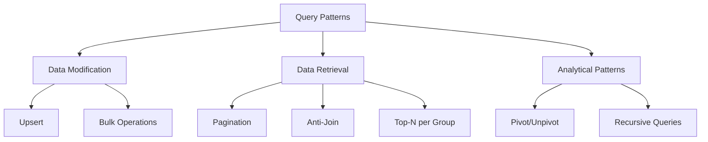

# Query Design Patterns

> **Module 5 • Lesson 2**  
> Estimated time: 35 min | Difficulty: ★★★☆☆

## 1. Why this matters

Query design patterns are reusable solutions to common data retrieval and manipulation challenges. These patterns help you write more efficient, maintainable, and correct SQL queries. Whether you're implementing upsert logic, handling pagination, or performing complex analytical operations, mastering these patterns will make you more productive and help you avoid common pitfalls that can lead to poor performance or incorrect results.

> **Need a refresher?** This lesson builds on concepts from [Subqueries and CTEs](04-02-subqueries-and-ctes.md) and [Window Functions and Analytics](04-03-window-functions-analytics.md).

## 2. Key Concepts

- **Upsert patterns**: INSERT ... ON DUPLICATE KEY UPDATE for idempotent operations
- **Pagination strategies**: OFFSET/LIMIT vs key-set pagination for large datasets
- **Anti-join patterns**: Finding records that don't exist in related tables
- **Top-N per group**: Getting the best/worst records for each category
- **Recursive queries**: Handling hierarchical data with CTEs
- **Dynamic pivot**: Converting rows to columns with conditional aggregation
- **Bulk operations**: Efficient patterns for large data modifications



## 3. Deep Dive

### 3.1 Upsert Patterns

**Purpose**: Perform INSERT or UPDATE in a single atomic operation, useful for data synchronization and avoiding race conditions.

**MySQL Approach - INSERT ... ON DUPLICATE KEY UPDATE**:
```sql
-- Create table with unique constraint
CREATE TABLE inventory (
    product_id INT PRIMARY KEY,
    product_name VARCHAR(100),
    quantity INT NOT NULL,
    last_updated TIMESTAMP DEFAULT CURRENT_TIMESTAMP ON UPDATE CURRENT_TIMESTAMP
);

-- Upsert: Insert new product or update existing quantity
INSERT INTO inventory (product_id, product_name, quantity)
VALUES (1, 'Laptop', 10)
ON DUPLICATE KEY UPDATE 
    quantity = quantity + VALUES(quantity),
    last_updated = CURRENT_TIMESTAMP;

-- Batch upsert
INSERT INTO inventory (product_id, product_name, quantity)
VALUES 
    (1, 'Laptop', 5),
    (2, 'Mouse', 20),
    (3, 'Keyboard', 15)
ON DUPLICATE KEY UPDATE 
    quantity = quantity + VALUES(quantity),
    product_name = VALUES(product_name);  -- Update name if provided
```

**Standard SQL Approach - MERGE (MySQL 8.0+ doesn't support MERGE, but here's the concept)**:
```sql
-- PostgreSQL/SQL Server style
MERGE inventory AS target
USING (VALUES (1, 'Laptop', 10)) AS source(product_id, product_name, quantity)
ON target.product_id = source.product_id
WHEN MATCHED THEN
    UPDATE SET quantity = target.quantity + source.quantity
WHEN NOT MATCHED THEN
    INSERT (product_id, product_name, quantity)
    VALUES (source.product_id, source.product_name, source.quantity);
```

### 3.2 Pagination Strategies

**OFFSET/LIMIT Approach** (Simple but can be slow for large offsets):
```sql
-- Page 1 (first 20 records)
SELECT * FROM products ORDER BY product_id LIMIT 20 OFFSET 0;

-- Page 100 (records 1981-2000) - Gets slower as offset increases
SELECT * FROM products ORDER BY product_id LIMIT 20 OFFSET 1980;
```

**Key-set Pagination** (Scalable for large datasets):
```sql
-- First page
SELECT * FROM products 
WHERE product_id > 0 
ORDER BY product_id 
LIMIT 20;

-- Next page (using last product_id from previous page)
SELECT * FROM products 
WHERE product_id > 1020  -- Last ID from previous page
ORDER BY product_id 
LIMIT 20;

-- For composite ordering (e.g., by name, then ID for ties)
SELECT * FROM products 
WHERE (name > 'Widget' OR (name = 'Widget' AND product_id > 1020))
ORDER BY name, product_id 
LIMIT 20;
```

**Cursor-based Pagination with Encoding**:
```sql
-- Create a cursor that encodes the position
SELECT *, 
       CONCAT(name, ':', product_id) as cursor
FROM products 
ORDER BY name, product_id 
LIMIT 20;

-- Next page using cursor
SELECT * FROM products 
WHERE CONCAT(name, ':', product_id) > 'Widget ABC:1020'
ORDER BY name, product_id 
LIMIT 20;
```

### 3.3 Anti-Join Patterns

**Purpose**: Find records that don't have matching records in another table.

**NOT EXISTS Pattern** (Usually most efficient):
```sql
-- Find customers who haven't placed any orders
SELECT c.customer_id, c.name, c.email
FROM customers c
WHERE NOT EXISTS (
    SELECT 1 
    FROM orders o 
    WHERE o.customer_id = c.customer_id
);

-- Find products never ordered
SELECT p.product_id, p.name, p.price
FROM products p
WHERE NOT EXISTS (
    SELECT 1 
    FROM order_items oi 
    WHERE oi.product_id = p.product_id
);
```

**LEFT JOIN with NULL Check**:
```sql
-- Alternative approach using LEFT JOIN
SELECT c.customer_id, c.name, c.email
FROM customers c
LEFT JOIN orders o ON c.customer_id = o.customer_id
WHERE o.customer_id IS NULL;
```

**NOT IN Pattern** (Be careful with NULLs):
```sql
-- DANGEROUS: If any order.customer_id is NULL, returns no results
SELECT * FROM customers 
WHERE customer_id NOT IN (SELECT customer_id FROM orders);

-- SAFER: Handle NULLs explicitly
SELECT * FROM customers 
WHERE customer_id NOT IN (
    SELECT customer_id 
    FROM orders 
    WHERE customer_id IS NOT NULL
);
```

### 3.4 Top-N per Group Pattern

**Purpose**: Get the best/worst N records for each category or group.

**Window Function Approach** (Modern, efficient):
```sql
-- Top 3 highest-paid employees per department
SELECT department, employee_name, salary
FROM (
    SELECT department, employee_name, salary,
           ROW_NUMBER() OVER (PARTITION BY department ORDER BY salary DESC) as rn
    FROM employees
) ranked
WHERE rn <= 3
ORDER BY department, salary DESC;

-- Latest order for each customer
SELECT customer_id, order_date, total_amount
FROM (
    SELECT customer_id, order_date, total_amount,
           ROW_NUMBER() OVER (PARTITION BY customer_id ORDER BY order_date DESC) as rn
    FROM orders
) latest
WHERE rn = 1;
```

**Correlated Subquery Approach** (Older, less efficient):
```sql
-- Top 3 products by sales in each category
SELECT p1.category, p1.product_name, p1.total_sales
FROM product_sales p1
WHERE (
    SELECT COUNT(*)
    FROM product_sales p2
    WHERE p2.category = p1.category 
      AND p2.total_sales > p1.total_sales
) < 3
ORDER BY p1.category, p1.total_sales DESC;
```

### 3.5 Recursive Queries with CTEs

**Purpose**: Handle hierarchical data like organizational charts, category trees, or bill of materials.

**Employee Hierarchy Example**:
```sql
-- Sample hierarchical data
CREATE TABLE employees (
    employee_id INT PRIMARY KEY,
    name VARCHAR(100),
    manager_id INT,
    FOREIGN KEY (manager_id) REFERENCES employees(employee_id)
);

-- Find all subordinates of a manager (recursive)
WITH RECURSIVE employee_hierarchy AS (
    -- Base case: Start with the CEO (manager_id IS NULL)
    SELECT employee_id, name, manager_id, 0 as level, name as path
    FROM employees
    WHERE manager_id IS NULL
    
    UNION ALL
    
    -- Recursive case: Find direct reports
    SELECT e.employee_id, e.name, e.manager_id, eh.level + 1,
           CONCAT(eh.path, ' -> ', e.name) as path
    FROM employees e
    JOIN employee_hierarchy eh ON e.manager_id = eh.employee_id
)
SELECT employee_id, name, level, path
FROM employee_hierarchy
ORDER BY level, name;

-- Find all managers above a specific employee
WITH RECURSIVE manager_chain AS (
    -- Base case: Start with specific employee
    SELECT employee_id, name, manager_id, 0 as level
    FROM employees
    WHERE employee_id = 123  -- Specific employee
    
    UNION ALL
    
    -- Recursive case: Find manager
    SELECT e.employee_id, e.name, e.manager_id, mc.level + 1
    FROM employees e
    JOIN manager_chain mc ON e.employee_id = mc.manager_id
)
SELECT employee_id, name, level
FROM manager_chain
ORDER BY level DESC;
```

**Category Tree Example**:
```sql
CREATE TABLE categories (
    category_id INT PRIMARY KEY,
    name VARCHAR(100),
    parent_id INT,
    FOREIGN KEY (parent_id) REFERENCES categories(category_id)
);

-- Get all subcategories under "Electronics"
WITH RECURSIVE category_tree AS (
    SELECT category_id, name, parent_id, 0 as depth
    FROM categories
    WHERE name = 'Electronics'
    
    UNION ALL
    
    SELECT c.category_id, c.name, c.parent_id, ct.depth + 1
    FROM categories c
    JOIN category_tree ct ON c.parent_id = ct.category_id
)
SELECT category_id, name, depth
FROM category_tree
ORDER BY depth, name;
```

### 3.6 Dynamic Pivot Pattern

**Purpose**: Convert rows to columns, useful for reporting and data presentation.

**Conditional Aggregation Approach**:
```sql
-- Sample sales data
CREATE TABLE monthly_sales (
    salesperson VARCHAR(50),
    month VARCHAR(10),
    sales_amount DECIMAL(10,2)
);

-- Pivot months into columns
SELECT 
    salesperson,
    SUM(CASE WHEN month = 'Jan' THEN sales_amount ELSE 0 END) as Jan,
    SUM(CASE WHEN month = 'Feb' THEN sales_amount ELSE 0 END) as Feb,
    SUM(CASE WHEN month = 'Mar' THEN sales_amount ELSE 0 END) as Mar,
    SUM(CASE WHEN month = 'Apr' THEN sales_amount ELSE 0 END) as Apr,
    SUM(sales_amount) as Total
FROM monthly_sales
GROUP BY salesperson
ORDER BY Total DESC;

-- Dynamic pivot using JSON (MySQL 8.0+)
SELECT 
    salesperson,
    JSON_OBJECTAGG(month, sales_amount) as monthly_sales
FROM monthly_sales
GROUP BY salesperson;
```

**Unpivot Pattern** (Converting columns to rows):
```sql
-- Sample data with columns for each quarter
CREATE TABLE quarterly_results (
    company VARCHAR(50),
    q1_revenue DECIMAL(12,2),
    q2_revenue DECIMAL(12,2),
    q3_revenue DECIMAL(12,2),
    q4_revenue DECIMAL(12,2)
);

-- Unpivot using UNION ALL
SELECT company, 'Q1' as quarter, q1_revenue as revenue FROM quarterly_results
UNION ALL
SELECT company, 'Q2' as quarter, q2_revenue as revenue FROM quarterly_results
UNION ALL
SELECT company, 'Q3' as quarter, q3_revenue as revenue FROM quarterly_results
UNION ALL
SELECT company, 'Q4' as quarter, q4_revenue as revenue FROM quarterly_results
ORDER BY company, quarter;
```

### 3.7 Bulk Operations Patterns

**Efficient Batch Updates**:
```sql
-- Update multiple records with different values
UPDATE products p
JOIN (
    SELECT 1 as id, 299.99 as new_price
    UNION ALL SELECT 2, 149.99
    UNION ALL SELECT 3, 79.99
) updates ON p.product_id = updates.id
SET p.price = updates.new_price;

-- Conditional bulk update
UPDATE orders 
SET status = 'shipped', 
    shipped_date = CURRENT_DATE
WHERE status = 'processing' 
  AND order_date >= DATE_SUB(CURRENT_DATE, INTERVAL 7 DAY);
```

**Efficient Batch Deletes**:
```sql
-- Delete in batches to avoid long-running transactions
DELETE FROM audit_log 
WHERE created_at < DATE_SUB(NOW(), INTERVAL 90 DAY)
LIMIT 1000;

-- Repeat until no more rows affected
-- This can be wrapped in a loop in application code
```

## 4. Hands-On Practice

Let's implement these patterns with a comprehensive e-commerce scenario:

```sql
-- Setup sample data
CREATE TABLE customers (
    customer_id INT AUTO_INCREMENT PRIMARY KEY,
    name VARCHAR(100),
    email VARCHAR(100) UNIQUE,
    registration_date DATE
);

CREATE TABLE products (
    product_id INT AUTO_INCREMENT PRIMARY KEY,
    name VARCHAR(100),
    category VARCHAR(50),
    price DECIMAL(10,2),
    stock_quantity INT
);

CREATE TABLE orders (
    order_id INT AUTO_INCREMENT PRIMARY KEY,
    customer_id INT,
    order_date DATE,
    status ENUM('pending', 'shipped', 'delivered', 'cancelled'),
    total_amount DECIMAL(10,2),
    FOREIGN KEY (customer_id) REFERENCES customers(customer_id)
);

CREATE TABLE order_items (
    order_id INT,
    product_id INT,
    quantity INT,
    unit_price DECIMAL(10,2),
    PRIMARY KEY (order_id, product_id),
    FOREIGN KEY (order_id) REFERENCES orders(order_id),
    FOREIGN KEY (product_id) REFERENCES products(product_id)
);

-- Insert sample data
INSERT INTO customers (name, email, registration_date) VALUES
('Alice Johnson', 'alice@email.com', '2024-01-15'),
('Bob Smith', 'bob@email.com', '2024-01-20'),
('Carol Davis', 'carol@email.com', '2024-02-01'),
('David Wilson', 'david@email.com', '2024-02-10');

INSERT INTO products (name, category, price, stock_quantity) VALUES
('Laptop Pro', 'Electronics', 1299.99, 50),
('Wireless Mouse', 'Electronics', 29.99, 200),
('Office Chair', 'Furniture', 199.99, 25),
('Desk Lamp', 'Furniture', 49.99, 75),
('Coffee Mug', 'Kitchen', 12.99, 100);

INSERT INTO orders (customer_id, order_date, status, total_amount) VALUES
(1, '2024-01-16', 'delivered', 1329.98),
(2, '2024-01-22', 'shipped', 199.99),
(3, '2024-02-02', 'pending', 62.98),
(1, '2024-02-15', 'delivered', 49.99);

INSERT INTO order_items VALUES
(1, 1, 1, 1299.99), (1, 2, 1, 29.99),
(2, 3, 1, 199.99),
(3, 4, 1, 49.99), (3, 5, 1, 12.99),
(4, 4, 1, 49.99);

-- Practice 1: Upsert inventory updates
CREATE TABLE inventory_updates (
    product_id INT PRIMARY KEY,
    quantity_change INT,
    update_reason VARCHAR(100)
);

-- Simulate inventory adjustments
INSERT INTO inventory_updates VALUES
(1, -5, 'Sales'),
(2, 10, 'Restock'),
(6, 20, 'New Product');  -- Product doesn't exist yet

-- Upsert pattern: Update existing products, insert new ones
INSERT INTO products (product_id, name, category, price, stock_quantity)
SELECT iu.product_id, 
       CONCAT('Product ', iu.product_id), 
       'Unknown', 
       0.00, 
       iu.quantity_change
FROM inventory_updates iu
LEFT JOIN products p ON iu.product_id = p.product_id
WHERE p.product_id IS NULL
ON DUPLICATE KEY UPDATE
    stock_quantity = stock_quantity + VALUES(stock_quantity);

-- Practice 2: Key-set pagination for large product lists
-- First page
SELECT product_id, name, price
FROM products
WHERE product_id > 0
ORDER BY product_id
LIMIT 3;

-- Next page (assuming last product_id was 3)
SELECT product_id, name, price
FROM products
WHERE product_id > 3
ORDER BY product_id
LIMIT 3;

-- Practice 3: Anti-join - Find customers with no orders
SELECT c.customer_id, c.name, c.email
FROM customers c
WHERE NOT EXISTS (
    SELECT 1 FROM orders o WHERE o.customer_id = c.customer_id
);

-- Practice 4: Top-N per group - Best-selling product in each category
SELECT category, name, total_sold
FROM (
    SELECT p.category, p.name,
           COALESCE(SUM(oi.quantity), 0) as total_sold,
           ROW_NUMBER() OVER (PARTITION BY p.category ORDER BY COALESCE(SUM(oi.quantity), 0) DESC) as rn
    FROM products p
    LEFT JOIN order_items oi ON p.product_id = oi.product_id
    GROUP BY p.product_id, p.category, p.name
) ranked
WHERE rn = 1
ORDER BY category;

-- Practice 5: Dynamic pivot - Sales by customer and status
SELECT 
    c.name,
    COUNT(CASE WHEN o.status = 'pending' THEN 1 END) as pending_orders,
    COUNT(CASE WHEN o.status = 'shipped' THEN 1 END) as shipped_orders,
    COUNT(CASE WHEN o.status = 'delivered' THEN 1 END) as delivered_orders,
    COUNT(CASE WHEN o.status = 'cancelled' THEN 1 END) as cancelled_orders,
    COUNT(*) as total_orders
FROM customers c
LEFT JOIN orders o ON c.customer_id = o.customer_id
GROUP BY c.customer_id, c.name
ORDER BY total_orders DESC;

-- Practice 6: Bulk update - Apply discount to specific categories
UPDATE products 
SET price = price * 0.9  -- 10% discount
WHERE category IN ('Electronics', 'Kitchen')
  AND price > 20;

-- Practice 7: Complex analytical query combining multiple patterns
WITH customer_metrics AS (
    SELECT 
        c.customer_id,
        c.name,
        COUNT(o.order_id) as total_orders,
        COALESCE(SUM(o.total_amount), 0) as total_spent,
        MAX(o.order_date) as last_order_date,
        DATEDIFF(CURRENT_DATE, MAX(o.order_date)) as days_since_last_order
    FROM customers c
    LEFT JOIN orders o ON c.customer_id = o.customer_id
    GROUP BY c.customer_id, c.name
),
customer_segments AS (
    SELECT *,
        CASE 
            WHEN total_spent >= 1000 THEN 'High Value'
            WHEN total_spent >= 200 THEN 'Medium Value'
            WHEN total_spent > 0 THEN 'Low Value'
            ELSE 'No Purchases'
        END as segment,
        ROW_NUMBER() OVER (ORDER BY total_spent DESC) as spending_rank
    FROM customer_metrics
)
SELECT 
    segment,
    COUNT(*) as customer_count,
    AVG(total_spent) as avg_spent,
    AVG(total_orders) as avg_orders,
    AVG(days_since_last_order) as avg_days_since_last_order
FROM customer_segments
GROUP BY segment
ORDER BY avg_spent DESC;
```

## 5. Common Pitfalls

### 5.1 Inefficient Pagination with Large Offsets
```sql
-- SLOW: Large offset requires scanning many rows
SELECT * FROM products ORDER BY name LIMIT 20 OFFSET 50000;

-- BETTER: Use key-set pagination
SELECT * FROM products WHERE name > 'last_seen_name' ORDER BY name LIMIT 20;
```

### 5.2 NOT IN with NULL Values
```sql
-- DANGEROUS: Returns no results if any value is NULL
SELECT * FROM customers WHERE customer_id NOT IN (SELECT customer_id FROM orders);

-- SAFE: Use NOT EXISTS instead
SELECT * FROM customers c WHERE NOT EXISTS (SELECT 1 FROM orders o WHERE o.customer_id = c.customer_id);
```

### 5.3 Inefficient Top-N Queries
```sql
-- SLOW: Correlated subquery approach
SELECT * FROM products p1 
WHERE (SELECT COUNT(*) FROM products p2 WHERE p2.category = p1.category AND p2.price > p1.price) < 3;

-- FAST: Window function approach
SELECT * FROM (
    SELECT *, ROW_NUMBER() OVER (PARTITION BY category ORDER BY price DESC) as rn
    FROM products
) ranked WHERE rn <= 3;
```

### 5.4 Recursive CTE Without Proper Termination
```sql
-- DANGEROUS: Could run forever
WITH RECURSIVE infinite_loop AS (
    SELECT 1 as n
    UNION ALL
    SELECT n + 1 FROM infinite_loop  -- No termination condition!
)
SELECT * FROM infinite_loop;

-- SAFE: Always include termination condition
WITH RECURSIVE safe_recursion AS (
    SELECT 1 as n
    UNION ALL
    SELECT n + 1 FROM safe_recursion WHERE n < 100  -- Termination condition
)
SELECT * FROM safe_recursion;
```

## 6. Knowledge Check

<details>
<summary>1. What's the advantage of key-set pagination over OFFSET/LIMIT?</summary>

Key-set pagination performs consistently regardless of page number because it uses indexed WHERE conditions instead of skipping rows. OFFSET/LIMIT gets slower as the offset increases because the database must scan and skip all preceding rows.
</details>

<details>
<summary>2. When should you use NOT EXISTS vs NOT IN?</summary>

Use NOT EXISTS when the subquery might return NULL values. NOT IN returns no results if any value in the subquery is NULL, while NOT EXISTS handles NULLs correctly.
</details>

<details>
<summary>3. What's the difference between ROW_NUMBER() and RANK() in top-N queries?</summary>

ROW_NUMBER() assigns unique sequential numbers (1,2,3,4...), while RANK() assigns the same rank to tied values and skips subsequent ranks (1,2,2,4...). For top-N queries, ROW_NUMBER() ensures exactly N results per group.
</details>

<details>
<summary>4. How do you prevent infinite loops in recursive CTEs?</summary>

Always include a termination condition in the recursive part of the CTE, such as a maximum depth counter or a condition that eventually becomes false.
</details>

<details>
<summary>5. What's the MySQL equivalent of the SQL MERGE statement?</summary>

MySQL uses `INSERT ... ON DUPLICATE KEY UPDATE` to achieve upsert functionality similar to the MERGE statement in other databases.
</details>

## 7. Further Reading

- [MySQL INSERT ... ON DUPLICATE KEY UPDATE](https://dev.mysql.com/doc/refman/8.0/en/insert-on-duplicate.html)
- [Efficient Pagination Techniques](https://use-the-index-luke.com/sql/partial-results/fetch-next-page)
- [MySQL Recursive CTE Documentation](https://dev.mysql.com/doc/refman/8.0/en/with.html#common-table-expressions-recursive)
- [Advanced SQL Query Patterns](https://modern-sql.com/)
- [SQL Performance Explained](https://sql-performance-explained.com/)

---

**Navigation**

[← Previous: Schema Design Patterns](05-01-schema-design-patterns.md) | [Next → Performance Patterns](05-03-performance-patterns.md)

_Last updated: 2025-01-21_ 