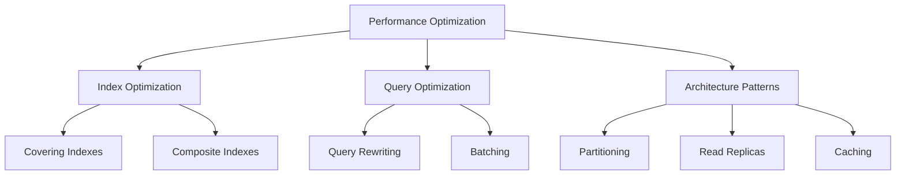

# Performance Patterns

> **Module 5 • Lesson 3**  
> Estimated time: 40 min | Difficulty: ★★★★☆

## 1. Why this matters

Performance patterns are essential techniques for building scalable database applications. As your data grows and user load increases, poorly performing queries can bring your entire system to a halt. Understanding these patterns helps you design efficient schemas, write optimized queries, and scale your database architecture. Whether you're dealing with millions of records or thousands of concurrent users, these patterns are your toolkit for maintaining fast, responsive applications.

> **Need a refresher?** This lesson builds on concepts from [Query Optimization Fundamentals](02-03-query-optimization.md) and [Index Design and Management](08-02-index-design-management.md).

## 2. Key Concepts

- **Covering indexes**: Include all needed columns to avoid table lookups
- **Composite indexes**: Multi-column indexes for complex WHERE clauses
- **Partitioning strategies**: Divide large tables for better performance
- **Query rewriting**: Transform queries for better execution plans
- **Batching patterns**: Process large datasets efficiently
- **Caching strategies**: Reduce database load with smart caching
- **Read replicas**: Scale read operations across multiple servers



## 3. Deep Dive

### 3.1 Covering Index Patterns

**Purpose**: Include all columns needed by a query in the index to avoid table lookups.

**Basic Covering Index**:
```sql
-- Query that needs optimization
SELECT customer_id, order_date, status 
FROM orders 
WHERE customer_id = 123 
ORDER BY order_date DESC;

-- Without covering index: Index seek + table lookup for each row
CREATE INDEX idx_orders_customer ON orders(customer_id);

-- With covering index: All data available in index
CREATE INDEX idx_orders_customer_covering 
ON orders(customer_id, order_date DESC, status);

-- Verify it's a covering index
EXPLAIN SELECT customer_id, order_date, status 
FROM orders 
WHERE customer_id = 123 
ORDER BY order_date DESC;
-- Look for "Using index" in Extra column
```

**Partial Covering Index** (MySQL 8.0+):
```sql
-- Cover only frequently accessed columns for active records
CREATE INDEX idx_products_active_covering 
ON products(category, price, name) 
WHERE is_active = 1;

-- This index covers queries like:
SELECT name, price FROM products 
WHERE category = 'Electronics' AND is_active = 1
ORDER BY price;
```

### 3.2 Composite Index Design Patterns

**Purpose**: Optimize queries with multiple WHERE conditions using proper column ordering.

**Index Column Ordering Rules**:
1. Equality conditions first (WHERE col = value)
2. Range conditions last (WHERE col > value)
3. Most selective columns first
4. Consider ORDER BY requirements

```sql
-- Sample query to optimize
SELECT * FROM orders 
WHERE customer_id = 123 
  AND status = 'shipped' 
  AND order_date >= '2024-01-01'
ORDER BY order_date DESC;

-- WRONG: Range condition in middle breaks index usage
CREATE INDEX idx_orders_wrong ON orders(customer_id, order_date, status);

-- CORRECT: Equality conditions first, range last
CREATE INDEX idx_orders_correct ON orders(customer_id, status, order_date DESC);

-- For queries with different patterns, consider multiple indexes
CREATE INDEX idx_orders_date_range ON orders(order_date, customer_id, status);
CREATE INDEX idx_orders_status_lookup ON orders(status, order_date DESC);
```

**Index Intersection Pattern**:
```sql
-- Sometimes multiple single-column indexes work better
CREATE INDEX idx_orders_customer ON orders(customer_id);
CREATE INDEX idx_orders_status ON orders(status);
CREATE INDEX idx_orders_date ON orders(order_date);

-- MySQL can combine these for complex queries
SELECT * FROM orders 
WHERE customer_id IN (123, 456, 789)
  AND status = 'shipped'
  AND order_date >= '2024-01-01';
```

### 3.3 Partitioning for Performance

**Purpose**: Divide large tables into smaller, more manageable pieces.

**Range Partitioning by Date**:
```sql
-- Partition large audit table by month
CREATE TABLE audit_log (
    log_id BIGINT AUTO_INCREMENT,
    user_id INT,
    action VARCHAR(100),
    timestamp TIMESTAMP NOT NULL,
    details JSON,
    PRIMARY KEY (log_id, timestamp)
) PARTITION BY RANGE (UNIX_TIMESTAMP(timestamp)) (
    PARTITION p202401 VALUES LESS THAN (UNIX_TIMESTAMP('2024-02-01')),
    PARTITION p202402 VALUES LESS THAN (UNIX_TIMESTAMP('2024-03-01')),
    PARTITION p202403 VALUES LESS THAN (UNIX_TIMESTAMP('2024-04-01')),
    PARTITION p202404 VALUES LESS THAN (UNIX_TIMESTAMP('2024-05-01')),
    PARTITION p_future VALUES LESS THAN MAXVALUE
);

-- Queries benefit from partition pruning
SELECT * FROM audit_log 
WHERE timestamp >= '2024-02-01' AND timestamp < '2024-03-01';
-- Only scans p202402 partition

-- Maintenance operations are faster
ALTER TABLE audit_log DROP PARTITION p202401;  -- Drop old data quickly
```

**Hash Partitioning for Load Distribution**:
```sql
-- Distribute user data evenly across partitions
CREATE TABLE user_sessions (
    session_id VARCHAR(64),
    user_id INT NOT NULL,
    login_time TIMESTAMP,
    last_activity TIMESTAMP,
    data JSON,
    PRIMARY KEY (session_id, user_id)
) PARTITION BY HASH(user_id) PARTITIONS 16;

-- Queries for specific users hit only one partition
SELECT * FROM user_sessions WHERE user_id = 12345;
```

### 3.4 Query Rewriting Patterns

**Subquery to JOIN Conversion**:
```sql
-- SLOW: Correlated subquery
SELECT c.customer_id, c.name
FROM customers c
WHERE c.customer_id IN (
    SELECT o.customer_id 
    FROM orders o 
    WHERE o.order_date >= '2024-01-01'
);

-- FAST: JOIN with DISTINCT
SELECT DISTINCT c.customer_id, c.name
FROM customers c
JOIN orders o ON c.customer_id = o.customer_id
WHERE o.order_date >= '2024-01-01';

-- FASTEST: EXISTS (often best for this pattern)
SELECT c.customer_id, c.name
FROM customers c
WHERE EXISTS (
    SELECT 1 FROM orders o 
    WHERE o.customer_id = c.customer_id 
      AND o.order_date >= '2024-01-01'
);
```

**UNION to UNION ALL Optimization**:
```sql
-- SLOW: UNION removes duplicates (requires sorting)
SELECT product_id, 'electronics' as source FROM electronics_products
UNION
SELECT product_id, 'furniture' as source FROM furniture_products;

-- FAST: UNION ALL when you know there are no duplicates
SELECT product_id, 'electronics' as source FROM electronics_products
UNION ALL
SELECT product_id, 'furniture' as source FROM furniture_products;
```

**Avoiding Functions in WHERE Clauses**:
```sql
-- SLOW: Function prevents index usage
SELECT * FROM orders WHERE YEAR(order_date) = 2024;

-- FAST: Use range conditions instead
SELECT * FROM orders 
WHERE order_date >= '2024-01-01' 
  AND order_date < '2025-01-01';

-- SLOW: String function prevents index usage
SELECT * FROM customers WHERE UPPER(email) = 'JOHN@EMAIL.COM';

-- FAST: Use case-insensitive collation or store normalized data
SELECT * FROM customers WHERE email = 'john@email.com';
```

### 3.5 Batching Patterns

**Bulk Insert Optimization**:
```sql
-- SLOW: Individual inserts
INSERT INTO products (name, price) VALUES ('Product 1', 10.00);
INSERT INTO products (name, price) VALUES ('Product 2', 15.00);
-- ... thousands more

-- FAST: Batch insert
INSERT INTO products (name, price) VALUES 
('Product 1', 10.00),
('Product 2', 15.00),
('Product 3', 20.00);
-- ... up to 1000 rows per batch

-- FASTEST: LOAD DATA for very large datasets
LOAD DATA INFILE '/path/to/products.csv'
INTO TABLE products
FIELDS TERMINATED BY ','
LINES TERMINATED BY '\n'
(name, price);
```

**Chunked Updates Pattern**:
```sql
-- Avoid long-running transactions that lock tables
-- Instead of updating all at once:
-- UPDATE products SET price = price * 1.1 WHERE category = 'Electronics';

-- Use chunked updates:
UPDATE products 
SET price = price * 1.1 
WHERE category = 'Electronics' 
  AND product_id BETWEEN 1 AND 1000;

UPDATE products 
SET price = price * 1.1 
WHERE category = 'Electronics' 
  AND product_id BETWEEN 1001 AND 2000;
-- Continue in chunks...

-- Or use a cursor/loop approach in stored procedure
DELIMITER //
CREATE PROCEDURE update_prices_chunked()
BEGIN
    DECLARE done INT DEFAULT FALSE;
    DECLARE batch_size INT DEFAULT 1000;
    DECLARE affected_rows INT;
    
    REPEAT
        UPDATE products 
        SET price = price * 1.1 
        WHERE category = 'Electronics' 
          AND price_updated = 0
        LIMIT batch_size;
        
        SET affected_rows = ROW_COUNT();
        COMMIT;  -- Commit each batch
        
    UNTIL affected_rows = 0 END REPEAT;
END //
DELIMITER ;
```

### 3.6 Caching Strategies

**Query Result Caching**:
```sql
-- Use MySQL query cache (MySQL 5.7 and earlier)
-- Note: Query cache removed in MySQL 8.0 due to scalability issues

-- Application-level caching pattern
-- Cache expensive aggregation queries
SELECT 
    category,
    COUNT(*) as product_count,
    AVG(price) as avg_price,
    SUM(stock_quantity) as total_stock
FROM products 
WHERE is_active = 1
GROUP BY category;

-- Cache key: "product_stats_by_category"
-- TTL: 300 seconds (5 minutes)
```

**Materialized View Pattern** (Using tables):
```sql
-- Create summary table for expensive calculations
CREATE TABLE daily_sales_summary (
    summary_date DATE PRIMARY KEY,
    total_orders INT,
    total_revenue DECIMAL(12,2),
    unique_customers INT,
    avg_order_value DECIMAL(8,2),
    updated_at TIMESTAMP DEFAULT CURRENT_TIMESTAMP ON UPDATE CURRENT_TIMESTAMP
);

-- Populate via scheduled job or trigger
INSERT INTO daily_sales_summary (summary_date, total_orders, total_revenue, unique_customers, avg_order_value)
SELECT 
    DATE(order_date) as summary_date,
    COUNT(*) as total_orders,
    SUM(total_amount) as total_revenue,
    COUNT(DISTINCT customer_id) as unique_customers,
    AVG(total_amount) as avg_order_value
FROM orders
WHERE DATE(order_date) = CURRENT_DATE - INTERVAL 1 DAY
GROUP BY DATE(order_date)
ON DUPLICATE KEY UPDATE
    total_orders = VALUES(total_orders),
    total_revenue = VALUES(total_revenue),
    unique_customers = VALUES(unique_customers),
    avg_order_value = VALUES(avg_order_value);

-- Fast dashboard queries
SELECT * FROM daily_sales_summary 
WHERE summary_date >= CURRENT_DATE - INTERVAL 30 DAY
ORDER BY summary_date DESC;
```

### 3.7 Read Replica Patterns

**Read/Write Splitting**:
```sql
-- Application pattern: Route queries based on operation type

-- WRITES: Always go to master
INSERT INTO orders (customer_id, total_amount) VALUES (123, 299.99);
UPDATE products SET stock_quantity = stock_quantity - 1 WHERE product_id = 456;

-- READS: Can go to read replicas (with eventual consistency)
SELECT * FROM products WHERE category = 'Electronics';
SELECT COUNT(*) FROM orders WHERE order_date >= '2024-01-01';

-- CRITICAL READS: May need to go to master for consistency
-- Read immediately after write
INSERT INTO orders (customer_id, total_amount) VALUES (123, 299.99);
SELECT * FROM orders WHERE order_id = LAST_INSERT_ID();  -- Use master
```

**Replica Lag Handling**:
```sql
-- Check replica lag before critical reads
SHOW SLAVE STATUS\G
-- Look at Seconds_Behind_Master

-- Application pattern: Fallback to master if lag is too high
-- If replica lag > 5 seconds, read from master instead
```

## 4. Hands-On Practice

Let's implement performance patterns on a realistic e-commerce dataset:

```sql
-- Create large tables for performance testing
CREATE TABLE customers (
    customer_id INT AUTO_INCREMENT PRIMARY KEY,
    email VARCHAR(100) UNIQUE NOT NULL,
    name VARCHAR(100) NOT NULL,
    registration_date DATE NOT NULL,
    country VARCHAR(50),
    is_active BOOLEAN DEFAULT TRUE,
    INDEX idx_email (email),
    INDEX idx_registration_country (registration_date, country),
    INDEX idx_active_customers (is_active, registration_date) WHERE is_active = TRUE
);

CREATE TABLE products (
    product_id INT AUTO_INCREMENT PRIMARY KEY,
    name VARCHAR(200) NOT NULL,
    category VARCHAR(50) NOT NULL,
    subcategory VARCHAR(50),
    price DECIMAL(10,2) NOT NULL,
    cost DECIMAL(10,2) NOT NULL,
    stock_quantity INT NOT NULL,
    is_active BOOLEAN DEFAULT TRUE,
    created_at TIMESTAMP DEFAULT CURRENT_TIMESTAMP,
    -- Covering index for product catalog queries
    INDEX idx_catalog_covering (category, subcategory, is_active, price, name),
    -- Index for inventory management
    INDEX idx_inventory (is_active, stock_quantity, product_id),
    -- Index for profit analysis
    INDEX idx_profit_analysis (category, price, cost)
);

-- Partitioned orders table
CREATE TABLE orders (
    order_id BIGINT AUTO_INCREMENT,
    customer_id INT NOT NULL,
    order_date DATE NOT NULL,
    status ENUM('pending', 'processing', 'shipped', 'delivered', 'cancelled') NOT NULL,
    total_amount DECIMAL(12,2) NOT NULL,
    created_at TIMESTAMP DEFAULT CURRENT_TIMESTAMP,
    PRIMARY KEY (order_id, order_date),
    INDEX idx_customer_orders (customer_id, order_date DESC),
    INDEX idx_status_date (status, order_date),
    FOREIGN KEY (customer_id) REFERENCES customers(customer_id)
) PARTITION BY RANGE (YEAR(order_date)) (
    PARTITION p2022 VALUES LESS THAN (2023),
    PARTITION p2023 VALUES LESS THAN (2024), 
    PARTITION p2024 VALUES LESS THAN (2025),
    PARTITION p2025 VALUES LESS THAN (2026),
    PARTITION p_future VALUES LESS THAN MAXVALUE
);

CREATE TABLE order_items (
    order_id BIGINT,
    product_id INT,
    quantity INT NOT NULL,
    unit_price DECIMAL(10,2) NOT NULL,
    PRIMARY KEY (order_id, product_id),
    INDEX idx_product_sales (product_id, order_id),
    FOREIGN KEY (product_id) REFERENCES products(product_id)
);

-- Performance pattern 1: Covering index optimization
-- Query: Product catalog with filtering and sorting
EXPLAIN SELECT product_id, name, price 
FROM products 
WHERE category = 'Electronics' 
  AND subcategory = 'Laptops'
  AND is_active = TRUE
ORDER BY price ASC
LIMIT 20;

-- Performance pattern 2: Optimized customer analysis
-- Before: Slow correlated subquery
SELECT c.customer_id, c.name, c.email,
    (SELECT COUNT(*) FROM orders o WHERE o.customer_id = c.customer_id) as order_count,
    (SELECT SUM(total_amount) FROM orders o WHERE o.customer_id = c.customer_id) as total_spent
FROM customers c
WHERE c.is_active = TRUE;

-- After: Efficient JOIN with aggregation
SELECT c.customer_id, c.name, c.email,
    COALESCE(o.order_count, 0) as order_count,
    COALESCE(o.total_spent, 0) as total_spent
FROM customers c
LEFT JOIN (
    SELECT customer_id,
           COUNT(*) as order_count,
           SUM(total_amount) as total_spent
    FROM orders
    GROUP BY customer_id
) o ON c.customer_id = o.customer_id
WHERE c.is_active = TRUE;

-- Performance pattern 3: Materialized view for dashboard
CREATE TABLE sales_summary_daily (
    summary_date DATE PRIMARY KEY,
    total_orders INT NOT NULL,
    total_revenue DECIMAL(15,2) NOT NULL,
    unique_customers INT NOT NULL,
    avg_order_value DECIMAL(10,2) NOT NULL,
    top_category VARCHAR(50),
    updated_at TIMESTAMP DEFAULT CURRENT_TIMESTAMP ON UPDATE CURRENT_TIMESTAMP
);

-- Populate summary (run daily via cron)
INSERT INTO sales_summary_daily 
SELECT 
    o.order_date,
    COUNT(*) as total_orders,
    SUM(o.total_amount) as total_revenue,
    COUNT(DISTINCT o.customer_id) as unique_customers,
    AVG(o.total_amount) as avg_order_value,
    (SELECT p.category 
     FROM order_items oi 
     JOIN products p ON oi.product_id = p.product_id 
     WHERE oi.order_id IN (SELECT order_id FROM orders WHERE order_date = o.order_date)
     GROUP BY p.category 
     ORDER BY SUM(oi.quantity * oi.unit_price) DESC 
     LIMIT 1) as top_category
FROM orders o
WHERE o.order_date = CURRENT_DATE - INTERVAL 1 DAY
  AND o.status NOT IN ('cancelled')
GROUP BY o.order_date
ON DUPLICATE KEY UPDATE
    total_orders = VALUES(total_orders),
    total_revenue = VALUES(total_revenue),
    unique_customers = VALUES(unique_customers),
    avg_order_value = VALUES(avg_order_value),
    top_category = VALUES(top_category);

-- Performance pattern 4: Efficient pagination
-- Key-set pagination for large product lists
SELECT product_id, name, price, category
FROM products
WHERE (category > 'Electronics' OR (category = 'Electronics' AND product_id > 1500))
  AND is_active = TRUE
ORDER BY category, product_id
LIMIT 20;

-- Performance pattern 5: Batch processing for large updates
-- Update product prices in batches to avoid long locks
DELIMITER //
CREATE PROCEDURE update_category_prices(
    IN p_category VARCHAR(50),
    IN p_price_multiplier DECIMAL(5,4),
    IN p_batch_size INT DEFAULT 1000
)
BEGIN
    DECLARE done INT DEFAULT FALSE;
    DECLARE affected_rows INT DEFAULT 0;
    
    -- Mark products for update
    UPDATE products 
    SET cost = -1  -- Temporary marker
    WHERE category = p_category AND cost >= 0;
    
    REPEAT
        UPDATE products 
        SET price = price * p_price_multiplier,
            cost = cost * p_price_multiplier
        WHERE category = p_category 
          AND cost < 0  -- Process marked records
        LIMIT p_batch_size;
        
        SET affected_rows = ROW_COUNT();
        
        -- Small delay to prevent overwhelming the system
        DO SLEEP(0.1);
        
    UNTIL affected_rows = 0 END REPEAT;
    
    -- Clean up: reset any remaining negative costs
    UPDATE products 
    SET cost = ABS(cost) 
    WHERE cost < 0;
    
END //
DELIMITER ;

-- Call the procedure
CALL update_category_prices('Electronics', 1.05, 500);  -- 5% price increase

-- Performance pattern 6: Optimized reporting query
-- Monthly sales report with multiple optimizations
SELECT 
    DATE_FORMAT(o.order_date, '%Y-%m') as month,
    p.category,
    COUNT(DISTINCT o.order_id) as orders,
    SUM(oi.quantity) as units_sold,
    SUM(oi.quantity * oi.unit_price) as revenue,
    SUM(oi.quantity * p.cost) as cost,
    SUM(oi.quantity * (oi.unit_price - p.cost)) as profit
FROM orders o
JOIN order_items oi ON o.order_id = oi.order_id
JOIN products p ON oi.product_id = p.product_id
WHERE o.order_date >= '2024-01-01'
  AND o.order_date < '2025-01-01'
  AND o.status IN ('shipped', 'delivered')
GROUP BY DATE_FORMAT(o.order_date, '%Y-%m'), p.category
ORDER BY month DESC, revenue DESC;
```

## 5. Common Pitfalls

### 5.1 Over-Indexing
```sql
-- BAD: Too many indexes slow down writes
CREATE TABLE products (
    product_id INT PRIMARY KEY,
    name VARCHAR(100),
    category VARCHAR(50),
    price DECIMAL(10,2),
    INDEX idx1 (name),
    INDEX idx2 (category),
    INDEX idx3 (price),
    INDEX idx4 (name, category),      -- Overlaps with idx1
    INDEX idx5 (category, name),      -- Different from idx4
    INDEX idx6 (name, price),         -- Overlaps with idx1
    INDEX idx7 (category, price)      -- Overlaps with idx2
);

-- BETTER: Fewer, well-designed indexes
CREATE TABLE products (
    product_id INT PRIMARY KEY,
    name VARCHAR(100),
    category VARCHAR(50),
    price DECIMAL(10,2),
    INDEX idx_category_price (category, price),  -- Covers most queries
    INDEX idx_name (name)                        -- For name searches
);
```

### 5.2 Ignoring Query Execution Plans
```sql
-- Always check execution plans for expensive queries
EXPLAIN FORMAT=JSON 
SELECT * FROM orders o
JOIN customers c ON o.customer_id = c.customer_id
WHERE o.order_date >= '2024-01-01';

-- Look for:
-- - Full table scans
-- - Missing index usage
-- - Expensive operations (filesort, temporary tables)
```

### 5.3 Inefficient Partitioning
```sql
-- BAD: Partitioning on column not used in WHERE clauses
CREATE TABLE orders (
    order_id INT AUTO_INCREMENT,
    customer_id INT,
    order_date DATE,
    PRIMARY KEY (order_id, customer_id)
) PARTITION BY HASH(customer_id) PARTITIONS 10;

-- If queries mostly filter by date:
SELECT * FROM orders WHERE order_date >= '2024-01-01';
-- This scans ALL partitions!

-- BETTER: Partition by the column used in WHERE clauses
CREATE TABLE orders (
    order_id INT AUTO_INCREMENT,
    customer_id INT,
    order_date DATE,
    PRIMARY KEY (order_id, order_date)
) PARTITION BY RANGE (YEAR(order_date)) (...);
```

### 5.4 Not Monitoring Performance
```sql
-- Enable slow query log
SET GLOBAL slow_query_log = 'ON';
SET GLOBAL long_query_time = 1;  -- Log queries taking > 1 second

-- Use performance schema
SELECT * FROM performance_schema.events_statements_summary_by_digest
WHERE avg_timer_wait > 1000000000  -- > 1 second average
ORDER BY avg_timer_wait DESC
LIMIT 10;
```

## 6. Knowledge Check

<details>
<summary>1. What makes an index a "covering" index?</summary>

A covering index includes all columns needed by a query, allowing the database to satisfy the query entirely from the index without accessing the table data. This eliminates expensive table lookups.
</details>

<details>
<summary>2. What's the proper order for columns in a composite index?</summary>

1. Equality conditions first (WHERE col = value)
2. Range conditions last (WHERE col > value)  
3. Most selective columns first
4. Consider ORDER BY requirements
This order maximizes the index's effectiveness for different query patterns.
</details>

<details>
<summary>3. Why is UNION ALL often faster than UNION?</summary>

UNION removes duplicates by sorting the result set, while UNION ALL simply concatenates results. If you know there are no duplicates or don't need them removed, UNION ALL avoids the expensive sorting operation.
</details>

<details>
<summary>4. What's the benefit of partitioning large tables?</summary>

Partitioning allows the database to skip entire partitions that don't match the query criteria (partition pruning), reducing I/O. It also enables parallel processing and makes maintenance operations (like dropping old data) much faster.
</details>

<details>
<summary>5. Why should you avoid functions in WHERE clauses?</summary>

Functions in WHERE clauses prevent the optimizer from using indexes efficiently because it must evaluate the function for every row. Use range conditions or store pre-computed values instead.
</details>

## 7. Further Reading

- [MySQL Performance Tuning Guide](https://dev.mysql.com/doc/refman/8.0/en/optimization.html)
- [Use The Index, Luke! - SQL Performance Explained](https://use-the-index-luke.com/)
- [High Performance MySQL](https://www.oreilly.com/library/view/high-performance-mysql/9781492080503/)
- [MySQL Partitioning Best Practices](https://dev.mysql.com/doc/refman/8.0/en/partitioning-overview.html)
- [Query Optimization Techniques](https://www.percona.com/blog/2019/11/22/mysql-query-optimization-techniques/)

---

**Navigation**

[← Previous: Query Design Patterns](05-02-query-design-patterns.md) | [Next → ACID Properties in Practice](06-01-acid-properties.md)

_Last updated: 2025-01-21_ 