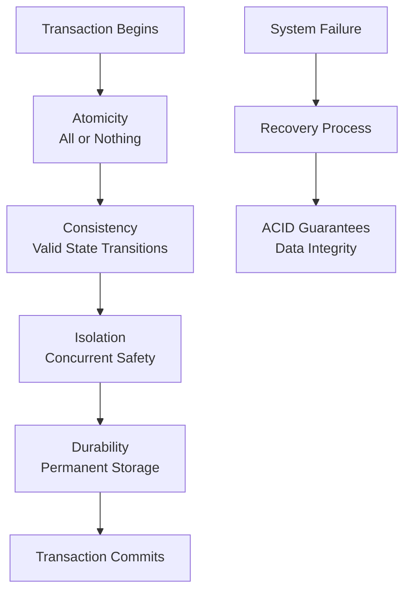

# ACID Properties in Practice

> **Module 6 • Lesson 1**  
> Estimated time: 30 min | Difficulty: ★★★☆☆

## 1. Why this matters

ACID properties are the foundation of reliable database systems, ensuring that your data remains consistent even when multiple users access it simultaneously or when system failures occur. Understanding ACID isn't just theoretical—it directly impacts how you design applications, handle errors, and ensure data integrity in production systems. Whether you're processing financial transactions, managing inventory, or handling user registrations, ACID properties determine whether your system can be trusted with critical data.

> **Need a refresher?** This lesson builds on transaction concepts from [Database Management Systems Deep Dive](01-02-dbms-deep-dive.md).

## 2. Key Concepts

- **Atomicity**: All operations in a transaction succeed or all fail together
- **Consistency**: Database moves from one valid state to another valid state
- **Isolation**: Concurrent transactions don't interfere with each other
- **Durability**: Committed changes survive system crashes and power failures
- **Transaction boundaries**: BEGIN, COMMIT, ROLLBACK define atomic units of work
- **Failure scenarios**: How ACID properties protect against various types of failures



## 3. Deep Dive

### 3.1 Atomicity: All or Nothing

Atomicity ensures that a transaction is treated as a single, indivisible unit. Either all operations within the transaction complete successfully, or none of them do.

**Classic Example: Bank Transfer**
```sql
-- Without proper atomicity, this could be dangerous
BEGIN;

-- Step 1: Deduct from source account
UPDATE accounts 
SET balance = balance - 1000 
WHERE account_id = 'ACC001';

-- Step 2: Add to destination account  
UPDATE accounts 
SET balance = balance + 1000 
WHERE account_id = 'ACC002';

-- If system crashes here, we could lose $1000!
COMMIT;
```

**How MySQL Ensures Atomicity:**
- **Undo Log**: Records old values before changes
- **Rollback**: If any operation fails, all changes are undone
- **Two-Phase Commit**: For distributed transactions

**Practical Atomicity Example:**
```sql
-- E-commerce order processing
BEGIN;

-- Reserve inventory
UPDATE products 
SET stock_quantity = stock_quantity - 2
WHERE product_id = 101 AND stock_quantity >= 2;

-- Check if reservation succeeded
SELECT ROW_COUNT() as affected_rows;
-- If 0 rows affected, product is out of stock

-- Create order record
INSERT INTO orders (customer_id, total_amount, status)
VALUES (12345, 199.98, 'PENDING');

-- Create order items
INSERT INTO order_items (order_id, product_id, quantity, price)
VALUES (LAST_INSERT_ID(), 101, 2, 99.99);

-- Process payment (simplified)
INSERT INTO payments (order_id, amount, status)
VALUES (LAST_INSERT_ID(), 199.98, 'COMPLETED');

-- If any step fails, everything rolls back
COMMIT;
```

### 3.2 Consistency: Valid State Transitions

Consistency ensures that the database moves from one valid state to another. All constraints, triggers, and business rules must be satisfied.

**Types of Consistency:**
- **Entity Integrity**: Primary keys must be unique and not null
- **Referential Integrity**: Foreign keys must reference existing records
- **Domain Integrity**: Data must satisfy column constraints
- **Business Rule Integrity**: Custom constraints and triggers

**Consistency in Action:**
```sql
-- Create tables with constraints
CREATE TABLE customers (
    id INT AUTO_INCREMENT PRIMARY KEY,
    email VARCHAR(255) UNIQUE NOT NULL,
    age INT CHECK (age >= 18),
    status ENUM('ACTIVE', 'INACTIVE', 'SUSPENDED') DEFAULT 'ACTIVE'
);

CREATE TABLE orders (
    id INT AUTO_INCREMENT PRIMARY KEY,
    customer_id INT NOT NULL,
    order_date DATE NOT NULL,
    total_amount DECIMAL(10,2) CHECK (total_amount > 0),
    FOREIGN KEY (customer_id) REFERENCES customers(id)
);

-- This transaction maintains consistency
BEGIN;

INSERT INTO customers (email, age, status) 
VALUES ('john@example.com', 25, 'ACTIVE');

INSERT INTO orders (customer_id, order_date, total_amount)
VALUES (LAST_INSERT_ID(), CURDATE(), 150.00);

COMMIT;

-- This would violate consistency and fail
BEGIN;
INSERT INTO orders (customer_id, order_date, total_amount)
VALUES (99999, CURDATE(), 150.00);  -- Non-existent customer_id
-- ERROR: Cannot add or update a child row: foreign key constraint fails
ROLLBACK;
```

### 3.3 Isolation: Concurrent Transaction Safety

Isolation ensures that concurrent transactions don't interfere with each other. Each transaction should behave as if it's running alone.

**Isolation Levels** (from weakest to strongest):
1. **READ UNCOMMITTED**: Can see uncommitted changes (dirty reads)
2. **READ COMMITTED**: Only sees committed changes
3. **REPEATABLE READ**: Same reads return same results (MySQL default)
4. **SERIALIZABLE**: Full isolation, transactions run as if sequential

**Isolation Example:**
```sql
-- Session 1: Long-running transaction
BEGIN;
UPDATE accounts SET balance = balance - 100 WHERE id = 1;
-- Don't commit yet...

-- Session 2: Concurrent transaction
BEGIN;
SELECT balance FROM accounts WHERE id = 1;
-- What balance do we see? Depends on isolation level!

-- Session 1: Complete the transaction
COMMIT;
```

**Practical Isolation Scenarios:**
```sql
-- Scenario 1: Inventory management with proper isolation
-- Session A: Customer trying to buy last item
BEGIN;
SELECT stock_quantity FROM products WHERE id = 101;
-- Shows: 1 item in stock

UPDATE products 
SET stock_quantity = stock_quantity - 1 
WHERE id = 101 AND stock_quantity > 0;

-- Session B: Another customer, same item, same time
BEGIN;
SELECT stock_quantity FROM products WHERE id = 101;
-- What does this show? Depends on isolation level and timing

UPDATE products 
SET stock_quantity = stock_quantity - 1 
WHERE id = 101 AND stock_quantity > 0;
-- This might block until Session A commits

COMMIT; -- Session A
COMMIT; -- Session B
```

### 3.4 Durability: Surviving System Failures

Durability guarantees that once a transaction is committed, it will survive system crashes, power failures, and other disasters.

**How MySQL Ensures Durability:**
- **Write-Ahead Logging (WAL)**: Changes written to log before data files
- **Redo Log**: Records what changes were made
- **Doublewrite Buffer**: Protects against partial page writes
- **Crash Recovery**: Replays committed transactions after restart

**Durability in Practice:**
```sql
-- Critical transaction that must survive crashes
BEGIN;

-- Update customer loyalty points
UPDATE customers 
SET loyalty_points = loyalty_points + 100 
WHERE id = 12345;

-- Log the transaction for audit
INSERT INTO audit_log (table_name, operation, record_id, timestamp)
VALUES ('customers', 'UPDATE', 12345, NOW());

-- This COMMIT ensures durability
COMMIT;
-- Even if power fails immediately after COMMIT,
-- the changes will be recovered on restart
```

## 4. Hands-On Practice

Let's create a realistic scenario to test ACID properties:

```sql
-- Create a banking system to demonstrate ACID
CREATE TABLE accounts (
    id INT AUTO_INCREMENT PRIMARY KEY,
    account_number VARCHAR(20) UNIQUE NOT NULL,
    customer_name VARCHAR(100) NOT NULL,
    balance DECIMAL(15,2) NOT NULL DEFAULT 0.00,
    account_type ENUM('CHECKING', 'SAVINGS') NOT NULL,
    created_at TIMESTAMP DEFAULT CURRENT_TIMESTAMP,
    CHECK (balance >= 0)  -- Business rule: no negative balances
);

CREATE TABLE transactions (
    id INT AUTO_INCREMENT PRIMARY KEY,
    from_account_id INT,
    to_account_id INT,
    amount DECIMAL(15,2) NOT NULL,
    transaction_type ENUM('DEPOSIT', 'WITHDRAWAL', 'TRANSFER') NOT NULL,
    description TEXT,
    created_at TIMESTAMP DEFAULT CURRENT_TIMESTAMP,
    status ENUM('PENDING', 'COMPLETED', 'FAILED') DEFAULT 'PENDING',
    FOREIGN KEY (from_account_id) REFERENCES accounts(id),
    FOREIGN KEY (to_account_id) REFERENCES accounts(id),
    CHECK (amount > 0)
);

-- Insert test data
INSERT INTO accounts (account_number, customer_name, balance, account_type) VALUES
('ACC001', 'Alice Johnson', 5000.00, 'CHECKING'),
('ACC002', 'Bob Smith', 3000.00, 'SAVINGS'),
('ACC003', 'Carol Davis', 1500.00, 'CHECKING');

-- Test Atomicity: Safe money transfer
DELIMITER //
CREATE PROCEDURE transfer_money(
    IN from_acc INT,
    IN to_acc INT, 
    IN transfer_amount DECIMAL(15,2),
    IN description TEXT
)
BEGIN
    DECLARE insufficient_funds CONDITION FOR SQLSTATE '45000';
    DECLARE from_balance DECIMAL(15,2);
    DECLARE transaction_id INT;
    
    -- Start atomic transaction
    START TRANSACTION;
    
    -- Check sufficient funds
    SELECT balance INTO from_balance 
    FROM accounts 
    WHERE id = from_acc 
    FOR UPDATE;  -- Lock the row
    
    IF from_balance < transfer_amount THEN
        SIGNAL insufficient_funds 
        SET MESSAGE_TEXT = 'Insufficient funds for transfer';
    END IF;
    
    -- Log the transaction attempt
    INSERT INTO transactions (from_account_id, to_account_id, amount, transaction_type, description)
    VALUES (from_acc, to_acc, transfer_amount, 'TRANSFER', description);
    
    SET transaction_id = LAST_INSERT_ID();
    
    -- Perform the transfer (atomic operations)
    UPDATE accounts 
    SET balance = balance - transfer_amount 
    WHERE id = from_acc;
    
    UPDATE accounts 
    SET balance = balance + transfer_amount 
    WHERE id = to_acc;
    
    -- Mark transaction as completed
    UPDATE transactions 
    SET status = 'COMPLETED' 
    WHERE id = transaction_id;
    
    -- Commit the transaction
    COMMIT;
    
    SELECT 'Transfer completed successfully' AS result;
END //
DELIMITER ;

-- Test the procedure
CALL transfer_money(1, 2, 500.00, 'Monthly transfer');

-- Verify balances
SELECT account_number, customer_name, balance 
FROM accounts 
ORDER BY id;

-- Test consistency: Try to violate constraints
BEGIN;
-- This should fail due to CHECK constraint
INSERT INTO accounts (account_number, customer_name, balance, account_type)
VALUES ('ACC004', 'Invalid Account', -100.00, 'CHECKING');
ROLLBACK;
```

**Practice Exercises:**

1. **Test Atomicity**: Modify the transfer procedure to fail at different points and verify rollback
2. **Test Isolation**: Run concurrent transfers and observe locking behavior
3. **Test Consistency**: Try to violate various constraints and see how they're enforced
4. **Test Durability**: Simulate a system restart scenario (conceptually)

## 5. Common Pitfalls

### 5.1 Forgetting Transaction Boundaries
**Problem**: Performing related operations without wrapping them in a transaction
```sql
-- DANGEROUS: Not atomic
UPDATE inventory SET quantity = quantity - 1 WHERE product_id = 101;
INSERT INTO orders (product_id, quantity) VALUES (101, 1);
-- If second statement fails, inventory is still decremented
```

### 5.2 Long-Running Transactions
**Problem**: Keeping transactions open too long
```sql
-- PROBLEMATIC: Long transaction holds locks
BEGIN;
SELECT * FROM large_table WHERE complex_condition;
-- ... application processing for 10 minutes ...
UPDATE small_table SET status = 'processed';
COMMIT;
```

### 5.3 Ignoring Isolation Level Effects
**Problem**: Not understanding what your isolation level guarantees
```sql
-- At READ COMMITTED level
BEGIN;
SELECT COUNT(*) FROM orders WHERE status = 'PENDING';  -- Returns 5
-- Another transaction inserts a PENDING order
SELECT COUNT(*) FROM orders WHERE status = 'PENDING';  -- Returns 6!
COMMIT;
```

### 5.4 Assuming Consistency Without Constraints
**Problem**: Relying on application logic instead of database constraints
```sql
-- WEAK: Only application enforces business rules
CREATE TABLE orders (
    id INT PRIMARY KEY,
    total_amount DECIMAL(10,2)  -- No constraint on positive values
);

-- STRONG: Database enforces business rules
CREATE TABLE orders (
    id INT PRIMARY KEY,
    total_amount DECIMAL(10,2) CHECK (total_amount > 0)
);
```

## 6. Knowledge Check

<details>
<summary>1. What happens if a transaction violates the Atomicity property?</summary>

If atomicity is violated, some operations in the transaction might complete while others fail, leaving the database in an inconsistent state. This is prevented by the database's transaction management system, which ensures that either all operations in a transaction succeed (COMMIT) or all are undone (ROLLBACK).
</details>

<details>
<summary>2. How does a CHECK constraint relate to the Consistency property?</summary>

CHECK constraints enforce consistency by ensuring that data meets specific business rules before it's stored. They prevent invalid data from being inserted or updated, maintaining the database in a consistent state that satisfies all defined constraints.
</details>

<details>
<summary>3. Why might you choose a weaker isolation level like READ COMMITTED over REPEATABLE READ?</summary>

Weaker isolation levels allow for better concurrency and performance by reducing lock contention. READ COMMITTED might be chosen when you can tolerate non-repeatable reads but want to avoid dirty reads, especially in high-concurrency OLTP systems where performance is critical.
</details>

<details>
<summary>4. What mechanisms does MySQL use to ensure Durability?</summary>

MySQL uses write-ahead logging (WAL), redo logs, doublewrite buffer, and crash recovery mechanisms. Changes are written to the log before being applied to data files, ensuring that committed transactions can be recovered even after system failures.
</details>

<details>
<summary>5. Give an example where violating ACID properties could cause real-world problems.</summary>

In an e-commerce system, if atomicity is violated during order processing, you might charge a customer's credit card but fail to create the order record, or reserve inventory but fail to create the order. This leads to financial discrepancies and customer service issues.
</details>

## 7. Further Reading

- [MySQL Transaction and Locking Statements](https://dev.mysql.com/doc/refman/8.0/en/sql-transactional-statements.html)
- [InnoDB Transaction Model](https://dev.mysql.com/doc/refman/8.0/en/innodb-transaction-model.html)
- [Database System Concepts - Transaction Management](https://www.db-book.com/)
- [PostgreSQL ACID Properties](https://www.postgresql.org/docs/current/tutorial-transactions.html)
- [ACID Properties in Distributed Systems](https://martinfowler.com/articles/microservice-trade-offs.html#consistency)

---

**Navigation**

[← Previous: Performance Patterns](05-03-performance-patterns.md) | [Next → Isolation Levels and Locking](06-02-isolation-levels-locking.md)

_Last updated: 2025-06-21_ 