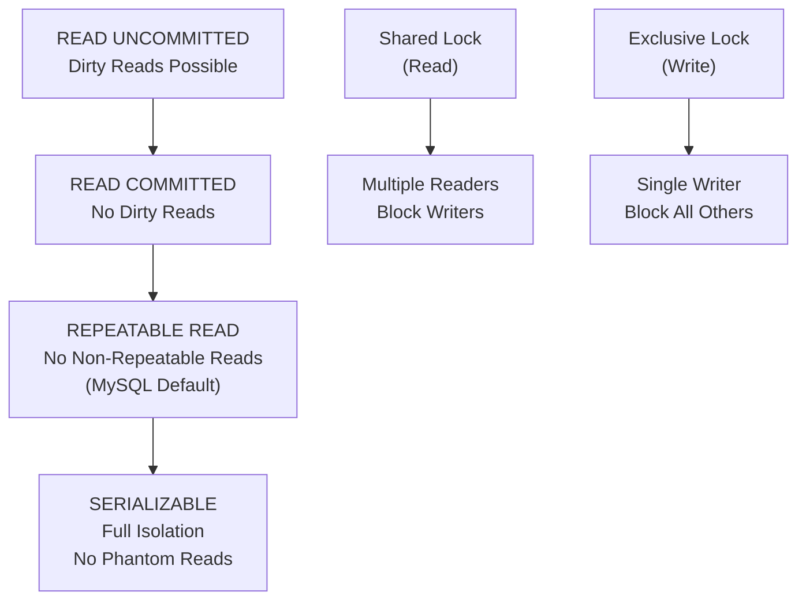

# Isolation Levels and Locking

> **Module 6 • Lesson 2**  
> Estimated time: 35 min | Difficulty: ★★★★☆

## 1. Why this matters

Isolation levels and locking mechanisms determine how your database handles concurrent access to data. Understanding these concepts is crucial for building high-performance applications that maintain data integrity under load. The wrong isolation level can lead to data corruption, while overly strict locking can create performance bottlenecks. Mastering these concepts helps you balance consistency, performance, and concurrency in production systems.

> **Need a refresher?** This lesson builds on ACID concepts from [ACID Properties in Practice](06-01-acid-properties.md).

## 2. Key Concepts

- **Isolation phenomena**: Dirty reads, non-repeatable reads, phantom reads
- **Four isolation levels**: READ UNCOMMITTED, READ COMMITTED, REPEATABLE READ, SERIALIZABLE
- **Locking mechanisms**: Shared locks, exclusive locks, intention locks
- **Lock granularity**: Row-level, page-level, table-level locking
- **MVCC**: Multi-Version Concurrency Control for better performance
- **Deadlocks**: Detection, prevention, and resolution strategies



## 3. Deep Dive

### 3.1 Isolation Phenomena and Problems

Before understanding isolation levels, let's examine the problems they're designed to prevent:

**Dirty Read**: Reading uncommitted changes from another transaction
```sql
-- Session A
BEGIN;
UPDATE accounts SET balance = 1000 WHERE id = 1;
-- Don't commit yet...

-- Session B (at READ UNCOMMITTED level)
SELECT balance FROM accounts WHERE id = 1;  -- Sees 1000 (dirty read)

-- Session A
ROLLBACK;  -- Session B saw data that never existed!
```

**Non-Repeatable Read**: Same query returns different results within a transaction
```sql
-- Session A
BEGIN;
SELECT balance FROM accounts WHERE id = 1;  -- Returns 500

-- Session B
UPDATE accounts SET balance = 1000 WHERE id = 1;
COMMIT;

-- Session A (same transaction)
SELECT balance FROM accounts WHERE id = 1;  -- Returns 1000 (different!)
COMMIT;
```

**Phantom Read**: New rows appear between identical queries
```sql
-- Session A
BEGIN;
SELECT COUNT(*) FROM orders WHERE amount > 1000;  -- Returns 5

-- Session B
INSERT INTO orders (amount) VALUES (1500);
COMMIT;

-- Session A (same transaction)
SELECT COUNT(*) FROM orders WHERE amount > 1000;  -- Returns 6 (phantom!)
COMMIT;
```

### 3.2 The Four Isolation Levels

**READ UNCOMMITTED** (Level 0)
- **Allows**: Dirty reads, non-repeatable reads, phantom reads
- **Use case**: Data warehousing where approximate results are acceptable
- **Performance**: Highest (no read locks)

```sql
-- Enable READ UNCOMMITTED
SET SESSION TRANSACTION ISOLATION LEVEL READ UNCOMMITTED;

BEGIN;
-- Can see uncommitted changes from other transactions
SELECT * FROM accounts WHERE balance > 1000;
COMMIT;
```

**READ COMMITTED** (Level 1)
- **Prevents**: Dirty reads
- **Allows**: Non-repeatable reads, phantom reads
- **Use case**: Most web applications, reporting systems
- **Performance**: Good balance of consistency and performance

```sql
-- Enable READ COMMITTED
SET SESSION TRANSACTION ISOLATION LEVEL READ COMMITTED;

BEGIN;
-- Only sees committed data, but data can change between reads
SELECT balance FROM accounts WHERE id = 1;  -- Snapshot at this moment
-- ... other transaction commits changes ...
SELECT balance FROM accounts WHERE id = 1;  -- May see different value
COMMIT;
```

**REPEATABLE READ** (Level 2) - MySQL Default
- **Prevents**: Dirty reads, non-repeatable reads
- **Allows**: Phantom reads (but MySQL's implementation prevents most phantoms)
- **Use case**: Financial systems, inventory management
- **Performance**: Good for most applications

```sql
-- Enable REPEATABLE READ (MySQL default)
SET SESSION TRANSACTION ISOLATION LEVEL REPEATABLE READ;

BEGIN;
SELECT balance FROM accounts WHERE id = 1;  -- Establishes snapshot
-- ... other transactions commit changes ...
SELECT balance FROM accounts WHERE id = 1;  -- Same value as first read
COMMIT;
```

**SERIALIZABLE** (Level 3)
- **Prevents**: All isolation phenomena
- **Use case**: Critical financial transactions, audit systems
- **Performance**: Lowest (maximum locking)

```sql
-- Enable SERIALIZABLE
SET SESSION TRANSACTION ISOLATION LEVEL SERIALIZABLE;

BEGIN;
SELECT * FROM accounts WHERE balance > 1000;
-- This query locks all matching rows and prevents inserts in the range
COMMIT;
```

### 3.3 Locking Mechanisms in MySQL

**Shared Locks (S-locks)**
- Multiple transactions can hold shared locks on the same resource
- Used for reading data
- Block exclusive locks but allow other shared locks

**Exclusive Locks (X-locks)**
- Only one transaction can hold an exclusive lock
- Used for writing data
- Block all other locks (shared and exclusive)

**Intention Locks**
- Table-level locks that indicate transaction intends to lock rows
- **IS** (Intention Shared): Planning to acquire shared row locks
- **IX** (Intention Exclusive): Planning to acquire exclusive row locks

```sql
-- Demonstrate locking behavior
-- Session A
BEGIN;
SELECT * FROM accounts WHERE id = 1 FOR SHARE;  -- Shared lock
-- This allows other sessions to read but not write

-- Session B
BEGIN;
SELECT * FROM accounts WHERE id = 1;  -- Works fine (no lock needed)
SELECT * FROM accounts WHERE id = 1 FOR SHARE;  -- Works (shared lock)
UPDATE accounts SET balance = 2000 WHERE id = 1;  -- BLOCKS (needs exclusive lock)

-- Session A
COMMIT;  -- Releases shared lock, Session B's update proceeds
```

### 3.4 Multi-Version Concurrency Control (MVCC)

MySQL InnoDB uses MVCC to provide better concurrency:

**How MVCC Works:**
1. Each row has hidden columns with transaction IDs
2. Each transaction sees a consistent snapshot of data
3. Readers don't block writers, writers don't block readers
4. Old versions of rows are kept in the undo log

```sql
-- MVCC in action
-- Session A
BEGIN;
UPDATE accounts SET balance = 1500 WHERE id = 1;
-- Creates new version of row, keeps old version

-- Session B (REPEATABLE READ)
BEGIN;
SELECT balance FROM accounts WHERE id = 1;  -- Sees old version (1000)

-- Session A
COMMIT;  -- New version becomes current

-- Session B (same transaction)
SELECT balance FROM accounts WHERE id = 1;  -- Still sees old version (1000)
COMMIT;

-- Session C (new transaction)
SELECT balance FROM accounts WHERE id = 1;  -- Sees new version (1500)
```

### 3.5 Lock Granularity and Performance

**Row-Level Locking** (InnoDB default)
- Locks individual rows
- Best concurrency
- Higher overhead

**Table-Level Locking** (MyISAM)
- Locks entire table
- Lower concurrency
- Lower overhead

```sql
-- Check current locks
SELECT 
    ENGINE_LOCK_ID,
    ENGINE_TRANSACTION_ID,
    THREAD_ID,
    OBJECT_SCHEMA,
    OBJECT_NAME,
    LOCK_TYPE,
    LOCK_MODE,
    LOCK_STATUS
FROM performance_schema.data_locks;

-- Check lock waits
SELECT 
    REQUESTING_ENGINE_LOCK_ID,
    REQUESTING_ENGINE_TRANSACTION_ID,
    BLOCKING_ENGINE_LOCK_ID,
    BLOCKING_ENGINE_TRANSACTION_ID
FROM performance_schema.data_lock_waits;
```

## 4. Hands-On Practice

Let's create scenarios to demonstrate isolation levels and locking:

```sql
-- Setup test environment
CREATE TABLE bank_accounts (
    id INT AUTO_INCREMENT PRIMARY KEY,
    account_number VARCHAR(20) UNIQUE,
    balance DECIMAL(10,2) NOT NULL,
    last_updated TIMESTAMP DEFAULT CURRENT_TIMESTAMP ON UPDATE CURRENT_TIMESTAMP
);

CREATE TABLE transaction_log (
    id INT AUTO_INCREMENT PRIMARY KEY,
    account_id INT,
    amount DECIMAL(10,2),
    transaction_type ENUM('DEBIT', 'CREDIT'),
    timestamp TIMESTAMP DEFAULT CURRENT_TIMESTAMP,
    FOREIGN KEY (account_id) REFERENCES bank_accounts(id)
);

-- Insert test data
INSERT INTO bank_accounts (account_number, balance) VALUES
('ACC001', 1000.00),
('ACC002', 2000.00),
('ACC003', 1500.00);

-- Test 1: Demonstrate isolation levels
-- Open two MySQL sessions and run these concurrently

-- Session 1: Long-running transaction
SET SESSION TRANSACTION ISOLATION LEVEL REPEATABLE READ;
BEGIN;
SELECT balance FROM bank_accounts WHERE id = 1;  -- Remember this value
-- Wait here... don't commit yet

-- Session 2: Modify the data
UPDATE bank_accounts SET balance = 5000 WHERE id = 1;
COMMIT;

-- Session 1: Read again
SELECT balance FROM bank_accounts WHERE id = 1;  -- Same as before?
COMMIT;

-- Test 2: Demonstrate locking with FOR UPDATE
-- Session 1: Acquire exclusive lock
BEGIN;
SELECT * FROM bank_accounts WHERE id = 1 FOR UPDATE;
-- This locks the row for updates

-- Session 2: Try to update (will block)
UPDATE bank_accounts SET balance = 3000 WHERE id = 1;
-- This will wait until Session 1 commits

-- Session 1: Release lock
COMMIT;

-- Test 3: Demonstrate deadlock scenario
-- Session 1:
BEGIN;
UPDATE bank_accounts SET balance = balance + 100 WHERE id = 1;
-- Now try to update account 2...
UPDATE bank_accounts SET balance = balance - 100 WHERE id = 2;

-- Session 2 (run concurrently):
BEGIN;
UPDATE bank_accounts SET balance = balance + 100 WHERE id = 2;
-- Now try to update account 1 (deadlock!)
UPDATE bank_accounts SET balance = balance - 100 WHERE id = 1;

-- One session will be chosen as deadlock victim and rolled back
```

**Advanced Locking Scenarios:**

```sql
-- Scenario 1: Optimistic locking with version numbers
ALTER TABLE bank_accounts ADD COLUMN version INT DEFAULT 1;

-- Update with version check
UPDATE bank_accounts 
SET balance = 1200, version = version + 1 
WHERE id = 1 AND version = 1;

-- Check affected rows to detect concurrent modifications
SELECT ROW_COUNT() AS rows_affected;

-- Scenario 2: Lock timeout handling
SET SESSION innodb_lock_wait_timeout = 5;  -- 5 seconds

BEGIN;
-- This will timeout if it can't acquire lock within 5 seconds
SELECT * FROM bank_accounts WHERE id = 1 FOR UPDATE;
COMMIT;

-- Scenario 3: Skip locked rows (MySQL 8.0+)
BEGIN;
SELECT * FROM bank_accounts 
WHERE balance > 1000 
FOR UPDATE SKIP LOCKED;  -- Skip rows that are locked
COMMIT;
```

**Practice Exercises:**

1. **Isolation Level Testing**: Test each isolation level with concurrent transactions
2. **Lock Monitoring**: Use `SHOW ENGINE INNODB STATUS` to observe lock information
3. **Deadlock Creation**: Create and resolve deadlock scenarios
4. **Performance Testing**: Compare performance of different isolation levels

## 5. Common Pitfalls

### 5.1 Using Wrong Isolation Level
**Problem**: Choosing isolation level based on fear rather than requirements
```sql
-- OVERKILL: Using SERIALIZABLE for simple read operations
SET TRANSACTION ISOLATION LEVEL SERIALIZABLE;
SELECT COUNT(*) FROM orders;  -- Unnecessary locking
```

### 5.2 Long-Running Transactions with High Isolation
**Problem**: Holding locks too long
```sql
-- PROBLEMATIC: Long transaction at REPEATABLE READ
BEGIN;
SELECT * FROM large_table;  -- Establishes snapshot
-- ... 10 minutes of application processing ...
UPDATE status_table SET processed = 1;
COMMIT;  -- Blocks other transactions for too long
```

### 5.3 Not Handling Deadlocks
**Problem**: Not catching and retrying deadlock errors
```sql
-- Application should catch error 1213 (ER_LOCK_DEADLOCK)
-- and retry the transaction
```

### 5.4 Ignoring Lock Waits
**Problem**: Not monitoring lock contention
```sql
-- Monitor lock waits regularly
SELECT 
    THREAD_ID,
    OBJECT_NAME,
    LOCK_MODE,
    LOCK_STATUS
FROM performance_schema.data_locks 
WHERE LOCK_STATUS = 'WAITING';
```

## 6. Knowledge Check

<details>
<summary>1. What's the difference between a dirty read and a non-repeatable read?</summary>

A dirty read occurs when a transaction reads uncommitted changes from another transaction. A non-repeatable read occurs when a transaction reads the same data twice and gets different results because another transaction modified and committed the data between the reads.
</details>

<details>
<summary>2. Why is REPEATABLE READ the default isolation level in MySQL?</summary>

REPEATABLE READ provides a good balance between consistency and performance. It prevents dirty reads and non-repeatable reads while still allowing good concurrency. MySQL's implementation also prevents most phantom reads through gap locking.
</details>

<details>
<summary>3. How does MVCC improve database performance?</summary>

MVCC allows readers and writers to work concurrently without blocking each other. Readers see consistent snapshots of data without acquiring locks, while writers can modify data without being blocked by readers. This significantly improves concurrency in read-heavy workloads.
</details>

<details>
<summary>4. When would you use SELECT ... FOR UPDATE?</summary>

Use SELECT ... FOR UPDATE when you need to read data and then update it based on what you read, ensuring no other transaction modifies the data between your read and write operations. It's commonly used in inventory systems, account balance updates, and other scenarios requiring atomic read-modify-write operations.
</details>

<details>
<summary>5. How should an application handle deadlocks?</summary>

Applications should catch deadlock errors (MySQL error 1213), log the occurrence, wait a random amount of time to avoid repeated conflicts, and then retry the entire transaction. The retry should have a maximum limit to prevent infinite loops.
</details>

## 7. Further Reading

- [MySQL Transaction Isolation Levels](https://dev.mysql.com/doc/refman/8.0/en/innodb-transaction-isolation-levels.html)
- [InnoDB Locking and Transaction Model](https://dev.mysql.com/doc/refman/8.0/en/innodb-locking-transaction-model.html)
- [Understanding MySQL Locking](https://www.percona.com/blog/2012/03/27/innodbs-gap-locks/)
- [MVCC in InnoDB](https://dev.mysql.com/doc/refman/8.0/en/innodb-multi-versioning.html)
- [Deadlock Detection and Rollback](https://dev.mysql.com/doc/refman/8.0/en/innodb-deadlocks.html)

---

**Navigation**

[← Previous: ACID Properties in Practice](06-01-acid-properties.md) | [Next → Deadlock Detection and Prevention](06-03-deadlock-detection-prevention.md)

_Last updated: 2025-06-21_ 