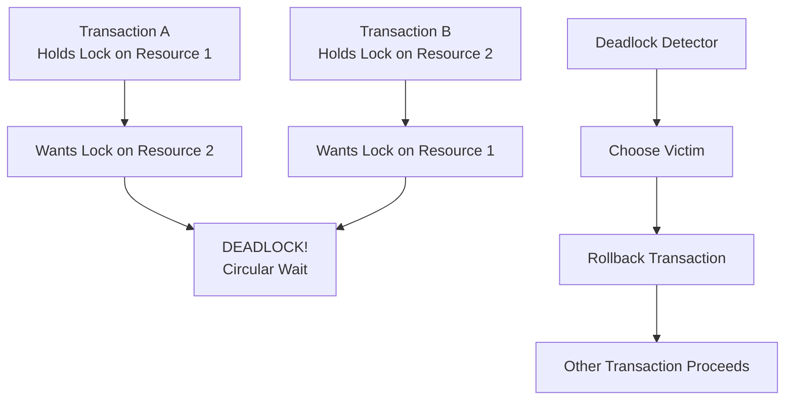

# Deadlock Detection and Prevention

> **Module 6 • Lesson 3**  
> Estimated time: 30 min | Difficulty: ★★★★☆

## 1. Why this matters

Deadlocks are one of the most challenging concurrency issues in database systems. When two or more transactions are waiting for each other to release locks, the system can come to a complete standstill. Understanding how to detect, prevent, and handle deadlocks is crucial for building robust, high-concurrency applications. Poor deadlock handling can lead to application timeouts, data inconsistency, and frustrated users. Mastering deadlock management ensures your applications remain responsive even under heavy concurrent load.

> **Need a refresher?** This lesson builds on locking concepts from [Isolation Levels and Locking](06-02-isolation-levels-locking.md).

## 2. Key Concepts

- **Deadlock definition**: Circular dependency where transactions wait for each other
- **Deadlock conditions**: Mutual exclusion, hold and wait, no preemption, circular wait
- **Detection mechanisms**: Wait-for graphs, timeout-based detection
- **Prevention strategies**: Lock ordering, lock timeout, lock granularity
- **Resolution approaches**: Victim selection, transaction rollback, retry logic
- **Application-level handling**: Error catching, exponential backoff, circuit breakers



## 3. Deep Dive

### 3.1 Understanding Deadlock Conditions

A deadlock occurs when four conditions are met simultaneously:

**1. Mutual Exclusion**: Resources cannot be shared
```sql
-- Only one transaction can hold an exclusive lock
UPDATE accounts SET balance = balance - 100 WHERE id = 1;
-- No other transaction can modify this row until commit/rollback
```

**2. Hold and Wait**: Transactions hold resources while waiting for others
```sql
-- Transaction holds lock on account 1, waits for lock on account 2
BEGIN;
UPDATE accounts SET balance = balance - 100 WHERE id = 1;  -- Hold lock
UPDATE accounts SET balance = balance + 100 WHERE id = 2;  -- Wait for lock
```

**3. No Preemption**: Locks cannot be forcibly taken away
```sql
-- MySQL cannot force a transaction to release its locks
-- (except through deadlock detection and rollback)
```

**4. Circular Wait**: Chain of transactions waiting for each other
```sql
-- Classic deadlock scenario:
-- Transaction A: Lock(1) → Wait(2)
-- Transaction B: Lock(2) → Wait(1)
```

### 3.2 Common Deadlock Scenarios

**Scenario 1: Lock Ordering Deadlock**
```sql
-- Session A
BEGIN;
UPDATE accounts SET balance = balance - 100 WHERE id = 1;  -- Lock account 1
UPDATE accounts SET balance = balance + 100 WHERE id = 2;  -- Wait for account 2

-- Session B (running concurrently)
BEGIN;
UPDATE accounts SET balance = balance - 50 WHERE id = 2;   -- Lock account 2
UPDATE accounts SET balance = balance + 50 WHERE id = 1;   -- Wait for account 1
-- DEADLOCK! Each session waits for the other's lock
```

**Scenario 2: Index Lock Deadlock**
```sql
-- Two transactions updating different rows but same index
-- Session A
BEGIN;
UPDATE users SET email = 'new1@example.com' WHERE id = 100;

-- Session B
BEGIN;
UPDATE users SET email = 'new2@example.com' WHERE id = 200;
-- If the email index pages overlap, deadlock can occur
```

**Scenario 3: Foreign Key Deadlock**
```sql
-- Session A
BEGIN;
INSERT INTO orders (customer_id, amount) VALUES (1, 100);  -- Locks customer row

-- Session B
BEGIN;
UPDATE customers SET status = 'VIP' WHERE id = 1;  -- Waits for customer lock
INSERT INTO orders (customer_id, amount) VALUES (1, 200);  -- Will create deadlock
```

### 3.3 MySQL's Deadlock Detection

MySQL InnoDB automatically detects deadlocks using a wait-for graph:

**Detection Process:**
1. Build wait-for graph of transactions and locks
2. Look for cycles in the graph
3. Choose a victim transaction (usually smallest)
4. Roll back the victim transaction
5. Return error 1213 (ER_LOCK_DEADLOCK) to application

**Viewing Deadlock Information:**
```sql
-- Show the last deadlock
SHOW ENGINE INNODB STATUS\G

-- Look for section: "LATEST DETECTED DEADLOCK"
-- Example output interpretation:
/*
*** (1) TRANSACTION:
TRANSACTION 421508, ACTIVE 0 sec starting index read
mysql tables in use 1, locked 1
LOCK WAIT 2 lock struct(s), heap size 1136, 1 row lock(s)
MySQL thread id 12, OS thread handle 140469861123840, query id 1234
localhost root updating
UPDATE accounts SET balance = balance - 100 WHERE id = 1

*** (2) TRANSACTION:
TRANSACTION 421509, ACTIVE 0 sec starting index read
mysql tables in use 1, locked 1
2 lock struct(s), heap size 1136, 1 row lock(s)
MySQL thread id 13, OS thread handle 140469860061952, query id 1235
localhost root updating
UPDATE accounts SET balance = balance + 100 WHERE id = 2

*** WE ROLL BACK TRANSACTION (1)
*/
```

### 3.4 Deadlock Prevention Strategies

**Strategy 1: Consistent Lock Ordering**
```sql
-- WRONG: Inconsistent ordering leads to deadlocks
-- Transaction A: Lock(1) then Lock(2)
-- Transaction B: Lock(2) then Lock(1)

-- CORRECT: Always acquire locks in same order
CREATE PROCEDURE transfer_money_safe(
    IN from_account INT,
    IN to_account INT,
    IN amount DECIMAL(10,2)
)
BEGIN
    DECLARE account1 INT;
    DECLARE account2 INT;
    
    -- Always lock accounts in ID order to prevent deadlocks
    IF from_account < to_account THEN
        SET account1 = from_account;
        SET account2 = to_account;
    ELSE
        SET account1 = to_account;
        SET account2 = from_account;
    END IF;
    
    BEGIN
        -- Lock accounts in consistent order
        SELECT balance FROM accounts WHERE id = account1 FOR UPDATE;
        SELECT balance FROM accounts WHERE id = account2 FOR UPDATE;
        
        -- Perform transfer
        UPDATE accounts SET balance = balance - amount WHERE id = from_account;
        UPDATE accounts SET balance = balance + amount WHERE id = to_account;
        
        COMMIT;
    END;
END;
```

**Strategy 2: Lock Timeout**
```sql
-- Set lock wait timeout to prevent indefinite waits
SET SESSION innodb_lock_wait_timeout = 10;  -- 10 seconds

BEGIN;
-- If this can't acquire lock within 10 seconds, it will fail
-- instead of potentially creating a deadlock
UPDATE accounts SET balance = balance - 100 WHERE id = 1;
COMMIT;
```

**Strategy 3: Reduce Lock Duration**
```sql
-- WRONG: Long-running transaction increases deadlock probability
BEGIN;
SELECT * FROM large_table;  -- Long operation
-- ... application processing ...
UPDATE accounts SET balance = balance - 100 WHERE id = 1;
COMMIT;

-- CORRECT: Keep transactions short
-- Do processing outside transaction
SELECT * FROM large_table;
-- ... application processing ...

-- Short transaction for critical update
BEGIN;
UPDATE accounts SET balance = balance - 100 WHERE id = 1;
COMMIT;
```

**Strategy 4: Use Lower Isolation Levels When Appropriate**
```sql
-- READ COMMITTED reduces lock duration
SET SESSION TRANSACTION ISOLATION LEVEL READ COMMITTED;

BEGIN;
-- Locks are released after each statement, reducing deadlock chance
SELECT balance FROM accounts WHERE id = 1;
UPDATE accounts SET balance = balance - 100 WHERE id = 1;
COMMIT;
```

### 3.5 Application-Level Deadlock Handling

**Basic Retry Logic:**
```python
import mysql.connector
import time
import random

def transfer_with_retry(from_account, to_account, amount, max_retries=3):
    for attempt in range(max_retries):
        try:
            conn = mysql.connector.connect(...)
            cursor = conn.cursor()
            
            cursor.execute("BEGIN")
            
            # Perform transfer operations
            cursor.execute(
                "UPDATE accounts SET balance = balance - %s WHERE id = %s",
                (amount, from_account)
            )
            cursor.execute(
                "UPDATE accounts SET balance = balance + %s WHERE id = %s", 
                (amount, to_account)
            )
            
            cursor.execute("COMMIT")
            return True
            
        except mysql.connector.Error as e:
            if e.errno == 1213:  # Deadlock error
                cursor.execute("ROLLBACK")
                if attempt < max_retries - 1:
                    # Exponential backoff with jitter
                    delay = (2 ** attempt) + random.uniform(0, 1)
                    time.sleep(delay)
                    continue
                else:
                    raise Exception("Transfer failed after retries")
            else:
                raise e
        finally:
            conn.close()
    
    return False
```

**Advanced Retry with Circuit Breaker:**
```python
class DeadlockCircuitBreaker:
    def __init__(self, failure_threshold=5, timeout=60):
        self.failure_count = 0
        self.failure_threshold = failure_threshold
        self.timeout = timeout
        self.last_failure_time = None
        self.state = 'CLOSED'  # CLOSED, OPEN, HALF_OPEN
    
    def call(self, func, *args, **kwargs):
        if self.state == 'OPEN':
            if time.time() - self.last_failure_time > self.timeout:
                self.state = 'HALF_OPEN'
            else:
                raise Exception("Circuit breaker is OPEN")
        
        try:
            result = func(*args, **kwargs)
            self.on_success()
            return result
        except mysql.connector.Error as e:
            if e.errno == 1213:  # Deadlock
                self.on_failure()
                raise
            else:
                raise
    
    def on_success(self):
        self.failure_count = 0
        self.state = 'CLOSED'
    
    def on_failure(self):
        self.failure_count += 1
        self.last_failure_time = time.time()
        if self.failure_count >= self.failure_threshold:
            self.state = 'OPEN'
```

## 4. Hands-On Practice

Let's create and resolve deadlock scenarios:

```sql
-- Setup for deadlock testing
CREATE TABLE deadlock_test_accounts (
    id INT AUTO_INCREMENT PRIMARY KEY,
    account_name VARCHAR(50),
    balance DECIMAL(10,2) DEFAULT 1000.00
);

INSERT INTO deadlock_test_accounts (account_name, balance) VALUES
('Account A', 1000.00),
('Account B', 1000.00),
('Account C', 1000.00);

-- Enable deadlock logging
SET GLOBAL innodb_print_all_deadlocks = ON;

-- Test 1: Create a simple deadlock
-- Run these in two different sessions simultaneously

-- Session 1:
BEGIN;
UPDATE deadlock_test_accounts SET balance = balance - 100 WHERE id = 1;
-- Wait a moment, then run:
UPDATE deadlock_test_accounts SET balance = balance + 100 WHERE id = 2;

-- Session 2 (run concurrently with Session 1):
BEGIN;
UPDATE deadlock_test_accounts SET balance = balance - 100 WHERE id = 2;
-- Wait a moment, then run:
UPDATE deadlock_test_accounts SET balance = balance + 100 WHERE id = 1;
-- One of these sessions will get a deadlock error

-- Test 2: Deadlock-safe transfer procedure
DELIMITER //
CREATE PROCEDURE safe_transfer(
    IN from_id INT,
    IN to_id INT,
    IN transfer_amount DECIMAL(10,2)
)
BEGIN
    DECLARE first_id INT;
    DECLARE second_id INT;
    DECLARE from_balance DECIMAL(10,2);
    
    -- Always lock in ID order to prevent deadlocks
    IF from_id < to_id THEN
        SET first_id = from_id;
        SET second_id = to_id;
    ELSE
        SET first_id = to_id;
        SET second_id = from_id;
    END IF;
    
    START TRANSACTION;
    
    -- Lock both accounts in consistent order
    SELECT balance INTO from_balance 
    FROM deadlock_test_accounts 
    WHERE id = first_id FOR UPDATE;
    
    SELECT balance 
    FROM deadlock_test_accounts 
    WHERE id = second_id FOR UPDATE;
    
    -- Check sufficient funds
    SELECT balance INTO from_balance 
    FROM deadlock_test_accounts 
    WHERE id = from_id;
    
    IF from_balance < transfer_amount THEN
        ROLLBACK;
        SIGNAL SQLSTATE '45000' SET MESSAGE_TEXT = 'Insufficient funds';
    END IF;
    
    -- Perform transfer
    UPDATE deadlock_test_accounts 
    SET balance = balance - transfer_amount 
    WHERE id = from_id;
    
    UPDATE deadlock_test_accounts 
    SET balance = balance + transfer_amount 
    WHERE id = to_id;
    
    COMMIT;
END //
DELIMITER ;

-- Test the safe procedure
CALL safe_transfer(1, 2, 100.00);
CALL safe_transfer(2, 1, 50.00);

-- Monitor deadlocks
SHOW ENGINE INNODB STATUS\G

-- Check deadlock count
SELECT 
    VARIABLE_NAME, 
    VARIABLE_VALUE 
FROM performance_schema.global_status 
WHERE VARIABLE_NAME = 'Innodb_deadlocks';
```

**Advanced Deadlock Testing:**
```sql
-- Create a more complex scenario with multiple tables
CREATE TABLE customers_deadlock (
    id INT AUTO_INCREMENT PRIMARY KEY,
    name VARCHAR(100),
    total_orders INT DEFAULT 0
);

CREATE TABLE orders_deadlock (
    id INT AUTO_INCREMENT PRIMARY KEY,
    customer_id INT,
    amount DECIMAL(10,2),
    FOREIGN KEY (customer_id) REFERENCES customers_deadlock(id)
);

INSERT INTO customers_deadlock (name) VALUES ('Customer 1'), ('Customer 2');

-- Procedure that can cause deadlocks with foreign keys
DELIMITER //
CREATE PROCEDURE create_order_with_deadlock_risk(
    IN cust_id INT,
    IN order_amount DECIMAL(10,2)
)
BEGIN
    START TRANSACTION;
    
    -- This can deadlock with concurrent updates to customers
    INSERT INTO orders_deadlock (customer_id, amount) VALUES (cust_id, order_amount);
    
    UPDATE customers_deadlock 
    SET total_orders = total_orders + 1 
    WHERE id = cust_id;
    
    COMMIT;
END //
DELIMITER ;
```

**Practice Exercises:**

1. **Create Deadlocks**: Intentionally create different types of deadlocks
2. **Analyze Deadlock Logs**: Use `SHOW ENGINE INNODB STATUS` to understand deadlock reports
3. **Implement Retry Logic**: Write application code to handle deadlock errors
4. **Test Prevention Strategies**: Compare deadlock rates with and without prevention techniques

## 5. Common Pitfalls

### 5.1 Ignoring Deadlock Errors
**Problem**: Not handling deadlock errors in application code
```python
# WRONG: Deadlock error crashes the application
try:
    cursor.execute("UPDATE accounts SET balance = balance - 100 WHERE id = 1")
except Exception as e:
    print(f"Error: {e}")
    # Application continues with inconsistent state
```

### 5.2 Inconsistent Lock Ordering
**Problem**: Different code paths acquire locks in different orders
```sql
-- Function A
UPDATE table1 SET value = 1 WHERE id = 1;
UPDATE table2 SET value = 2 WHERE id = 1;

-- Function B (different order - deadlock risk!)
UPDATE table2 SET value = 3 WHERE id = 1;
UPDATE table1 SET value = 4 WHERE id = 1;
```

### 5.3 Long-Running Transactions
**Problem**: Holding locks for extended periods
```sql
-- PROBLEMATIC
BEGIN;
UPDATE accounts SET balance = balance - 100 WHERE id = 1;
-- ... complex business logic for 30 seconds ...
UPDATE audit_log SET processed = 1 WHERE id = 1234;
COMMIT;
```

### 5.4 Not Monitoring Deadlock Frequency
**Problem**: Not tracking deadlock occurrences in production
```sql
-- Monitor deadlock frequency
SELECT 
    VARIABLE_VALUE as deadlock_count
FROM performance_schema.global_status 
WHERE VARIABLE_NAME = 'Innodb_deadlocks';
```

## 6. Knowledge Check

<details>
<summary>1. What are the four conditions necessary for a deadlock to occur?</summary>

1. Mutual Exclusion (resources cannot be shared)
2. Hold and Wait (processes hold resources while waiting for others)
3. No Preemption (resources cannot be forcibly taken away)
4. Circular Wait (circular chain of processes waiting for each other's resources)
</details>

<details>
<summary>2. How does MySQL detect deadlocks?</summary>

MySQL uses a wait-for graph algorithm that tracks which transactions are waiting for locks held by other transactions. When it detects a cycle in this graph, it identifies a deadlock and automatically chooses a victim transaction to roll back (usually the one with the smallest number of locks or that has done the least work).
</details>

<details>
<summary>3. What is the most effective way to prevent deadlocks?</summary>

Consistent lock ordering is the most effective prevention strategy. Always acquire locks in the same order across all transactions (e.g., by primary key value). This eliminates the circular wait condition and prevents deadlocks.
</details>

<details>
<summary>4. How should an application handle a deadlock error?</summary>

The application should catch the deadlock error (MySQL error 1213), roll back the transaction, wait a random amount of time (exponential backoff with jitter), and retry the entire transaction. Implement a maximum retry limit to prevent infinite loops.
</details>

<details>
<summary>5. Why might increasing the lock timeout not be a good solution for deadlocks?</summary>

Increasing lock timeout doesn't prevent deadlocks; it just makes them take longer to detect. This can actually make the problem worse by having more transactions waiting and potentially creating larger deadlock chains. It's better to prevent deadlocks through proper design than to rely on timeouts.
</details>

## 7. Further Reading

- [MySQL Deadlock Detection and Rollback](https://dev.mysql.com/doc/refman/8.0/en/innodb-deadlocks.html)
- [Understanding InnoDB Deadlocks](https://www.percona.com/blog/2014/10/28/how-to-deal-with-mysql-deadlocks/)
- [Deadlock Prevention Strategies](https://planet.mysql.com/entry/?id=32721)
- [Application-Level Deadlock Handling](https://www.oreilly.com/library/view/high-performance-mysql/9781492080503/)
- [Database Deadlock Prevention Patterns](https://martinfowler.com/articles/patterns-of-distributed-systems/deadlock-prevention.html)

---

**Navigation**

[← Previous: Isolation Levels and Locking](06-02-isolation-levels-locking.md) | [Next → Storage Engines](07-01-storage-engines.md)

_Last updated: 2025-01-21_ 