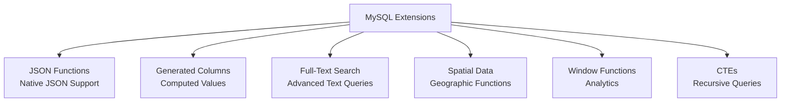

# MySQL Extensions and Functions

> **Module 7 • Lesson 2**  
> Estimated time: 35 min | Difficulty: ★★★☆☆

## 1. Why this matters

MySQL offers powerful extensions beyond standard SQL that can significantly enhance your applications' capabilities. From JSON data handling to full-text search, spatial data processing, and generated columns, these features can eliminate complex application logic and improve performance. Understanding MySQL-specific extensions helps you leverage the database's full potential while maintaining code simplicity and data integrity. However, using these features also creates vendor lock-in, so understanding the trade-offs is crucial for architectural decisions.

> **Need a refresher?** This lesson builds on SQL foundations from [What is SQL and the Relational Model](01-01-what-is-sql.md).

## 2. Key Concepts

- **JSON data type**: Native JSON storage and manipulation functions
- **Generated columns**: Virtual and stored computed columns
- **Full-text search**: Advanced text search capabilities
- **Spatial data types**: Geographic and geometric data handling
- **Common Table Expressions (CTEs)**: Recursive and non-recursive CTEs
- **Window functions**: Advanced analytical functions
- **MySQL-specific SQL modes**: Behavior modification settings



## 3. Deep Dive

### 3.1 JSON Data Type and Functions

MySQL 5.7+ provides native JSON support with validation, indexing, and manipulation functions:

**JSON Data Type:**
```sql
-- Create table with JSON column
CREATE TABLE products (
    id INT AUTO_INCREMENT PRIMARY KEY,
    name VARCHAR(100),
    specifications JSON,
    tags JSON,
    created_at TIMESTAMP DEFAULT CURRENT_TIMESTAMP
);

-- Insert JSON data
INSERT INTO products (name, specifications, tags) VALUES
('Laptop', 
 '{"cpu": "Intel i7", "ram": "16GB", "storage": "512GB SSD", "weight": 1.8}',
 '["electronics", "computers", "portable"]'),
('Smartphone',
 '{"cpu": "Snapdragon 888", "ram": "8GB", "storage": "128GB", "camera": "108MP"}',
 '["electronics", "mobile", "communication"]');

-- JSON validation is automatic
-- INSERT INTO products (name, specifications) VALUES ('Invalid', 'not json');  -- Error
```

**JSON Query Functions:**
```sql
-- Extract JSON values
SELECT 
    name,
    JSON_EXTRACT(specifications, '$.cpu') AS cpu,
    specifications->>'$.ram' AS ram,  -- Alternative syntax
    JSON_EXTRACT(specifications, '$.weight') AS weight
FROM products;

-- Query JSON arrays
SELECT name, JSON_EXTRACT(tags, '$[0]') AS first_tag
FROM products;

-- Search in JSON
SELECT * FROM products 
WHERE JSON_EXTRACT(specifications, '$.ram') = '16GB';

-- Use JSON path expressions
SELECT * FROM products
WHERE specifications->>'$.cpu' LIKE '%Intel%';
```

**JSON Manipulation Functions:**
```sql
-- Update JSON data
UPDATE products 
SET specifications = JSON_SET(specifications, '$.price', 999.99)
WHERE name = 'Laptop';

-- Add to JSON array
UPDATE products 
SET tags = JSON_ARRAY_APPEND(tags, '$', 'bestseller')
WHERE name = 'Smartphone';

-- Remove JSON keys
UPDATE products 
SET specifications = JSON_REMOVE(specifications, '$.weight')
WHERE name = 'Smartphone';

-- Merge JSON objects
UPDATE products 
SET specifications = JSON_MERGE_PATCH(
    specifications, 
    '{"warranty": "2 years", "color": "silver"}'
)
WHERE name = 'Laptop';

-- Pretty print JSON
SELECT name, JSON_PRETTY(specifications) 
FROM products 
WHERE name = 'Laptop';
```

**JSON Indexing:**
```sql
-- Create functional index on JSON field
ALTER TABLE products 
ADD INDEX idx_cpu ((CAST(specifications->>'$.cpu' AS CHAR(50))));

-- Create generated column for better indexing
ALTER TABLE products 
ADD COLUMN cpu_type VARCHAR(50) AS (specifications->>'$.cpu') STORED,
ADD INDEX idx_cpu_generated (cpu_type);

-- Query using the index
EXPLAIN SELECT * FROM products WHERE cpu_type = 'Intel i7';
```

### 3.2 Generated Columns

Generated columns compute their values based on expressions involving other columns:

**Virtual vs Stored Generated Columns:**
```sql
CREATE TABLE orders (
    id INT AUTO_INCREMENT PRIMARY KEY,
    quantity INT NOT NULL,
    unit_price DECIMAL(10,2) NOT NULL,
    -- Virtual column (computed on-the-fly)
    total_price DECIMAL(12,2) AS (quantity * unit_price) VIRTUAL,
    -- Stored column (computed and stored)
    total_with_tax DECIMAL(12,2) AS (quantity * unit_price * 1.08) STORED,
    order_date DATE NOT NULL,
    -- Generated column with date functions
    order_year INT AS (YEAR(order_date)) VIRTUAL,
    order_month VARCHAR(7) AS (DATE_FORMAT(order_date, '%Y-%m')) STORED
);

INSERT INTO orders (quantity, unit_price, order_date) VALUES
(5, 19.99, '2024-01-15'),
(3, 49.50, '2024-02-20'),
(10, 12.75, '2024-01-28');

-- Query generated columns
SELECT 
    quantity,
    unit_price,
    total_price,      -- Computed virtually
    total_with_tax,   -- Stored value
    order_year,       -- Virtual
    order_month       -- Stored
FROM orders;

-- Index on generated column
CREATE INDEX idx_order_year ON orders (order_year);
CREATE INDEX idx_total_range ON orders (total_with_tax);
```

**Advanced Generated Column Examples:**
```sql
-- JSON-based generated columns
CREATE TABLE user_profiles (
    id INT AUTO_INCREMENT PRIMARY KEY,
    profile_data JSON,
    -- Extract commonly queried fields
    email VARCHAR(255) AS (profile_data->>'$.email') STORED,
    age INT AS (profile_data->>'$.age') VIRTUAL,
    full_name VARCHAR(200) AS (
        CONCAT(profile_data->>'$.firstName', ' ', profile_data->>'$.lastName')
    ) VIRTUAL,
    -- Create searchable tags
    searchable_text TEXT AS (
        CONCAT(
            IFNULL(profile_data->>'$.firstName', ''), ' ',
            IFNULL(profile_data->>'$.lastName', ''), ' ',
            IFNULL(profile_data->>'$.email', ''), ' ',
            IFNULL(profile_data->>'$.company', '')
        )
    ) STORED,
    INDEX idx_email (email),
    FULLTEXT idx_searchable (searchable_text)
);

INSERT INTO user_profiles (profile_data) VALUES
('{"firstName": "John", "lastName": "Doe", "email": "john@example.com", "age": 30, "company": "Tech Corp"}'),
('{"firstName": "Jane", "lastName": "Smith", "email": "jane@example.com", "age": 28, "company": "Data Inc"}');

-- Query using generated columns
SELECT full_name, email, age 
FROM user_profiles 
WHERE age > 25;

-- Full-text search on generated column
SELECT full_name, email
FROM user_profiles 
WHERE MATCH(searchable_text) AGAINST('Tech Corp');
```

### 3.3 Full-Text Search

MySQL provides sophisticated full-text search capabilities:

**Full-Text Index Creation:**
```sql
CREATE TABLE articles (
    id INT AUTO_INCREMENT PRIMARY KEY,
    title VARCHAR(255),
    content TEXT,
    author VARCHAR(100),
    published_date DATE,
    FULLTEXT idx_title_content (title, content),
    FULLTEXT idx_content (content)
);

INSERT INTO articles (title, content, author, published_date) VALUES
('Introduction to Machine Learning', 
 'Machine learning is a subset of artificial intelligence that focuses on algorithms and statistical models...', 
 'Dr. Smith', '2024-01-15'),
('Database Optimization Techniques',
 'Database performance optimization involves various strategies including indexing, query optimization, and schema design...',
 'Jane Developer', '2024-01-20'),
('Advanced SQL Patterns',
 'SQL patterns help developers write more efficient and maintainable database queries using common table expressions...',
 'Bob Analyst', '2024-02-01');
```

**Full-Text Search Modes:**
```sql
-- Natural language mode (default)
SELECT title, author,
       MATCH(title, content) AGAINST('machine learning') AS relevance_score
FROM articles 
WHERE MATCH(title, content) AGAINST('machine learning')
ORDER BY relevance_score DESC;

-- Boolean mode for complex queries
SELECT title, author
FROM articles 
WHERE MATCH(title, content) AGAINST('+database -machine' IN BOOLEAN MODE);

-- Query expansion mode
SELECT title, author
FROM articles 
WHERE MATCH(title, content) AGAINST('optimization' WITH QUERY EXPANSION);

-- Boolean operators
SELECT title, author
FROM articles 
WHERE MATCH(content) AGAINST('"query optimization"' IN BOOLEAN MODE);  -- Exact phrase

SELECT title, author
FROM articles 
WHERE MATCH(content) AGAINST('SQL* pattern*' IN BOOLEAN MODE);  -- Wildcards
```

**Full-Text Search Configuration:**
```sql
-- Check full-text configuration
SHOW VARIABLES LIKE 'ft_%';

-- Minimum word length
SHOW VARIABLES LIKE 'ft_min_word_len';

-- Stop words
SELECT * FROM INFORMATION_SCHEMA.INNODB_FT_DEFAULT_STOPWORD;

-- Custom stopword table
CREATE TABLE custom_stopwords (value VARCHAR(30));
INSERT INTO custom_stopwords VALUES ('the'), ('and'), ('but');

SET GLOBAL innodb_ft_user_stopword_table = 'database_name/custom_stopwords';
```

### 3.4 Spatial Data Types and Functions

MySQL supports spatial data for geographic and geometric applications:

**Spatial Data Types:**
```sql
CREATE TABLE locations (
    id INT AUTO_INCREMENT PRIMARY KEY,
    name VARCHAR(100),
    location POINT NOT NULL,
    coverage_area POLYGON,
    delivery_routes LINESTRING,
    SPATIAL INDEX idx_location (location),
    SPATIAL INDEX idx_coverage (coverage_area)
);

-- Insert spatial data using Well-Known Text (WKT)
INSERT INTO locations (name, location, coverage_area) VALUES
('Downtown Store', 
 ST_GeomFromText('POINT(-73.935242 40.730610)'),  -- NYC coordinates
 ST_GeomFromText('POLYGON((-73.940 40.725, -73.930 40.725, -73.930 40.735, -73.940 40.735, -73.940 40.725))')),
('Uptown Branch',
 ST_GeomFromText('POINT(-73.953 40.785)'),
 ST_GeomFromText('POLYGON((-73.960 40.780, -73.945 40.780, -73.945 40.790, -73.960 40.790, -73.960 40.780))'));
```

**Spatial Query Functions:**
```sql
-- Distance calculations
SELECT 
    name,
    ST_Distance_Sphere(
        location, 
        ST_GeomFromText('POINT(-73.935 40.730)')
    ) / 1000 AS distance_km
FROM locations
ORDER BY distance_km;

-- Find locations within a distance
SELECT name
FROM locations 
WHERE ST_Distance_Sphere(
    location, 
    ST_GeomFromText('POINT(-73.935 40.730)')
) < 5000;  -- Within 5km

-- Check if point is within polygon
SELECT name
FROM locations 
WHERE ST_Contains(
    coverage_area,
    ST_GeomFromText('POINT(-73.937 40.728)')
);

-- Get coordinates
SELECT 
    name,
    ST_X(location) AS longitude,
    ST_Y(location) AS latitude
FROM locations;
```

### 3.5 Common Table Expressions (CTEs)

CTEs provide readable, reusable query components:

**Basic CTEs:**
```sql
-- Simple CTE
WITH high_value_orders AS (
    SELECT customer_id, order_date, total
    FROM orders 
    WHERE total > 1000
)
SELECT c.name, h.order_date, h.total
FROM customers c
JOIN high_value_orders h ON c.id = h.customer_id;

-- Multiple CTEs
WITH 
monthly_sales AS (
    SELECT 
        DATE_FORMAT(order_date, '%Y-%m') AS month,
        SUM(total) AS monthly_total
    FROM orders 
    GROUP BY DATE_FORMAT(order_date, '%Y-%m')
),
avg_monthly AS (
    SELECT AVG(monthly_total) AS avg_total
    FROM monthly_sales
)
SELECT m.month, m.monthly_total, a.avg_total,
       CASE 
           WHEN m.monthly_total > a.avg_total THEN 'Above Average'
           ELSE 'Below Average'
       END AS performance
FROM monthly_sales m
CROSS JOIN avg_monthly a
ORDER BY m.month;
```

**Recursive CTEs:**
```sql
-- Employee hierarchy
CREATE TABLE employees (
    id INT PRIMARY KEY,
    name VARCHAR(100),
    manager_id INT,
    FOREIGN KEY (manager_id) REFERENCES employees(id)
);

INSERT INTO employees VALUES
(1, 'CEO', NULL),
(2, 'VP Sales', 1),
(3, 'VP Engineering', 1),
(4, 'Sales Manager', 2),
(5, 'Developer', 3),
(6, 'Senior Developer', 3);

-- Recursive CTE to show organizational hierarchy
WITH RECURSIVE employee_hierarchy AS (
    -- Base case: top-level employees
    SELECT id, name, manager_id, 0 AS level, CAST(name AS CHAR(1000)) AS path
    FROM employees 
    WHERE manager_id IS NULL
    
    UNION ALL
    
    -- Recursive case: employees with managers
    SELECT e.id, e.name, e.manager_id, eh.level + 1,
           CONCAT(eh.path, ' -> ', e.name)
    FROM employees e
    JOIN employee_hierarchy eh ON e.manager_id = eh.id
)
SELECT 
    CONCAT(REPEAT('  ', level), name) AS hierarchy,
    level,
    path
FROM employee_hierarchy
ORDER BY path;
```

### 3.6 MySQL-Specific SQL Modes

SQL modes control MySQL's behavior and compatibility:

```sql
-- View current SQL mode
SELECT @@sql_mode;

-- Common SQL modes
SET sql_mode = 'STRICT_TRANS_TABLES,ERROR_FOR_DIVISION_BY_ZERO,NO_AUTO_CREATE_USER,NO_ENGINE_SUBSTITUTION';

-- Strict mode prevents invalid data
SET sql_mode = 'STRICT_TRANS_TABLES';
-- INSERT INTO users (age) VALUES (-5);  -- Would fail in strict mode

-- Traditional mode for maximum compatibility
SET sql_mode = 'TRADITIONAL';

-- ANSI mode for standard SQL compliance
SET sql_mode = 'ANSI';

-- Check specific mode settings
SELECT 
    @@sql_mode,
    @@sql_mode LIKE '%STRICT_TRANS_TABLES%' AS strict_enabled,
    @@sql_mode LIKE '%ONLY_FULL_GROUP_BY%' AS group_by_strict;
```

## 4. Hands-On Practice

Let's create a comprehensive example using multiple MySQL extensions:

```sql
-- E-commerce product catalog with advanced features
CREATE TABLE advanced_products (
    id INT AUTO_INCREMENT PRIMARY KEY,
    name VARCHAR(200),
    description TEXT,
    specifications JSON,
    price DECIMAL(10,2),
    category_id INT,
    location POINT,
    created_at TIMESTAMP DEFAULT CURRENT_TIMESTAMP,
    
    -- Generated columns
    price_tier VARCHAR(20) AS (
        CASE 
            WHEN price < 50 THEN 'Budget'
            WHEN price < 200 THEN 'Mid-range'
            ELSE 'Premium'
        END
    ) VIRTUAL,
    
    brand VARCHAR(100) AS (specifications->>'$.brand') STORED,
    
    searchable_content TEXT AS (
        CONCAT(
            name, ' ',
            IFNULL(description, ''), ' ',
            IFNULL(specifications->>'$.brand', ''), ' ',
            IFNULL(specifications->>'$.model', '')
        )
    ) STORED,
    
    -- Indexes
    INDEX idx_price_tier (price_tier),
    INDEX idx_brand (brand),
    FULLTEXT idx_search (searchable_content),
    SPATIAL INDEX idx_location (location)
);

-- Insert sample data
INSERT INTO advanced_products (name, description, specifications, price, category_id, location) VALUES
('Gaming Laptop Pro', 
 'High-performance gaming laptop with RGB keyboard and advanced cooling system',
 '{"brand": "TechCorp", "model": "GL-2024", "cpu": "Intel i9", "gpu": "RTX 4080", "ram": "32GB", "storage": "1TB NVMe"}',
 2499.99, 1,
 ST_GeomFromText('POINT(-74.006 40.7128)')),

('Wireless Earbuds Elite',
 'Premium wireless earbuds with active noise cancellation and 30-hour battery life',
 '{"brand": "AudioMax", "model": "WE-Pro", "battery": "30 hours", "features": ["ANC", "Wireless Charging", "IPX7"]}',
 299.99, 2,
 ST_GeomFromText('POINT(-73.935 40.730)')),

('Smart Home Hub',
 'Central control hub for smart home devices with voice control and AI integration',
 '{"brand": "SmartTech", "model": "SH-Hub", "connectivity": ["WiFi", "Bluetooth", "Zigbee"], "voice": "Built-in"}',
 199.99, 3,
 ST_GeomFromText('POINT(-73.985 40.758)'));

-- Complex queries using multiple extensions

-- 1. Full-text search with JSON filtering
SELECT 
    name,
    brand,
    price,
    price_tier,
    MATCH(searchable_content) AGAINST('gaming performance') AS relevance
FROM advanced_products
WHERE MATCH(searchable_content) AGAINST('gaming performance')
  AND JSON_EXTRACT(specifications, '$.ram') >= '16GB'
ORDER BY relevance DESC;

-- 2. Spatial query with generated columns
WITH nearby_products AS (
    SELECT *,
           ST_Distance_Sphere(
               location, 
               ST_GeomFromText('POINT(-74.0 40.7)')
           ) / 1000 AS distance_km
    FROM advanced_products
    WHERE ST_Distance_Sphere(
        location, 
        ST_GeomFromText('POINT(-74.0 40.7)')
    ) < 10000  -- Within 10km
)
SELECT 
    name,
    brand,
    price_tier,
    ROUND(distance_km, 2) AS distance_km
FROM nearby_products
ORDER BY distance_km;

-- 3. Recursive CTE for category hierarchy
CREATE TABLE categories (
    id INT PRIMARY KEY,
    name VARCHAR(100),
    parent_id INT,
    FOREIGN KEY (parent_id) REFERENCES categories(id)
);

INSERT INTO categories VALUES
(1, 'Electronics', NULL),
(2, 'Computers', 1),
(3, 'Audio', 1),
(4, 'Laptops', 2),
(5, 'Headphones', 3);

WITH RECURSIVE category_tree AS (
    SELECT id, name, parent_id, 0 AS level, name AS path
    FROM categories 
    WHERE parent_id IS NULL
    
    UNION ALL
    
    SELECT c.id, c.name, c.parent_id, ct.level + 1,
           CONCAT(ct.path, ' > ', c.name)
    FROM categories c
    JOIN category_tree ct ON c.parent_id = ct.id
)
SELECT 
    CONCAT(REPEAT('  ', level), name) AS category_hierarchy,
    path
FROM category_tree
ORDER BY path;

-- 4. JSON aggregation with window functions
SELECT 
    brand,
    COUNT(*) AS product_count,
    AVG(price) AS avg_price,
    JSON_ARRAYAGG(
        JSON_OBJECT(
            'name', name,
            'price', price,
            'tier', price_tier
        )
    ) AS products,
    RANK() OVER (ORDER BY AVG(price) DESC) AS price_rank
FROM advanced_products
GROUP BY brand;
```

**Practice Exercises:**

1. **JSON Mastery**: Create complex JSON queries with nested data and arrays
2. **Generated Column Optimization**: Design generated columns to improve query performance
3. **Full-Text Search Tuning**: Experiment with different search modes and custom stopwords
4. **Spatial Analysis**: Build location-based queries for real-world scenarios
5. **CTE Complexity**: Create multi-level recursive CTEs for hierarchical data

## 5. Common Pitfalls

### 5.1 JSON Performance Issues
**Problem**: Not indexing frequently queried JSON fields
```sql
-- SLOW: No index on JSON field
SELECT * FROM products 
WHERE specifications->>'$.brand' = 'Apple';

-- BETTER: Generated column with index
ALTER TABLE products 
ADD COLUMN brand VARCHAR(50) AS (specifications->>'$.brand') STORED,
ADD INDEX idx_brand (brand);
```

### 5.2 Generated Column Limitations
**Problem**: Using complex expressions that can't be indexed
```sql
-- PROBLEMATIC: Complex generated column
ALTER TABLE orders 
ADD COLUMN complex_calc DECIMAL(10,2) AS (
    (SELECT AVG(price) FROM products) * quantity * 1.08
) VIRTUAL;  -- Subqueries not allowed
```

### 5.3 Full-Text Search Misconceptions
**Problem**: Expecting exact matches in natural language mode
```sql
-- May not work as expected
SELECT * FROM articles 
WHERE MATCH(content) AGAINST('the quick brown fox');

-- Better: Use boolean mode for exact control
SELECT * FROM articles 
WHERE MATCH(content) AGAINST('"the quick brown fox"' IN BOOLEAN MODE);
```

### 5.4 Spatial Data Type Confusion
**Problem**: Mixing coordinate systems or using wrong functions
```sql
-- WRONG: Mixing different spatial reference systems
-- Always be consistent with coordinate systems (WGS84, etc.)
```

## 6. Knowledge Check

<details>
<summary>1. What's the difference between virtual and stored generated columns?</summary>

Virtual generated columns are computed on-the-fly when accessed and don't take storage space, but can't be indexed directly. Stored generated columns are computed when the row is inserted/updated, take storage space, but can be indexed and are faster to query.
</details>

<details>
<summary>2. How do you create an index on a JSON field in MySQL?</summary>

You can create a functional index using `ALTER TABLE table_name ADD INDEX idx_name ((JSON_EXTRACT(json_column, '$.field')))` or create a generated column and index that: `ADD COLUMN field_name VARCHAR(50) AS (json_column->>'$.field') STORED, ADD INDEX (field_name)`.
</details>

<details>
<summary>3. What are the different full-text search modes in MySQL?</summary>

Natural Language Mode (default): Ranks results by relevance. Boolean Mode: Allows operators like +, -, "", *. Query Expansion Mode: Performs search twice, second time including words from most relevant results.
</details>

<details>
<summary>4. When should you use recursive CTEs?</summary>

Use recursive CTEs for hierarchical data like organizational charts, category trees, bill of materials, or any scenario where you need to traverse parent-child relationships of unknown depth.
</details>

<details>
<summary>5. What are the trade-offs of using MySQL-specific extensions?</summary>

Benefits: Better performance, reduced application complexity, leveraging database strengths. Drawbacks: Vendor lock-in, reduced portability, potential complexity in testing and development environments using different databases.
</details>

## 7. Further Reading

- [MySQL JSON Functions](https://dev.mysql.com/doc/refman/8.0/en/json-functions.html)
- [Generated Columns](https://dev.mysql.com/doc/refman/8.0/en/create-table-generated-columns.html)
- [Full-Text Search Functions](https://dev.mysql.com/doc/refman/8.0/en/fulltext-search.html)
- [Spatial Data Types](https://dev.mysql.com/doc/refman/8.0/en/spatial-types.html)
- [Common Table Expressions](https://dev.mysql.com/doc/refman/8.0/en/with.html)
- [SQL Modes](https://dev.mysql.com/doc/refman/8.0/en/sql-mode.html)

---

**Navigation**

[← Previous: Storage Engines](07-01-storage-engines.md) | [Next → Replication and High Availability](07-03-replication-high-availability.md)

_Last updated: 2025-06-21_ 