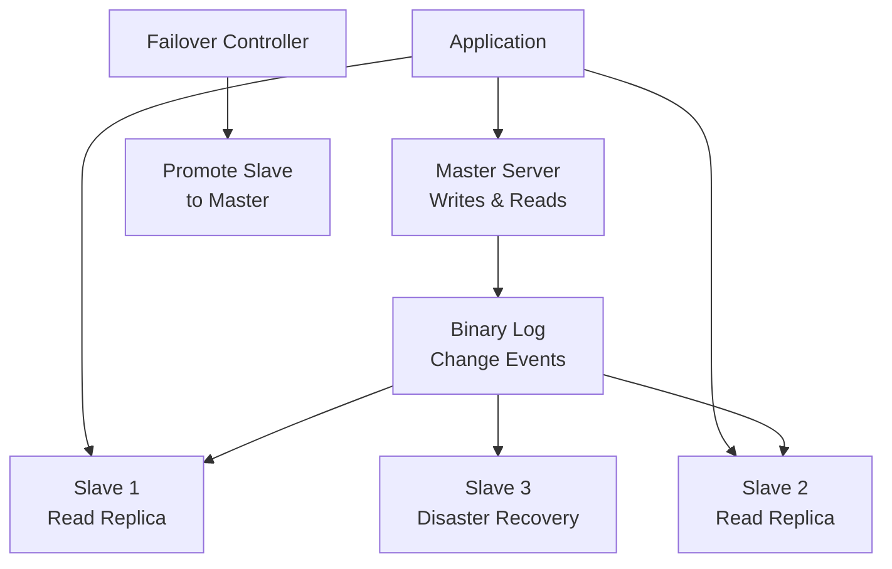

# Replication and High Availability

> **Module 7 • Lesson 3**  
> Estimated time: 40 min | Difficulty: ★★★★☆

## 1. Why this matters

High availability and replication are critical for production systems that cannot afford downtime. MySQL replication allows you to maintain multiple copies of your data across different servers, enabling load distribution, disaster recovery, and geographic distribution. Understanding replication concepts, configuration, and troubleshooting is essential for database administrators and developers working with mission-critical applications. Poor replication setup can lead to data inconsistency, performance bottlenecks, and extended downtime during failures.

> **Need a refresher?** This lesson builds on transaction concepts from [ACID Properties in Practice](06-01-acid-properties.md).

## 2. Key Concepts

- **Master-slave replication**: Traditional primary-replica architecture
- **Binary log**: Record of all changes for replication
- **Replication formats**: Statement-based, row-based, mixed
- **Replication lag**: Delay between master and slave
- **Failover strategies**: Automatic and manual failover procedures
- **Multi-master replication**: Bidirectional replication setup
- **High availability patterns**: Load balancing, clustering, geographic distribution



## 3. Deep Dive

### 3.1 MySQL Replication Architecture

MySQL replication works through a master-slave model where changes are recorded in the binary log and replayed on slave servers:

**Key Components:**
- **Master**: Accepts writes and logs changes to binary log
- **Slave**: Connects to master, downloads and applies changes
- **Binary Log**: Sequential log of all data modifications
- **Relay Log**: Slave's local copy of master's binary log
- **Replication Threads**: IO thread (downloads) and SQL thread (applies)

**Basic Replication Setup:**
```sql
-- On Master server
-- Enable binary logging in my.cnf
-- [mysqld]
-- log-bin=mysql-bin
-- server-id=1

-- Create replication user
CREATE USER 'repl_user'@'%' IDENTIFIED BY 'strong_password';
GRANT REPLICATION SLAVE ON *.* TO 'repl_user'@'%';
FLUSH PRIVILEGES;

-- Get master status
SHOW MASTER STATUS;
-- Note: File and Position values needed for slave setup

-- On Slave server  
-- Configure in my.cnf
-- [mysqld]
-- server-id=2
-- relay-log=relay-log

-- Configure slave to connect to master
CHANGE MASTER TO
    MASTER_HOST='master-server-ip',
    MASTER_USER='repl_user',
    MASTER_PASSWORD='strong_password',
    MASTER_LOG_FILE='mysql-bin.000001',  -- From SHOW MASTER STATUS
    MASTER_LOG_POS=154;                  -- From SHOW MASTER STATUS

-- Start replication
START SLAVE;

-- Check slave status
SHOW SLAVE STATUS\G
```

### 3.2 Replication Formats

MySQL supports three replication formats, each with different characteristics:

**Statement-Based Replication (SBR):**
```sql
-- Master executes: UPDATE products SET price = price * 1.1 WHERE category = 'electronics';
-- Slave receives and executes the same statement

-- Advantages: Compact binary log, less network traffic
-- Disadvantages: Non-deterministic functions can cause inconsistency

-- Configure statement-based replication
SET GLOBAL binlog_format = 'STATEMENT';

-- Example of potential inconsistency
UPDATE orders SET updated_at = NOW() WHERE status = 'pending';
-- NOW() might return different values on master and slave
```

**Row-Based Replication (RBR):**
```sql
-- Master logs actual row changes, not statements
-- Slave receives exact before/after values for each row

-- Configure row-based replication
SET GLOBAL binlog_format = 'ROW';

-- Advantages: Consistent replication, handles all SQL constructs
-- Disadvantages: Larger binary log, more network traffic

-- View binary log events in row format
SHOW BINLOG EVENTS IN 'mysql-bin.000001';
```

**Mixed Format:**
```sql
-- Automatically chooses between statement and row based on query type
SET GLOBAL binlog_format = 'MIXED';

-- Uses statement-based for safe statements
-- Uses row-based for potentially unsafe statements
```

### 3.3 Monitoring and Troubleshooting Replication

**Replication Status Monitoring:**
```sql
-- On Master: Check binary log status
SHOW MASTER STATUS;
SHOW BINARY LOGS;

-- On Slave: Comprehensive replication status
SHOW SLAVE STATUS\G

-- Key metrics to monitor:
-- Slave_IO_Running: Should be 'Yes'
-- Slave_SQL_Running: Should be 'Yes'  
-- Seconds_Behind_Master: Replication lag in seconds
-- Last_Error: Any replication errors
-- Relay_Master_Log_File: Current master log file being processed
-- Exec_Master_Log_Pos: Position in master log file

-- Check replication lag
SELECT 
    CASE 
        WHEN Seconds_Behind_Master IS NULL THEN 'Not Replicating'
        WHEN Seconds_Behind_Master = 0 THEN 'Up to Date'
        ELSE CONCAT(Seconds_Behind_Master, ' seconds behind')
    END AS replication_status
FROM (
    SELECT SUBSTRING_INDEX(SUBSTRING_INDEX(
        REPLACE(
            REPLACE(@@GLOBAL.slave_status, '\n', ''), 
            '\t', ''
        ), 'Seconds_Behind_Master:', -1
    ), ' ', 1) AS Seconds_Behind_Master
) AS repl_info;
```

**Common Replication Issues and Solutions:**
```sql
-- Issue 1: Slave SQL thread stopped due to error
SHOW SLAVE STATUS\G
-- Look for Last_SQL_Error

-- Solution: Skip problematic statement (use carefully!)
SET GLOBAL sql_slave_skip_counter = 1;
START SLAVE SQL_THREAD;

-- Issue 2: Duplicate key error on slave
-- Solution: Fix data inconsistency
STOP SLAVE;
-- Manually resolve the conflict
DELETE FROM table_name WHERE id = conflicting_id;
START SLAVE;

-- Issue 3: Replication lag
-- Check for long-running queries on slave
SHOW PROCESSLIST;

-- Optimize slave performance
SET GLOBAL slave_parallel_workers = 4;  -- MySQL 5.6+
SET GLOBAL slave_parallel_type = 'LOGICAL_CLOCK';  -- MySQL 5.7+

-- Issue 4: Binary log corruption
-- Rebuild slave from master backup
STOP SLAVE;
-- Restore from master backup
-- Reset slave position
RESET SLAVE;
CHANGE MASTER TO ...;
START SLAVE;
```

### 3.4 Advanced Replication Configurations

**Multi-Source Replication (MySQL 5.7+):**
```sql
-- Slave can replicate from multiple masters
-- Useful for data consolidation

-- Configure first master
CHANGE MASTER TO
    MASTER_HOST='master1-ip',
    MASTER_USER='repl_user',
    MASTER_PASSWORD='password',
    MASTER_LOG_FILE='mysql-bin.000001',
    MASTER_LOG_POS=154
    FOR CHANNEL 'master1';

-- Configure second master  
CHANGE MASTER TO
    MASTER_HOST='master2-ip',
    MASTER_USER='repl_user',
    MASTER_PASSWORD='password',
    MASTER_LOG_FILE='mysql-bin.000001',
    MASTER_LOG_POS=154
    FOR CHANNEL 'master2';

-- Start replication for specific channels
START SLAVE FOR CHANNEL 'master1';
START SLAVE FOR CHANNEL 'master2';

-- Monitor specific channels
SHOW SLAVE STATUS FOR CHANNEL 'master1'\G
```

**Group Replication (MySQL 5.7+):**
```sql
-- Configure group replication for multi-master setup
-- In my.cnf for all nodes:
-- [mysqld]
-- server-id=1  # Unique for each server
-- gtid-mode=ON
-- enforce-gtid-consistency=ON
-- binlog-checksum=NONE
-- log-slave-updates=ON
-- log-bin=binlog
-- master-info-repository=TABLE
-- relay-log-info-repository=TABLE
-- transaction-write-set-extraction=XXHASH64

-- Install group replication plugin
INSTALL PLUGIN group_replication SONAME 'group_replication.so';

-- Configure group replication
SET GLOBAL group_replication_group_name = 'aaaaaaaa-aaaa-aaaa-aaaa-aaaaaaaaaaaa';
SET GLOBAL group_replication_start_on_boot = OFF;
SET GLOBAL group_replication_local_address = '127.0.0.1:33061';
SET GLOBAL group_replication_group_seeds = '127.0.0.1:33061,127.0.0.1:33062,127.0.0.1:33063';

-- Start group replication
START GROUP_REPLICATION;

-- Check group members
SELECT * FROM performance_schema.replication_group_members;
```

### 3.5 High Availability Patterns

**Master-Slave with Failover:**
```sql
-- Automated failover using tools like MHA (Master High Availability)
-- or Orchestrator

-- Manual failover process:
-- 1. Stop application writes to master
-- 2. Ensure slave is caught up
SHOW SLAVE STATUS\G  -- Check Seconds_Behind_Master = 0

-- 3. Promote slave to master
STOP SLAVE;
RESET SLAVE ALL;

-- 4. Configure new master
-- Enable binary logging if not already enabled
-- Update application to point to new master

-- 5. Configure old master as slave (if recovered)
CHANGE MASTER TO
    MASTER_HOST='new-master-ip',
    MASTER_USER='repl_user',
    MASTER_PASSWORD='password',
    MASTER_AUTO_POSITION=1;  -- Using GTID
START SLAVE;
```

**Load Balancing with Read Replicas:**
```python
# Application-level read/write splitting
import mysql.connector
from mysql.connector import pooling

class DatabaseManager:
    def __init__(self):
        # Master for writes
        self.master_pool = pooling.MySQLConnectionPool(
            pool_name="master_pool",
            pool_size=10,
            host='master-server',
            database='myapp',
            user='app_user',
            password='password'
        )
        
        # Slaves for reads
        self.slave_pools = [
            pooling.MySQLConnectionPool(
                pool_name="slave1_pool",
                pool_size=5,
                host='slave1-server',
                database='myapp',
                user='app_user',
                password='password'
            ),
            pooling.MySQLConnectionPool(
                pool_name="slave2_pool", 
                pool_size=5,
                host='slave2-server',
                database='myapp',
                user='app_user',
                password='password'
            )
        ]
        self.current_slave = 0
    
    def get_write_connection(self):
        return self.master_pool.get_connection()
    
    def get_read_connection(self):
        # Round-robin load balancing
        pool = self.slave_pools[self.current_slave]
        self.current_slave = (self.current_slave + 1) % len(self.slave_pools)
        return pool.get_connection()
    
    def execute_write(self, query, params=None):
        conn = self.get_write_connection()
        try:
            cursor = conn.cursor()
            cursor.execute(query, params)
            conn.commit()
            return cursor.fetchall()
        finally:
            conn.close()
    
    def execute_read(self, query, params=None):
        conn = self.get_read_connection()
        try:
            cursor = conn.cursor()
            cursor.execute(query, params)
            return cursor.fetchall()
        finally:
            conn.close()
```

### 3.6 Backup and Recovery Strategies

**Consistent Backup with Replication:**
```sql
-- Method 1: Using mysqldump with master data
mysqldump --master-data=2 --single-transaction --routines --triggers --all-databases > backup.sql

-- Method 2: Using Percona XtraBackup for hot backup
xtrabackup --backup --target-dir=/backup/full --user=backup_user --password=password

-- Method 3: Filesystem snapshot (if using LVM or similar)
-- 1. FLUSH TABLES WITH READ LOCK;
-- 2. Take filesystem snapshot
-- 3. UNLOCK TABLES;

-- Point-in-time recovery using binary logs
-- 1. Restore from backup
mysql < backup.sql

-- 2. Apply binary logs from backup point to desired time
mysqlbinlog --start-datetime="2024-01-01 10:00:00" \
           --stop-datetime="2024-01-01 11:30:00" \
           mysql-bin.000001 mysql-bin.000002 | mysql

-- 3. Set up replication from the recovery point
```

## 4. Hands-On Practice

Let's set up a complete replication environment:

```sql
-- Simulate master-slave setup (using different ports on same machine for demo)

-- Master configuration (port 3306)
-- Create replication user
CREATE USER 'repl_user'@'localhost' IDENTIFIED BY 'repl_password';
GRANT REPLICATION SLAVE ON *.* TO 'repl_user'@'localhost';
FLUSH PRIVILEGES;

-- Create sample database and data
CREATE DATABASE replication_test;
USE replication_test;

CREATE TABLE test_table (
    id INT AUTO_INCREMENT PRIMARY KEY,
    data VARCHAR(100),
    created_at TIMESTAMP DEFAULT CURRENT_TIMESTAMP
);

INSERT INTO test_table (data) VALUES 
('Initial data 1'),
('Initial data 2'),
('Initial data 3');

-- Get master status
SHOW MASTER STATUS;

-- Slave configuration (port 3307)
-- Configure slave connection
CHANGE MASTER TO
    MASTER_HOST='localhost',
    MASTER_PORT=3306,
    MASTER_USER='repl_user',
    MASTER_PASSWORD='repl_password',
    MASTER_LOG_FILE='mysql-bin.000001',  -- From master status
    MASTER_LOG_POS=154;                  -- From master status

-- Start slave
START SLAVE;

-- Check slave status
SHOW SLAVE STATUS\G

-- Test replication
-- On master:
INSERT INTO replication_test.test_table (data) VALUES ('Replicated data 1');
UPDATE replication_test.test_table SET data = 'Updated data' WHERE id = 1;

-- On slave:
SELECT * FROM replication_test.test_table;

-- Monitor replication lag
CREATE TABLE replication_monitor (
    timestamp TIMESTAMP DEFAULT CURRENT_TIMESTAMP,
    lag_seconds INT
);

-- Monitoring script (run periodically)
DELIMITER //
CREATE PROCEDURE monitor_replication_lag()
BEGIN
    DECLARE lag_seconds INT DEFAULT NULL;
    
    -- Get replication lag
    SELECT 
        CASE 
            WHEN Slave_SQL_Running = 'Yes' AND Slave_IO_Running = 'Yes' 
            THEN Seconds_Behind_Master
            ELSE NULL
        END INTO lag_seconds
    FROM (
        SELECT 
            SUBSTRING_INDEX(STATUS_VALUE, '\t', 1) AS Slave_IO_Running,
            SUBSTRING_INDEX(SUBSTRING_INDEX(STATUS_VALUE, '\t', 2), '\t', -1) AS Slave_SQL_Running,
            CAST(SUBSTRING_INDEX(SUBSTRING_INDEX(STATUS_VALUE, '\t', 11), '\t', -1) AS UNSIGNED) AS Seconds_Behind_Master
        FROM (
            SELECT CONCAT_WS('\t',
                (SELECT VARIABLE_VALUE FROM performance_schema.global_status WHERE VARIABLE_NAME = 'Slave_running'),
                'Yes', -- Simplified for demo
                (SELECT VARIABLE_VALUE FROM performance_schema.global_status WHERE VARIABLE_NAME = 'Seconds_behind_master')
            ) AS STATUS_VALUE
        ) AS status_data
    ) AS repl_status;
    
    INSERT INTO replication_monitor (lag_seconds) VALUES (lag_seconds);
END //
DELIMITER ;

-- Advanced replication testing
-- Test different replication formats
SET GLOBAL binlog_format = 'ROW';
INSERT INTO replication_test.test_table (data) VALUES ('Row-based replication test');

SET GLOBAL binlog_format = 'STATEMENT';  
INSERT INTO replication_test.test_table (data) VALUES ('Statement-based replication test');

-- Test replication with transactions
BEGIN;
INSERT INTO replication_test.test_table (data) VALUES ('Transaction test 1');
INSERT INTO replication_test.test_table (data) VALUES ('Transaction test 2');
COMMIT;

-- Verify on slave
SELECT * FROM replication_test.test_table ORDER BY id;
```

**Failover Simulation:**
```sql
-- Simulate master failure and failover

-- 1. Simulate master going down
-- (Stop master MySQL service)

-- 2. On slave, check replication status
SHOW SLAVE STATUS\G
-- Note: Slave_IO_Running will show 'No' 

-- 3. Promote slave to master
STOP SLAVE;
RESET SLAVE ALL;

-- 4. Enable binary logging on new master (if not already enabled)
-- Add to my.cnf: log-bin=mysql-bin

-- 5. Test writes on new master
INSERT INTO replication_test.test_table (data) VALUES ('New master test');

-- 6. When old master comes back, configure it as slave
-- (On recovered server)
CHANGE MASTER TO
    MASTER_HOST='new-master-ip',
    MASTER_USER='repl_user',
    MASTER_PASSWORD='repl_password',
    MASTER_AUTO_POSITION=1;  -- If using GTID
START SLAVE;
```

**Practice Exercises:**

1. **Replication Setup**: Configure master-slave replication from scratch
2. **Lag Monitoring**: Create monitoring scripts for replication lag
3. **Failover Testing**: Practice manual and automated failover procedures
4. **Conflict Resolution**: Simulate and resolve replication conflicts
5. **Performance Tuning**: Optimize replication for high-throughput scenarios

## 5. Common Pitfalls

### 5.1 Inconsistent Data Between Master and Slave
**Problem**: Data drift due to writes to slave or missed transactions
```sql
-- WRONG: Writing to slave
INSERT INTO slave_table VALUES (1, 'data');  -- Breaks replication

-- CORRECT: All writes go to master
-- Use read-only mode on slaves
SET GLOBAL read_only = 1;
```

### 5.2 Ignoring Replication Lag
**Problem**: Not monitoring or alerting on replication lag
```sql
-- Set up monitoring
CREATE EVENT monitor_replication_lag
ON SCHEDULE EVERY 1 MINUTE
DO
BEGIN
    DECLARE lag INT;
    SELECT Seconds_Behind_Master INTO lag FROM SHOW SLAVE STATUS;
    IF lag > 300 THEN  -- 5 minutes
        -- Send alert
        INSERT INTO alerts (message) VALUES ('Replication lag exceeded 5 minutes');
    END IF;
END;
```

### 5.3 Improper Failover Procedures
**Problem**: Promoting slave without ensuring data consistency
```sql
-- WRONG: Immediate failover without checking lag
STOP SLAVE;
-- Promote immediately

-- CORRECT: Ensure slave is caught up
SHOW SLAVE STATUS\G  -- Check Seconds_Behind_Master = 0
-- Then promote
```

### 5.4 Binary Log Management
**Problem**: Not managing binary log disk space
```sql
-- Configure automatic binary log cleanup
SET GLOBAL expire_logs_days = 7;  -- Keep logs for 7 days
SET GLOBAL max_binlog_size = 1073741824;  -- 1GB max per log file

-- Manual cleanup
PURGE BINARY LOGS BEFORE '2024-01-01 00:00:00';
```

## 6. Knowledge Check

<details>
<summary>1. What are the three main replication formats in MySQL and when would you use each?</summary>

Statement-based (SBR): Logs SQL statements, compact but can be inconsistent with non-deterministic functions. Row-based (RBR): Logs actual row changes, consistent but larger logs. Mixed: Automatically chooses based on statement safety. Use RBR for consistency, SBR for efficiency with safe statements, Mixed for automatic optimization.
</details>

<details>
<summary>2. What should you check when troubleshooting replication issues?</summary>

Check SHOW SLAVE STATUS for: Slave_IO_Running and Slave_SQL_Running (should be 'Yes'), Seconds_Behind_Master (replication lag), Last_Error (any error messages), and binary log positions. Also check network connectivity, disk space, and master binary log status.
</details>

<details>
<summary>3. How do you perform a safe failover from master to slave?</summary>

1. Stop writes to master, 2. Ensure slave is caught up (Seconds_Behind_Master = 0), 3. Stop slave replication, 4. Promote slave to master, 5. Update application to point to new master, 6. Configure old master as slave when recovered.
</details>

<details>
<summary>4. What is the difference between synchronous and asynchronous replication?</summary>

Asynchronous (MySQL default): Master doesn't wait for slave confirmation, better performance but potential data loss. Synchronous: Master waits for slave confirmation, guarantees consistency but slower performance. MySQL also supports semi-synchronous replication as a middle ground.
</details>

<details>
<summary>5. How can you minimize replication lag?</summary>

Use parallel replication (slave_parallel_workers), optimize slave hardware (faster disks, more RAM), use row-based replication for consistency, monitor and tune slow queries on slave, and consider using multi-threaded replication features in newer MySQL versions.
</details>

## 7. Further Reading

- [MySQL Replication](https://dev.mysql.com/doc/refman/8.0/en/replication.html)
- [Binary Log](https://dev.mysql.com/doc/refman/8.0/en/binary-log.html)
- [Group Replication](https://dev.mysql.com/doc/refman/8.0/en/group-replication.html)
- [MySQL High Availability Tools](https://www.percona.com/software/mysql-tools)
- [Replication Best Practices](https://dev.mysql.com/doc/refman/8.0/en/replication-solutions.html)
- [Master High Availability (MHA)](https://github.com/yoshinorim/mha4mysql-manager)

---

**Navigation**

[← Previous: MySQL Extensions and Functions](07-02-mysql-extensions-functions.md) | [Next → Query Performance Analysis](08-01-query-performance-analysis.md)

_Last updated: 2025-06-21_ 