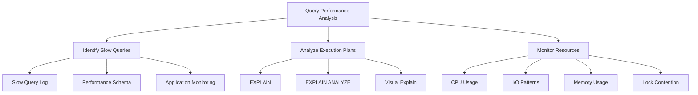

# Query Performance Analysis

> **Module 8 • Lesson 1**  
> Estimated time: 35 min | Difficulty: ★★★☆☆

## 1. Why this matters

Query performance analysis is the cornerstone of database optimization. A single poorly performing query can bring down an entire application, while well-optimized queries can handle millions of rows efficiently. Understanding how to identify, analyze, and fix performance bottlenecks transforms you from someone who writes functional SQL to someone who writes scalable, production-ready database solutions. This skill becomes increasingly critical as data volumes grow and user expectations for fast response times increase.

> **Prerequisites**: This lesson builds on [Physical Execution Behind the Scenes](02-02-physical-execution.md) and [Index Design and Management](08-02-index-design-management.md).

## 2. Key Concepts

- **Performance metrics**: Response time, throughput, resource utilization
- **EXPLAIN plans**: Understanding execution strategies and costs
- **Slow query identification**: Finding the bottlenecks in your system
- **Performance Schema**: MySQL's built-in monitoring framework
- **Query profiling**: Detailed timing analysis of query execution
- **Resource monitoring**: CPU, I/O, memory, and lock contention analysis



## 3. Deep Dive

### 3.1 Performance Metrics and Baselines

**Key Performance Indicators (KPIs)**:

**Response Time**: How long a query takes to complete
```sql
-- Enable query timing
SET profiling = 1;

-- Run your query
SELECT c.name, COUNT(o.id) as order_count
FROM customers c
LEFT JOIN orders o ON c.id = o.customer_id
GROUP BY c.id, c.name
HAVING COUNT(o.id) > 5;

-- Check timing
SHOW PROFILES;
SHOW PROFILE FOR QUERY 1;
```

**Throughput**: Queries processed per second
```sql
-- Check global query statistics
SHOW GLOBAL STATUS LIKE 'Questions';
SHOW GLOBAL STATUS LIKE 'Uptime';
-- QPS = Questions / Uptime
```

**Resource Utilization**: CPU, memory, I/O usage
```sql
-- Check InnoDB status for resource usage
SHOW ENGINE INNODB STATUS\G

-- Key metrics to monitor:
-- - Buffer pool hit ratio
-- - Pages read/written per second
-- - Lock waits and deadlocks
-- - Pending I/O operations
```

### 3.2 EXPLAIN Statement Analysis

**Basic EXPLAIN**:
```sql
EXPLAIN SELECT c.name, o.total
FROM customers c
JOIN orders o ON c.id = o.customer_id
WHERE c.country = 'USA'
AND o.order_date >= '2024-01-01';
```

**Key EXPLAIN columns**:
- **select_type**: SIMPLE, SUBQUERY, DERIVED, UNION
- **table**: Which table is being accessed
- **type**: Access method (const, eq_ref, ref, range, index, ALL)
- **possible_keys**: Available indexes
- **key**: Actually used index
- **rows**: Estimated rows examined
- **Extra**: Additional information (Using where, Using filesort, etc.)

**EXPLAIN ANALYZE (MySQL 8.0+)**:
```sql
EXPLAIN ANALYZE 
SELECT c.name, AVG(o.total) as avg_order
FROM customers c
JOIN orders o ON c.id = o.customer_id
WHERE c.country = 'USA'
GROUP BY c.id, c.name;
```

**EXPLAIN FORMAT=TREE**:
```sql
EXPLAIN FORMAT=TREE
SELECT c.name, COUNT(*) as order_count
FROM customers c
JOIN orders o ON c.id = o.customer_id
WHERE c.created_at >= '2023-01-01'
GROUP BY c.id
ORDER BY order_count DESC
LIMIT 10;
```

### 3.3 Slow Query Log Analysis

**Enable slow query logging**:
```sql
-- Enable slow query log
SET GLOBAL slow_query_log = 'ON';
SET GLOBAL long_query_time = 1;  -- Log queries taking > 1 second
SET GLOBAL log_queries_not_using_indexes = 'ON';

-- Check current settings
SHOW VARIABLES LIKE 'slow_query%';
SHOW VARIABLES LIKE 'long_query_time';
```

**Analyze slow query log**:
```bash
# Use mysqldumpslow to analyze the log
mysqldumpslow -s t -t 10 /var/log/mysql/slow.log

# Parameters:
# -s t: Sort by query time
# -t 10: Show top 10 queries
# -s c: Sort by count
# -s l: Sort by lock time
```

**Sample slow query log entry**:
```
# Time: 2024-01-21T10:30:45.123456Z
# User@Host: app_user[app_user] @ [192.168.1.100]
# Thread_id: 12345  Schema: ecommerce
# Query_time: 5.123456  Lock_time: 0.000123  Rows_sent: 1000  Rows_examined: 500000
SELECT * FROM orders WHERE customer_id IN (SELECT id FROM customers WHERE country = 'USA');
```

### 3.4 Performance Schema Deep Dive

**Enable Performance Schema**:
```sql
-- Check if Performance Schema is enabled
SHOW VARIABLES LIKE 'performance_schema';

-- Key Performance Schema tables
SELECT * FROM performance_schema.events_statements_summary_by_digest
ORDER BY SUM_TIMER_WAIT DESC LIMIT 10;
```

**Query digest analysis**:
```sql
-- Top queries by total execution time
SELECT 
    DIGEST_TEXT,
    COUNT_STAR as exec_count,
    AVG_TIMER_WAIT/1000000000 as avg_time_sec,
    SUM_TIMER_WAIT/1000000000 as total_time_sec,
    SUM_ROWS_EXAMINED as total_rows_examined,
    SUM_ROWS_SENT as total_rows_sent
FROM performance_schema.events_statements_summary_by_digest
WHERE DIGEST_TEXT IS NOT NULL
ORDER BY SUM_TIMER_WAIT DESC
LIMIT 10;
```

**Wait event analysis**:
```sql
-- Check what queries are waiting for
SELECT 
    EVENT_NAME,
    COUNT_STAR,
    SUM_TIMER_WAIT/1000000000 as total_wait_sec,
    AVG_TIMER_WAIT/1000000000 as avg_wait_sec
FROM performance_schema.events_waits_summary_global_by_event_name
WHERE COUNT_STAR > 0
ORDER BY SUM_TIMER_WAIT DESC
LIMIT 10;
```

### 3.5 Resource Monitoring and Bottleneck Identification

**I/O Analysis**:
```sql
-- File I/O summary
SELECT 
    FILE_NAME,
    EVENT_NAME,
    COUNT_STAR as operations,
    SUM_TIMER_WAIT/1000000000 as total_wait_sec,
    SUM_NUMBER_OF_BYTES as total_bytes
FROM performance_schema.file_summary_by_instance
WHERE COUNT_STAR > 0
ORDER BY SUM_TIMER_WAIT DESC
LIMIT 10;
```

**Lock Analysis**:
```sql
-- Current lock waits
SELECT 
    r.trx_id waiting_trx_id,
    r.trx_mysql_thread_id waiting_thread,
    r.trx_query waiting_query,
    b.trx_id blocking_trx_id,
    b.trx_mysql_thread_id blocking_thread,
    b.trx_query blocking_query
FROM information_schema.innodb_lock_waits w
INNER JOIN information_schema.innodb_trx b ON b.trx_id = w.blocking_trx_id
INNER JOIN information_schema.innodb_trx r ON r.trx_id = w.requesting_trx_id;
```

**Memory Usage**:
```sql
-- Memory usage by event
SELECT 
    EVENT_NAME,
    CURRENT_COUNT_USED,
    CURRENT_SIZE_USED,
    HIGH_COUNT_USED,
    HIGH_SIZE_USED
FROM performance_schema.memory_summary_global_by_event_name
WHERE CURRENT_SIZE_USED > 0
ORDER BY CURRENT_SIZE_USED DESC
LIMIT 10;
```

## 4. Hands-On Practice

Let's create a comprehensive performance analysis scenario:

```sql
-- Create test tables with performance issues
CREATE TABLE customers_perf (
    id INT AUTO_INCREMENT PRIMARY KEY,
    name VARCHAR(100),
    email VARCHAR(100),
    country VARCHAR(50),
    created_at TIMESTAMP DEFAULT CURRENT_TIMESTAMP,
    status ENUM('active', 'inactive', 'suspended') DEFAULT 'active'
);

CREATE TABLE orders_perf (
    id INT AUTO_INCREMENT PRIMARY KEY,
    customer_id INT,
    order_date DATE,
    total DECIMAL(10,2),
    status VARCHAR(20),
    created_at TIMESTAMP DEFAULT CURRENT_TIMESTAMP,
    INDEX idx_customer (customer_id),
    INDEX idx_date (order_date)
);

-- Insert test data (this will be slow - intentionally)
INSERT INTO customers_perf (name, email, country, status)
SELECT 
    CONCAT('Customer ', n),
    CONCAT('customer', n, '@email.com'),
    CASE (n % 5) 
        WHEN 0 THEN 'USA'
        WHEN 1 THEN 'Canada' 
        WHEN 2 THEN 'UK'
        WHEN 3 THEN 'Germany'
        ELSE 'France'
    END,
    CASE (n % 10) WHEN 0 THEN 'inactive' ELSE 'active' END
FROM (
    SELECT a.N + b.N * 10 + c.N * 100 + d.N * 1000 + 1 n
    FROM 
        (SELECT 0 AS N UNION SELECT 1 UNION SELECT 2 UNION SELECT 3 UNION SELECT 4 UNION SELECT 5 UNION SELECT 6 UNION SELECT 7 UNION SELECT 8 UNION SELECT 9) a
    CROSS JOIN (SELECT 0 AS N UNION SELECT 1 UNION SELECT 2 UNION SELECT 3 UNION SELECT 4 UNION SELECT 5 UNION SELECT 6 UNION SELECT 7 UNION SELECT 8 UNION SELECT 9) b
    CROSS JOIN (SELECT 0 AS N UNION SELECT 1 UNION SELECT 2 UNION SELECT 3 UNION SELECT 4 UNION SELECT 5 UNION SELECT 6 UNION SELECT 7 UNION SELECT 8 UNION SELECT 9) c
    CROSS JOIN (SELECT 0 AS N UNION SELECT 1 UNION SELECT 2 UNION SELECT 3 UNION SELECT 4 UNION SELECT 5 UNION SELECT 6 UNION SELECT 7 UNION SELECT 8 UNION SELECT 9) d
) numbers 
WHERE n <= 50000;

-- Insert orders (with some performance challenges)
INSERT INTO orders_perf (customer_id, order_date, total, status)
SELECT 
    FLOOR(RAND() * 50000) + 1,
    DATE_ADD('2023-01-01', INTERVAL FLOOR(RAND() * 365) DAY),
    ROUND(RAND() * 1000 + 10, 2),
    CASE FLOOR(RAND() * 4)
        WHEN 0 THEN 'pending'
        WHEN 1 THEN 'completed'
        WHEN 2 THEN 'shipped'
        ELSE 'cancelled'
    END
FROM (
    SELECT a.N + b.N * 10 + c.N * 100 + d.N * 1000 + e.N * 10000 + 1 n
    FROM 
        (SELECT 0 AS N UNION SELECT 1 UNION SELECT 2 UNION SELECT 3 UNION SELECT 4 UNION SELECT 5 UNION SELECT 6 UNION SELECT 7 UNION SELECT 8 UNION SELECT 9) a
    CROSS JOIN (SELECT 0 AS N UNION SELECT 1 UNION SELECT 2 UNION SELECT 3 UNION SELECT 4 UNION SELECT 5 UNION SELECT 6 UNION SELECT 7 UNION SELECT 8 UNION SELECT 9) b
    CROSS JOIN (SELECT 0 AS N UNION SELECT 1 UNION SELECT 2 UNION SELECT 3 UNION SELECT 4 UNION SELECT 5 UNION SELECT 6 UNION SELECT 7 UNION SELECT 8 UNION SELECT 9) c
    CROSS JOIN (SELECT 0 AS N UNION SELECT 1 UNION SELECT 2 UNION SELECT 3 UNION SELECT 4 UNION SELECT 5 UNION SELECT 6 UNION SELECT 7 UNION SELECT 8 UNION SELECT 9) d
    CROSS JOIN (SELECT 0 AS N UNION SELECT 1 UNION SELECT 2 UNION SELECT 3 UNION SELECT 4) e
) numbers 
WHERE n <= 200000;

-- Now let's analyze some problematic queries

-- Query 1: Missing index on country
SET profiling = 1;
SELECT COUNT(*) FROM customers_perf WHERE country = 'USA' AND status = 'active';
SHOW PROFILES;

-- Analyze the execution plan
EXPLAIN SELECT COUNT(*) FROM customers_perf WHERE country = 'USA' AND status = 'active';

-- Query 2: Inefficient join
SELECT c.name, COUNT(o.id) as order_count, SUM(o.total) as total_spent
FROM customers_perf c
LEFT JOIN orders_perf o ON c.id = o.customer_id
WHERE c.country = 'USA'
GROUP BY c.id, c.name
HAVING COUNT(o.id) > 5
ORDER BY total_spent DESC;

-- Analyze this query
EXPLAIN FORMAT=TREE
SELECT c.name, COUNT(o.id) as order_count, SUM(o.total) as total_spent
FROM customers_perf c
LEFT JOIN orders_perf o ON c.id = o.customer_id
WHERE c.country = 'USA'
GROUP BY c.id, c.name
HAVING COUNT(o.id) > 5
ORDER BY total_spent DESC;

-- Query 3: Subquery that could be optimized
SELECT * FROM customers_perf 
WHERE id IN (
    SELECT customer_id 
    FROM orders_perf 
    WHERE order_date >= '2024-01-01' 
    AND total > 500
);

EXPLAIN 
SELECT * FROM customers_perf 
WHERE id IN (
    SELECT customer_id 
    FROM orders_perf 
    WHERE order_date >= '2024-01-01' 
    AND total > 500
);
```

**Performance Analysis Exercises**:

1. **Identify the bottlenecks** in each query above
2. **Create appropriate indexes** to improve performance
3. **Rewrite the subquery** as a JOIN and compare performance
4. **Use Performance Schema** to identify the slowest queries
5. **Monitor resource usage** during query execution

**Solutions to implement**:
```sql
-- Fix Query 1: Add composite index
CREATE INDEX idx_country_status ON customers_perf(country, status);

-- Fix Query 2: Add index on total for better sorting
CREATE INDEX idx_total ON orders_perf(total);

-- Fix Query 3: Rewrite as JOIN
SELECT DISTINCT c.* 
FROM customers_perf c
INNER JOIN orders_perf o ON c.id = o.customer_id
WHERE o.order_date >= '2024-01-01' 
AND o.total > 500;
```

## 5. Common Pitfalls

### 5.1 Misinterpreting EXPLAIN Output
**Problem**: Focusing only on the `rows` column without considering the full execution plan
```sql
-- This might show fewer rows but be slower due to filesort
EXPLAIN SELECT * FROM orders_perf ORDER BY total DESC LIMIT 10;
-- vs
EXPLAIN SELECT * FROM orders_perf ORDER BY id DESC LIMIT 10;
```

### 5.2 Ignoring Index Selectivity
**Problem**: Creating indexes on low-selectivity columns
```sql
-- Poor index choice (status has only 4 values)
CREATE INDEX idx_status ON orders_perf(status);

-- Better: Composite index with high-selectivity column first
CREATE INDEX idx_date_status ON orders_perf(order_date, status);
```

### 5.3 Not Considering Query Frequency
**Problem**: Optimizing infrequent queries while ignoring frequent ones
```sql
-- Check query frequency from Performance Schema
SELECT 
    DIGEST_TEXT,
    COUNT_STAR,
    AVG_TIMER_WAIT/1000000000 as avg_time_sec,
    (COUNT_STAR * AVG_TIMER_WAIT/1000000000) as total_impact
FROM performance_schema.events_statements_summary_by_digest
ORDER BY total_impact DESC;
```

### 5.4 Over-optimizing for Specific Cases
**Problem**: Creating too many indexes or over-complex queries for edge cases
**Solution**: Focus on the 80/20 rule - optimize the queries that matter most

### 5.5 Not Testing with Production Data Volumes
**Problem**: Queries that work fine with test data fail in production
**Solution**: Always test with realistic data volumes and distributions

## 6. Knowledge Check

<details>
<summary>1. What's the difference between EXPLAIN and EXPLAIN ANALYZE?</summary>

EXPLAIN shows the optimizer's execution plan and estimates, while EXPLAIN ANALYZE actually executes the query and shows real timing and row counts. EXPLAIN ANALYZE is more accurate but has the overhead of actually running the query.
</details>

<details>
<summary>2. Which EXPLAIN access type is generally the fastest?</summary>

`const` is the fastest - it means the optimizer can determine the result using constants, typically when querying by primary key with a literal value.
</details>

<details>
<summary>3. What does "Using filesort" in the Extra column indicate?</summary>

It means MySQL needs to perform an additional sorting pass to order the results, which can be expensive. This often indicates that an appropriate index for the ORDER BY clause is missing.
</details>

<details>
<summary>4. How would you identify the top 5 slowest queries in your database?</summary>

Use the Performance Schema: `SELECT DIGEST_TEXT, SUM_TIMER_WAIT FROM performance_schema.events_statements_summary_by_digest ORDER BY SUM_TIMER_WAIT DESC LIMIT 5;`
</details>

<details>
<summary>5. What's a good buffer pool hit ratio, and why does it matter?</summary>

A good buffer pool hit ratio is above 95%. It represents the percentage of page requests served from memory vs disk. A low ratio indicates frequent disk I/O, which significantly impacts performance.
</details>

## 7. Further Reading

- [MySQL EXPLAIN Documentation](https://dev.mysql.com/doc/refman/8.0/en/explain.html)
- [Performance Schema Documentation](https://dev.mysql.com/doc/refman/8.0/en/performance-schema.html)
- [MySQL Slow Query Log](https://dev.mysql.com/doc/refman/8.0/en/slow-query-log.html)
- [High Performance MySQL](https://www.oreilly.com/library/view/high-performance-mysql/9781492080503/) - Chapters 3-4
- [Percona Toolkit](https://www.percona.com/software/database-tools/percona-toolkit) - pt-query-digest and other analysis tools
- [MySQL Performance Tuning Guide](https://dev.mysql.com/doc/refman/8.0/en/optimization.html)

---

**Navigation**

[← Previous: Replication and High Availability](07-03-replication-high-availability.md) | [Next → Index Design and Management](08-02-index-design-management.md)

_Last updated: 2025-01-21_ 