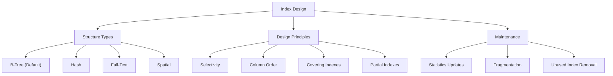

# Index Design and Management

> **Module 8 • Lesson 2**  
> Estimated time: 40 min | Difficulty: ★★★★☆

## 1. Why this matters

Indexes are the most powerful tool for query optimization, but they're also one of the most misunderstood. A well-designed index can turn a query that scans millions of rows into one that examines just a few. Conversely, poorly designed indexes can slow down writes, waste storage space, and even make queries slower. Understanding index design principles, B-tree structures, and maintenance strategies is essential for building scalable database applications that perform well under load.

> **Prerequisites**: This lesson builds on [Query Performance Analysis](08-01-query-performance-analysis.md) and concepts from [Physical Execution Behind the Scenes](02-02-physical-execution.md).

## 2. Key Concepts

- **B-tree structure**: How indexes are physically organized for fast lookups
- **Index selectivity**: The uniqueness of values and its impact on performance
- **Composite indexes**: Multi-column indexes and column order importance
- **Covering indexes**: Including all needed columns to avoid table lookups
- **Index maintenance**: The overhead of keeping indexes up-to-date
- **Partial indexes**: Indexing subsets of data for efficiency



## 3. Deep Dive

### 3.1 B-Tree Index Structure and Behavior

**Understanding B-Tree Organization**:
```sql
-- Create a table to demonstrate index behavior
CREATE TABLE index_demo (
    id INT AUTO_INCREMENT PRIMARY KEY,
    category VARCHAR(50),
    subcategory VARCHAR(50),
    price DECIMAL(10,2),
    created_at TIMESTAMP DEFAULT CURRENT_TIMESTAMP,
    status ENUM('active', 'inactive', 'pending')
);

-- Insert sample data with specific patterns
INSERT INTO index_demo (category, subcategory, price, status)
SELECT 
    CASE (n % 5)
        WHEN 0 THEN 'Electronics'
        WHEN 1 THEN 'Books'
        WHEN 2 THEN 'Clothing'
        WHEN 3 THEN 'Home'
        ELSE 'Sports'
    END,
    CONCAT('Sub', (n % 10) + 1),
    ROUND(RAND() * 1000 + 10, 2),
    CASE (n % 4)
        WHEN 0 THEN 'active'
        WHEN 1 THEN 'inactive'
        ELSE 'pending'
    END
FROM (
    SELECT a.N + b.N * 10 + c.N * 100 + d.N * 1000 + 1 n
    FROM 
        (SELECT 0 AS N UNION SELECT 1 UNION SELECT 2 UNION SELECT 3 UNION SELECT 4 UNION SELECT 5 UNION SELECT 6 UNION SELECT 7 UNION SELECT 8 UNION SELECT 9) a
    CROSS JOIN (SELECT 0 AS N UNION SELECT 1 UNION SELECT 2 UNION SELECT 3 UNION SELECT 4 UNION SELECT 5 UNION SELECT 6 UNION SELECT 7 UNION SELECT 8 UNION SELECT 9) b
    CROSS JOIN (SELECT 0 AS N UNION SELECT 1 UNION SELECT 2 UNION SELECT 3 UNION SELECT 4 UNION SELECT 5 UNION SELECT 6 UNION SELECT 7 UNION SELECT 8 UNION SELECT 9) c
    CROSS JOIN (SELECT 0 AS N UNION SELECT 1 UNION SELECT 2 UNION SELECT 3 UNION SELECT 4 UNION SELECT 5 UNION SELECT 6 UNION SELECT 7 UNION SELECT 8 UNION SELECT 9) d
) numbers 
WHERE n <= 10000;
```

**B-Tree Properties**:
- **Balanced**: All leaf nodes are at the same level
- **Sorted**: Keys are stored in sorted order
- **Range-efficient**: Excellent for range queries (>, <, BETWEEN)
- **Prefix-efficient**: Can use leftmost columns of composite indexes

### 3.2 Index Selectivity and Cardinality

**Measuring Selectivity**:
```sql
-- Check cardinality of different columns
SELECT 
    'category' as column_name,
    COUNT(DISTINCT category) as unique_values,
    COUNT(*) as total_rows,
    COUNT(DISTINCT category) / COUNT(*) as selectivity
FROM index_demo
UNION ALL
SELECT 
    'subcategory',
    COUNT(DISTINCT subcategory),
    COUNT(*),
    COUNT(DISTINCT subcategory) / COUNT(*)
FROM index_demo
UNION ALL
SELECT 
    'status',
    COUNT(DISTINCT status),
    COUNT(*),
    COUNT(DISTINCT status) / COUNT(*)
FROM index_demo;
```

**Selectivity Impact on Performance**:
```sql
-- High selectivity - good for indexing
EXPLAIN SELECT * FROM index_demo WHERE id = 5000;

-- Medium selectivity - okay for indexing
EXPLAIN SELECT * FROM index_demo WHERE subcategory = 'Sub5';

-- Low selectivity - poor index candidate alone
EXPLAIN SELECT * FROM index_demo WHERE status = 'active';

-- Create indexes to demonstrate
CREATE INDEX idx_subcategory ON index_demo(subcategory);
CREATE INDEX idx_status ON index_demo(status);

-- Compare performance after indexing
EXPLAIN SELECT * FROM index_demo WHERE subcategory = 'Sub5';
EXPLAIN SELECT * FROM index_demo WHERE status = 'active';
```

### 3.3 Composite Index Design

**Column Order Principles**:
1. **Equality first**: Columns used in WHERE with = conditions
2. **Range second**: Columns used in range conditions (>, <, BETWEEN)
3. **Selectivity matters**: More selective columns first (when other rules don't apply)

```sql
-- Composite index examples
-- Rule 1: Equality columns first
CREATE INDEX idx_category_price ON index_demo(category, price);

-- This query can use the full index
EXPLAIN SELECT * FROM index_demo 
WHERE category = 'Electronics' AND price BETWEEN 100 AND 500;

-- This query can only use the category part
EXPLAIN SELECT * FROM index_demo WHERE price BETWEEN 100 AND 500;

-- Rule 2: Range columns last
CREATE INDEX idx_category_status_created ON index_demo(category, status, created_at);

-- Optimal usage
EXPLAIN SELECT * FROM index_demo 
WHERE category = 'Books' 
AND status = 'active' 
AND created_at >= '2024-01-01';

-- Suboptimal - can't use created_at part efficiently
EXPLAIN SELECT * FROM index_demo 
WHERE category = 'Books' 
AND created_at >= '2024-01-01';
```

**Index Prefix Usage**:
```sql
-- Create a composite index
CREATE INDEX idx_cat_sub_price ON index_demo(category, subcategory, price);

-- These queries can use the index (left-to-right prefix rule)
EXPLAIN SELECT * FROM index_demo WHERE category = 'Electronics';
EXPLAIN SELECT * FROM index_demo WHERE category = 'Electronics' AND subcategory = 'Sub1';
EXPLAIN SELECT * FROM index_demo WHERE category = 'Electronics' AND subcategory = 'Sub1' AND price > 100;

-- This query CANNOT use the index efficiently (skips category)
EXPLAIN SELECT * FROM index_demo WHERE subcategory = 'Sub1' AND price > 100;
```

### 3.4 Covering Indexes

**Covering Index Benefits**:
```sql
-- Query that requires table lookup
EXPLAIN SELECT category, subcategory, price 
FROM index_demo 
WHERE category = 'Electronics' AND subcategory = 'Sub1';

-- Create covering index
CREATE INDEX idx_covering ON index_demo(category, subcategory, price);

-- Now the query is "covered" - no table lookup needed
EXPLAIN SELECT category, subcategory, price 
FROM index_demo 
WHERE category = 'Electronics' AND subcategory = 'Sub1';

-- Check for "Using index" in Extra column
```

**Include Columns (MySQL 8.0.13+)**:
```sql
-- Alternative syntax for covering indexes
CREATE INDEX idx_cat_sub_include_price ON index_demo(category, subcategory) INCLUDE (price, status);
```

### 3.5 Partial and Functional Indexes

**Partial Indexes with WHERE clause**:
```sql
-- Index only active records (MySQL 8.0.13+)
CREATE INDEX idx_active_category ON index_demo(category) WHERE status = 'active';

-- Functional indexes
CREATE INDEX idx_upper_category ON index_demo((UPPER(category)));

-- Can be used for case-insensitive searches
EXPLAIN SELECT * FROM index_demo WHERE UPPER(category) = 'ELECTRONICS';
```

**Prefix Indexes for Large Columns**:
```sql
-- For VARCHAR columns, you can index just a prefix
ALTER TABLE index_demo ADD COLUMN description TEXT;

-- Index first 20 characters only
CREATE INDEX idx_desc_prefix ON index_demo(description(20));

-- Check prefix selectivity
SELECT 
    COUNT(DISTINCT LEFT(description, 10)) / COUNT(*) as prefix_10,
    COUNT(DISTINCT LEFT(description, 20)) / COUNT(*) as prefix_20,
    COUNT(DISTINCT LEFT(description, 30)) / COUNT(*) as prefix_30
FROM index_demo 
WHERE description IS NOT NULL;
```

### 3.6 Index Maintenance and Monitoring

**Monitoring Index Usage**:
```sql
-- Enable index usage tracking
SELECT * FROM performance_schema.table_io_waits_summary_by_index_usage 
WHERE OBJECT_SCHEMA = 'your_database' 
AND OBJECT_NAME = 'index_demo'
ORDER BY SUM_TIMER_WAIT DESC;

-- Find unused indexes
SELECT 
    OBJECT_SCHEMA,
    OBJECT_NAME,
    INDEX_NAME
FROM performance_schema.table_io_waits_summary_by_index_usage 
WHERE INDEX_NAME IS NOT NULL
AND COUNT_STAR = 0
AND OBJECT_SCHEMA NOT IN ('mysql', 'performance_schema', 'information_schema');
```

**Index Statistics and Maintenance**:
```sql
-- Check index statistics
SHOW INDEX FROM index_demo;

-- Update statistics manually
ANALYZE TABLE index_demo;

-- Check index size
SELECT 
    TABLE_NAME,
    INDEX_NAME,
    STAT_NAME,
    STAT_VALUE,
    STAT_DESCRIPTION
FROM mysql.innodb_index_stats 
WHERE TABLE_NAME = 'index_demo';
```

**Detecting Index Fragmentation**:
```sql
-- Check table and index fragmentation
SELECT 
    TABLE_SCHEMA,
    TABLE_NAME,
    DATA_LENGTH,
    INDEX_LENGTH,
    DATA_FREE,
    (DATA_FREE / (DATA_LENGTH + INDEX_LENGTH)) * 100 as fragmentation_percent
FROM information_schema.TABLES 
WHERE TABLE_NAME = 'index_demo';

-- Rebuild fragmented indexes
OPTIMIZE TABLE index_demo;
```

## 4. Hands-On Practice

**Comprehensive Index Design Exercise**:

```sql
-- Create a realistic e-commerce scenario
CREATE TABLE products (
    id INT AUTO_INCREMENT PRIMARY KEY,
    sku VARCHAR(50) UNIQUE NOT NULL,
    name VARCHAR(200) NOT NULL,
    category_id INT NOT NULL,
    brand_id INT,
    price DECIMAL(10,2) NOT NULL,
    cost DECIMAL(10,2),
    weight DECIMAL(8,2),
    dimensions VARCHAR(50),
    description TEXT,
    tags JSON,
    is_active BOOLEAN DEFAULT TRUE,
    is_featured BOOLEAN DEFAULT FALSE,
    stock_quantity INT DEFAULT 0,
    created_at TIMESTAMP DEFAULT CURRENT_TIMESTAMP,
    updated_at TIMESTAMP DEFAULT CURRENT_TIMESTAMP ON UPDATE CURRENT_TIMESTAMP
);

-- Insert realistic test data
INSERT INTO products (sku, name, category_id, brand_id, price, cost, weight, is_active, is_featured, stock_quantity)
SELECT 
    CONCAT('SKU-', LPAD(n, 8, '0')),
    CONCAT('Product ', n),
    (n % 20) + 1,  -- 20 categories
    (n % 50) + 1,  -- 50 brands
    ROUND(RAND() * 500 + 10, 2),
    ROUND(RAND() * 300 + 5, 2),
    ROUND(RAND() * 10 + 0.1, 2),
    RAND() > 0.1,  -- 90% active
    RAND() > 0.9,  -- 10% featured
    FLOOR(RAND() * 1000)
FROM (
    SELECT a.N + b.N * 10 + c.N * 100 + d.N * 1000 + e.N * 10000 + 1 n
    FROM 
        (SELECT 0 AS N UNION SELECT 1 UNION SELECT 2 UNION SELECT 3 UNION SELECT 4 UNION SELECT 5 UNION SELECT 6 UNION SELECT 7 UNION SELECT 8 UNION SELECT 9) a
    CROSS JOIN (SELECT 0 AS N UNION SELECT 1 UNION SELECT 2 UNION SELECT 3 UNION SELECT 4 UNION SELECT 5 UNION SELECT 6 UNION SELECT 7 UNION SELECT 8 UNION SELECT 9) b
    CROSS JOIN (SELECT 0 AS N UNION SELECT 1 UNION SELECT 2 UNION SELECT 3 UNION SELECT 4 UNION SELECT 5 UNION SELECT 6 UNION SELECT 7 UNION SELECT 8 UNION SELECT 9) c
    CROSS JOIN (SELECT 0 AS N UNION SELECT 1 UNION SELECT 2 UNION SELECT 3 UNION SELECT 4 UNION SELECT 5 UNION SELECT 6 UNION SELECT 7 UNION SELECT 8 UNION SELECT 9) d
    CROSS JOIN (SELECT 0 AS N UNION SELECT 1 UNION SELECT 2 UNION SELECT 3 UNION SELECT 4) e
) numbers 
WHERE n <= 100000;

-- Common query patterns to optimize
-- Pattern 1: Category browsing with filters
SELECT id, name, price, is_featured
FROM products 
WHERE category_id = 5 
AND is_active = TRUE 
AND price BETWEEN 50 AND 200
ORDER BY is_featured DESC, price ASC
LIMIT 20;

-- Pattern 2: Brand + category filtering
SELECT id, name, price
FROM products 
WHERE category_id = 5 
AND brand_id = 10 
AND is_active = TRUE
ORDER BY created_at DESC
LIMIT 10;

-- Pattern 3: Search by name
SELECT id, name, price
FROM products 
WHERE name LIKE '%Widget%' 
AND is_active = TRUE;

-- Pattern 4: Featured products
SELECT id, name, price, category_id
FROM products 
WHERE is_featured = TRUE 
AND is_active = TRUE
ORDER BY created_at DESC;

-- Pattern 5: Low stock alert
SELECT id, name, stock_quantity
FROM products 
WHERE stock_quantity < 10 
AND is_active = TRUE;
```

**Exercise Tasks**:

1. **Analyze current performance** - Run EXPLAIN on each query pattern
2. **Design optimal indexes** for each query pattern
3. **Handle conflicting requirements** - Some indexes might conflict
4. **Measure the impact** - Before/after performance comparison
5. **Monitor index usage** - Identify which indexes are actually used

**Suggested Index Solutions**:
```sql
-- Solution for Pattern 1: Category browsing
CREATE INDEX idx_category_active_price_featured ON products(category_id, is_active, price, is_featured);

-- Solution for Pattern 2: Brand + category
CREATE INDEX idx_category_brand_active_created ON products(category_id, brand_id, is_active, created_at);

-- Solution for Pattern 3: Name search (full-text might be better for real use)
CREATE INDEX idx_name_active ON products(name, is_active);

-- Solution for Pattern 4: Featured products
CREATE INDEX idx_featured_active_created ON products(is_featured, is_active, created_at);

-- Solution for Pattern 5: Stock alerts
CREATE INDEX idx_stock_active ON products(stock_quantity, is_active);

-- Alternative: Covering index for Pattern 1
CREATE INDEX idx_category_covering ON products(category_id, is_active, price, is_featured, id, name);
```

## 5. Common Pitfalls

### 5.1 Wrong Column Order in Composite Indexes
**Problem**: Not following the equality-first, range-last principle
```sql
-- WRONG: Range column first
CREATE INDEX idx_wrong ON products(price, category_id, is_active);

-- RIGHT: Equality columns first
CREATE INDEX idx_right ON products(category_id, is_active, price);
```

### 5.2 Over-Indexing
**Problem**: Creating too many similar indexes
```sql
-- Redundant indexes
CREATE INDEX idx_category ON products(category_id);
CREATE INDEX idx_category_active ON products(category_id, is_active);
-- The first index is redundant!
```

### 5.3 Ignoring Index Maintenance
**Problem**: Never updating statistics or removing unused indexes
```sql
-- Regular maintenance tasks
ANALYZE TABLE products;  -- Update statistics

-- Remove unused indexes (check usage first!)
DROP INDEX idx_unused ON products;
```

### 5.4 Not Considering Write Performance
**Problem**: Focusing only on read performance
```sql
-- Each index slows down INSERT/UPDATE/DELETE
-- Balance is key - don't index everything

-- Monitor write performance impact
SHOW ENGINE INNODB STATUS\G
-- Look for "queries inside InnoDB" and lock waits
```

### 5.5 Functional Index Misuse
**Problem**: Creating functional indexes for rarely-used functions
```sql
-- Avoid unless frequently used
CREATE INDEX idx_expensive_function ON products((COMPLEX_FUNCTION(name)));

-- Better: Denormalize if the computation is expensive
ALTER TABLE products ADD COLUMN name_upper VARCHAR(200) AS (UPPER(name)) STORED;
CREATE INDEX idx_name_upper ON products(name_upper);
```

## 6. Knowledge Check

<details>
<summary>1. In a composite index on (A, B, C), which queries can use the index efficiently?</summary>

Queries that filter on:
- A only
- A and B
- A, B, and C
- A and C (but only the A part will be used efficiently)

Queries that cannot use the index efficiently:
- B only
- C only  
- B and C only
</details>

<details>
<summary>2. What's the difference between a covering index and a regular index?</summary>

A covering index includes all columns needed for a query, eliminating the need to access the actual table data. This shows as "Using index" in the EXPLAIN Extra column and can significantly improve performance.
</details>

<details>
<summary>3. When should you use a prefix index?</summary>

Use prefix indexes for large VARCHAR or TEXT columns when:
- You only need to search by the beginning of the string
- The full column would make the index too large
- The prefix provides sufficient selectivity
- Storage space is a concern
</details>

<details>
<summary>4. How do you identify unused indexes?</summary>

Query the Performance Schema:
```sql
SELECT OBJECT_SCHEMA, OBJECT_NAME, INDEX_NAME
FROM performance_schema.table_io_waits_summary_by_index_usage 
WHERE INDEX_NAME IS NOT NULL AND COUNT_STAR = 0;
```
</details>

<details>
<summary>5. What's the impact of too many indexes on a table?</summary>

Too many indexes:
- Slow down INSERT, UPDATE, and DELETE operations
- Consume additional storage space
- Require more memory for buffer pool
- Increase maintenance overhead
- Can confuse the optimizer in some cases
</details>

## 7. Further Reading

- [MySQL Index Documentation](https://dev.mysql.com/doc/refman/8.0/en/mysql-indexes.html)
- [InnoDB Index Structure](https://dev.mysql.com/doc/refman/8.0/en/innodb-index-types.html)
- [Index Optimization Guidelines](https://dev.mysql.com/doc/refman/8.0/en/optimization-indexes.html)
- [High Performance MySQL](https://www.oreilly.com/library/view/high-performance-mysql/9781492080503/) - Chapter 5
- [Use the Index, Luke!](https://use-the-index-luke.com/) - Comprehensive index guide
- [Percona Blog on Index Design](https://www.percona.com/blog/)

---

**Navigation**

[← Previous: Query Performance Analysis](08-01-query-performance-analysis.md) | [Next → Server Configuration and Tuning](08-03-server-configuration-tuning.md)

_Last updated: 2025-06-21_ 