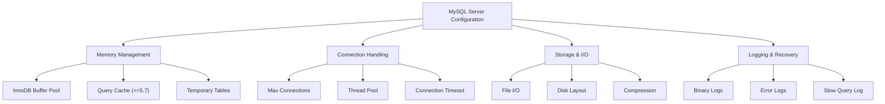

# Server Configuration and Tuning

> **Module 8 • Lesson 3**  
> Estimated time: 45 min | Difficulty: ★★★★☆

## 1. Why this matters

MySQL server configuration is often the difference between a database that struggles under load and one that handles thousands of concurrent connections smoothly. Default configurations are designed to work on minimal hardware, but production systems require careful tuning based on workload patterns, hardware resources, and performance requirements. Understanding key configuration parameters and their interactions helps you optimize MySQL for your specific use case, whether it's high-throughput OLTP, analytical workloads, or mixed environments.

> **Prerequisites**: This lesson builds on [Query Performance Analysis](08-01-query-performance-analysis.md) and [Index Design and Management](08-02-index-design-management.md).

## 2. Key Concepts

- **Memory allocation**: Buffer pool, caches, and temporary space configuration
- **Connection management**: Thread handling and connection limits
- **I/O optimization**: Disk access patterns and async I/O settings
- **Transaction management**: Log file sizing and checkpoint behavior
- **Replication settings**: Binary logging and replica configuration
- **Monitoring and diagnostics**: Performance Schema and status variables



## 3. Deep Dive

### 3.1 Memory Configuration

**InnoDB Buffer Pool - The Most Critical Setting**:
```sql
-- Check current buffer pool size
SHOW VARIABLES LIKE 'innodb_buffer_pool_size';

-- Recommended: 70-80% of total RAM for dedicated MySQL servers
-- Example for 16GB server: 12GB buffer pool
SET GLOBAL innodb_buffer_pool_size = 12884901888;  -- 12GB in bytes

-- Buffer pool instances (MySQL 5.7+)
SHOW VARIABLES LIKE 'innodb_buffer_pool_instances';
-- Recommended: 1 instance per GB, max 64 instances
```

**Monitor Buffer Pool Efficiency**:
```sql
-- Check buffer pool hit ratio (should be >95%)
SELECT 
    (1 - (Innodb_buffer_pool_reads / Innodb_buffer_pool_read_requests)) * 100 
    AS buffer_pool_hit_ratio
FROM (
    SELECT 
        VARIABLE_VALUE AS Innodb_buffer_pool_reads
    FROM performance_schema.global_status 
    WHERE VARIABLE_NAME = 'Innodb_buffer_pool_reads'
) reads
CROSS JOIN (
    SELECT 
        VARIABLE_VALUE AS Innodb_buffer_pool_read_requests
    FROM performance_schema.global_status 
    WHERE VARIABLE_NAME = 'Innodb_buffer_pool_read_requests'
) requests;

-- Detailed buffer pool status
SHOW ENGINE INNODB STATUS\G
```

**Other Memory Settings**:
```sql
-- Query cache (MySQL 5.7 and earlier - deprecated in 8.0)
SHOW VARIABLES LIKE 'query_cache%';
-- Usually better to disable: SET GLOBAL query_cache_size = 0;

-- Temporary table memory limits
SHOW VARIABLES LIKE 'tmp_table_size';
SHOW VARIABLES LIKE 'max_heap_table_size';
-- Set both to same value, typically 64MB-256MB

-- Sort and join buffers (per connection)
SHOW VARIABLES LIKE 'sort_buffer_size';        -- Default 256KB
SHOW VARIABLES LIKE 'join_buffer_size';        -- Default 256KB
SHOW VARIABLES LIKE 'read_buffer_size';        -- Default 128KB
SHOW VARIABLES LIKE 'read_rnd_buffer_size';    -- Default 256KB
```

### 3.2 Connection Management

**Connection Limits and Timeouts**:
```sql
-- Maximum concurrent connections
SHOW VARIABLES LIKE 'max_connections';
-- Typical range: 100-1000 depending on workload

-- Connection timeout settings
SHOW VARIABLES LIKE 'wait_timeout';           -- Default 28800 (8 hours)
SHOW VARIABLES LIKE 'interactive_timeout';    -- Default 28800
-- Consider reducing for web applications: 300-600 seconds

-- Check current connection usage
SHOW STATUS LIKE 'Threads_connected';
SHOW STATUS LIKE 'Max_used_connections';
SHOW STATUS LIKE 'Connection_errors%';
```

**Thread Pool Configuration (MySQL Enterprise/Percona)**:
```sql
-- Enable thread pool
SET GLOBAL thread_handling = 'pool-of-threads';
SHOW VARIABLES LIKE 'thread_pool%';

-- Key thread pool settings
-- thread_pool_size: Number of thread groups (usually = CPU cores)
-- thread_pool_stall_limit: Milliseconds before creating new thread
-- thread_pool_max_threads: Maximum threads per group
```

### 3.3 InnoDB Storage Engine Tuning

**Transaction Log Configuration**:
```sql
-- Redo log settings (critical for write performance)
SHOW VARIABLES LIKE 'innodb_log_file_size';
-- Recommended: 1-2GB for write-heavy workloads
-- Larger = better write performance, slower crash recovery

SHOW VARIABLES LIKE 'innodb_log_files_in_group';
-- Usually 2 (default), rarely needs changing

SHOW VARIABLES LIKE 'innodb_log_buffer_size';
-- Default 16MB, increase for high write workloads to 64-256MB

-- Flush behavior
SHOW VARIABLES LIKE 'innodb_flush_log_at_trx_commit';
-- 1 = Full ACID (default), 2 = Better performance, slight risk
```

**I/O and Disk Configuration**:
```sql
-- I/O capacity settings (based on storage type)
SHOW VARIABLES LIKE 'innodb_io_capacity';
-- HDD: 200, SSD: 2000-20000, NVMe: 10000-50000

SHOW VARIABLES LIKE 'innodb_io_capacity_max';
-- Usually 2x innodb_io_capacity

-- File per table (should be ON for modern systems)
SHOW VARIABLES LIKE 'innodb_file_per_table';

-- Compression settings
SHOW VARIABLES LIKE 'innodb_compression_level';
SHOW VARIABLES LIKE 'innodb_page_size';
-- Default 16KB, consider 8KB for SSD with compression
```

**Concurrency and Locking**:
```sql
-- Deadlock detection (can be disabled for high concurrency)
SHOW VARIABLES LIKE 'innodb_deadlock_detect';

-- Lock wait timeout
SHOW VARIABLES LIKE 'innodb_lock_wait_timeout';
-- Default 50 seconds, consider 5-10 for web applications

-- Adaptive hash index
SHOW VARIABLES LIKE 'innodb_adaptive_hash_index';
-- Usually ON, but can be disabled for write-heavy workloads
```

### 3.4 Replication and Binary Logging

**Binary Log Configuration**:
```sql
-- Binary logging settings
SHOW VARIABLES LIKE 'log_bin';
SHOW VARIABLES LIKE 'binlog_format';
-- ROW = safer, STATEMENT = more compact, MIXED = automatic

SHOW VARIABLES LIKE 'binlog_row_image';
-- FULL = all columns, MINIMAL = only changed columns

-- Binary log retention
SHOW VARIABLES LIKE 'binlog_expire_logs_seconds';
-- MySQL 8.0+, replaces expire_logs_days

-- Sync settings for durability
SHOW VARIABLES LIKE 'sync_binlog';
-- 1 = sync every commit (safest), 0 = OS handles, N = sync every N commits
```

**Replication-Specific Settings**:
```sql
-- Replica settings
SHOW VARIABLES LIKE 'replica_parallel_workers';
-- Enable parallel replication, typically 4-16 workers

SHOW VARIABLES LIKE 'replica_preserve_commit_order';
-- ON to maintain commit order with parallel replication

-- Semi-synchronous replication
SHOW VARIABLES LIKE 'rpl_semi_sync%';
```

### 3.5 Monitoring and Diagnostics Configuration

**Performance Schema Settings**:
```sql
-- Performance Schema memory usage
SHOW VARIABLES LIKE 'performance_schema_max%';

-- Enable specific instruments
UPDATE performance_schema.setup_instruments 
SET ENABLED = 'YES' 
WHERE NAME LIKE 'wait/io/file/%';

-- Enable specific consumers
UPDATE performance_schema.setup_consumers 
SET ENABLED = 'YES' 
WHERE NAME LIKE '%events_statements%';
```

**Logging Configuration**:
```sql
-- Error log settings
SHOW VARIABLES LIKE 'log_error%';
SHOW VARIABLES LIKE 'log_timestamps';

-- Slow query log
SHOW VARIABLES LIKE 'slow_query_log';
SHOW VARIABLES LIKE 'long_query_time';
SHOW VARIABLES LIKE 'log_queries_not_using_indexes';

-- General query log (usually disabled in production)
SHOW VARIABLES LIKE 'general_log';
```

## 4. Hands-On Practice

**Configuration Audit and Optimization Exercise**:

```sql
-- Create a comprehensive configuration audit script
-- 1. Check current memory allocation
SELECT 
    'Buffer Pool Size' as Setting,
    @@innodb_buffer_pool_size / 1024 / 1024 / 1024 as Value_GB,
    'Should be 70-80% of total RAM' as Recommendation
UNION ALL
SELECT 
    'Tmp Table Size',
    @@tmp_table_size / 1024 / 1024 as Value_MB,
    'Should match max_heap_table_size'
UNION ALL
SELECT 
    'Max Connections',
    @@max_connections,
    'Monitor Max_used_connections'
UNION ALL
SELECT 
    'Log File Size',
    @@innodb_log_file_size / 1024 / 1024 as Value_MB,
    'Should be 1-2GB for write-heavy workloads';

-- 2. Check buffer pool efficiency
SELECT 
    'Buffer Pool Hit Ratio %' as Metric,
    ROUND(
        (1 - (
            (SELECT VARIABLE_VALUE FROM performance_schema.global_status WHERE VARIABLE_NAME = 'Innodb_buffer_pool_reads') /
            (SELECT VARIABLE_VALUE FROM performance_schema.global_status WHERE VARIABLE_NAME = 'Innodb_buffer_pool_read_requests')
        )) * 100, 2
    ) as Value,
    'Should be > 95%' as Target;

-- 3. Check connection usage
SELECT 
    'Connection Usage %' as Metric,
    ROUND(
        (SELECT VARIABLE_VALUE FROM performance_schema.global_status WHERE VARIABLE_NAME = 'Threads_connected') /
        @@max_connections * 100, 2
    ) as Value,
    'Should be < 80%' as Target;

-- 4. Check temporary table usage
SELECT 
    'Temp Tables to Disk %' as Metric,
    ROUND(
        (SELECT VARIABLE_VALUE FROM performance_schema.global_status WHERE VARIABLE_NAME = 'Created_tmp_disk_tables') /
        (SELECT VARIABLE_VALUE FROM performance_schema.global_status WHERE VARIABLE_NAME = 'Created_tmp_tables') * 100, 2
    ) as Value,
    'Should be < 25%' as Target;

-- 5. Check InnoDB I/O efficiency
SELECT 
    'InnoDB Data Reads' as Metric,
    VARIABLE_VALUE as Value
FROM performance_schema.global_status 
WHERE VARIABLE_NAME = 'Innodb_data_reads'
UNION ALL
SELECT 
    'InnoDB Data Writes',
    VARIABLE_VALUE
FROM performance_schema.global_status 
WHERE VARIABLE_NAME = 'Innodb_data_writes';
```

**Workload-Specific Configuration Examples**:

```sql
-- Configuration for OLTP workload (many small transactions)
/*
[mysqld]
# Memory settings
innodb_buffer_pool_size = 12G
innodb_buffer_pool_instances = 12
tmp_table_size = 64M
max_heap_table_size = 64M

# Connection settings
max_connections = 500
wait_timeout = 300
interactive_timeout = 300

# InnoDB settings
innodb_log_file_size = 1G
innodb_log_buffer_size = 64M
innodb_flush_log_at_trx_commit = 1
innodb_io_capacity = 2000
innodb_io_capacity_max = 4000

# Replication
binlog_format = ROW
sync_binlog = 1
*/

-- Configuration for Analytics workload (large queries, reporting)
/*
[mysqld]
# Memory settings (more aggressive)
innodb_buffer_pool_size = 20G
innodb_buffer_pool_instances = 16
tmp_table_size = 256M
max_heap_table_size = 256M
sort_buffer_size = 2M
join_buffer_size = 2M

# Connection settings (fewer connections, longer timeouts)
max_connections = 100
wait_timeout = 3600
interactive_timeout = 3600

# InnoDB settings
innodb_log_file_size = 2G
innodb_log_buffer_size = 128M
innodb_flush_log_at_trx_commit = 2  # Slightly relaxed for performance
innodb_io_capacity = 10000
innodb_io_capacity_max = 20000

# Query cache disabled (MySQL 5.7)
query_cache_size = 0
query_cache_type = 0
*/
```

**Performance Testing Script**:
```sql
-- Create test workload to validate configuration changes
DELIMITER $$
CREATE PROCEDURE test_workload(IN iterations INT)
BEGIN
    DECLARE i INT DEFAULT 0;
    DECLARE start_time TIMESTAMP DEFAULT CURRENT_TIMESTAMP;
    
    -- Simulate mixed workload
    WHILE i < iterations DO
        -- Read operations
        SELECT COUNT(*) INTO @dummy FROM products WHERE category_id = (i % 20) + 1;
        
        -- Write operations
        INSERT INTO test_log (message, created_at) 
        VALUES (CONCAT('Test message ', i), NOW());
        
        -- Update operations
        UPDATE products SET updated_at = NOW() WHERE id = (i % 1000) + 1;
        
        SET i = i + 1;
    END WHILE;
    
    SELECT 
        CONCAT('Completed ', iterations, ' iterations in ', 
               TIMESTAMPDIFF(SECOND, start_time, CURRENT_TIMESTAMP), ' seconds') as Result;
END$$
DELIMITER ;

-- Create test log table
CREATE TABLE test_log (
    id INT AUTO_INCREMENT PRIMARY KEY,
    message VARCHAR(255),
    created_at TIMESTAMP DEFAULT CURRENT_TIMESTAMP
);

-- Run performance test
CALL test_workload(1000);
```

## 5. Common Pitfalls

### 5.1 Over-Allocating Memory
**Problem**: Setting buffer pool too large, causing OS swapping
```sql
-- Check for swapping
-- On Linux: cat /proc/swaps
-- Leave 2-4GB for OS and other processes

-- Wrong: Using 100% of RAM
-- innodb_buffer_pool_size = 32G  -- on 32GB server

-- Right: Leave room for OS
-- innodb_buffer_pool_size = 28G  -- on 32GB server
```

### 5.2 Ignoring Workload Patterns
**Problem**: Using same configuration for all workloads
```sql
-- OLTP needs: Fast commits, many connections, smaller buffers
-- Analytics needs: Large buffers, fewer connections, relaxed durability

-- Check your workload pattern
SELECT 
    ROUND(AVG(TIMER_WAIT/1000000000), 3) as avg_query_time_sec,
    COUNT(*) as query_count
FROM performance_schema.events_statements_history_long
WHERE EVENT_NAME = 'statement/sql/select';
```

### 5.3 Not Monitoring Configuration Changes
**Problem**: Making changes without measuring impact
```sql
-- Always baseline before changes
CREATE TABLE config_baseline AS
SELECT VARIABLE_NAME, VARIABLE_VALUE, NOW() as measured_at
FROM performance_schema.global_status
WHERE VARIABLE_NAME IN (
    'Innodb_buffer_pool_read_requests',
    'Innodb_buffer_pool_reads',
    'Threads_connected',
    'Created_tmp_disk_tables',
    'Created_tmp_tables'
);
```

### 5.4 Copying Configurations Blindly
**Problem**: Using configurations from different environments
```sql
-- Always validate settings for your hardware
-- Check available memory
SELECT 
    @@innodb_buffer_pool_size / 1024 / 1024 / 1024 as buffer_pool_gb,
    'Check against available RAM' as note;

-- Check CPU cores for thread settings
SHOW VARIABLES LIKE 'innodb_read_io_threads';
SHOW VARIABLES LIKE 'innodb_write_io_threads';
```

### 5.5 Not Planning for Growth
**Problem**: Optimizing only for current load
```sql
-- Monitor growth trends
SELECT 
    DATE(created_at) as date,
    COUNT(*) as daily_records
FROM your_main_table
WHERE created_at >= DATE_SUB(NOW(), INTERVAL 30 DAY)
GROUP BY DATE(created_at)
ORDER BY date;

-- Plan capacity accordingly
```

## 6. Knowledge Check

<details>
<summary>1. What percentage of total RAM should typically be allocated to InnoDB buffer pool?</summary>

For dedicated MySQL servers, 70-80% of total RAM. For shared servers, 50-60%. Always leave 2-4GB for the operating system and other processes to avoid swapping.
</details>

<details>
<summary>2. What's the difference between innodb_flush_log_at_trx_commit values 1, 2, and 0?</summary>

- 1 (default): Full ACID compliance - log is written and flushed to disk on each commit
- 2: Log is written on each commit but flushed to disk only once per second (faster, small risk)
- 0: Log is written and flushed only once per second (fastest, higher risk)
</details>

<details>
<summary>3. How do you determine the appropriate innodb_io_capacity setting?</summary>

Based on storage type:
- Traditional HDD: 200
- SSD: 2000-20000
- NVMe SSD: 10000-50000
Test with your specific hardware using tools like `fio` or `sysbench`.
</details>

<details>
<summary>4. What's a good buffer pool hit ratio and how do you calculate it?</summary>

A good buffer pool hit ratio is above 95%. Calculate as:
`(1 - (Innodb_buffer_pool_reads / Innodb_buffer_pool_read_requests)) * 100`
</details>

<details>
<summary>5. When should you disable the query cache in MySQL 5.7?</summary>

Disable query cache when:
- You have high write activity (cache invalidation overhead)
- Queries are mostly unique (low cache hit rate)
- Using MySQL 8.0+ (query cache is removed)
- Performance testing shows it's not beneficial
</details>

## 7. Further Reading

- [MySQL Server System Variables](https://dev.mysql.com/doc/refman/8.0/en/server-system-variables.html)
- [InnoDB Configuration](https://dev.mysql.com/doc/refman/8.0/en/innodb-configuration.html)
- [MySQL Performance Tuning](https://dev.mysql.com/doc/refman/8.0/en/optimization.html)
- [High Performance MySQL](https://www.oreilly.com/library/view/high-performance-mysql/9781492080503/) - Chapters 6-8
- [Percona MySQL Configuration Wizard](https://tools.percona.com/wizard)
- [MySQL Configuration Best Practices](https://www.percona.com/blog/2016/10/12/mysql-5-7-performance-tuning-immediately-after-installation/)

---

**Navigation**

[← Previous: Index Design and Management](08-02-index-design-management.md) | [Next → Development Phase Issues](09-01-development-phase-issues.md)

_Last updated: 2025-01-21_ 