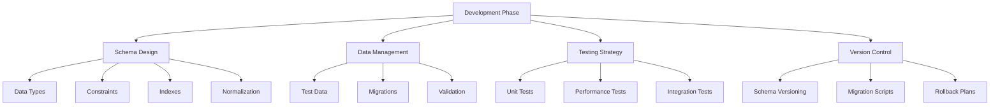

# Development Phase Issues

> **Module 9 • Lesson 1**  
> Estimated time: 35 min | Difficulty: ★★★☆☆

## 1. Why this matters

Development phase issues are the foundation of most production problems. Poor schema design, inadequate testing, and lack of proper development workflows create technical debt that becomes exponentially more expensive to fix as applications scale. Understanding common development pitfalls and implementing robust practices early prevents performance bottlenecks, data integrity issues, and maintenance nightmares. The decisions you make during development determine whether your database will gracefully handle growth or become a bottleneck that limits your entire application.

> **Prerequisites**: This lesson builds on concepts from [Schema Design Patterns](05-01-schema-design-patterns.md) and [Query Design Patterns](05-02-query-design-patterns.md).

## 2. Key Concepts

- **Schema evolution**: Managing database changes over time
- **Data type selection**: Choosing optimal types for performance and storage
- **Constraint design**: Balancing data integrity with performance
- **Test data management**: Creating realistic test scenarios
- **Version control**: Tracking database schema changes
- **Migration strategies**: Safe deployment of database changes



## 3. Deep Dive

### 3.1 Schema Evolution and Migration Strategies

**Version-Controlled Schema Changes**:
```sql
-- Create a migrations tracking table
CREATE TABLE schema_migrations (
    version VARCHAR(50) PRIMARY KEY,
    description TEXT,
    applied_at TIMESTAMP DEFAULT CURRENT_TIMESTAMP,
    applied_by VARCHAR(100),
    checksum VARCHAR(64)
);

-- Example migration structure
-- migrations/001_create_users_table.sql
CREATE TABLE users (
    id INT AUTO_INCREMENT PRIMARY KEY,
    email VARCHAR(255) UNIQUE NOT NULL,
    username VARCHAR(50) UNIQUE NOT NULL,
    password_hash VARCHAR(255) NOT NULL,
    created_at TIMESTAMP DEFAULT CURRENT_TIMESTAMP,
    updated_at TIMESTAMP DEFAULT CURRENT_TIMESTAMP ON UPDATE CURRENT_TIMESTAMP
);

INSERT INTO schema_migrations (version, description, applied_by) 
VALUES ('001', 'Create users table', USER());

-- migrations/002_add_user_profile_fields.sql
ALTER TABLE users 
ADD COLUMN first_name VARCHAR(100),
ADD COLUMN last_name VARCHAR(100),
ADD COLUMN date_of_birth DATE,
ADD COLUMN phone VARCHAR(20);

INSERT INTO schema_migrations (version, description, applied_by) 
VALUES ('002', 'Add user profile fields', USER());
```

**Safe Migration Patterns**:
```sql
-- Pattern 1: Additive changes (safest)
-- Add new columns with default values
ALTER TABLE products 
ADD COLUMN category_slug VARCHAR(100) DEFAULT 'uncategorized';

-- Pattern 2: Three-phase approach for breaking changes
-- Phase 1: Add new column
ALTER TABLE orders ADD COLUMN status_new ENUM('pending', 'processing', 'shipped', 'delivered', 'cancelled');

-- Phase 2: Populate new column (can be done gradually)
UPDATE orders SET status_new = 
    CASE 
        WHEN status = 'new' THEN 'pending'
        WHEN status = 'in_progress' THEN 'processing'
        ELSE status
    END;

-- Phase 3: Drop old column (after code deployment)
-- ALTER TABLE orders DROP COLUMN status;
-- ALTER TABLE orders CHANGE status_new status ENUM('pending', 'processing', 'shipped', 'delivered', 'cancelled');
```

**Rollback Strategies**:
```sql
-- Always plan rollbacks
-- migrations/002_add_user_profile_fields_rollback.sql
ALTER TABLE users 
DROP COLUMN first_name,
DROP COLUMN last_name,
DROP COLUMN date_of_birth,
DROP COLUMN phone;

DELETE FROM schema_migrations WHERE version = '002';
```

### 3.2 Data Type Selection and Validation

**Optimal Data Type Choices**:
```sql
-- Common data type mistakes and fixes

-- MISTAKE: Using VARCHAR when fixed length is better
CREATE TABLE countries (
    id INT AUTO_INCREMENT PRIMARY KEY,
    code VARCHAR(2),  -- Should be CHAR(2)
    name VARCHAR(100)
);

-- BETTER: Use appropriate fixed-length types
CREATE TABLE countries_fixed (
    id INT AUTO_INCREMENT PRIMARY KEY,
    code CHAR(2) NOT NULL,        -- ISO country codes are always 2 chars
    name VARCHAR(100) NOT NULL
);

-- MISTAKE: Using TEXT for short strings
CREATE TABLE products_bad (
    id INT AUTO_INCREMENT PRIMARY KEY,
    name TEXT,                    -- Overkill for product names
    description TEXT
);

-- BETTER: Use VARCHAR with appropriate length
CREATE TABLE products_good (
    id INT AUTO_INCREMENT PRIMARY KEY,
    name VARCHAR(200) NOT NULL,   -- Reasonable limit for product names
    description TEXT              -- Appropriate for long descriptions
);

-- MISTAKE: Using DECIMAL for non-monetary values
CREATE TABLE measurements_bad (
    id INT AUTO_INCREMENT PRIMARY KEY,
    temperature DECIMAL(5,2),     -- Unnecessary precision overhead
    humidity DECIMAL(5,2)
);

-- BETTER: Use FLOAT/DOUBLE for scientific measurements
CREATE TABLE measurements_good (
    id INT AUTO_INCREMENT PRIMARY KEY,
    temperature FLOAT,            -- Sufficient precision, better performance
    humidity FLOAT
);

-- MISTAKE: Using DATETIME when TIMESTAMP is better
CREATE TABLE events_bad (
    id INT AUTO_INCREMENT PRIMARY KEY,
    event_time DATETIME,          -- No timezone awareness
    created_at DATETIME
);

-- BETTER: Use TIMESTAMP for time-sensitive data
CREATE TABLE events_good (
    id INT AUTO_INCREMENT PRIMARY KEY,
    event_time TIMESTAMP NOT NULL,
    created_at TIMESTAMP DEFAULT CURRENT_TIMESTAMP
);
```

**Data Validation at Schema Level**:
```sql
-- Implement validation through constraints
CREATE TABLE users_validated (
    id INT AUTO_INCREMENT PRIMARY KEY,
    email VARCHAR(255) NOT NULL,
    age INT,
    salary DECIMAL(10,2),
    status ENUM('active', 'inactive', 'suspended') DEFAULT 'active',
    
    -- Validation constraints
    CONSTRAINT chk_email_format CHECK (email REGEXP '^[A-Za-z0-9._%+-]+@[A-Za-z0-9.-]+\.[A-Za-z]{2,}$'),
    CONSTRAINT chk_age_range CHECK (age >= 0 AND age <= 150),
    CONSTRAINT chk_salary_positive CHECK (salary >= 0),
    
    -- Indexes for performance
    UNIQUE KEY idx_email (email),
    INDEX idx_status (status)
);

-- JSON validation (MySQL 8.0+)
CREATE TABLE user_preferences (
    id INT AUTO_INCREMENT PRIMARY KEY,
    user_id INT NOT NULL,
    preferences JSON,
    
    -- JSON schema validation
    CONSTRAINT chk_preferences_schema CHECK (
        JSON_VALID(preferences) AND
        JSON_CONTAINS_PATH(preferences, 'one', '$.theme', '$.language')
    ),
    
    FOREIGN KEY (user_id) REFERENCES users_validated(id)
);
```

### 3.3 Test Data Management

**Realistic Test Data Generation**:
```sql
-- Create comprehensive test data that mirrors production patterns
DELIMITER $$
CREATE PROCEDURE generate_test_data()
BEGIN
    DECLARE i INT DEFAULT 1;
    DECLARE max_users INT DEFAULT 10000;
    DECLARE max_orders INT DEFAULT 50000;
    
    -- Generate users with realistic distribution
    WHILE i <= max_users DO
        INSERT INTO users_validated (email, age, salary, status)
        VALUES (
            CONCAT('user', i, '@example.com'),
            FLOOR(18 + RAND() * 62),  -- Age 18-80
            ROUND(30000 + RAND() * 120000, 2),  -- Salary $30k-$150k
            CASE 
                WHEN RAND() < 0.85 THEN 'active'
                WHEN RAND() < 0.95 THEN 'inactive'
                ELSE 'suspended'
            END
        );
        SET i = i + 1;
    END WHILE;
    
    -- Generate orders with realistic patterns
    SET i = 1;
    WHILE i <= max_orders DO
        INSERT INTO orders (user_id, amount, order_date, status)
        VALUES (
            FLOOR(1 + RAND() * max_users),
            ROUND(10 + RAND() * 500, 2),
            DATE_SUB(NOW(), INTERVAL FLOOR(RAND() * 365) DAY),
            CASE 
                WHEN RAND() < 0.7 THEN 'completed'
                WHEN RAND() < 0.85 THEN 'shipped'
                WHEN RAND() < 0.95 THEN 'pending'
                ELSE 'cancelled'
            END
        );
        SET i = i + 1;
    END WHILE;
END$$
DELIMITER ;

-- Data anonymization for testing
CREATE TABLE users_anonymized AS
SELECT 
    id,
    CONCAT('user', id, '@test.com') as email,
    CASE 
        WHEN age BETWEEN 18 AND 25 THEN '18-25'
        WHEN age BETWEEN 26 AND 35 THEN '26-35'
        WHEN age BETWEEN 36 AND 50 THEN '36-50'
        ELSE '50+'
    END as age_group,
    CASE 
        WHEN salary < 50000 THEN 'low'
        WHEN salary < 100000 THEN 'medium'
        ELSE 'high'
    END as salary_range,
    status
FROM users_validated;
```

**Test Data Fixtures and Factories**:
```sql
-- Create reusable test fixtures
CREATE TABLE test_fixtures (
    fixture_name VARCHAR(50) PRIMARY KEY,
    table_name VARCHAR(50),
    data JSON,
    created_at TIMESTAMP DEFAULT CURRENT_TIMESTAMP
);

-- Insert common test scenarios
INSERT INTO test_fixtures (fixture_name, table_name, data) VALUES
('new_user', 'users', JSON_OBJECT(
    'email', 'newuser@test.com',
    'age', 25,
    'salary', 50000,
    'status', 'active'
)),
('premium_user', 'users', JSON_OBJECT(
    'email', 'premium@test.com',
    'age', 35,
    'salary', 120000,
    'status', 'active'
)),
('large_order', 'orders', JSON_OBJECT(
    'user_id', 1,
    'amount', 1500.00,
    'status', 'pending'
));

-- Procedure to load fixtures
DELIMITER $$
CREATE PROCEDURE load_fixture(IN fixture_name VARCHAR(50))
BEGIN
    DECLARE table_name VARCHAR(50);
    DECLARE fixture_data JSON;
    
    SELECT t.table_name, t.data INTO table_name, fixture_data
    FROM test_fixtures t
    WHERE t.fixture_name = fixture_name;
    
    -- Dynamic SQL to insert fixture data
    -- (Implementation would depend on your testing framework)
    SELECT CONCAT('Loaded fixture: ', fixture_name, ' into ', table_name) as result;
END$$
DELIMITER ;
```

### 3.4 Performance Testing in Development

**Benchmark Critical Queries**:
```sql
-- Create performance benchmarking framework
CREATE TABLE query_benchmarks (
    id INT AUTO_INCREMENT PRIMARY KEY,
    query_name VARCHAR(100),
    query_sql TEXT,
    execution_time_ms DECIMAL(10,3),
    rows_examined INT,
    rows_returned INT,
    test_date TIMESTAMP DEFAULT CURRENT_TIMESTAMP,
    environment VARCHAR(50)
);

-- Benchmark procedure
DELIMITER $$
CREATE PROCEDURE benchmark_query(
    IN query_name VARCHAR(100),
    IN query_sql TEXT,
    IN environment VARCHAR(50)
)
BEGIN
    DECLARE start_time BIGINT;
    DECLARE end_time BIGINT;
    DECLARE execution_time DECIMAL(10,3);
    
    -- Enable profiling
    SET profiling = 1;
    
    -- Record start time
    SET start_time = UNIX_TIMESTAMP(NOW(6)) * 1000000;
    
    -- Execute the query (would need dynamic SQL in real implementation)
    -- This is a simplified example
    SET @sql = query_sql;
    PREPARE stmt FROM @sql;
    EXECUTE stmt;
    DEALLOCATE PREPARE stmt;
    
    -- Record end time
    SET end_time = UNIX_TIMESTAMP(NOW(6)) * 1000000;
    SET execution_time = (end_time - start_time) / 1000;
    
    -- Store benchmark result
    INSERT INTO query_benchmarks (query_name, query_sql, execution_time_ms, environment)
    VALUES (query_name, query_sql, execution_time, environment);
    
    SET profiling = 0;
END$$
DELIMITER ;

-- Performance regression detection
CREATE VIEW performance_regressions AS
SELECT 
    query_name,
    environment,
    AVG(execution_time_ms) as avg_time_ms,
    COUNT(*) as test_count,
    MAX(test_date) as last_test
FROM query_benchmarks
WHERE test_date >= DATE_SUB(NOW(), INTERVAL 7 DAY)
GROUP BY query_name, environment
HAVING avg_time_ms > (
    SELECT AVG(execution_time_ms) * 1.2  -- 20% regression threshold
    FROM query_benchmarks b2
    WHERE b2.query_name = query_benchmarks.query_name
    AND b2.environment = query_benchmarks.environment
    AND b2.test_date BETWEEN DATE_SUB(NOW(), INTERVAL 14 DAY) AND DATE_SUB(NOW(), INTERVAL 7 DAY)
);
```

### 3.5 Development Environment Setup

**Database Configuration for Development**:
```sql
-- Development-specific settings
-- my.cnf for development environment
/*
[mysqld]
# Relaxed settings for development
innodb_flush_log_at_trx_commit = 2
sync_binlog = 0
innodb_buffer_pool_size = 1G

# Enhanced logging for debugging
general_log = ON
general_log_file = /var/log/mysql/general.log
slow_query_log = ON
long_query_time = 0.5
log_queries_not_using_indexes = ON

# Strict mode for catching issues early
sql_mode = STRICT_TRANS_TABLES,ERROR_FOR_DIVISION_BY_ZERO,NO_AUTO_CREATE_USER,NO_ENGINE_SUBSTITUTION

# Enable Performance Schema for analysis
performance_schema = ON
*/

-- Development database initialization script
DELIMITER $$
CREATE PROCEDURE setup_development_environment()
BEGIN
    -- Create development-specific tables
    CREATE TABLE IF NOT EXISTS dev_query_log (
        id INT AUTO_INCREMENT PRIMARY KEY,
        query_text TEXT,
        execution_time DECIMAL(10,3),
        user VARCHAR(50),
        timestamp TIMESTAMP DEFAULT CURRENT_TIMESTAMP
    );
    
    -- Create test user accounts
    CREATE USER IF NOT EXISTS 'dev_user'@'localhost' IDENTIFIED BY 'dev_password';
    GRANT SELECT, INSERT, UPDATE, DELETE ON *.* TO 'dev_user'@'localhost';
    
    CREATE USER IF NOT EXISTS 'test_user'@'localhost' IDENTIFIED BY 'test_password';
    GRANT ALL PRIVILEGES ON test_%.* TO 'test_user'@'localhost';
    
    -- Set up development-friendly settings
    SET GLOBAL log_bin_trust_function_creators = 1;
    SET GLOBAL event_scheduler = ON;
    
    SELECT 'Development environment setup complete' as status;
END$$
DELIMITER ;
```

## 4. Hands-On Practice

**Complete Development Workflow Exercise**:

```sql
-- 1. Create a realistic project structure
CREATE DATABASE ecommerce_dev;
USE ecommerce_dev;

-- 2. Implement proper schema versioning
CREATE TABLE schema_migrations (
    version VARCHAR(50) PRIMARY KEY,
    description TEXT,
    applied_at TIMESTAMP DEFAULT CURRENT_TIMESTAMP,
    applied_by VARCHAR(100),
    checksum VARCHAR(64)
);

-- 3. Create initial schema with proper data types
CREATE TABLE customers (
    id INT AUTO_INCREMENT PRIMARY KEY,
    email VARCHAR(255) NOT NULL,
    first_name VARCHAR(100) NOT NULL,
    last_name VARCHAR(100) NOT NULL,
    phone CHAR(10),  -- Assuming US phone format
    date_of_birth DATE,
    created_at TIMESTAMP DEFAULT CURRENT_TIMESTAMP,
    updated_at TIMESTAMP DEFAULT CURRENT_TIMESTAMP ON UPDATE CURRENT_TIMESTAMP,
    
    -- Constraints
    CONSTRAINT chk_email_format CHECK (email REGEXP '^[A-Za-z0-9._%+-]+@[A-Za-z0-9.-]+\.[A-Za-z]{2,}$'),
    CONSTRAINT chk_phone_format CHECK (phone REGEXP '^[0-9]{10}$'),
    CONSTRAINT chk_birth_date CHECK (date_of_birth <= CURDATE()),
    
    -- Indexes
    UNIQUE KEY idx_email (email),
    INDEX idx_name (last_name, first_name),
    INDEX idx_created (created_at)
);

CREATE TABLE products (
    id INT AUTO_INCREMENT PRIMARY KEY,
    sku VARCHAR(50) NOT NULL,
    name VARCHAR(200) NOT NULL,
    description TEXT,
    price DECIMAL(10,2) NOT NULL,
    cost DECIMAL(10,2),
    weight DECIMAL(8,2),
    category_id INT NOT NULL,
    is_active BOOLEAN DEFAULT TRUE,
    created_at TIMESTAMP DEFAULT CURRENT_TIMESTAMP,
    updated_at TIMESTAMP DEFAULT CURRENT_TIMESTAMP ON UPDATE CURRENT_TIMESTAMP,
    
    -- Constraints
    CONSTRAINT chk_price_positive CHECK (price > 0),
    CONSTRAINT chk_cost_positive CHECK (cost >= 0),
    CONSTRAINT chk_weight_positive CHECK (weight > 0),
    
    -- Indexes
    UNIQUE KEY idx_sku (sku),
    INDEX idx_category_active (category_id, is_active),
    INDEX idx_price (price),
    FULLTEXT INDEX idx_name_desc (name, description)
);

-- 4. Create test data with realistic patterns
INSERT INTO customers (email, first_name, last_name, phone, date_of_birth)
VALUES 
    ('john.doe@email.com', 'John', 'Doe', '5551234567', '1985-03-15'),
    ('jane.smith@email.com', 'Jane', 'Smith', '5559876543', '1990-07-22'),
    ('bob.johnson@email.com', 'Bob', 'Johnson', '5555555555', '1978-11-30');

INSERT INTO products (sku, name, description, price, cost, weight, category_id)
VALUES 
    ('LAPTOP-001', 'Gaming Laptop', 'High-performance gaming laptop', 1299.99, 899.99, 2.5, 1),
    ('MOUSE-001', 'Wireless Mouse', 'Ergonomic wireless mouse', 29.99, 15.99, 0.2, 1),
    ('BOOK-001', 'SQL Guide', 'Complete guide to SQL', 49.99, 25.99, 0.8, 2);

-- 5. Create performance benchmarks
DELIMITER $$
CREATE PROCEDURE run_development_tests()
BEGIN
    DECLARE test_start TIMESTAMP DEFAULT CURRENT_TIMESTAMP;
    DECLARE test_count INT DEFAULT 0;
    
    -- Test 1: Customer lookup by email
    SELECT COUNT(*) INTO @result FROM customers WHERE email = 'john.doe@email.com';
    SET test_count = test_count + 1;
    
    -- Test 2: Product search
    SELECT COUNT(*) INTO @result FROM products WHERE name LIKE '%laptop%';
    SET test_count = test_count + 1;
    
    -- Test 3: Category filtering
    SELECT COUNT(*) INTO @result FROM products WHERE category_id = 1 AND is_active = TRUE;
    SET test_count = test_count + 1;
    
    SELECT 
        test_count as tests_executed,
        TIMESTAMPDIFF(MICROSECOND, test_start, CURRENT_TIMESTAMP) / 1000 as total_time_ms;
END$$
DELIMITER ;

-- 6. Set up development monitoring
CREATE EVENT IF NOT EXISTS daily_dev_cleanup
ON SCHEDULE EVERY 1 DAY
STARTS CURRENT_TIMESTAMP
DO
    DELETE FROM dev_query_log WHERE timestamp < DATE_SUB(NOW(), INTERVAL 7 DAY);
```

**Exercise Tasks**:
1. **Schema Evolution**: Add a new column to the customers table using proper migration
2. **Data Validation**: Add constraints to prevent invalid data
3. **Performance Testing**: Benchmark queries before and after adding indexes
4. **Test Data**: Create realistic test scenarios for edge cases
5. **Version Control**: Track all changes with proper migration scripts

## 5. Common Pitfalls

### 5.1 Inadequate Data Type Planning
**Problem**: Choosing data types without considering future growth
```sql
-- WRONG: Too restrictive
CREATE TABLE orders (
    id INT AUTO_INCREMENT PRIMARY KEY,  -- Will run out at 2 billion
    total DECIMAL(8,2)                  -- Max $999,999.99
);

-- BETTER: Plan for scale
CREATE TABLE orders (
    id BIGINT AUTO_INCREMENT PRIMARY KEY,
    total DECIMAL(12,2)  -- Up to $9.99 billion
);
```

### 5.2 Missing Migration Rollback Plans
**Problem**: Not planning for failed deployments
```sql
-- Always create rollback scripts
-- migration_up.sql
ALTER TABLE users ADD COLUMN middle_name VARCHAR(100);

-- migration_down.sql
ALTER TABLE users DROP COLUMN middle_name;
```

### 5.3 Unrealistic Test Data
**Problem**: Testing with clean, uniform data
```sql
-- WRONG: Perfect test data
INSERT INTO users (email, age) VALUES ('test@test.com', 25);

-- BETTER: Realistic edge cases
INSERT INTO users (email, age, notes) VALUES 
    ('user+tag@domain.co.uk', 17, 'Under 18'),
    ('very.long.email.address@subdomain.example.com', 150, 'Edge case age'),
    ('unicode@例え.テスト', 30, 'Unicode domain'),
    ('normal@email.com', NULL, 'Missing age data');
```

### 5.4 Ignoring Performance from Day One
**Problem**: "We'll optimize later" mentality
```sql
-- Start with proper indexes from the beginning
CREATE TABLE user_activities (
    id BIGINT AUTO_INCREMENT PRIMARY KEY,
    user_id INT NOT NULL,
    activity_type VARCHAR(50) NOT NULL,
    created_at TIMESTAMP DEFAULT CURRENT_TIMESTAMP,
    
    -- Index for common queries from day one
    INDEX idx_user_activity (user_id, activity_type),
    INDEX idx_created (created_at)
);
```

### 5.5 Insufficient Environment Parity
**Problem**: Development environment too different from production
```sql
-- Ensure development mirrors production constraints
-- Use same MySQL version, same storage engine, similar data volumes
-- Test with production-like data sizes
```

## 6. Knowledge Check

<details>
<summary>1. What's the safest approach for renaming a column in production?</summary>

Use a three-phase approach:
1. Add the new column
2. Update application code to write to both columns
3. Migrate data, then drop the old column
This ensures zero downtime and easy rollback.
</details>

<details>
<summary>2. Why should you avoid using TEXT columns for short strings?</summary>

TEXT columns:
- Cannot have default values
- Are stored off-page in InnoDB
- Cannot be fully indexed
- Have performance overhead for short strings
Use VARCHAR with appropriate length instead.
</details>

<details>
<summary>3. What's the difference between CHAR and VARCHAR?</summary>

CHAR is fixed-length (padded with spaces), VARCHAR is variable-length. Use CHAR for fixed-length data like country codes, phone numbers, or status flags. Use VARCHAR for variable-length data like names or descriptions.
</details>

<details>
<summary>4. How do you ensure test data represents production scenarios?</summary>

- Include edge cases (nulls, empty strings, boundary values)
- Use realistic data distributions
- Include unicode and special characters
- Test with similar data volumes
- Include invalid data to test constraints
</details>

<details>
<summary>5. What should be included in every database migration?</summary>

Every migration should include:
- Version number and description
- Forward migration script
- Rollback script
- Checksum for verification
- Testing instructions
- Performance impact assessment
</details>

## 7. Further Reading

- [Database Schema Evolution](https://martinfowler.com/articles/evodb.html) - Martin Fowler's guide
- [MySQL Data Types](https://dev.mysql.com/doc/refman/8.0/en/data-types.html)
- [Database Testing Best Practices](https://www.red-gate.com/simple-talk/sql/database-testing/)
- [Evolutionary Database Design](https://www.thoughtworks.com/insights/articles/evolutionary-database-design)
- [Liquibase Documentation](https://docs.liquibase.com/) - Database change management
- [Flyway Documentation](https://flywaydb.org/documentation/) - Database migration tool

---

**Navigation**

[← Previous: Server Configuration and Tuning](08-03-server-configuration-tuning.md) | [Next → Production Issues and Debugging](09-02-production-issues-debugging.md)

_Last updated: 2025-01-21_ 