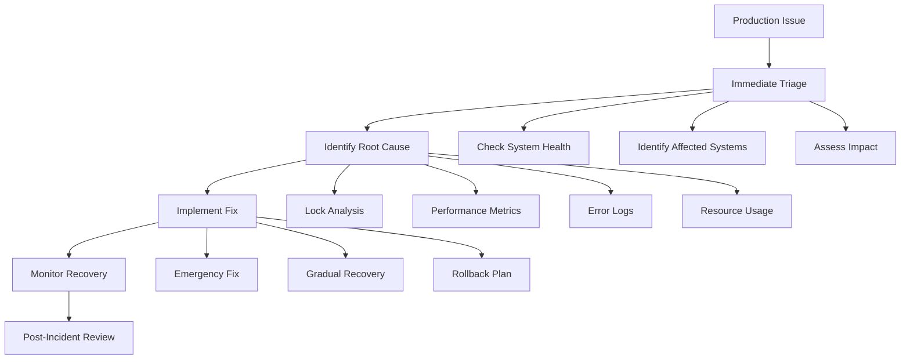

# Production Issues and Debugging

> **Module 9 • Lesson 2**  
> Estimated time: 40 min | Difficulty: ★★★★☆

## 1. Why this matters

Production database issues can bring down entire applications, cause data loss, and impact business operations. The ability to quickly diagnose and resolve database problems under pressure is a critical skill for any database professional. Understanding common failure patterns, having systematic debugging approaches, and knowing how to implement emergency fixes can mean the difference between a minor incident and a major outage. This lesson provides the tools and techniques needed to handle production crises effectively and prevent them from recurring.

> **Prerequisites**: This lesson builds on [Query Performance Analysis](08-01-query-performance-analysis.md), [Server Configuration and Tuning](08-03-server-configuration-tuning.md), and [Isolation Levels and Locking](06-02-isolation-levels-locking.md).

## 2. Key Concepts

- **Incident response**: Systematic approach to production issues
- **Lock contention**: Identifying and resolving blocking queries
- **Performance degradation**: Sudden slowdowns and their causes
- **Connection exhaustion**: Managing connection pool issues
- **Replication lag**: Diagnosis and resolution strategies
- **Data corruption**: Detection and recovery procedures



## 3. Deep Dive

### 3.1 Systematic Incident Response

**Incident Triage Framework**:
```sql
-- Create incident response toolkit
CREATE TABLE incident_log (
    id INT AUTO_INCREMENT PRIMARY KEY,
    incident_id VARCHAR(50) UNIQUE NOT NULL,
    severity ENUM('critical', 'high', 'medium', 'low') NOT NULL,
    description TEXT NOT NULL,
    affected_systems TEXT,
    started_at TIMESTAMP DEFAULT CURRENT_TIMESTAMP,
    resolved_at TIMESTAMP NULL,
    root_cause TEXT,
    resolution TEXT,
    responder VARCHAR(100)
);

-- Quick health check procedure
DELIMITER $$
CREATE PROCEDURE emergency_health_check()
BEGIN
    -- System overview
    SELECT 'System Status' as check_type, 
           @@version as mysql_version,
           @@hostname as hostname,
           NOW() as current_time;
    
    -- Connection status
    SELECT 'Connections' as check_type,
           @@max_connections as max_connections,
           (SELECT VARIABLE_VALUE FROM performance_schema.global_status 
            WHERE VARIABLE_NAME = 'Threads_connected') as current_connections,
           (SELECT VARIABLE_VALUE FROM performance_schema.global_status 
            WHERE VARIABLE_NAME = 'Max_used_connections') as max_used_connections;
    
    -- Lock status
    SELECT 'Lock Waits' as check_type,
           COUNT(*) as waiting_transactions
    FROM information_schema.innodb_trx
    WHERE trx_state = 'LOCK WAIT';
    
    -- Replication status (if applicable)
    SHOW SLAVE STATUS\G
    
    -- Recent errors
    SELECT 'Recent Errors' as check_type,
           COUNT(*) as error_count
    FROM performance_schema.events_statements_history_long
    WHERE EVENT_NAME LIKE '%error%'
    AND TIMER_START > UNIX_TIMESTAMP(DATE_SUB(NOW(), INTERVAL 5 MINUTE)) * 1000000000;
END$$
DELIMITER ;
```

**Critical Metrics Dashboard**:
```sql
-- Real-time monitoring queries
-- Query 1: Current system load
SELECT 
    'System Load' as metric,
    (SELECT VARIABLE_VALUE FROM performance_schema.global_status WHERE VARIABLE_NAME = 'Threads_running') as threads_running,
    (SELECT VARIABLE_VALUE FROM performance_schema.global_status WHERE VARIABLE_NAME = 'Threads_connected') as threads_connected,
    (SELECT VARIABLE_VALUE FROM performance_schema.global_status WHERE VARIABLE_NAME = 'Questions') as total_queries;

-- Query 2: Buffer pool efficiency
SELECT 
    'Buffer Pool' as metric,
    ROUND(
        (1 - (
            (SELECT VARIABLE_VALUE FROM performance_schema.global_status WHERE VARIABLE_NAME = 'Innodb_buffer_pool_reads') /
            (SELECT VARIABLE_VALUE FROM performance_schema.global_status WHERE VARIABLE_NAME = 'Innodb_buffer_pool_read_requests')
        )) * 100, 2
    ) as hit_ratio_percent;

-- Query 3: Slow queries
SELECT 
    'Slow Queries' as metric,
    (SELECT VARIABLE_VALUE FROM performance_schema.global_status WHERE VARIABLE_NAME = 'Slow_queries') as slow_query_count,
    @@long_query_time as threshold_seconds;

-- Query 4: InnoDB status
SELECT 
    'InnoDB Status' as metric,
    (SELECT VARIABLE_VALUE FROM performance_schema.global_status WHERE VARIABLE_NAME = 'Innodb_rows_read') as rows_read,
    (SELECT VARIABLE_VALUE FROM performance_schema.global_status WHERE VARIABLE_NAME = 'Innodb_rows_inserted') as rows_inserted,
    (SELECT VARIABLE_VALUE FROM performance_schema.global_status WHERE VARIABLE_NAME = 'Innodb_rows_updated') as rows_updated,
    (SELECT VARIABLE_VALUE FROM performance_schema.global_status WHERE VARIABLE_NAME = 'Innodb_rows_deleted') as rows_deleted;
```

### 3.2 Lock Contention Analysis and Resolution

**Identifying Lock Waits**:
```sql
-- Current lock waits (MySQL 8.0+)
SELECT 
    r.trx_id as waiting_trx_id,
    r.trx_mysql_thread_id as waiting_thread,
    SUBSTRING(r.trx_query, 1, 100) as waiting_query,
    b.trx_id as blocking_trx_id,
    b.trx_mysql_thread_id as blocking_thread,
    SUBSTRING(b.trx_query, 1, 100) as blocking_query,
    w.requested_lock_id,
    w.blocking_lock_id
FROM information_schema.innodb_lock_waits w
INNER JOIN information_schema.innodb_trx b ON b.trx_id = w.blocking_trx_id
INNER JOIN information_schema.innodb_trx r ON r.trx_id = w.requesting_trx_id;

-- Alternative for MySQL 8.0+ using Performance Schema
SELECT 
    waiting.THREAD_ID as waiting_thread_id,
    waiting.PROCESSLIST_ID as waiting_connection_id,
    waiting.PROCESSLIST_INFO as waiting_query,
    blocking.THREAD_ID as blocking_thread_id,
    blocking.PROCESSLIST_ID as blocking_connection_id,
    blocking.PROCESSLIST_INFO as blocking_query,
    waiting.PROCESSLIST_TIME as wait_time_seconds
FROM performance_schema.threads waiting
JOIN performance_schema.threads blocking ON waiting.PROCESSLIST_ID != blocking.PROCESSLIST_ID
WHERE waiting.PROCESSLIST_STATE = 'Waiting for table metadata lock'
   OR waiting.PROCESSLIST_STATE LIKE '%lock%';

-- Long-running transactions
SELECT 
    trx_id,
    trx_state,
    trx_started,
    TIMESTAMPDIFF(SECOND, trx_started, NOW()) as duration_seconds,
    trx_mysql_thread_id,
    SUBSTRING(trx_query, 1, 200) as current_query,
    trx_rows_locked,
    trx_rows_modified
FROM information_schema.innodb_trx
WHERE TIMESTAMPDIFF(SECOND, trx_started, NOW()) > 30
ORDER BY duration_seconds DESC;
```

**Emergency Lock Resolution**:
```sql
-- Kill blocking queries (use with extreme caution)
-- First, identify the problematic connection
SELECT 
    ID,
    USER,
    HOST,
    DB,
    COMMAND,
    TIME,
    STATE,
    SUBSTRING(INFO, 1, 100) as QUERY
FROM information_schema.PROCESSLIST
WHERE TIME > 300  -- Running for more than 5 minutes
   OR STATE LIKE '%lock%'
ORDER BY TIME DESC;

-- Kill specific connection (replace XXX with actual connection ID)
-- KILL XXX;

-- Procedure for safe connection termination
DELIMITER $$
CREATE PROCEDURE kill_long_running_queries(IN max_time_seconds INT)
BEGIN
    DECLARE done INT DEFAULT FALSE;
    DECLARE connection_id INT;
    DECLARE query_time INT;
    DECLARE query_text TEXT;
    
    DECLARE cur CURSOR FOR 
        SELECT ID, TIME, COALESCE(INFO, 'NULL') 
        FROM information_schema.PROCESSLIST 
        WHERE TIME > max_time_seconds 
        AND COMMAND != 'Sleep'
        AND USER != 'system user'
        AND ID != CONNECTION_ID();
    
    DECLARE CONTINUE HANDLER FOR NOT FOUND SET done = TRUE;
    
    OPEN cur;
    
    read_loop: LOOP
        FETCH cur INTO connection_id, query_time, query_text;
        IF done THEN
            LEAVE read_loop;
        END IF;
        
        -- Log before killing
        INSERT INTO incident_log (incident_id, severity, description)
        VALUES (
            CONCAT('KILL-', connection_id, '-', UNIX_TIMESTAMP()),
            'high',
            CONCAT('Killed connection ', connection_id, ' running for ', query_time, 's: ', SUBSTRING(query_text, 1, 200))
        );
        
        -- Kill the connection
        SET @sql = CONCAT('KILL ', connection_id);
        PREPARE stmt FROM @sql;
        EXECUTE stmt;
        DEALLOCATE PREPARE stmt;
        
    END LOOP;
    
    CLOSE cur;
    SELECT CONCAT('Killed connections running longer than ', max_time_seconds, ' seconds') as result;
END$$
DELIMITER ;
```

### 3.3 Performance Degradation Diagnosis

**Sudden Performance Issues**:
```sql
-- Check for plan changes
SELECT 
    DIGEST_TEXT,
    COUNT_STAR as execution_count,
    AVG_TIMER_WAIT/1000000000 as avg_time_seconds,
    MAX_TIMER_WAIT/1000000000 as max_time_seconds,
    SUM_ROWS_EXAMINED/COUNT_STAR as avg_rows_examined,
    FIRST_SEEN,
    LAST_SEEN
FROM performance_schema.events_statements_summary_by_digest
WHERE LAST_SEEN > DATE_SUB(NOW(), INTERVAL 1 HOUR)
  AND AVG_TIMER_WAIT/1000000000 > 1  -- Queries taking more than 1 second
ORDER BY AVG_TIMER_WAIT DESC
LIMIT 10;

-- Check for missing statistics
SELECT 
    TABLE_SCHEMA,
    TABLE_NAME,
    UPDATE_TIME,
    CHECK_TIME,
    TIMESTAMPDIFF(HOUR, UPDATE_TIME, NOW()) as hours_since_update
FROM information_schema.TABLES
WHERE TABLE_SCHEMA NOT IN ('information_schema', 'performance_schema', 'mysql', 'sys')
  AND UPDATE_TIME IS NOT NULL
  AND TIMESTAMPDIFF(HOUR, UPDATE_TIME, NOW()) > 24
ORDER BY hours_since_update DESC;

-- Emergency statistics update
DELIMITER $$
CREATE PROCEDURE update_table_statistics()
BEGIN
    DECLARE done INT DEFAULT FALSE;
    DECLARE table_name VARCHAR(64);
    DECLARE schema_name VARCHAR(64);
    
    DECLARE cur CURSOR FOR
        SELECT TABLE_SCHEMA, TABLE_NAME
        FROM information_schema.TABLES
        WHERE TABLE_SCHEMA NOT IN ('information_schema', 'performance_schema', 'mysql', 'sys')
          AND ENGINE = 'InnoDB';
    
    DECLARE CONTINUE HANDLER FOR NOT FOUND SET done = TRUE;
    
    OPEN cur;
    
    read_loop: LOOP
        FETCH cur INTO schema_name, table_name;
        IF done THEN
            LEAVE read_loop;
        END IF;
        
        SET @sql = CONCAT('ANALYZE TABLE ', schema_name, '.', table_name);
        PREPARE stmt FROM @sql;
        EXECUTE stmt;
        DEALLOCATE PREPARE stmt;
        
    END LOOP;
    
    CLOSE cur;
    SELECT 'Statistics updated for all InnoDB tables' as result;
END$$
DELIMITER ;
```

### 3.4 Connection Pool Issues

**Connection Exhaustion Diagnosis**:
```sql
-- Connection analysis
SELECT 
    'Connection Summary' as info,
    @@max_connections as max_allowed,
    (SELECT VARIABLE_VALUE FROM performance_schema.global_status 
     WHERE VARIABLE_NAME = 'Threads_connected') as current_connections,
    (SELECT VARIABLE_VALUE FROM performance_schema.global_status 
     WHERE VARIABLE_NAME = 'Max_used_connections') as peak_connections,
    (SELECT VARIABLE_VALUE FROM performance_schema.global_status 
     WHERE VARIABLE_NAME = 'Connection_errors_max_connections') as rejected_connections;

-- Connection breakdown by user and host
SELECT 
    USER,
    HOST,
    COUNT(*) as connection_count,
    AVG(TIME) as avg_time_seconds,
    MAX(TIME) as max_time_seconds,
    SUM(CASE WHEN COMMAND = 'Sleep' THEN 1 ELSE 0 END) as sleeping_connections
FROM information_schema.PROCESSLIST
GROUP BY USER, HOST
ORDER BY connection_count DESC;

-- Identify connection leaks
SELECT 
    HOST,
    USER,
    DB,
    COMMAND,
    TIME,
    STATE,
    SUBSTRING(INFO, 1, 100) as QUERY
FROM information_schema.PROCESSLIST
WHERE COMMAND = 'Sleep'
  AND TIME > 3600  -- Sleeping for more than 1 hour
ORDER BY TIME DESC;
```

**Emergency Connection Management**:
```sql
-- Procedure to clean up idle connections
DELIMITER $$
CREATE PROCEDURE cleanup_idle_connections(IN max_idle_time INT)
BEGIN
    DECLARE done INT DEFAULT FALSE;
    DECLARE connection_id INT;
    DECLARE idle_time INT;
    DECLARE connection_user VARCHAR(50);
    DECLARE connection_host VARCHAR(100);
    
    DECLARE cur CURSOR FOR 
        SELECT ID, TIME, USER, HOST
        FROM information_schema.PROCESSLIST 
        WHERE COMMAND = 'Sleep' 
        AND TIME > max_idle_time
        AND USER NOT IN ('root', 'mysql.sys', 'mysql.session');
    
    DECLARE CONTINUE HANDLER FOR NOT FOUND SET done = TRUE;
    
    OPEN cur;
    
    read_loop: LOOP
        FETCH cur INTO connection_id, idle_time, connection_user, connection_host;
        IF done THEN
            LEAVE read_loop;
        END IF;
        
        -- Log the cleanup
        INSERT INTO incident_log (incident_id, severity, description)
        VALUES (
            CONCAT('CLEANUP-', connection_id, '-', UNIX_TIMESTAMP()),
            'medium',
            CONCAT('Cleaned up idle connection ', connection_id, ' from ', connection_user, '@', connection_host, ' idle for ', idle_time, 's')
        );
        
        -- Kill the idle connection
        SET @sql = CONCAT('KILL ', connection_id);
        PREPARE stmt FROM @sql;
        EXECUTE stmt;
        DEALLOCATE PREPARE stmt;
        
    END LOOP;
    
    CLOSE cur;
    SELECT CONCAT('Cleaned up idle connections older than ', max_idle_time, ' seconds') as result;
END$$
DELIMITER ;
```

### 3.5 Replication Issues

**Replication Lag Diagnosis**:
```sql
-- Check replication status
SHOW SLAVE STATUS\G

-- Key metrics to monitor:
-- - Seconds_Behind_Master: Lag in seconds
-- - Slave_IO_Running: Should be 'Yes'
-- - Slave_SQL_Running: Should be 'Yes'
-- - Last_Error: Any error messages

-- Replication lag analysis
SELECT 
    'Replication Status' as check_type,
    @@server_id as server_id,
    @@read_only as read_only_mode;

-- Check for large transactions causing lag
SELECT 
    trx_id,
    trx_state,
    trx_started,
    TIMESTAMPDIFF(SECOND, trx_started, NOW()) as duration_seconds,
    trx_rows_locked,
    trx_rows_modified,
    SUBSTRING(trx_query, 1, 200) as query
FROM information_schema.innodb_trx
WHERE trx_rows_modified > 1000
   OR TIMESTAMPDIFF(SECOND, trx_started, NOW()) > 60
ORDER BY trx_rows_modified DESC;
```

**Replication Recovery Procedures**:
```sql
-- Emergency replication restart (use with caution)
/*
STOP SLAVE;
START SLAVE;
*/

-- Skip problematic replication event (last resort)
/*
STOP SLAVE;
SET GLOBAL sql_slave_skip_counter = 1;
START SLAVE;
*/

-- Replication monitoring procedure
DELIMITER $$
CREATE PROCEDURE check_replication_health()
BEGIN
    DECLARE lag_seconds INT DEFAULT 0;
    DECLARE io_running VARCHAR(10);
    DECLARE sql_running VARCHAR(10);
    DECLARE last_error TEXT;
    
    -- Get replication status
    SELECT 
        COALESCE(Seconds_Behind_Master, -1),
        Slave_IO_Running,
        Slave_SQL_Running,
        COALESCE(Last_Error, 'None')
    INTO lag_seconds, io_running, sql_running, last_error
    FROM (SHOW SLAVE STATUS) AS status;
    
    -- Alert conditions
    IF lag_seconds > 300 OR io_running != 'Yes' OR sql_running != 'Yes' THEN
        INSERT INTO incident_log (incident_id, severity, description)
        VALUES (
            CONCAT('REP-', UNIX_TIMESTAMP()),
            'critical',
            CONCAT('Replication issue: Lag=', lag_seconds, 's, IO=', io_running, ', SQL=', sql_running, ', Error=', last_error)
        );
    END IF;
    
    SELECT 
        lag_seconds as seconds_behind_master,
        io_running as io_thread_status,
        sql_running as sql_thread_status,
        last_error as last_error_message;
END$$
DELIMITER ;
```

## 4. Hands-On Practice

**Production Simulation Exercise**:

```sql
-- Create a realistic production scenario
CREATE DATABASE production_sim;
USE production_sim;

-- Set up tables
CREATE TABLE users (
    id INT AUTO_INCREMENT PRIMARY KEY,
    username VARCHAR(50) UNIQUE NOT NULL,
    email VARCHAR(255) UNIQUE NOT NULL,
    created_at TIMESTAMP DEFAULT CURRENT_TIMESTAMP,
    last_login TIMESTAMP,
    INDEX idx_username (username),
    INDEX idx_email (email),
    INDEX idx_last_login (last_login)
);

CREATE TABLE user_sessions (
    id BIGINT AUTO_INCREMENT PRIMARY KEY,
    user_id INT NOT NULL,
    session_token VARCHAR(255) UNIQUE NOT NULL,
    created_at TIMESTAMP DEFAULT CURRENT_TIMESTAMP,
    expires_at TIMESTAMP NOT NULL,
    is_active BOOLEAN DEFAULT TRUE,
    FOREIGN KEY (user_id) REFERENCES users(id),
    INDEX idx_user_active (user_id, is_active),
    INDEX idx_token (session_token),
    INDEX idx_expires (expires_at)
);

-- Insert test data
INSERT INTO users (username, email, last_login)
SELECT 
    CONCAT('user', n),
    CONCAT('user', n, '@example.com'),
    DATE_SUB(NOW(), INTERVAL FLOOR(RAND() * 30) DAY)
FROM (
    SELECT a.N + b.N * 10 + c.N * 100 + d.N * 1000 + 1 n
    FROM 
        (SELECT 0 AS N UNION SELECT 1 UNION SELECT 2 UNION SELECT 3 UNION SELECT 4 UNION SELECT 5 UNION SELECT 6 UNION SELECT 7 UNION SELECT 8 UNION SELECT 9) a
    CROSS JOIN (SELECT 0 AS N UNION SELECT 1 UNION SELECT 2 UNION SELECT 3 UNION SELECT 4 UNION SELECT 5 UNION SELECT 6 UNION SELECT 7 UNION SELECT 8 UNION SELECT 9) b
    CROSS JOIN (SELECT 0 AS N UNION SELECT 1 UNION SELECT 2 UNION SELECT 3 UNION SELECT 4 UNION SELECT 5 UNION SELECT 6 UNION SELECT 7 UNION SELECT 8 UNION SELECT 9) c
    CROSS JOIN (SELECT 0 AS N UNION SELECT 1 UNION SELECT 2 UNION SELECT 3 UNION SELECT 4 UNION SELECT 5 UNION SELECT 6 UNION SELECT 7 UNION SELECT 8 UNION SELECT 9) d
) numbers 
WHERE n <= 10000;

-- Simulate production issues
-- Issue 1: Create lock contention
DELIMITER $$
CREATE PROCEDURE simulate_lock_contention()
BEGIN
    DECLARE EXIT HANDLER FOR SQLEXCEPTION
    BEGIN
        ROLLBACK;
        RESIGNAL;
    END;
    
    START TRANSACTION;
    
    -- Lock a range of users
    SELECT * FROM users WHERE id BETWEEN 1000 AND 2000 FOR UPDATE;
    
    -- Hold the lock for a while
    DO SLEEP(30);
    
    COMMIT;
END$$
DELIMITER ;

-- Issue 2: Create connection exhaustion simulation
DELIMITER $$
CREATE PROCEDURE simulate_connection_flood()
BEGIN
    DECLARE i INT DEFAULT 1;
    
    -- This would normally be done from multiple connections
    WHILE i <= 100 DO
        -- Simulate long-running query
        SELECT COUNT(*) FROM users u1 
        CROSS JOIN users u2 
        WHERE u1.id < 1000 AND u2.id < 1000;
        
        SET i = i + 1;
    END WHILE;
END$$
DELIMITER ;

-- Issue 3: Create slow query scenario
CREATE TABLE audit_log (
    id BIGINT AUTO_INCREMENT PRIMARY KEY,
    user_id INT,
    action VARCHAR(100),
    details TEXT,
    created_at TIMESTAMP DEFAULT CURRENT_TIMESTAMP
    -- Intentionally missing indexes to create slow queries
);

-- Insert large amount of audit data
INSERT INTO audit_log (user_id, action, details)
SELECT 
    FLOOR(RAND() * 10000) + 1,
    CASE FLOOR(RAND() * 4)
        WHEN 0 THEN 'login'
        WHEN 1 THEN 'logout'
        WHEN 2 THEN 'update_profile'
        ELSE 'view_page'
    END,
    CONCAT('Action performed at ', NOW())
FROM (
    SELECT a.N + b.N * 10 + c.N * 100 + d.N * 1000 + e.N * 10000 + 1 n
    FROM 
        (SELECT 0 AS N UNION SELECT 1 UNION SELECT 2 UNION SELECT 3 UNION SELECT 4 UNION SELECT 5 UNION SELECT 6 UNION SELECT 7 UNION SELECT 8 UNION SELECT 9) a
    CROSS JOIN (SELECT 0 AS N UNION SELECT 1 UNION SELECT 2 UNION SELECT 3 UNION SELECT 4 UNION SELECT 5 UNION SELECT 6 UNION SELECT 7 UNION SELECT 8 UNION SELECT 9) b
    CROSS JOIN (SELECT 0 AS N UNION SELECT 1 UNION SELECT 2 UNION SELECT 3 UNION SELECT 4 UNION SELECT 5 UNION SELECT 6 UNION SELECT 7 UNION SELECT 8 UNION SELECT 9) c
    CROSS JOIN (SELECT 0 AS N UNION SELECT 1 UNION SELECT 2 UNION SELECT 3 UNION SELECT 4 UNION SELECT 5 UNION SELECT 6 UNION SELECT 7 UNION SELECT 8 UNION SELECT 9) d
    CROSS JOIN (SELECT 0 AS N UNION SELECT 1 UNION SELECT 2 UNION SELECT 3 UNION SELECT 4) e
) numbers 
WHERE n <= 500000;

-- Now this query will be slow (missing index on user_id)
-- SELECT * FROM audit_log WHERE user_id = 1234 ORDER BY created_at DESC LIMIT 10;
```

**Exercise Tasks**:

1. **Diagnose Lock Contention**: Run the lock simulation and identify blocking queries
2. **Resolve Performance Issues**: Find and fix the slow audit query
3. **Monitor System Health**: Set up monitoring for key metrics
4. **Create Emergency Procedures**: Write runbooks for common issues
5. **Test Recovery Procedures**: Practice incident response workflows

## 5. Common Pitfalls

### 5.1 Panic-Driven Debugging
**Problem**: Making changes without understanding the root cause
```sql
-- WRONG: Randomly killing connections
KILL 123; KILL 124; KILL 125;

-- RIGHT: Systematic analysis first
-- 1. Identify the problem pattern
-- 2. Find the root cause
-- 3. Implement targeted fix
-- 4. Monitor the results
```

### 5.2 Not Having Emergency Procedures Ready
**Problem**: Figuring out commands during an outage
```sql
-- Prepare emergency procedures in advance
-- Create runbooks with exact commands
-- Test procedures in non-production environments
-- Have escalation paths defined
```

### 5.3 Insufficient Monitoring
**Problem**: Not knowing about issues until users complain
```sql
-- Set up proactive monitoring
-- Monitor key metrics continuously
-- Set up alerts for threshold breaches
-- Regular health checks
```

### 5.4 Making Changes Without Logging
**Problem**: Not tracking what was done during incidents
```sql
-- Always log incident actions
INSERT INTO incident_log (incident_id, severity, description, responder)
VALUES ('INC-2024-001', 'critical', 'Killed blocking query 12345', USER());
```

### 5.5 Not Planning for Rollback
**Problem**: Implementing fixes that can't be undone
```sql
-- Always have a rollback plan
-- Test rollback procedures
-- Document rollback steps
-- Consider impact of rollback on data consistency
```

## 6. Knowledge Check

<details>
<summary>1. What's the first thing you should do when responding to a production database issue?</summary>

Perform a quick health check to assess the scope and severity of the issue. Check system status, connections, locks, and replication before making any changes. This helps avoid making the situation worse.
</details>

<details>
<summary>2. How do you identify which query is causing lock contention?</summary>

Query the `information_schema.innodb_lock_waits` table joined with `information_schema.innodb_trx` to see both waiting and blocking transactions, including their queries and thread IDs.
</details>

<details>
<summary>3. What should you check first when queries suddenly become slow?</summary>

Check if table statistics are up to date using `information_schema.TABLES.UPDATE_TIME`. Outdated statistics can cause the optimizer to choose poor execution plans. Run `ANALYZE TABLE` if needed.
</details>

<details>
<summary>4. How do you safely kill a long-running query?</summary>

First identify the connection ID from `SHOW PROCESSLIST`, verify it's the correct query, log the action for audit purposes, then use `KILL <connection_id>`. Always document why the query was killed.
</details>

<details>
<summary>5. What are the key metrics to monitor for replication health?</summary>

Monitor `Seconds_Behind_Master` (should be low), `Slave_IO_Running` and `Slave_SQL_Running` (should be 'Yes'), and check for any values in `Last_Error`. Also monitor binary log size and disk space.
</details>

## 7. Further Reading

- [MySQL Troubleshooting Guide](https://dev.mysql.com/doc/refman/8.0/en/problems.html)
- [InnoDB Troubleshooting](https://dev.mysql.com/doc/refman/8.0/en/innodb-troubleshooting.html)
- [MySQL Performance Schema](https://dev.mysql.com/doc/refman/8.0/en/performance-schema.html)
- [High Performance MySQL](https://www.oreilly.com/library/view/high-performance-mysql/9781492080503/) - Chapter 14
- [Percona Monitoring and Management](https://www.percona.com/software/database-tools/percona-monitoring-and-management)
- [MySQL Enterprise Monitor](https://www.mysql.com/products/enterprise/monitor.html)

---

**Navigation**

[← Previous: Development Phase Issues](09-01-development-phase-issues.md) | [Next → Monitoring and Maintenance](09-03-monitoring-maintenance.md)

_Last updated: 2025-06-21_ 