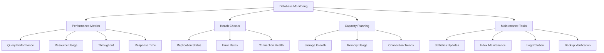

# Monitoring and Maintenance

> **Module 9 • Lesson 3**  
> Estimated time: 45 min | Difficulty: ★★★★☆

## 1. Why this matters

Proactive monitoring and regular maintenance are the difference between a database that fails unexpectedly and one that runs reliably for years. Effective monitoring catches problems before they impact users, while proper maintenance prevents performance degradation and data corruption. Understanding what to monitor, how to automate maintenance tasks, and when to take action transforms reactive firefighting into predictable, manageable operations. This systematic approach reduces downtime, improves performance, and extends the life of your database systems.

> **Prerequisites**: This lesson builds on [Production Issues and Debugging](09-02-production-issues-debugging.md), [Query Performance Analysis](08-01-query-performance-analysis.md), and [Server Configuration and Tuning](08-03-server-configuration-tuning.md).

## 2. Key Concepts

- **Proactive monitoring**: Catching issues before they become problems
- **Key performance indicators**: Metrics that matter for database health
- **Automated maintenance**: Scheduling routine tasks for optimal performance
- **Capacity planning**: Predicting and preparing for growth
- **Alerting strategies**: When and how to notify operations teams
- **Historical trending**: Understanding patterns and growth over time



## 3. Deep Dive

### 3.1 Comprehensive Monitoring Framework

**Core Performance Metrics**:
```sql
-- Create monitoring tables
CREATE TABLE monitoring_metrics (
    id BIGINT AUTO_INCREMENT PRIMARY KEY,
    metric_name VARCHAR(100) NOT NULL,
    metric_value DECIMAL(20,4),
    metric_unit VARCHAR(20),
    collected_at TIMESTAMP DEFAULT CURRENT_TIMESTAMP,
    server_id VARCHAR(50),
    INDEX idx_metric_time (metric_name, collected_at),
    INDEX idx_collected (collected_at)
);

CREATE TABLE monitoring_alerts (
    id INT AUTO_INCREMENT PRIMARY KEY,
    alert_name VARCHAR(100) NOT NULL,
    severity ENUM('info', 'warning', 'critical') NOT NULL,
    metric_name VARCHAR(100),
    threshold_value DECIMAL(20,4),
    current_value DECIMAL(20,4),
    alert_message TEXT,
    triggered_at TIMESTAMP DEFAULT CURRENT_TIMESTAMP,
    resolved_at TIMESTAMP NULL,
    INDEX idx_severity_time (severity, triggered_at),
    INDEX idx_resolved (resolved_at)
);

-- Comprehensive metrics collection procedure
DELIMITER $$
CREATE PROCEDURE collect_monitoring_metrics()
BEGIN
    DECLARE server_name VARCHAR(50) DEFAULT @@hostname;
    
    -- Connection metrics
    INSERT INTO monitoring_metrics (metric_name, metric_value, metric_unit, server_id)
    SELECT 'connections_current', VARIABLE_VALUE, 'count', server_name
    FROM performance_schema.global_status WHERE VARIABLE_NAME = 'Threads_connected'
    UNION ALL
    SELECT 'connections_max_used', VARIABLE_VALUE, 'count', server_name
    FROM performance_schema.global_status WHERE VARIABLE_NAME = 'Max_used_connections'
    UNION ALL
    SELECT 'connections_aborted', VARIABLE_VALUE, 'count', server_name
    FROM performance_schema.global_status WHERE VARIABLE_NAME = 'Aborted_connects';
    
    -- Query performance metrics
    INSERT INTO monitoring_metrics (metric_name, metric_value, metric_unit, server_id)
    SELECT 'queries_per_second', 
           VARIABLE_VALUE / (SELECT VARIABLE_VALUE FROM performance_schema.global_status WHERE VARIABLE_NAME = 'Uptime'),
           'qps', server_name
    FROM performance_schema.global_status WHERE VARIABLE_NAME = 'Questions'
    UNION ALL
    SELECT 'slow_queries', VARIABLE_VALUE, 'count', server_name
    FROM performance_schema.global_status WHERE VARIABLE_NAME = 'Slow_queries';
    
    -- InnoDB metrics
    INSERT INTO monitoring_metrics (metric_name, metric_value, metric_unit, server_id)
    SELECT 'innodb_buffer_pool_hit_ratio',
           (1 - (
               (SELECT VARIABLE_VALUE FROM performance_schema.global_status WHERE VARIABLE_NAME = 'Innodb_buffer_pool_reads') /
               (SELECT VARIABLE_VALUE FROM performance_schema.global_status WHERE VARIABLE_NAME = 'Innodb_buffer_pool_read_requests')
           )) * 100,
           'percent', server_name
    UNION ALL
    SELECT 'innodb_deadlocks', VARIABLE_VALUE, 'count', server_name
    FROM performance_schema.global_status WHERE VARIABLE_NAME = 'Innodb_deadlocks'
    UNION ALL
    SELECT 'innodb_lock_waits', VARIABLE_VALUE, 'count', server_name
    FROM performance_schema.global_status WHERE VARIABLE_NAME = 'Innodb_row_lock_waits';
    
    -- Replication metrics (if applicable)
    INSERT INTO monitoring_metrics (metric_name, metric_value, metric_unit, server_id)
    SELECT 'replication_lag', 
           COALESCE((SELECT Seconds_Behind_Master FROM SHOW SLAVE STATUS), 0),
           'seconds', server_name;
    
    -- Storage metrics
    INSERT INTO monitoring_metrics (metric_name, metric_value, metric_unit, server_id)
    SELECT 'database_size_gb',
           SUM(data_length + index_length) / 1024 / 1024 / 1024,
           'gigabytes', server_name
    FROM information_schema.tables
    WHERE table_schema NOT IN ('information_schema', 'performance_schema', 'mysql', 'sys');
    
END$$
DELIMITER ;
```

**Automated Alert System**:
```sql
-- Alert threshold configuration
CREATE TABLE alert_thresholds (
    id INT AUTO_INCREMENT PRIMARY KEY,
    metric_name VARCHAR(100) NOT NULL,
    warning_threshold DECIMAL(20,4),
    critical_threshold DECIMAL(20,4),
    comparison_operator ENUM('>', '<', '=', '>=', '<=') DEFAULT '>',
    is_active BOOLEAN DEFAULT TRUE,
    created_at TIMESTAMP DEFAULT CURRENT_TIMESTAMP,
    UNIQUE KEY idx_metric (metric_name)
);

-- Insert default thresholds
INSERT INTO alert_thresholds (metric_name, warning_threshold, critical_threshold, comparison_operator) VALUES
('connections_current', 80, 95, '>'),  -- Percentage of max_connections
('innodb_buffer_pool_hit_ratio', 90, 85, '<'),  -- Should be high
('slow_queries', 100, 500, '>'),  -- Per hour
('replication_lag', 60, 300, '>'),  -- Seconds
('innodb_deadlocks', 10, 50, '>'),  -- Per hour
('database_size_gb', 800, 900, '>');  -- Adjust based on your capacity

-- Alert checking procedure
DELIMITER $$
CREATE PROCEDURE check_alerts()
BEGIN
    DECLARE done INT DEFAULT FALSE;
    DECLARE metric_name VARCHAR(100);
    DECLARE current_value DECIMAL(20,4);
    DECLARE warning_threshold DECIMAL(20,4);
    DECLARE critical_threshold DECIMAL(20,4);
    DECLARE comparison_op VARCHAR(2);
    DECLARE alert_severity VARCHAR(10);
    
    DECLARE cur CURSOR FOR
        SELECT m.metric_name, m.metric_value, t.warning_threshold, t.critical_threshold, t.comparison_operator
        FROM monitoring_metrics m
        JOIN alert_thresholds t ON m.metric_name = t.metric_name
        WHERE m.collected_at >= DATE_SUB(NOW(), INTERVAL 5 MINUTE)
        AND t.is_active = TRUE
        GROUP BY m.metric_name
        HAVING m.collected_at = MAX(m.collected_at);
    
    DECLARE CONTINUE HANDLER FOR NOT FOUND SET done = TRUE;
    
    OPEN cur;
    
    read_loop: LOOP
        FETCH cur INTO metric_name, current_value, warning_threshold, critical_threshold, comparison_op;
        IF done THEN
            LEAVE read_loop;
        END IF;
        
        SET alert_severity = NULL;
        
        -- Check critical threshold
        IF (comparison_op = '>' AND current_value > critical_threshold) OR
           (comparison_op = '<' AND current_value < critical_threshold) OR
           (comparison_op = '>=' AND current_value >= critical_threshold) OR
           (comparison_op = '<=' AND current_value <= critical_threshold) THEN
            SET alert_severity = 'critical';
        -- Check warning threshold
        ELSEIF (comparison_op = '>' AND current_value > warning_threshold) OR
               (comparison_op = '<' AND current_value < warning_threshold) OR
               (comparison_op = '>=' AND current_value >= warning_threshold) OR
               (comparison_op = '<=' AND current_value <= warning_threshold) THEN
            SET alert_severity = 'warning';
        END IF;
        
        -- Insert alert if threshold breached
        IF alert_severity IS NOT NULL THEN
            INSERT INTO monitoring_alerts (alert_name, severity, metric_name, threshold_value, current_value, alert_message)
            VALUES (
                CONCAT(UPPER(alert_severity), ': ', metric_name),
                alert_severity,
                metric_name,
                CASE WHEN alert_severity = 'critical' THEN critical_threshold ELSE warning_threshold END,
                current_value,
                CONCAT('Metric ', metric_name, ' is ', current_value, ', threshold is ', 
                       CASE WHEN alert_severity = 'critical' THEN critical_threshold ELSE warning_threshold END)
            );
        END IF;
        
    END LOOP;
    
    CLOSE cur;
END$$
DELIMITER ;
```

### 3.2 Automated Maintenance Tasks

**Statistics and Index Maintenance**:
```sql
-- Table maintenance tracking
CREATE TABLE maintenance_log (
    id BIGINT AUTO_INCREMENT PRIMARY KEY,
    table_schema VARCHAR(64),
    table_name VARCHAR(64),
    maintenance_type ENUM('ANALYZE', 'OPTIMIZE', 'REPAIR', 'CHECK') NOT NULL,
    started_at TIMESTAMP DEFAULT CURRENT_TIMESTAMP,
    completed_at TIMESTAMP NULL,
    status ENUM('running', 'completed', 'failed') DEFAULT 'running',
    error_message TEXT,
    rows_affected BIGINT,
    INDEX idx_table (table_schema, table_name),
    INDEX idx_type_time (maintenance_type, started_at)
);

-- Automated statistics update procedure
DELIMITER $$
CREATE PROCEDURE automated_table_maintenance()
BEGIN
    DECLARE done INT DEFAULT FALSE;
    DECLARE schema_name VARCHAR(64);
    DECLARE table_name VARCHAR(64);
    DECLARE table_rows BIGINT;
    DECLARE data_length BIGINT;
    DECLARE index_length BIGINT;
    DECLARE data_free BIGINT;
    DECLARE maintenance_id BIGINT;
    
    DECLARE cur CURSOR FOR
        SELECT TABLE_SCHEMA, TABLE_NAME, TABLE_ROWS, DATA_LENGTH, INDEX_LENGTH, DATA_FREE
        FROM information_schema.TABLES
        WHERE TABLE_SCHEMA NOT IN ('information_schema', 'performance_schema', 'mysql', 'sys')
        AND ENGINE = 'InnoDB'
        AND (
            -- Tables with significant free space (fragmentation)
            (DATA_FREE > DATA_LENGTH * 0.1 AND DATA_LENGTH > 100 * 1024 * 1024) OR
            -- Tables not analyzed recently
            (UPDATE_TIME IS NULL OR UPDATE_TIME < DATE_SUB(NOW(), INTERVAL 7 DAY))
        );
    
    DECLARE CONTINUE HANDLER FOR NOT FOUND SET done = TRUE;
    DECLARE CONTINUE HANDLER FOR SQLEXCEPTION
    BEGIN
        UPDATE maintenance_log 
        SET status = 'failed', 
            completed_at = NOW(),
            error_message = 'SQL Exception occurred'
        WHERE id = maintenance_id;
    END;
    
    OPEN cur;
    
    read_loop: LOOP
        FETCH cur INTO schema_name, table_name, table_rows, data_length, index_length, data_free;
        IF done THEN
            LEAVE read_loop;
        END IF;
        
        -- Determine maintenance type needed
        IF data_free > data_length * 0.1 AND data_length > 100 * 1024 * 1024 THEN
            -- Table needs optimization (defragmentation)
            INSERT INTO maintenance_log (table_schema, table_name, maintenance_type)
            VALUES (schema_name, table_name, 'OPTIMIZE');
            SET maintenance_id = LAST_INSERT_ID();
            
            SET @sql = CONCAT('OPTIMIZE TABLE ', schema_name, '.', table_name);
            PREPARE stmt FROM @sql;
            EXECUTE stmt;
            DEALLOCATE PREPARE stmt;
            
        ELSE
            -- Table needs statistics update
            INSERT INTO maintenance_log (table_schema, table_name, maintenance_type)
            VALUES (schema_name, table_name, 'ANALYZE');
            SET maintenance_id = LAST_INSERT_ID();
            
            SET @sql = CONCAT('ANALYZE TABLE ', schema_name, '.', table_name);
            PREPARE stmt FROM @sql;
            EXECUTE stmt;
            DEALLOCATE PREPARE stmt;
        END IF;
        
        -- Mark as completed
        UPDATE maintenance_log 
        SET status = 'completed', 
            completed_at = NOW(),
            rows_affected = table_rows
        WHERE id = maintenance_id;
        
    END LOOP;
    
    CLOSE cur;
END$$
DELIMITER ;
```

**Log File Management**:
```sql
-- Binary log cleanup procedure
DELIMITER $$
CREATE PROCEDURE cleanup_binary_logs(IN retention_days INT)
BEGIN
    DECLARE log_count INT;
    DECLARE oldest_log VARCHAR(255);
    
    -- Check current binary logs
    SELECT COUNT(*) INTO log_count FROM (SHOW BINARY LOGS) AS logs;
    
    -- Log the cleanup action
    INSERT INTO maintenance_log (table_schema, table_name, maintenance_type)
    VALUES ('mysql', 'binary_logs', 'CLEANUP');
    
    -- Purge old binary logs
    SET @sql = CONCAT('PURGE BINARY LOGS BEFORE DATE_SUB(NOW(), INTERVAL ', retention_days, ' DAY)');
    PREPARE stmt FROM @sql;
    EXECUTE stmt;
    DEALLOCATE PREPARE stmt;
    
    -- Update maintenance log
    UPDATE maintenance_log 
    SET status = 'completed', 
        completed_at = NOW(),
        rows_affected = log_count
    WHERE id = LAST_INSERT_ID();
    
    SELECT CONCAT('Cleaned up binary logs older than ', retention_days, ' days') as result;
END$$
DELIMITER ;

-- Slow query log rotation procedure
DELIMITER $$
CREATE PROCEDURE rotate_slow_query_log()
BEGIN
    DECLARE log_file VARCHAR(512);
    
    -- Get current slow query log file
    SELECT @@slow_query_log_file INTO log_file;
    
    -- Disable slow query log temporarily
    SET GLOBAL slow_query_log = OFF;
    
    -- Rename current log file (would be done at OS level in practice)
    -- This is a simplified example
    
    -- Re-enable slow query log (creates new file)
    SET GLOBAL slow_query_log = ON;
    
    INSERT INTO maintenance_log (table_schema, table_name, maintenance_type)
    VALUES ('mysql', 'slow_query_log', 'ROTATE');
    
    UPDATE maintenance_log 
    SET status = 'completed', completed_at = NOW()
    WHERE id = LAST_INSERT_ID();
    
    SELECT 'Slow query log rotated successfully' as result;
END$$
DELIMITER ;
```

### 3.3 Capacity Planning and Trending

**Growth Analysis**:
```sql
-- Database growth tracking
CREATE TABLE capacity_metrics (
    id BIGINT AUTO_INCREMENT PRIMARY KEY,
    metric_date DATE NOT NULL,
    database_size_gb DECIMAL(10,2),
    table_count INT,
    largest_table_gb DECIMAL(10,2),
    largest_table_name VARCHAR(128),
    total_connections_peak INT,
    queries_per_day BIGINT,
    created_at TIMESTAMP DEFAULT CURRENT_TIMESTAMP,
    UNIQUE KEY idx_date (metric_date)
);

-- Daily capacity collection
DELIMITER $$
CREATE PROCEDURE collect_capacity_metrics()
BEGIN
    DECLARE db_size DECIMAL(10,2);
    DECLARE tbl_count INT;
    DECLARE largest_size DECIMAL(10,2);
    DECLARE largest_name VARCHAR(128);
    DECLARE peak_connections INT;
    DECLARE daily_queries BIGINT;
    
    -- Calculate database size
    SELECT SUM(data_length + index_length) / 1024 / 1024 / 1024 INTO db_size
    FROM information_schema.tables
    WHERE table_schema NOT IN ('information_schema', 'performance_schema', 'mysql', 'sys');
    
    -- Count tables
    SELECT COUNT(*) INTO tbl_count
    FROM information_schema.tables
    WHERE table_schema NOT IN ('information_schema', 'performance_schema', 'mysql', 'sys');
    
    -- Find largest table
    SELECT 
        (data_length + index_length) / 1024 / 1024 / 1024,
        CONCAT(table_schema, '.', table_name)
    INTO largest_size, largest_name
    FROM information_schema.tables
    WHERE table_schema NOT IN ('information_schema', 'performance_schema', 'mysql', 'sys')
    ORDER BY (data_length + index_length) DESC
    LIMIT 1;
    
    -- Get peak connections
    SELECT VARIABLE_VALUE INTO peak_connections
    FROM performance_schema.global_status 
    WHERE VARIABLE_NAME = 'Max_used_connections';
    
    -- Get daily query count (approximate)
    SELECT VARIABLE_VALUE INTO daily_queries
    FROM performance_schema.global_status 
    WHERE VARIABLE_NAME = 'Questions';
    
    -- Insert or update today's metrics
    INSERT INTO capacity_metrics 
    (metric_date, database_size_gb, table_count, largest_table_gb, largest_table_name, total_connections_peak, queries_per_day)
    VALUES 
    (CURDATE(), db_size, tbl_count, largest_size, largest_name, peak_connections, daily_queries)
    ON DUPLICATE KEY UPDATE
        database_size_gb = db_size,
        table_count = tbl_count,
        largest_table_gb = largest_size,
        largest_table_name = largest_name,
        total_connections_peak = peak_connections,
        queries_per_day = daily_queries;
    
END$$
DELIMITER ;

-- Growth projection analysis
CREATE VIEW capacity_trends AS
SELECT 
    metric_date,
    database_size_gb,
    database_size_gb - LAG(database_size_gb, 7) OVER (ORDER BY metric_date) as weekly_growth_gb,
    database_size_gb - LAG(database_size_gb, 30) OVER (ORDER BY metric_date) as monthly_growth_gb,
    queries_per_day,
    queries_per_day - LAG(queries_per_day, 7) OVER (ORDER BY metric_date) as weekly_query_growth,
    total_connections_peak
FROM capacity_metrics
ORDER BY metric_date DESC;
```

### 3.4 Health Check Automation

**Comprehensive Health Check**:
```sql
-- Health check results table
CREATE TABLE health_check_results (
    id BIGINT AUTO_INCREMENT PRIMARY KEY,
    check_name VARCHAR(100) NOT NULL,
    check_category ENUM('performance', 'replication', 'storage', 'security', 'configuration') NOT NULL,
    status ENUM('pass', 'warning', 'fail') NOT NULL,
    message TEXT,
    recommendation TEXT,
    checked_at TIMESTAMP DEFAULT CURRENT_TIMESTAMP,
    INDEX idx_category_time (check_category, checked_at),
    INDEX idx_status (status)
);

-- Comprehensive health check procedure
DELIMITER $$
CREATE PROCEDURE run_health_checks()
BEGIN
    -- Clear previous results
    DELETE FROM health_check_results WHERE checked_at < DATE_SUB(NOW(), INTERVAL 1 DAY);
    
    -- Check 1: Buffer pool hit ratio
    INSERT INTO health_check_results (check_name, check_category, status, message, recommendation)
    SELECT 
        'Buffer Pool Hit Ratio',
        'performance',
        CASE 
            WHEN hit_ratio >= 95 THEN 'pass'
            WHEN hit_ratio >= 90 THEN 'warning'
            ELSE 'fail'
        END,
        CONCAT('Buffer pool hit ratio: ', ROUND(hit_ratio, 2), '%'),
        CASE 
            WHEN hit_ratio < 90 THEN 'Consider increasing innodb_buffer_pool_size'
            WHEN hit_ratio < 95 THEN 'Monitor buffer pool usage'
            ELSE 'Buffer pool performing well'
        END
    FROM (
        SELECT (1 - (
            (SELECT VARIABLE_VALUE FROM performance_schema.global_status WHERE VARIABLE_NAME = 'Innodb_buffer_pool_reads') /
            (SELECT VARIABLE_VALUE FROM performance_schema.global_status WHERE VARIABLE_NAME = 'Innodb_buffer_pool_read_requests')
        )) * 100 as hit_ratio
    ) AS buffer_stats;
    
    -- Check 2: Connection usage
    INSERT INTO health_check_results (check_name, check_category, status, message, recommendation)
    SELECT 
        'Connection Usage',
        'performance',
        CASE 
            WHEN usage_percent < 70 THEN 'pass'
            WHEN usage_percent < 85 THEN 'warning'
            ELSE 'fail'
        END,
        CONCAT('Connection usage: ', ROUND(usage_percent, 1), '% (', current_conn, '/', max_conn, ')'),
        CASE 
            WHEN usage_percent >= 85 THEN 'Consider increasing max_connections or optimizing connection pooling'
            WHEN usage_percent >= 70 THEN 'Monitor connection usage trends'
            ELSE 'Connection usage is healthy'
        END
    FROM (
        SELECT 
            (SELECT VARIABLE_VALUE FROM performance_schema.global_status WHERE VARIABLE_NAME = 'Threads_connected') as current_conn,
            @@max_connections as max_conn,
            ((SELECT VARIABLE_VALUE FROM performance_schema.global_status WHERE VARIABLE_NAME = 'Threads_connected') / @@max_connections) * 100 as usage_percent
    ) AS conn_stats;
    
    -- Check 3: Replication status
    INSERT INTO health_check_results (check_name, check_category, status, message, recommendation)
    SELECT 
        'Replication Status',
        'replication',
        CASE 
            WHEN lag_seconds IS NULL THEN 'pass'
            WHEN lag_seconds <= 60 THEN 'pass'
            WHEN lag_seconds <= 300 THEN 'warning'
            ELSE 'fail'
        END,
        CASE 
            WHEN lag_seconds IS NULL THEN 'No replication configured'
            ELSE CONCAT('Replication lag: ', lag_seconds, ' seconds')
        END,
        CASE 
            WHEN lag_seconds IS NULL THEN 'No action needed'
            WHEN lag_seconds > 300 THEN 'Investigate replication lag immediately'
            WHEN lag_seconds > 60 THEN 'Monitor replication performance'
            ELSE 'Replication is healthy'
        END
    FROM (
        SELECT COALESCE((SELECT Seconds_Behind_Master FROM SHOW SLAVE STATUS), NULL) as lag_seconds
    ) AS repl_stats;
    
    -- Check 4: Disk space
    INSERT INTO health_check_results (check_name, check_category, status, message, recommendation)
    SELECT 
        'Database Size Growth',
        'storage',
        CASE 
            WHEN size_gb < 100 THEN 'pass'
            WHEN size_gb < 500 THEN 'warning'
            ELSE 'fail'
        END,
        CONCAT('Database size: ', ROUND(size_gb, 2), ' GB'),
        CASE 
            WHEN size_gb >= 500 THEN 'Plan for storage expansion'
            WHEN size_gb >= 100 THEN 'Monitor storage growth trends'
            ELSE 'Storage usage is healthy'
        END
    FROM (
        SELECT SUM(data_length + index_length) / 1024 / 1024 / 1024 as size_gb
        FROM information_schema.tables
        WHERE table_schema NOT IN ('information_schema', 'performance_schema', 'mysql', 'sys')
    ) AS storage_stats;
    
    -- Check 5: Long-running queries
    INSERT INTO health_check_results (check_name, check_category, status, message, recommendation)
    SELECT 
        'Long Running Queries',
        'performance',
        CASE 
            WHEN long_query_count = 0 THEN 'pass'
            WHEN long_query_count <= 5 THEN 'warning'
            ELSE 'fail'
        END,
        CONCAT(long_query_count, ' queries running longer than 5 minutes'),
        CASE 
            WHEN long_query_count > 5 THEN 'Investigate and potentially kill long-running queries'
            WHEN long_query_count > 0 THEN 'Monitor long-running queries'
            ELSE 'No long-running queries detected'
        END
    FROM (
        SELECT COUNT(*) as long_query_count
        FROM information_schema.processlist
        WHERE TIME > 300 AND COMMAND != 'Sleep'
    ) AS query_stats;
    
    -- Summary
    SELECT 
        check_category,
        COUNT(*) as total_checks,
        SUM(CASE WHEN status = 'pass' THEN 1 ELSE 0 END) as passed,
        SUM(CASE WHEN status = 'warning' THEN 1 ELSE 0 END) as warnings,
        SUM(CASE WHEN status = 'fail' THEN 1 ELSE 0 END) as failed
    FROM health_check_results
    WHERE checked_at >= DATE_SUB(NOW(), INTERVAL 1 HOUR)
    GROUP BY check_category
    ORDER BY check_category;
    
END$$
DELIMITER ;
```

### 3.5 Automated Scheduling and Events

**Event Scheduler Setup**:
```sql
-- Enable event scheduler
SET GLOBAL event_scheduler = ON;

-- Daily metrics collection
CREATE EVENT IF NOT EXISTS daily_metrics_collection
ON SCHEDULE EVERY 1 DAY
STARTS CURRENT_TIMESTAMP
DO
BEGIN
    CALL collect_monitoring_metrics();
    CALL collect_capacity_metrics();
END;

-- Hourly health checks
CREATE EVENT IF NOT EXISTS hourly_health_check
ON SCHEDULE EVERY 1 HOUR
STARTS CURRENT_TIMESTAMP
DO
BEGIN
    CALL run_health_checks();
    CALL check_alerts();
END;

-- Weekly maintenance
CREATE EVENT IF NOT EXISTS weekly_maintenance
ON SCHEDULE EVERY 1 WEEK
STARTS DATE_ADD(DATE_ADD(CURDATE(), INTERVAL 1 DAY), INTERVAL 2 HOUR)  -- Sunday 2 AM
DO
BEGIN
    CALL automated_table_maintenance();
    CALL cleanup_binary_logs(7);  -- Keep 7 days of binary logs
END;

-- Monthly log rotation
CREATE EVENT IF NOT EXISTS monthly_log_rotation
ON SCHEDULE EVERY 1 MONTH
STARTS DATE_ADD(DATE_ADD(DATE_ADD(CURDATE(), INTERVAL 1 DAY), INTERVAL 1 WEEK), INTERVAL 3 HOUR)  -- First Sunday 3 AM
DO
BEGIN
    CALL rotate_slow_query_log();
    -- Clean up old monitoring data
    DELETE FROM monitoring_metrics WHERE collected_at < DATE_SUB(NOW(), INTERVAL 90 DAY);
    DELETE FROM monitoring_alerts WHERE triggered_at < DATE_SUB(NOW(), INTERVAL 30 DAY);
    DELETE FROM maintenance_log WHERE started_at < DATE_SUB(NOW(), INTERVAL 90 DAY);
END;

-- Check event status
SHOW EVENTS;
```

## 4. Hands-On Practice

**Complete Monitoring Setup Exercise**:

```sql
-- Set up a complete monitoring environment
-- 1. Create all monitoring tables and procedures (from above)
-- 2. Set up realistic alert thresholds
-- 3. Create test scenarios to trigger alerts
-- 4. Implement automated responses

-- Test scenario 1: Simulate high connection usage
DELIMITER $$
CREATE PROCEDURE simulate_high_connections()
BEGIN
    DECLARE i INT DEFAULT 1;
    
    -- This would normally be done from multiple connections
    -- For testing, we'll just update the threshold temporarily
    UPDATE alert_thresholds 
    SET critical_threshold = 5  -- Very low threshold for testing
    WHERE metric_name = 'connections_current';
    
    -- Collect metrics and check alerts
    CALL collect_monitoring_metrics();
    CALL check_alerts();
    
    -- Reset threshold
    UPDATE alert_thresholds 
    SET critical_threshold = 95
    WHERE metric_name = 'connections_current';
    
    SELECT 'High connection simulation completed' as result;
END$$
DELIMITER ;

-- Test scenario 2: Simulate performance degradation
CREATE TABLE performance_test_large AS
SELECT 
    a.id as id1,
    b.id as id2,
    CONCAT('Test data ', a.id, '-', b.id) as test_data,
    NOW() as created_at
FROM 
    (SELECT id FROM users LIMIT 100) a
CROSS JOIN 
    (SELECT id FROM users LIMIT 100) b;

-- This will create a slow query to trigger alerts
-- SELECT COUNT(*) FROM performance_test_large p1 
-- JOIN performance_test_large p2 ON p1.id1 = p2.id2
-- WHERE p1.test_data LIKE '%50%';

-- Test scenario 3: Monitor maintenance effectiveness
DELIMITER $$
CREATE PROCEDURE test_maintenance_effectiveness()
BEGIN
    DECLARE before_size BIGINT;
    DECLARE after_size BIGINT;
    DECLARE fragmentation_before DECIMAL(5,2);
    DECLARE fragmentation_after DECIMAL(5,2);
    
    -- Measure before maintenance
    SELECT 
        SUM(data_length + index_length),
        SUM(data_free) / SUM(data_length + index_length) * 100
    INTO before_size, fragmentation_before
    FROM information_schema.tables
    WHERE table_schema = DATABASE()
    AND table_name = 'performance_test_large';
    
    -- Run maintenance
    OPTIMIZE TABLE performance_test_large;
    
    -- Measure after maintenance
    SELECT 
        SUM(data_length + index_length),
        SUM(data_free) / SUM(data_length + index_length) * 100
    INTO after_size, fragmentation_after
    FROM information_schema.tables
    WHERE table_schema = DATABASE()
    AND table_name = 'performance_test_large';
    
    SELECT 
        before_size as size_before_bytes,
        after_size as size_after_bytes,
        before_size - after_size as space_reclaimed_bytes,
        fragmentation_before as fragmentation_before_percent,
        fragmentation_after as fragmentation_after_percent;
        
END$$
DELIMITER ;
```

**Exercise Tasks**:
1. **Set up monitoring**: Implement the complete monitoring framework
2. **Configure alerts**: Set appropriate thresholds for your environment
3. **Test alerting**: Create scenarios that trigger different alert levels
4. **Automate maintenance**: Schedule regular maintenance tasks
5. **Analyze trends**: Use capacity metrics to predict future needs

## 5. Common Pitfalls

### 5.1 Alert Fatigue
**Problem**: Too many false positive alerts
```sql
-- WRONG: Overly sensitive thresholds
UPDATE alert_thresholds SET warning_threshold = 50 WHERE metric_name = 'connections_current';

-- RIGHT: Realistic thresholds based on historical data
SELECT 
    metric_name,
    AVG(metric_value) as avg_value,
    MAX(metric_value) as max_value,
    STDDEV(metric_value) as std_dev
FROM monitoring_metrics 
WHERE collected_at >= DATE_SUB(NOW(), INTERVAL 30 DAY)
GROUP BY metric_name;
```

### 5.2 Insufficient Historical Data
**Problem**: Not keeping enough historical data for trend analysis
```sql
-- Keep at least 90 days of detailed metrics
-- Keep 1 year of daily summaries
-- Archive older data rather than deleting it
```

### 5.3 Monitoring the Wrong Metrics
**Problem**: Focusing on vanity metrics instead of actionable ones
```sql
-- Focus on metrics that indicate problems:
-- - Response time (not just throughput)
-- - Error rates (not just success counts)
-- - Resource utilization trends (not just current usage)
-- - Business impact metrics (not just technical metrics)
```

### 5.4 Manual Maintenance Tasks
**Problem**: Relying on manual processes for routine maintenance
```sql
-- Automate everything that can be automated:
-- - Statistics updates
-- - Log rotation
-- - Backup verification
-- - Health checks
-- - Alert notifications
```

### 5.5 Not Testing Monitoring Systems
**Problem**: Monitoring that doesn't work when you need it
```sql
-- Regularly test your monitoring:
-- - Simulate failure scenarios
-- - Verify alert delivery
-- - Test automated responses
-- - Validate backup and recovery procedures
```

## 6. Knowledge Check

<details>
<summary>1. What are the most critical metrics to monitor for database health?</summary>

Key metrics include: buffer pool hit ratio (>95%), connection usage (<80% of max), replication lag (<60 seconds), slow query count, deadlock frequency, and storage growth trends. These indicate performance, capacity, and reliability issues.
</details>

<details>
<summary>2. How often should you run ANALYZE TABLE on your tables?</summary>

Run ANALYZE TABLE when table data changes significantly (>10-20% of rows), after bulk operations, or weekly for heavily updated tables. Use automated procedures to check UPDATE_TIME and run analysis as needed.
</details>

<details>
<summary>3. What's the difference between proactive and reactive monitoring?</summary>

Proactive monitoring uses thresholds and trends to predict and prevent issues before they impact users. Reactive monitoring responds to problems after they occur. Proactive monitoring reduces downtime and improves user experience.
</details>

<details>
<summary>4. When should you use OPTIMIZE TABLE?</summary>

Use OPTIMIZE TABLE when a table has significant fragmentation (DATA_FREE > 10% of table size) after many DELETE/UPDATE operations. Schedule during maintenance windows as it rebuilds the table and can be time-consuming.
</details>

<details>
<summary>5. How do you determine appropriate alert thresholds?</summary>

Base thresholds on historical data analysis: calculate average, maximum, and standard deviation over 30-90 days. Set warning thresholds at average + 2 standard deviations, critical thresholds at average + 3 standard deviations, adjusted for business requirements.
</details>

## 7. Further Reading

- [MySQL Performance Schema](https://dev.mysql.com/doc/refman/8.0/en/performance-schema.html)
- [MySQL Event Scheduler](https://dev.mysql.com/doc/refman/8.0/en/event-scheduler.html)
- [Percona Monitoring and Management](https://www.percona.com/software/database-tools/percona-monitoring-and-management)
- [MySQL Enterprise Monitor](https://www.mysql.com/products/enterprise/monitor.html)
- [Database Monitoring Best Practices](https://www.datadoghq.com/blog/mysql-monitoring/)
- [SRE Book - Monitoring Distributed Systems](https://sre.google/sre-book/monitoring-distributed-systems/)

---

**Navigation**

[← Previous: Production Issues and Debugging](09-02-production-issues-debugging.md) | [Next → Data Modeling for Different Workloads](10-01-data-modeling-workloads.md)

_Last updated: 2025-01-21_ 