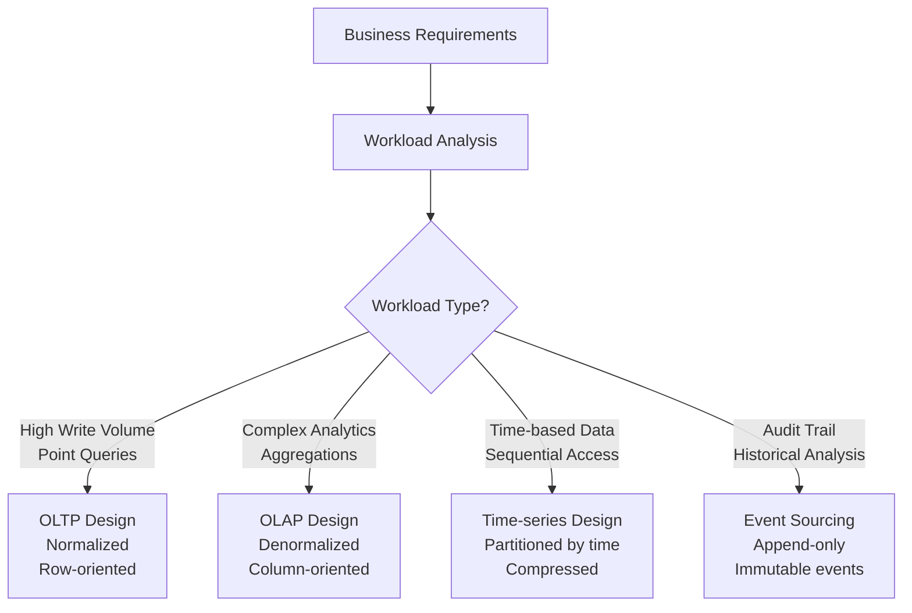

# Data Modeling for Different Workloads

> **Module 10 • Lesson 1**  
> Estimated time: 35 min | Difficulty: ★★★★☆

## 1. Why this matters

Different types of applications require fundamentally different approaches to data modeling. An e-commerce transaction system needs fast, consistent writes and point lookups, while a business intelligence dashboard needs fast aggregations across millions of rows. Understanding how to model data for OLTP (Online Transaction Processing), OLAP (Online Analytical Processing), time-series, and event-driven architectures is crucial for building systems that perform well at scale. The wrong data model can make a system unusable, while the right model can make complex operations trivial.

> **Need a refresher?** This lesson builds on concepts from [Schema Design Patterns](05-01-schema-design-patterns.md) and [Performance Patterns](05-03-performance-patterns.md).

## 2. Key Concepts

- **OLTP vs OLAP**: Transaction processing vs analytical processing requirements
- **Normalization vs denormalization**: When to break normal forms for performance
- **Data warehouse design**: Star schema, snowflake schema, fact and dimension tables
- **Time-series modeling**: Handling time-based data efficiently
- **Event sourcing**: Storing events rather than current state
- **Polyglot persistence**: Using different databases for different parts of the system



## 3. Deep Dive

### 3.1 OLTP vs OLAP Design Considerations

**OLTP (Online Transaction Processing) Characteristics:**
- High volume of small, fast transactions
- Strong consistency requirements (ACID)
- Normalized data to prevent update anomalies
- Optimized for INSERT, UPDATE, DELETE operations
- Current state focus

**OLAP (Online Analytical Processing) Characteristics:**
- Complex queries across large datasets
- Read-heavy workload with batch updates
- Denormalized data for query performance
- Optimized for SELECT operations with aggregations
- Historical data focus

**OLTP Example - E-commerce System:**
```sql
-- Normalized OLTP design
CREATE TABLE customers (
    id INT AUTO_INCREMENT PRIMARY KEY,
    email VARCHAR(255) UNIQUE NOT NULL,
    first_name VARCHAR(100),
    last_name VARCHAR(100),
    created_at TIMESTAMP DEFAULT CURRENT_TIMESTAMP
);

CREATE TABLE orders (
    id INT AUTO_INCREMENT PRIMARY KEY,
    customer_id INT NOT NULL,
    status ENUM('pending', 'processing', 'shipped', 'delivered'),
    order_date TIMESTAMP DEFAULT CURRENT_TIMESTAMP,
    total_amount DECIMAL(10,2),
    FOREIGN KEY (customer_id) REFERENCES customers(id),
    INDEX idx_customer_date (customer_id, order_date)
);

CREATE TABLE order_items (
    id INT AUTO_INCREMENT PRIMARY KEY,
    order_id INT NOT NULL,
    product_id INT NOT NULL,
    quantity INT NOT NULL,
    unit_price DECIMAL(10,2),
    FOREIGN KEY (order_id) REFERENCES orders(id)
);

-- OLTP queries are simple and fast
SELECT * FROM orders WHERE id = 12345;
UPDATE orders SET status = 'shipped' WHERE id = 12345;
```

**OLAP Example - Sales Analytics:**
```sql
-- Denormalized OLAP design (fact table)
CREATE TABLE sales_fact (
    id BIGINT AUTO_INCREMENT PRIMARY KEY,
    order_date DATE NOT NULL,
    customer_id INT,
    customer_name VARCHAR(200),
    customer_country VARCHAR(100),
    product_id INT,
    product_name VARCHAR(200),
    product_category VARCHAR(100),
    quantity INT,
    unit_price DECIMAL(10,2),
    total_amount DECIMAL(10,2),
    -- Partitioned by date for performance
    PARTITION BY RANGE (YEAR(order_date)) (
        PARTITION p2022 VALUES LESS THAN (2023),
        PARTITION p2023 VALUES LESS THAN (2024),
        PARTITION p2024 VALUES LESS THAN (2025)
    )
);

-- OLAP queries are complex aggregations
SELECT 
    customer_country,
    product_category,
    YEAR(order_date) as year,
    SUM(total_amount) as revenue,
    COUNT(*) as order_count,
    AVG(total_amount) as avg_order_value
FROM sales_fact
WHERE order_date BETWEEN '2023-01-01' AND '2023-12-31'
GROUP BY customer_country, product_category, YEAR(order_date)
ORDER BY revenue DESC;
```

### 3.2 Data Warehouse Design Patterns

**Star Schema:**
- Central fact table surrounded by dimension tables
- Denormalized dimensions for query performance
- Simple structure, easy to understand

```sql
-- Star Schema Example
CREATE TABLE sales_fact (
    sale_id BIGINT PRIMARY KEY,
    date_key INT,
    customer_key INT,
    product_key INT,
    store_key INT,
    sales_amount DECIMAL(10,2),
    quantity_sold INT,
    cost_amount DECIMAL(10,2)
);

CREATE TABLE date_dimension (
    date_key INT PRIMARY KEY,
    full_date DATE,
    day_of_week VARCHAR(10),
    month_name VARCHAR(10),
    quarter INT,
    year INT,
    is_weekend BOOLEAN,
    is_holiday BOOLEAN
);

CREATE TABLE customer_dimension (
    customer_key INT PRIMARY KEY,
    customer_id VARCHAR(50),
    customer_name VARCHAR(200),
    city VARCHAR(100),
    state VARCHAR(100),
    country VARCHAR(100),
    customer_segment VARCHAR(50)
);

-- Efficient star schema query
SELECT 
    d.year,
    d.quarter,
    c.country,
    SUM(f.sales_amount) as total_sales
FROM sales_fact f
JOIN date_dimension d ON f.date_key = d.date_key
JOIN customer_dimension c ON f.customer_key = c.customer_key
WHERE d.year = 2024
GROUP BY d.year, d.quarter, c.country;
```

**Snowflake Schema:**
- Normalized dimension tables
- Reduces storage but increases query complexity
- Better for data integrity

```sql
-- Snowflake Schema Example
CREATE TABLE customer_dimension (
    customer_key INT PRIMARY KEY,
    customer_id VARCHAR(50),
    customer_name VARCHAR(200),
    city_key INT  -- References city_dimension
);

CREATE TABLE city_dimension (
    city_key INT PRIMARY KEY,
    city_name VARCHAR(100),
    state_key INT  -- References state_dimension
);

CREATE TABLE state_dimension (
    state_key INT PRIMARY KEY,
    state_name VARCHAR(100),
    country_key INT  -- References country_dimension
);
```

### 3.3 Time-Series Data Modeling

Time-series data has unique characteristics that require specialized modeling:

```sql
-- Time-series table for IoT sensor data
CREATE TABLE sensor_readings (
    id BIGINT AUTO_INCREMENT,
    sensor_id VARCHAR(50) NOT NULL,
    timestamp TIMESTAMP(6) NOT NULL,
    temperature DECIMAL(5,2),
    humidity DECIMAL(5,2),
    pressure DECIMAL(7,2),
    battery_level INT,
    PRIMARY KEY (timestamp, sensor_id),  -- Time-based primary key
    INDEX idx_sensor_time (sensor_id, timestamp)
) PARTITION BY RANGE (UNIX_TIMESTAMP(timestamp)) (
    PARTITION p202401 VALUES LESS THAN (UNIX_TIMESTAMP('2024-02-01')),
    PARTITION p202402 VALUES LESS THAN (UNIX_TIMESTAMP('2024-03-01')),
    PARTITION p202403 VALUES LESS THAN (UNIX_TIMESTAMP('2024-04-01'))
    -- Add partitions as needed
);

-- Time-series aggregation table for performance
CREATE TABLE sensor_readings_hourly (
    sensor_id VARCHAR(50) NOT NULL,
    hour_timestamp TIMESTAMP NOT NULL,
    avg_temperature DECIMAL(5,2),
    min_temperature DECIMAL(5,2),
    max_temperature DECIMAL(5,2),
    avg_humidity DECIMAL(5,2),
    reading_count INT,
    PRIMARY KEY (sensor_id, hour_timestamp)
);

-- Time-series queries
-- Recent data query
SELECT sensor_id, timestamp, temperature
FROM sensor_readings
WHERE sensor_id = 'TEMP_001' 
  AND timestamp >= NOW() - INTERVAL 1 HOUR
ORDER BY timestamp DESC;

-- Aggregated historical query
SELECT 
    DATE(hour_timestamp) as date,
    AVG(avg_temperature) as daily_avg_temp,
    MAX(max_temperature) as daily_max_temp,
    MIN(min_temperature) as daily_min_temp
FROM sensor_readings_hourly
WHERE sensor_id = 'TEMP_001'
  AND hour_timestamp >= '2024-01-01'
GROUP BY DATE(hour_timestamp)
ORDER BY date;
```

### 3.4 Event Sourcing Pattern

Event sourcing stores all changes as a sequence of events rather than just the current state:

```sql
-- Event store table
CREATE TABLE events (
    id BIGINT AUTO_INCREMENT PRIMARY KEY,
    aggregate_id VARCHAR(100) NOT NULL,
    aggregate_type VARCHAR(50) NOT NULL,
    event_type VARCHAR(100) NOT NULL,
    event_data JSON NOT NULL,
    event_version INT NOT NULL,
    timestamp TIMESTAMP(6) DEFAULT CURRENT_TIMESTAMP(6),
    INDEX idx_aggregate (aggregate_id, event_version),
    INDEX idx_type_time (aggregate_type, timestamp)
);

-- Example events for a bank account
INSERT INTO events (aggregate_id, aggregate_type, event_type, event_data, event_version)
VALUES 
('account-123', 'BankAccount', 'AccountOpened', 
 '{"accountId": "account-123", "customerId": "cust-456", "initialBalance": 1000.00}', 1),
('account-123', 'BankAccount', 'MoneyDeposited',
 '{"accountId": "account-123", "amount": 500.00, "description": "Salary deposit"}', 2),
('account-123', 'BankAccount', 'MoneyWithdrawn',
 '{"accountId": "account-123", "amount": 200.00, "description": "ATM withdrawal"}', 3);

-- Snapshot table for performance (optional)
CREATE TABLE account_snapshots (
    aggregate_id VARCHAR(100) PRIMARY KEY,
    aggregate_type VARCHAR(50) NOT NULL,
    snapshot_data JSON NOT NULL,
    snapshot_version INT NOT NULL,
    created_at TIMESTAMP DEFAULT CURRENT_TIMESTAMP,
    INDEX idx_type (aggregate_type)
);

-- Rebuild current state from events
SELECT 
    aggregate_id,
    JSON_EXTRACT(event_data, '$.accountId') as account_id,
    SUM(CASE 
        WHEN event_type = 'AccountOpened' THEN JSON_EXTRACT(event_data, '$.initialBalance')
        WHEN event_type = 'MoneyDeposited' THEN JSON_EXTRACT(event_data, '$.amount')
        WHEN event_type = 'MoneyWithdrawn' THEN -JSON_EXTRACT(event_data, '$.amount')
        ELSE 0
    END) as current_balance
FROM events
WHERE aggregate_id = 'account-123'
GROUP BY aggregate_id;
```

### 3.5 Polyglot Persistence Strategy

Different parts of an application may benefit from different database technologies:

```sql
-- MySQL for transactional data (OLTP)
CREATE TABLE orders (
    id INT AUTO_INCREMENT PRIMARY KEY,
    customer_id INT,
    status VARCHAR(20),
    created_at TIMESTAMP
);

-- Use alongside:
-- - Redis for session storage and caching
-- - Elasticsearch for full-text search
-- - InfluxDB for time-series metrics
-- - Neo4j for recommendation graphs
-- - MongoDB for product catalogs with varying schemas
```

## 4. Hands-On Practice

Let's design data models for different workload scenarios:

```sql
-- Scenario 1: Social Media Platform
-- OLTP design for posts and interactions
CREATE TABLE users (
    id BIGINT AUTO_INCREMENT PRIMARY KEY,
    username VARCHAR(50) UNIQUE NOT NULL,
    email VARCHAR(255) UNIQUE NOT NULL,
    created_at TIMESTAMP DEFAULT CURRENT_TIMESTAMP
);

CREATE TABLE posts (
    id BIGINT AUTO_INCREMENT PRIMARY KEY,
    user_id BIGINT NOT NULL,
    content TEXT,
    created_at TIMESTAMP DEFAULT CURRENT_TIMESTAMP,
    FOREIGN KEY (user_id) REFERENCES users(id),
    INDEX idx_user_time (user_id, created_at)
);

CREATE TABLE post_interactions (
    id BIGINT AUTO_INCREMENT PRIMARY KEY,
    post_id BIGINT NOT NULL,
    user_id BIGINT NOT NULL,
    interaction_type ENUM('like', 'share', 'comment'),
    created_at TIMESTAMP DEFAULT CURRENT_TIMESTAMP,
    FOREIGN KEY (post_id) REFERENCES posts(id),
    FOREIGN KEY (user_id) REFERENCES users(id),
    UNIQUE KEY unique_interaction (post_id, user_id, interaction_type)
);

-- OLAP design for analytics
CREATE TABLE social_analytics_fact (
    date_key INT,
    user_key BIGINT,
    post_count INT,
    like_count INT,
    share_count INT,
    comment_count INT,
    engagement_score DECIMAL(10,4),
    PRIMARY KEY (date_key, user_key)
) PARTITION BY RANGE (date_key) (
    PARTITION p2024_q1 VALUES LESS THAN (20240401),
    PARTITION p2024_q2 VALUES LESS THAN (20240701),
    PARTITION p2024_q3 VALUES LESS THAN (20241001),
    PARTITION p2024_q4 VALUES LESS THAN (20250101)
);

-- Scenario 2: Financial Trading System
-- Event sourcing for trade events
CREATE TABLE trade_events (
    id BIGINT AUTO_INCREMENT PRIMARY KEY,
    trade_id VARCHAR(100) NOT NULL,
    event_type VARCHAR(50) NOT NULL,
    symbol VARCHAR(10) NOT NULL,
    quantity DECIMAL(15,4),
    price DECIMAL(15,4),
    timestamp TIMESTAMP(6) DEFAULT CURRENT_TIMESTAMP(6),
    event_data JSON,
    INDEX idx_trade_time (trade_id, timestamp),
    INDEX idx_symbol_time (symbol, timestamp)
);

-- Time-series for market data
CREATE TABLE market_data (
    symbol VARCHAR(10) NOT NULL,
    timestamp TIMESTAMP(6) NOT NULL,
    open_price DECIMAL(15,4),
    high_price DECIMAL(15,4),
    low_price DECIMAL(15,4),
    close_price DECIMAL(15,4),
    volume BIGINT,
    PRIMARY KEY (symbol, timestamp)
) PARTITION BY RANGE (UNIX_TIMESTAMP(timestamp)) (
    PARTITION p_current VALUES LESS THAN MAXVALUE
);
```

**Practice Exercises:**

1. **Design an e-learning platform** with both OLTP (enrollment, progress tracking) and OLAP (learning analytics) requirements
2. **Model a logistics system** with real-time package tracking and historical reporting
3. **Create an event sourcing model** for an inventory management system
4. **Design time-series tables** for application performance monitoring

## 5. Common Pitfalls

### 5.1 One-Size-Fits-All Approach
**Problem**: Using the same data model for all workloads
**Solution**: Analyze workload patterns and choose appropriate modeling strategies

### 5.2 Over-normalization in Analytics
**Problem**: Keeping OLTP normalization in data warehouses
```sql
-- Inefficient for analytics
SELECT c.name, p.name, SUM(oi.quantity * oi.price)
FROM customers c
JOIN orders o ON c.id = o.customer_id
JOIN order_items oi ON o.id = oi.order_id
JOIN products p ON oi.product_id = p.id
GROUP BY c.name, p.name;
```
**Solution**: Denormalize for analytical queries

### 5.3 Ignoring Time-Series Characteristics
**Problem**: Treating time-series data like regular relational data
**Solution**: Use time-based partitioning and appropriate indexing strategies

### 5.4 Event Sourcing Complexity
**Problem**: Applying event sourcing everywhere
**Solution**: Use event sourcing only where audit trails and temporal queries are critical

### 5.5 Missing Aggregation Tables
**Problem**: Running complex aggregations on raw data repeatedly
**Solution**: Pre-calculate and store common aggregations

## 6. Knowledge Check

<details>
<summary>1. What are the key differences between OLTP and OLAP data modeling approaches?</summary>

OLTP focuses on normalized data for fast transactions, strong consistency, and current state. OLAP focuses on denormalized data for fast analytics, eventual consistency acceptable, and historical analysis. OLTP optimizes for writes, OLAP optimizes for reads.
</details>

<details>
<summary>2. When would you choose a star schema over a snowflake schema?</summary>

Choose star schema when query performance is more important than storage space and data integrity. Star schema has fewer joins and is easier to understand, making it better for most analytical workloads. Snowflake schema is better when storage space is limited and data integrity is critical.
</details>

<details>
<summary>3. What makes time-series data different from regular relational data?</summary>

Time-series data is typically append-only, has a natural time-based ordering, often requires aggregations over time windows, and benefits from time-based partitioning. It's usually queried by time ranges and requires efficient compression for storage.
</details>

<details>
<summary>4. What are the benefits and drawbacks of event sourcing?</summary>

Benefits: Complete audit trail, ability to replay events, temporal queries, debugging capabilities. Drawbacks: Increased complexity, eventual consistency challenges, potential performance issues, and the need for event versioning and migration strategies.
</details>

<details>
<summary>5. How do you decide when to use polyglot persistence?</summary>

Use polyglot persistence when different parts of your system have fundamentally different data access patterns, consistency requirements, or scalability needs. Consider the operational complexity, data consistency requirements, and team expertise before adopting multiple database technologies.
</details>

## 7. Further Reading

- [The Data Warehouse Toolkit by Ralph Kimball](https://www.kimballgroup.com/data-warehouse-business-intelligence-resources/books/)
- [Designing Data-Intensive Applications by Martin Kleppmann](https://dataintensive.net/)
- [Event Sourcing Pattern - Microsoft Architecture Center](https://docs.microsoft.com/en-us/azure/architecture/patterns/event-sourcing)
- [Time Series Database Requirements](https://blog.timescale.com/blog/what-the-heck-is-time-series-data-and-why-do-i-need-a-time-series-database-dcf3b1b18563/)
- [Star Schema vs Snowflake Schema](https://www.vertabelo.com/blog/data-warehouse-modeling-star-schema-vs-snowflake-schema/)

---

**Navigation**

[← Previous: Monitoring and Maintenance](09-03-monitoring-maintenance.md) | [Next → Security and Compliance](10-02-security-compliance.md)

_Last updated: 2025-01-21_ 