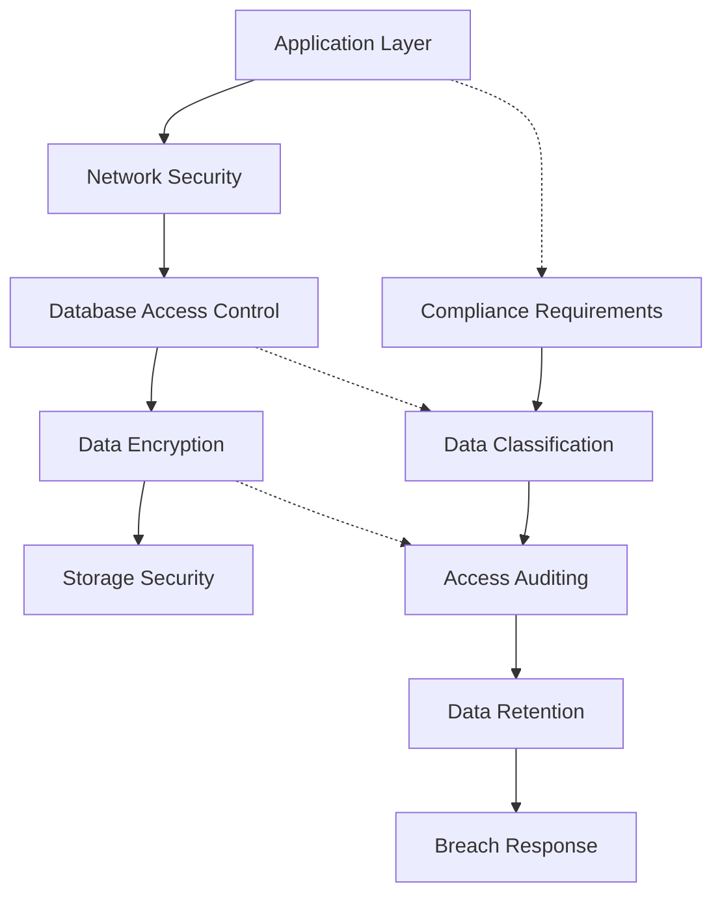

# Security and Compliance

> **Module 10 • Lesson 2**  
> Estimated time: 40 min | Difficulty: ★★★★☆

## 1. Why this matters

Database security isn't just about preventing unauthorized access—it's about protecting your organization's most valuable asset: data. A single security breach can result in millions in fines, loss of customer trust, and regulatory penalties. Modern applications must comply with regulations like GDPR, HIPAA, SOX, and PCI DSS, each with specific requirements for data protection, access control, and audit trails. Understanding how to implement defense-in-depth security, handle PII correctly, and maintain compliance isn't optional—it's essential for any production database system.

> **Need a refresher?** This lesson builds on concepts from [Data Control Language (DCL) & Transaction Control (TCL)](03-03-data-control-transaction-control.md) and [Production Issues and Debugging](09-02-production-issues-debugging.md).

## 2. Key Concepts

- **Defense in depth**: Multiple layers of security controls
- **Principle of least privilege**: Users get minimum necessary permissions
- **Data classification**: Identifying and protecting sensitive data
- **Encryption**: At rest, in transit, and in processing
- **Access control**: Authentication, authorization, and auditing
- **Compliance frameworks**: GDPR, HIPAA, SOX, PCI DSS requirements



## 3. Deep Dive

### 3.1 SQL Injection Prevention

SQL injection remains one of the most dangerous security vulnerabilities:

**Vulnerable Code (Never do this):**
```sql
-- Dangerous: Direct string concatenation
query = "SELECT * FROM users WHERE username = '" + username + "' AND password = '" + password + "'";

-- Attacker input: username = "admin'; DROP TABLE users; --"
-- Results in: SELECT * FROM users WHERE username = 'admin'; DROP TABLE users; --' AND password = '...'
```

**Secure Implementation:**
```sql
-- Use parameterized queries/prepared statements
PREPARE stmt FROM 'SELECT * FROM users WHERE username = ? AND password = ?';
SET @username = 'john_doe';
SET @password = 'hashed_password';
EXECUTE stmt USING @username, @password;
DEALLOCATE PREPARE stmt;

-- Or using application-level prepared statements (preferred)
-- Java example: PreparedStatement ps = connection.prepareStatement("SELECT * FROM users WHERE username = ? AND password = ?");
-- PHP example: $stmt = $pdo->prepare("SELECT * FROM users WHERE username = ? AND password = ?");
```

**Input Validation and Sanitization:**
```sql
-- Create stored procedures for complex operations
DELIMITER //
CREATE PROCEDURE GetUserOrders(
    IN user_id INT,
    IN start_date DATE,
    IN end_date DATE
)
BEGIN
    -- Validate inputs
    IF user_id <= 0 THEN
        SIGNAL SQLSTATE '45000' SET MESSAGE_TEXT = 'Invalid user ID';
    END IF;
    
    IF start_date > end_date THEN
        SIGNAL SQLSTATE '45000' SET MESSAGE_TEXT = 'Invalid date range';
    END IF;
    
    -- Safe query execution
    SELECT o.id, o.order_date, o.total
    FROM orders o
    WHERE o.customer_id = user_id
      AND o.order_date BETWEEN start_date AND end_date
    ORDER BY o.order_date DESC;
END //
DELIMITER ;
```

### 3.2 Access Control and User Management

**Principle of Least Privilege Implementation:**
```sql
-- Create role-based access control
CREATE ROLE 'app_read_only';
CREATE ROLE 'app_read_write';
CREATE ROLE 'app_admin';
CREATE ROLE 'data_analyst';

-- Grant specific permissions to roles
GRANT SELECT ON ecommerce.products TO 'app_read_only';
GRANT SELECT ON ecommerce.customers TO 'app_read_only';
GRANT SELECT ON ecommerce.orders TO 'app_read_only';

GRANT SELECT, INSERT, UPDATE ON ecommerce.orders TO 'app_read_write';
GRANT SELECT, INSERT, UPDATE ON ecommerce.order_items TO 'app_read_write';
GRANT SELECT ON ecommerce.products TO 'app_read_write';
GRANT SELECT ON ecommerce.customers TO 'app_read_write';

GRANT ALL PRIVILEGES ON ecommerce.* TO 'app_admin';

-- Analytics role with restricted access
GRANT SELECT ON ecommerce.orders TO 'data_analyst';
GRANT SELECT ON ecommerce.order_items TO 'data_analyst';
GRANT SELECT ON ecommerce.products TO 'data_analyst';
-- Note: No access to customers table (PII protection)

-- Create users and assign roles
CREATE USER 'app_service'@'10.0.1.%' IDENTIFIED BY 'strong_password_here';
CREATE USER 'analyst_john'@'%' IDENTIFIED BY 'another_strong_password';
CREATE USER 'dba_admin'@'localhost' IDENTIFIED BY 'admin_password';

GRANT 'app_read_write' TO 'app_service'@'10.0.1.%';
GRANT 'data_analyst' TO 'analyst_john'@'%';
GRANT 'app_admin' TO 'dba_admin'@'localhost';

-- Activate roles
SET DEFAULT ROLE ALL TO 'app_service'@'10.0.1.%';
SET DEFAULT ROLE ALL TO 'analyst_john'@'%';
SET DEFAULT ROLE ALL TO 'dba_admin'@'localhost';
```

**Network Security:**
```sql
-- Restrict connections by IP/network
CREATE USER 'web_app'@'10.0.1.0/255.255.255.0' IDENTIFIED BY 'password';
CREATE USER 'backup_service'@'192.168.1.100' IDENTIFIED BY 'backup_password';

-- Enable SSL/TLS encryption
-- In my.cnf:
-- ssl-ca=/path/to/ca.pem
-- ssl-cert=/path/to/server-cert.pem
-- ssl-key=/path/to/server-key.pem
-- require_secure_transport=ON

-- Require SSL for specific users
ALTER USER 'web_app'@'10.0.1.0/255.255.255.0' REQUIRE SSL;
```

### 3.3 Data Encryption

**Encryption at Rest:**
```sql
-- Enable InnoDB encryption
-- In my.cnf:
-- early-plugin-load=keyring_file.so
-- keyring_file_data=/var/lib/mysql-keyring/keyring

-- Create encrypted tables
CREATE TABLE sensitive_data (
    id INT AUTO_INCREMENT PRIMARY KEY,
    ssn VARCHAR(11) NOT NULL,
    credit_card VARCHAR(19),
    medical_record TEXT,
    created_at TIMESTAMP DEFAULT CURRENT_TIMESTAMP
) ENCRYPTION='Y';

-- Encrypt existing table
ALTER TABLE customer_data ENCRYPTION='Y';

-- Application-level encryption for highly sensitive data
CREATE TABLE encrypted_records (
    id INT AUTO_INCREMENT PRIMARY KEY,
    user_id INT NOT NULL,
    encrypted_data VARBINARY(1000),  -- AES encrypted data
    encryption_key_id VARCHAR(50),    -- Reference to key management system
    created_at TIMESTAMP DEFAULT CURRENT_TIMESTAMP
);

-- Example of application-level encryption (MySQL functions)
INSERT INTO encrypted_records (user_id, encrypted_data, encryption_key_id)
VALUES (
    123,
    AES_ENCRYPT('sensitive personal data', UNHEX(SHA2('encryption_key',256))),
    'key_id_v1'
);

-- Decrypt data (only in application, never in logs)
SELECT 
    user_id,
    AES_DECRYPT(encrypted_data, UNHEX(SHA2('encryption_key',256))) as decrypted_data
FROM encrypted_records
WHERE user_id = 123;
```

**Column-Level Encryption:**
```sql
-- Hash sensitive data (one-way)
CREATE TABLE user_auth (
    id INT AUTO_INCREMENT PRIMARY KEY,
    username VARCHAR(50) UNIQUE NOT NULL,
    password_hash VARCHAR(255) NOT NULL,  -- bcrypt/scrypt hash
    salt VARCHAR(32) NOT NULL,
    last_login TIMESTAMP,
    failed_attempts INT DEFAULT 0,
    locked_until TIMESTAMP NULL
);

-- Insert hashed password (done in application)
INSERT INTO user_auth (username, password_hash, salt)
VALUES ('john_doe', '$2b$12$LQv3c1yqBWVHxkd0LHAkCOYz6TtxMQJqhN8/LewdBPj/kMxd7td8.', 'random_salt');

-- Tokenization for credit cards
CREATE TABLE payment_tokens (
    id INT AUTO_INCREMENT PRIMARY KEY,
    user_id INT NOT NULL,
    token VARCHAR(50) UNIQUE NOT NULL,  -- Non-sensitive token
    card_last_four CHAR(4),             -- For display purposes
    card_type VARCHAR(20),
    expires_at DATE,
    created_at TIMESTAMP DEFAULT CURRENT_TIMESTAMP,
    -- Actual card data stored in separate, highly secured system
    INDEX idx_user_token (user_id, token)
);
```

### 3.4 Audit Logging and Compliance

**Comprehensive Audit Trail:**
```sql
-- Enable MySQL audit logging
-- Install audit plugin and configure in my.cnf:
-- plugin-load-add=audit_log.so
-- audit_log_policy=ALL
-- audit_log_format=JSON

-- Create custom audit table for application-level tracking
CREATE TABLE audit_log (
    id BIGINT AUTO_INCREMENT PRIMARY KEY,
    table_name VARCHAR(100) NOT NULL,
    operation ENUM('INSERT', 'UPDATE', 'DELETE', 'SELECT') NOT NULL,
    record_id VARCHAR(100),
    user_id INT,
    username VARCHAR(100),
    ip_address VARCHAR(45),
    user_agent TEXT,
    old_values JSON,
    new_values JSON,
    timestamp TIMESTAMP(6) DEFAULT CURRENT_TIMESTAMP(6),
    INDEX idx_table_time (table_name, timestamp),
    INDEX idx_user_time (user_id, timestamp)
) PARTITION BY RANGE (UNIX_TIMESTAMP(timestamp)) (
    PARTITION p_2024_01 VALUES LESS THAN (UNIX_TIMESTAMP('2024-02-01')),
    PARTITION p_2024_02 VALUES LESS THAN (UNIX_TIMESTAMP('2024-03-01'))
    -- Add partitions monthly for performance
);

-- Trigger-based auditing for sensitive tables
DELIMITER //
CREATE TRIGGER customer_audit_update
AFTER UPDATE ON customers
FOR EACH ROW
BEGIN
    INSERT INTO audit_log (
        table_name, operation, record_id, user_id, old_values, new_values
    ) VALUES (
        'customers',
        'UPDATE',
        NEW.id,
        @audit_user_id,
        JSON_OBJECT(
            'name', OLD.name,
            'email', OLD.email,
            'phone', OLD.phone
        ),
        JSON_OBJECT(
            'name', NEW.name,
            'email', NEW.email,
            'phone', NEW.phone
        )
    );
END //

CREATE TRIGGER customer_audit_delete
AFTER DELETE ON customers
FOR EACH ROW
BEGIN
    INSERT INTO audit_log (
        table_name, operation, record_id, user_id, old_values
    ) VALUES (
        'customers',
        'DELETE',
        OLD.id,
        @audit_user_id,
        JSON_OBJECT(
            'name', OLD.name,
            'email', OLD.email,
            'phone', OLD.phone
        )
    );
END //
DELIMITER ;
```

**GDPR Compliance Implementation:**
```sql
-- Data subject rights implementation
CREATE TABLE data_subject_requests (
    id INT AUTO_INCREMENT PRIMARY KEY,
    request_type ENUM('access', 'rectification', 'erasure', 'portability', 'restriction') NOT NULL,
    subject_email VARCHAR(255) NOT NULL,
    subject_id INT,
    request_date TIMESTAMP DEFAULT CURRENT_TIMESTAMP,
    completion_date TIMESTAMP NULL,
    status ENUM('pending', 'in_progress', 'completed', 'rejected') DEFAULT 'pending',
    notes TEXT,
    processed_by INT,
    INDEX idx_status_date (status, request_date)
);

-- Right to be forgotten implementation
DELIMITER //
CREATE PROCEDURE ProcessErasureRequest(
    IN subject_id INT,
    IN request_id INT
)
BEGIN
    DECLARE EXIT HANDLER FOR SQLEXCEPTION
    BEGIN
        ROLLBACK;
        RESIGNAL;
    END;
    
    START TRANSACTION;
    
    -- Anonymize personal data instead of deleting (for referential integrity)
    UPDATE customers 
    SET 
        name = CONCAT('DELETED_USER_', id),
        email = CONCAT('deleted_', id, '@example.com'),
        phone = NULL,
        address = NULL,
        date_of_birth = NULL,
        gdpr_deleted = TRUE,
        deletion_date = CURRENT_TIMESTAMP
    WHERE id = subject_id;
    
    -- Remove from marketing lists
    DELETE FROM marketing_subscriptions WHERE customer_id = subject_id;
    
    -- Update request status
    UPDATE data_subject_requests 
    SET status = 'completed', completion_date = CURRENT_TIMESTAMP
    WHERE id = request_id;
    
    -- Log the action
    INSERT INTO audit_log (table_name, operation, record_id, new_values)
    VALUES ('customers', 'GDPR_ERASURE', subject_id, JSON_OBJECT('request_id', request_id));
    
    COMMIT;
END //
DELIMITER ;

-- Data portability (export user data)
CREATE VIEW customer_data_export AS
SELECT 
    c.id,
    c.name,
    c.email,
    c.phone,
    c.created_at,
    GROUP_CONCAT(
        JSON_OBJECT(
            'order_id', o.id,
            'order_date', o.order_date,
            'total', o.total,
            'status', o.status
        )
    ) as orders
FROM customers c
LEFT JOIN orders o ON c.id = o.customer_id
WHERE c.gdpr_deleted = FALSE
GROUP BY c.id;
```

### 3.5 Data Classification and Masking

**Data Classification Schema:**
```sql
-- Metadata table for data classification
CREATE TABLE data_classification (
    id INT AUTO_INCREMENT PRIMARY KEY,
    table_name VARCHAR(100) NOT NULL,
    column_name VARCHAR(100) NOT NULL,
    classification ENUM('public', 'internal', 'confidential', 'restricted') NOT NULL,
    data_type ENUM('pii', 'financial', 'health', 'technical', 'business') NOT NULL,
    retention_period_days INT,
    encryption_required BOOLEAN DEFAULT FALSE,
    masking_required BOOLEAN DEFAULT FALSE,
    UNIQUE KEY unique_column (table_name, column_name)
);

-- Populate classification data
INSERT INTO data_classification (table_name, column_name, classification, data_type, encryption_required, masking_required) VALUES
('customers', 'name', 'confidential', 'pii', TRUE, TRUE),
('customers', 'email', 'confidential', 'pii', TRUE, TRUE),
('customers', 'phone', 'confidential', 'pii', TRUE, TRUE),
('customers', 'ssn', 'restricted', 'pii', TRUE, TRUE),
('orders', 'total', 'internal', 'financial', FALSE, FALSE),
('payment_methods', 'card_number', 'restricted', 'financial', TRUE, TRUE);

-- Data masking for non-production environments
CREATE TABLE customers_masked AS
SELECT 
    id,
    CONCAT('Customer_', id) as name,
    CONCAT('user', id, '@example.com') as email,
    CONCAT('555-', LPAD(id % 10000, 4, '0')) as phone,
    'XXX-XX-', RIGHT(ssn, 4) as ssn,
    created_at
FROM customers;

-- Dynamic data masking view for analysts
CREATE VIEW customers_analyst_view AS
SELECT 
    id,
    CASE 
        WHEN @user_role = 'data_analyst' THEN CONCAT(LEFT(name, 1), '***')
        ELSE name
    END as name,
    CASE 
        WHEN @user_role = 'data_analyst' THEN CONCAT('***@', SUBSTRING_INDEX(email, '@', -1))
        ELSE email
    END as email,
    CASE 
        WHEN @user_role = 'data_analyst' THEN 'XXX-XXX-XXXX'
        ELSE phone
    END as phone,
    created_at
FROM customers;
```

## 4. Hands-On Practice

Let's implement a comprehensive security setup:

```sql
-- 1. Create a secure multi-tenant application database
CREATE DATABASE secure_saas;
USE secure_saas;

-- 2. Implement row-level security with tenant isolation
CREATE TABLE tenants (
    id INT AUTO_INCREMENT PRIMARY KEY,
    name VARCHAR(100) NOT NULL,
    subdomain VARCHAR(50) UNIQUE NOT NULL,
    created_at TIMESTAMP DEFAULT CURRENT_TIMESTAMP,
    is_active BOOLEAN DEFAULT TRUE
);

CREATE TABLE tenant_users (
    id INT AUTO_INCREMENT PRIMARY KEY,
    tenant_id INT NOT NULL,
    username VARCHAR(50) NOT NULL,
    email VARCHAR(255) NOT NULL,
    password_hash VARCHAR(255) NOT NULL,
    role ENUM('admin', 'user', 'viewer') DEFAULT 'user',
    last_login TIMESTAMP NULL,
    is_active BOOLEAN DEFAULT TRUE,
    created_at TIMESTAMP DEFAULT CURRENT_TIMESTAMP,
    FOREIGN KEY (tenant_id) REFERENCES tenants(id),
    UNIQUE KEY unique_tenant_username (tenant_id, username),
    UNIQUE KEY unique_tenant_email (tenant_id, email)
);

CREATE TABLE tenant_data (
    id INT AUTO_INCREMENT PRIMARY KEY,
    tenant_id INT NOT NULL,
    data_type VARCHAR(50) NOT NULL,
    sensitive_data JSON,
    created_by INT,
    created_at TIMESTAMP DEFAULT CURRENT_TIMESTAMP,
    updated_at TIMESTAMP DEFAULT CURRENT_TIMESTAMP ON UPDATE CURRENT_TIMESTAMP,
    FOREIGN KEY (tenant_id) REFERENCES tenants(id),
    FOREIGN KEY (created_by) REFERENCES tenant_users(id)
) ENCRYPTION='Y';

-- 3. Create security views with row-level filtering
CREATE VIEW secure_tenant_data AS
SELECT 
    td.id,
    td.data_type,
    td.sensitive_data,
    td.created_at
FROM tenant_data td
WHERE td.tenant_id = @current_tenant_id
  AND EXISTS (
    SELECT 1 FROM tenant_users tu 
    WHERE tu.id = @current_user_id 
      AND tu.tenant_id = td.tenant_id
      AND tu.is_active = TRUE
  );

-- 4. Implement comprehensive audit logging
CREATE TABLE security_events (
    id BIGINT AUTO_INCREMENT PRIMARY KEY,
    event_type ENUM('login', 'logout', 'failed_login', 'data_access', 'data_modification', 'admin_action') NOT NULL,
    tenant_id INT,
    user_id INT,
    ip_address VARCHAR(45),
    user_agent TEXT,
    resource_accessed VARCHAR(255),
    event_details JSON,
    risk_score INT DEFAULT 0,  -- 0-100 risk assessment
    timestamp TIMESTAMP(6) DEFAULT CURRENT_TIMESTAMP(6),
    INDEX idx_tenant_time (tenant_id, timestamp),
    INDEX idx_event_type_time (event_type, timestamp),
    INDEX idx_risk_score (risk_score)
);

-- 5. Create stored procedures for secure operations
DELIMITER //
CREATE PROCEDURE SecureLogin(
    IN p_username VARCHAR(50),
    IN p_password_hash VARCHAR(255),
    IN p_tenant_id INT,
    IN p_ip_address VARCHAR(45),
    IN p_user_agent TEXT,
    OUT p_user_id INT,
    OUT p_success BOOLEAN
)
BEGIN
    DECLARE v_stored_hash VARCHAR(255);
    DECLARE v_user_id INT;
    DECLARE v_failed_attempts INT DEFAULT 0;
    DECLARE v_locked_until TIMESTAMP;
    
    -- Check for user
    SELECT id, password_hash, failed_login_attempts, locked_until
    INTO v_user_id, v_stored_hash, v_failed_attempts, v_locked_until
    FROM tenant_users
    WHERE username = p_username 
      AND tenant_id = p_tenant_id 
      AND is_active = TRUE;
    
    -- Check if account is locked
    IF v_locked_until IS NOT NULL AND v_locked_until > NOW() THEN
        SET p_success = FALSE;
        SET p_user_id = NULL;
        
        INSERT INTO security_events (event_type, tenant_id, user_id, ip_address, user_agent, risk_score)
        VALUES ('failed_login', p_tenant_id, v_user_id, p_ip_address, p_user_agent, 80);
        
    ELSEIF v_stored_hash = p_password_hash THEN
        -- Successful login
        SET p_success = TRUE;
        SET p_user_id = v_user_id;
        
        UPDATE tenant_users 
        SET last_login = NOW(), failed_login_attempts = 0, locked_until = NULL
        WHERE id = v_user_id;
        
        INSERT INTO security_events (event_type, tenant_id, user_id, ip_address, user_agent, risk_score)
        VALUES ('login', p_tenant_id, v_user_id, p_ip_address, p_user_agent, 0);
        
    ELSE
        -- Failed login
        SET p_success = FALSE;
        SET p_user_id = NULL;
        
        UPDATE tenant_users 
        SET failed_login_attempts = failed_login_attempts + 1,
            locked_until = CASE 
                WHEN failed_login_attempts >= 4 THEN DATE_ADD(NOW(), INTERVAL 30 MINUTE)
                ELSE locked_until
            END
        WHERE id = v_user_id;
        
        INSERT INTO security_events (event_type, tenant_id, user_id, ip_address, user_agent, risk_score)
        VALUES ('failed_login', p_tenant_id, v_user_id, p_ip_address, p_user_agent, 60);
    END IF;
END //
DELIMITER ;
```

**Practice Exercises:**

1. **Implement PCI DSS compliance** for a payment processing system
2. **Create a HIPAA-compliant** patient data management system
3. **Design data retention policies** with automatic deletion
4. **Build an incident response system** for security breaches

## 5. Common Pitfalls

### 5.1 Storing Passwords in Plain Text
**Problem**: Storing passwords without proper hashing
**Solution**: Use bcrypt, scrypt, or Argon2 with proper salt

### 5.2 Over-Privileged Database Users
**Problem**: Application connecting with admin privileges
**Solution**: Create specific users with minimal required permissions

### 5.3 Insufficient Audit Logging
**Problem**: Not logging access to sensitive data
**Solution**: Implement comprehensive audit trails for all data access

### 5.4 Weak Encryption Key Management
**Problem**: Storing encryption keys in the same database
**Solution**: Use external key management systems (AWS KMS, HashiCorp Vault)

### 5.5 Ignoring Data Classification
**Problem**: Treating all data with the same security level
**Solution**: Classify data and apply appropriate protection measures

## 6. Knowledge Check

<details>
<summary>1. What are the key components of defense-in-depth database security?</summary>

Network security (firewalls, VPNs), access controls (authentication/authorization), encryption (at rest and in transit), audit logging, input validation, and security monitoring. Each layer provides protection if other layers fail.
</details>

<details>
<summary>2. How do you implement the principle of least privilege in MySQL?</summary>

Create specific roles with minimal required permissions, assign users to appropriate roles, regularly review and revoke unnecessary permissions, use specific grants rather than wildcards, and implement time-limited access for administrative tasks.
</details>

<details>
<summary>3. What's the difference between hashing and encryption for sensitive data?</summary>

Hashing is one-way (passwords, integrity checks) - you can't recover the original data. Encryption is two-way (credit cards, PII) - you can decrypt with the proper key. Use hashing for authentication, encryption for data that needs to be retrieved.
</details>

<details>
<summary>4. What are the key GDPR requirements for database design?</summary>

Right to access (data export), right to rectification (data correction), right to erasure (deletion/anonymization), data portability, consent management, breach notification within 72 hours, and privacy by design principles.
</details>

<details>
<summary>5. How do you prevent SQL injection attacks?</summary>

Use parameterized queries/prepared statements, validate and sanitize all input, implement stored procedures for complex operations, use least privilege database accounts, and never concatenate user input directly into SQL strings.
</details>

## 7. Further Reading

- [OWASP Database Security Cheat Sheet](https://cheatsheetseries.owasp.org/cheatsheets/Database_Security_Cheat_Sheet.html)
- [MySQL Security Documentation](https://dev.mysql.com/doc/refman/8.0/en/security.html)
- [GDPR Compliance Guide for Developers](https://gdpr.eu/developers/)
- [NIST Cybersecurity Framework](https://www.nist.gov/cyberframework)
- [PCI DSS Requirements](https://www.pcisecuritystandards.org/pci_security/)
- [Database Encryption Best Practices](https://www.imperva.com/learn/data-security/database-encryption/)

---

**Navigation**

[← Previous: Data Modeling for Different Workloads](10-01-data-modeling-workloads.md) | [Next → Integration and Migration](10-03-integration-migration.md)

_Last updated: 2025-06-21_ 