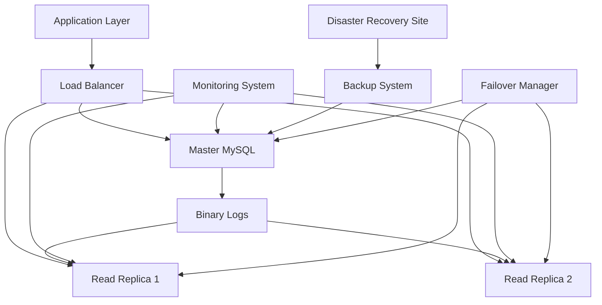

# Project 3: High-Availability System

> **Assessment Project • Final Capstone**  
> Estimated time: 3-5 days | Difficulty: ★★★★★

## 1. Why this matters

High availability (HA) is critical for production database systems where downtime means lost revenue, damaged reputation, and frustrated users. This capstone project brings together everything you've learned about MySQL to build a robust, fault-tolerant database system that can handle hardware failures, network partitions, and maintenance operations with minimal service interruption. You'll implement the same patterns used by major companies to achieve 99.9%+ uptime.

> **Prerequisites**: This project requires knowledge from [Replication and High Availability](07-03-replication-high-availability.md), [ACID Properties](06-01-acid-properties.md), [Monitoring and Maintenance](09-03-monitoring-maintenance.md), and [Server Configuration](08-03-server-configuration-tuning.md).

## 2. Project Overview

You'll design and implement a complete high-availability MySQL system including:

- **Master-slave replication** with automatic failover
- **Load balancing** for read/write traffic distribution  
- **Monitoring and alerting** for proactive issue detection
- **Backup and recovery** procedures with point-in-time recovery
- **Disaster recovery** planning and testing
- **Performance optimization** under high load



## 3. Architecture Requirements

### 3.1 System Components

**Primary Infrastructure**:
- 1 Master MySQL server (write operations)
- 2+ Read replica servers (read operations)
- 1 Load balancer (ProxySQL or HAProxy)
- 1 Monitoring server (Prometheus + Grafana)
- 1 Backup server with automated scheduling

**High Availability Features**:
- Automatic failover (< 30 seconds RTO)
- Zero data loss replication (RPO = 0)
- Health checks and monitoring
- Automated backup verification
- Disaster recovery site

### 3.2 Performance Targets

- **Availability**: 99.9% uptime (< 9 hours downtime/year)
- **Recovery Time Objective (RTO)**: < 30 seconds for failover
- **Recovery Point Objective (RPO)**: 0 seconds (no data loss)
- **Read throughput**: Handle 10,000+ queries/second
- **Write throughput**: Handle 1,000+ transactions/second

## 4. Implementation Guide

### 4.1 Phase 1: Master-Slave Replication Setup

First, establish the core replication topology:

```sql
-- Master server configuration (my.cnf)
[mysqld]
server-id = 1
log-bin = mysql-bin
binlog-format = ROW
gtid-mode = ON
enforce-gtid-consistency = ON
sync_binlog = 1
innodb_flush_log_at_trx_commit = 1

-- Enable semi-synchronous replication for zero data loss
plugin-load = "rpl_semi_sync_master=semisync_master.so"
rpl_semi_sync_master_enabled = 1
rpl_semi_sync_master_timeout = 1000

-- Performance and reliability settings
innodb_buffer_pool_size = 70% of RAM
innodb_log_file_size = 512M
innodb_flush_method = O_DIRECT
max_connections = 1000
```

```sql
-- Replica server configuration (my.cnf)
[mysqld]
server-id = 2  -- Use unique IDs: 3, 4, etc. for additional replicas
log-bin = mysql-bin
binlog-format = ROW
gtid-mode = ON
enforce-gtid-consistency = ON
read_only = 1
super_read_only = 1

-- Semi-synchronous replication slave
plugin-load = "rpl_semi_sync_slave=semisync_slave.so"
rpl_semi_sync_slave_enabled = 1

-- Replica-specific optimizations
slave_parallel_workers = 4
slave_parallel_type = LOGICAL_CLOCK
slave_preserve_commit_order = 1
```

**Setup Replication**:
```sql
-- On master: Create replication user
CREATE USER 'replicator'@'%' IDENTIFIED BY 'strong_password_here';
GRANT REPLICATION SLAVE ON *.* TO 'replicator'@'%';
FLUSH PRIVILEGES;

-- Get master status
SHOW MASTER STATUS;

-- On replica: Configure replication
CHANGE MASTER TO
    MASTER_HOST = '10.0.1.100',
    MASTER_USER = 'replicator',
    MASTER_PASSWORD = 'strong_password_here',
    MASTER_AUTO_POSITION = 1;

START SLAVE;
SHOW SLAVE STATUS\G
```

### 4.2 Phase 2: Load Balancer Configuration

Set up ProxySQL for intelligent query routing:

```sql
-- ProxySQL configuration
-- Install and configure ProxySQL
-- Add MySQL servers
INSERT INTO mysql_servers(hostgroup_id, hostname, port, weight) VALUES
(0, '10.0.1.100', 3306, 1000),  -- Master (write group)
(1, '10.0.1.101', 3306, 900),   -- Replica 1 (read group)
(1, '10.0.1.102', 3306, 900);   -- Replica 2 (read group)

-- Configure users
INSERT INTO mysql_users(username, password, default_hostgroup) VALUES
('app_user', 'app_password', 1);  -- Default to read group

-- Query routing rules
INSERT INTO mysql_query_rules(rule_id, match_pattern, destination_hostgroup, apply) VALUES
(1, '^SELECT.*', 1, 1),          -- Route SELECTs to read replicas
(2, '^INSERT|UPDATE|DELETE.*', 0, 1);  -- Route writes to master

LOAD MYSQL SERVERS TO RUNTIME;
LOAD MYSQL USERS TO RUNTIME;
LOAD MYSQL QUERY RULES TO RUNTIME;
SAVE MYSQL SERVERS TO DISK;
SAVE MYSQL USERS TO DISK;
SAVE MYSQL QUERY RULES TO DISK;
```

### 4.3 Phase 3: Monitoring and Alerting

Implement comprehensive monitoring:

```yaml
# docker-compose.yml for monitoring stack
version: '3.8'
services:
  prometheus:
    image: prom/prometheus
    ports:
      - "9090:9090"
    volumes:
      - ./prometheus.yml:/etc/prometheus/prometheus.yml
      
  grafana:
    image: grafana/grafana
    ports:
      - "3000:3000"
    environment:
      - GF_SECURITY_ADMIN_PASSWORD=admin
    volumes:
      - grafana-storage:/var/lib/grafana

  mysqld-exporter:
    image: prom/mysqld-exporter
    environment:
      - DATA_SOURCE_NAME=monitor:password@(mysql-master:3306)/
    ports:
      - "9104:9104"

volumes:
  grafana-storage:
```

```yaml
# prometheus.yml
global:
  scrape_interval: 15s

scrape_configs:
  - job_name: 'mysql-master'
    static_configs:
      - targets: ['10.0.1.100:9104']
  - job_name: 'mysql-replica-1'
    static_configs:
      - targets: ['10.0.1.101:9104']
  - job_name: 'mysql-replica-2'
    static_configs:
      - targets: ['10.0.1.102:9104']

rule_files:
  - "mysql_alerts.yml"

alerting:
  alertmanagers:
    - static_configs:
        - targets: ['alertmanager:9093']
```

**Key Monitoring Metrics**:
```sql
-- Custom monitoring queries
SELECT 
    VARIABLE_NAME,
    VARIABLE_VALUE
FROM performance_schema.global_status 
WHERE VARIABLE_NAME IN (
    'Connections',
    'Threads_running',
    'Queries',
    'Slow_queries',
    'Innodb_buffer_pool_read_requests',
    'Innodb_buffer_pool_reads'
);

-- Replication lag monitoring
SELECT 
    SECONDS_BEHIND_MASTER,
    MASTER_LOG_FILE,
    READ_MASTER_LOG_POS,
    RELAY_LOG_FILE,
    RELAY_LOG_POS
FROM performance_schema.replication_connection_status;

-- Check for replication errors
SELECT * FROM performance_schema.replication_applier_status_by_worker
WHERE LAST_ERROR_NUMBER != 0;
```

### 4.4 Phase 4: Automated Backup System

Implement comprehensive backup strategy:

```bash
#!/bin/bash
# automated_backup.sh

set -euo pipefail

# Configuration
MYSQL_USER="backup_user"
MYSQL_PASSWORD="backup_password"
MYSQL_HOST="10.0.1.100"
BACKUP_DIR="/backups/mysql"
RETENTION_DAYS=30
S3_BUCKET="company-mysql-backups"

# Create timestamped backup directory
TIMESTAMP=$(date +%Y%m%d_%H%M%S)
BACKUP_PATH="${BACKUP_DIR}/${TIMESTAMP}"
mkdir -p "${BACKUP_PATH}"

# Full backup using mysqldump
echo "Starting full backup at $(date)"
mysqldump \
    --user="${MYSQL_USER}" \
    --password="${MYSQL_PASSWORD}" \
    --host="${MYSQL_HOST}" \
    --single-transaction \
    --routines \
    --triggers \
    --all-databases \
    --master-data=2 \
    --flush-logs \
    --hex-blob \
    --quick \
    --lock-tables=false \
    --compress | gzip > "${BACKUP_PATH}/full_backup.sql.gz"

# Binary log backup for point-in-time recovery
mysql \
    --user="${MYSQL_USER}" \
    --password="${MYSQL_PASSWORD}" \
    --host="${MYSQL_HOST}" \
    --execute="FLUSH LOGS;"

# Copy recent binary logs
BINLOG_DIR="/var/lib/mysql"
find "${BINLOG_DIR}" -name "mysql-bin.*" -newer "${BACKUP_PATH}" -exec cp {} "${BACKUP_PATH}/" \;

# Verify backup integrity
echo "Verifying backup integrity..."
if gzip -t "${BACKUP_PATH}/full_backup.sql.gz"; then
    echo "Backup verification successful"
else
    echo "Backup verification failed!" >&2
    exit 1
fi

# Upload to S3
aws s3 sync "${BACKUP_PATH}" "s3://${S3_BUCKET}/${TIMESTAMP}/"

# Cleanup old backups
find "${BACKUP_DIR}" -type d -mtime +${RETENTION_DAYS} -exec rm -rf {} +

echo "Backup completed successfully at $(date)"
```

**Point-in-Time Recovery Script**:
```bash
#!/bin/bash
# point_in_time_recovery.sh

BACKUP_DATE="$1"
RECOVERY_TIME="$2"
MYSQL_DATA_DIR="/var/lib/mysql"

if [[ -z "$BACKUP_DATE" || -z "$RECOVERY_TIME" ]]; then
    echo "Usage: $0 <backup_date> <recovery_time>"
    echo "Example: $0 20241201_120000 '2024-12-01 14:30:00'"
    exit 1
fi

# Stop MySQL
systemctl stop mysql

# Restore from full backup
echo "Restoring from backup date: $BACKUP_DATE"
gunzip -c "/backups/mysql/${BACKUP_DATE}/full_backup.sql.gz" | mysql

# Apply binary logs up to recovery time
echo "Applying binary logs up to: $RECOVERY_TIME"
mysqlbinlog \
    --stop-datetime="$RECOVERY_TIME" \
    /backups/mysql/${BACKUP_DATE}/mysql-bin.* | mysql

# Start MySQL
systemctl start mysql

echo "Point-in-time recovery completed to: $RECOVERY_TIME"
```

### 4.5 Phase 5: Automatic Failover System

Implement automated failover using MHA (Master High Availability):

```perl
# /etc/mha/app1.cnf
[server default]
manager_log=/var/log/mha/app1/manager.log
manager_workdir=/var/log/mha/app1
master_binlog_dir=/var/lib/mysql
user=mha
password=mha_password
ping_interval=3
repl_user=replicator
repl_password=replicator_password
ssh_user=root

[server1]
hostname=10.0.1.100
port=3306
candidate_master=1

[server2]
hostname=10.0.1.101
port=3306
candidate_master=1
check_repl_delay=0

[server3]
hostname=10.0.1.102
port=3306
no_master=1
```

**Custom Failover Script**:
```bash
#!/bin/bash
# custom_failover.sh

NEW_MASTER_HOST="$1"
OLD_MASTER_HOST="$2"

echo "Failover initiated: $OLD_MASTER_HOST -> $NEW_MASTER_HOST"

# Update ProxySQL to point to new master
mysql -h proxysql-host -P 6032 -u admin -padmin <<EOF
UPDATE mysql_servers SET hostgroup_id=0 WHERE hostname='$NEW_MASTER_HOST';
UPDATE mysql_servers SET hostgroup_id=1 WHERE hostname='$OLD_MASTER_HOST';
LOAD MYSQL SERVERS TO RUNTIME;
SAVE MYSQL SERVERS TO DISK;
EOF

echo "Failover completed successfully"
```

## 5. Testing and Validation

### 5.1 Failure Scenarios Testing

**Test 1: Master Server Failure**
```bash
# Simulate master failure
sudo systemctl stop mysql  # On master server

# Verify automatic failover occurs
# Check failover logs and verify new master is serving writes
```

**Test 2: Performance Testing**
```python
#!/usr/bin/env python3
import mysql.connector
import threading
import time
import random

class MySQLLoadTester:
    def __init__(self, host, port, user, password, database):
        self.host = host
        self.port = port
        self.user = user
        self.password = password
        self.database = database
        self.stats = {'reads': 0, 'writes': 0, 'errors': 0}

    def get_connection(self):
        return mysql.connector.connect(
            host=self.host,
            port=self.port,
            user=self.user,
            password=self.password,
            database=self.database,
            autocommit=True
        )

    def read_workload(self):
        try:
            conn = self.get_connection()
            cursor = conn.cursor()
            
            queries = [
                "SELECT COUNT(*) FROM orders WHERE status = 'completed'",
                "SELECT * FROM customers WHERE country = 'USA' LIMIT 10"
            ]
            
            query = random.choice(queries)
            cursor.execute(query)
            cursor.fetchall()
            
            self.stats['reads'] += 1
            cursor.close()
            conn.close()
            
        except Exception as e:
            self.stats['errors'] += 1
            print(f"Read error: {e}")

    def write_workload(self):
        try:
            conn = self.get_connection()
            cursor = conn.cursor()
            
            customer_id = random.randint(1, 1000)
            total = round(random.uniform(10.0, 500.0), 2)
            
            cursor.execute(
                "INSERT INTO orders (customer_id, total, status, order_date) "
                "VALUES (%s, %s, 'pending', NOW())",
                (customer_id, total)
            )
            
            self.stats['writes'] += 1
            cursor.close()
            conn.close()
            
        except Exception as e:
            self.stats['errors'] += 1
            print(f"Write error: {e}")

    def run_load_test(self, duration_seconds=300):
        print(f"Starting load test for {duration_seconds} seconds...")
        
        start_time = time.time()
        threads = []
        
        # Start read threads
        for _ in range(50):
            t = threading.Thread(target=self._continuous_reads, args=(start_time + duration_seconds,))
            t.start()
            threads.append(t)
        
        # Start write threads
        for _ in range(10):
            t = threading.Thread(target=self._continuous_writes, args=(start_time + duration_seconds,))
            t.start()
            threads.append(t)
        
        # Wait for all threads to complete
        for t in threads:
            t.join()
        
        # Print statistics
        elapsed = time.time() - start_time
        print(f"Load test completed in {elapsed:.2f} seconds")
        print(f"Total reads: {self.stats['reads']} ({self.stats['reads']/elapsed:.2f}/sec)")
        print(f"Total writes: {self.stats['writes']} ({self.stats['writes']/elapsed:.2f}/sec)")
        print(f"Total errors: {self.stats['errors']}")

    def _continuous_reads(self, end_time):
        while time.time() < end_time:
            self.read_workload()
            time.sleep(0.01)

    def _continuous_writes(self, end_time):
        while time.time() < end_time:
            self.write_workload()
            time.sleep(0.1)

if __name__ == "__main__":
    tester = MySQLLoadTester(
        host='10.0.1.200',  # ProxySQL host
        port=6033,
        user='app_user',
        password='app_password',
        database='ecommerce'
    )
    
    tester.run_load_test(duration_seconds=300)
```

## 6. Deliverables

### 6.1 Technical Deliverables

1. **Architecture Diagram**: Complete system topology
2. **Configuration Files**: All server and application configs
3. **Automation Scripts**: Backup, monitoring, and failover scripts
4. **Test Results**: Performance benchmarks and failure scenario outcomes
5. **Monitoring Setup**: Grafana dashboards and alerting rules

### 6.2 Documentation Deliverables

1. **Installation Guide**: Step-by-step setup instructions
2. **Operational Runbooks**: Procedures for common scenarios
3. **Disaster Recovery Plan**: Complete DR procedures and testing
4. **Performance Tuning Guide**: Optimization recommendations
5. **Troubleshooting Guide**: Common issues and solutions

### 6.3 Presentation

Prepare a 30-minute presentation covering:
- Architecture overview and design decisions
- High availability features and RTO/RPO achievements
- Performance test results and scalability limits
- Lessons learned and recommendations for production

## 7. Evaluation Criteria

Your project will be evaluated on:

**Technical Implementation (40%)**
- Correct replication setup with GTID
- Functional automatic failover
- Comprehensive monitoring and alerting
- Robust backup and recovery procedures

**Performance and Reliability (30%)**
- Meeting RTO/RPO targets
- Handling target throughput under load
- Successful failure scenario testing
- Monitoring effectiveness

**Documentation and Operations (20%)**
- Clear, actionable runbooks
- Complete system documentation
- Disaster recovery procedures
- Troubleshooting guides

**Best Practices and Security (10%)**
- Proper security configuration
- Following MySQL best practices
- Code quality in automation scripts
- Monitoring and alerting coverage

## 8. Common Pitfalls

### 8.1 Replication Issues
**Problem**: Replication lag during high write loads
**Solution**: Use parallel replication and optimize replica hardware

### 8.2 Split-Brain Scenarios
**Problem**: Multiple masters after network partition
**Solution**: Implement proper fencing and use semi-synchronous replication

### 8.3 Backup Verification
**Problem**: Backups that can't be restored
**Solution**: Regularly test restore procedures and verify backup integrity

### 8.4 Monitoring Gaps
**Problem**: Missing critical failure scenarios
**Solution**: Implement comprehensive health checks and synthetic monitoring

## 9. Further Reading

- [MySQL High Availability Solutions](https://dev.mysql.com/doc/mysql-ha-scalability/en/)
- [ProxySQL Documentation](https://proxysql.com/documentation/)
- [MySQL Performance Tuning Guide](https://dev.mysql.com/doc/refman/8.0/en/optimization.html)
- [Disaster Recovery Best Practices](https://www.mysql.com/products/enterprise/backup.html)

---

**Navigation**

[← Previous: Data Warehouse Implementation](project-02-data-warehouse.md) | [Back to Tutorial Index](README.md)

_Last updated: 2025-06-21_ 